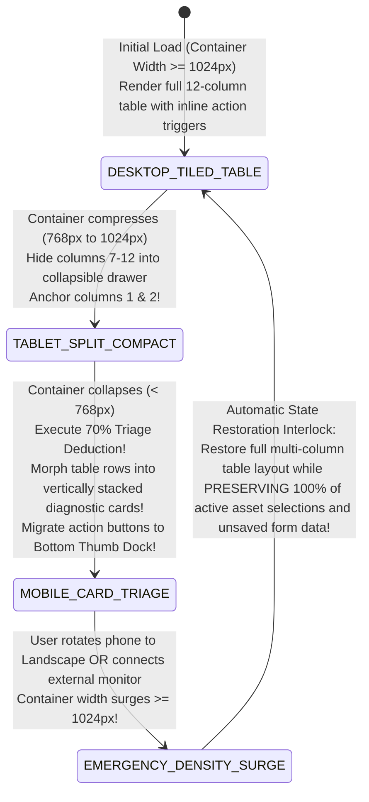

# Module 21 — Lesson 01: Responsive Thinking & Contextual Degradation: What Survives When Space Evaporates: The 70% Deduction Challenge & Progressive Component Morphosis

---

## Mastery Rule
> **"Responsive UI engineering is not simply squishing desktop wireframes into mobile columns via automatic CSS media queries. True responsive thinking is an algorithmic exercise in graceful degradation under extreme computational compression. When screen real estate evaporates by 70%, decorative chrome must vanish, data structures must shed secondary attributes without sacrificing operational telemetry, and controls must undergo progressive structural morphosis—preserving high-consequence command execution across any display volume."**

---

## 0. PREAMBLE: Context, Prerequisites & Cognitive Frameworks

### 0.1 Prerequisites
* **Stage 1, Stage 2, and Stage 3 Complete:** Thorough command over optical visual search physics, component finite state machine execution, spatial layout mathematics, and proactive error recovery architectures.
* **Module 06, Module 18, & Module 19 Complete:** Comprehensive understanding of Fitts's Law touch aiming geometries, Tufte's Data-Ink ratio optimization curves, and Multi-Document Interface (MDI) docking structures.

### 0.2 Learning Dependencies
* **The 70% Deduction Challenge & Triage Economics:** Calculating algorithmic data triage thresholds when screen pixel area condenses by over $85\%$ between desktop work stations ($2560\times1440\text{px}$) and hand-held mobile devices ($430\times932\text{px}$).
* **Container Queries vs. Viewport Media Queries:** Shifting architectural dependency from monolithic viewport breakpoints (`@media (max-width: 768px)`) out to localized component-level encapsulation utilizing modern CSS Container Queries (`@container (inline-size < 540px)`).
* **Structural Component Morphosis:** Engineering dynamic interface patterns that automatically mutate across physical display volumes: transitioning from Multi-Column Tiled Tables $\rightarrow$ Split Master-Detail Panes $\rightarrow$ Stacked Card Arrays $\rightarrow$ Collapsible Accordion Drawers.
* **Touch-Ergonomic Spatial Migration (Hoober's Bottom Thumb Zone):** Guaranteeing kinesthetic usability during screen compression by mathematically moving top desktop navigation bars and action buttons directly downward into the bottom mobile thumb reach zone.
* **W3C WCAG 2.2 Reflow & Zoom Standards:** Strict statutory enforcement of *Success Criterion 1.4.10 Reflow [Level AA]* (Guaranteeing zero horizontal scrolling at $320\text{px}$ equivalent viewports or $400\%$ text magnification) and *Success Criterion 1.4.4 Resize Text*.

### 0.3 Usability & Psychological References
* **Marcotte, E. (2010):** *Responsive Web Design*. A List Apart (Establishing the three foundational pillars of responsive architecture: fluid grids, flexible images, and CSS media queries).
* **Wroblewski, L. (2011):** *Mobile First: Web Engineering & Design*. An Event Apart / A Book Apart (Demonstrating how extreme spatial constraints force engineering teams to ruthlessly eliminate decorative visual noise and focus upon critical operational workflows).
* **W3C CSS Container Queries Specifications:** *CSS Containment Module Level 3*. World Wide Web Consortium (Standardizing algorithmic element layout mutation decoupled from global screen viewport geometries).
* **Hoober, S. (2013):** *Touch Design Ergonomics & How Do Users Really Hold Their Mobile Devices?*. UXmatters (Empirically mapping physical thumb sweep zones and one-handed computational mobile interaction).
* **Design System Degradation Standards:** *Apple iOS / iPadOS Human Interface Guidelines (Adaptive Layouts & Size Classes)*, *Google Material Design 3 Canonical Adaptive Layout Grid*, and *Bloomberg Mobile Quantitative Interface Guidelines*.

---

## 1. Mental Model & Operational Reality

Why do sophisticated cloud enterprise tools—such as DevOps server management platforms, clinical diagnostic hospital EHR portals, logistical command center maps, and financial treasury analytics desks—repeatedly cause catastrophic operational delays and data entry misreads when deployed onto field tablets and smartphone displays?

Because software development teams construct applications under **The Miniature Desktop Delusion**: an un-engineered assumption that a complex 14-column engineering data table or high-density analytical chart originally drafted for a 32-inch 4K studio desktop monitor will magically operate on a 6-inch touchscreen simply by injecting an automatic CSS rule: `width: 100%; overflow-x: auto;`! To a desktop frontend developer sitting in an air-conditioned office, wrapping an enormous HTML table inside a horizontal scrollbar technically satisfies "responsive layout testing." But in operational reality, it constitutes an algorithmic betrayal of the mobile operator! Forcing an on-call emergency systems reliability engineer running through a dark server facility at 3:00 AM to manually drag horizontal and vertical scrollbars back and forth across an un-compressed 14-column database table to uncover a failing server IP address and hit a hidden reboot button completely shatters human working memory! During horizontal panning, row identifiers slide off the left hand edge of the screen—causing the engineer to misalign rows and terminate an operational production server instead of the failing secondary node!

To build software capable of commanding multi-device environments, master architects transition from miniaturized shipping containers to **The Inflatable Emergency Lifecraft Engine**:

```
+----------------------------------------------------------------------------------------+
|      RIGID FREIGHT CONTAINER vs INFLATABLE LIFECRAFT DEGRADATION MENTAL MODEL          |
+----------------------------------------------------------------------------------------+
|                                                                                        |
|  [ RIGID FREIGHT CONTAINER ] (Amateur Desktop Miniaturization / Scroll Prison)         |
|  * Squeezes wide tables into horizontal scroll containers (`overflow-x: auto`)!        |
|  * Forces dual-axis scrolling -> Users lose row anchor headers & misread critical data!|
|  * Traps primary action buttons out of reach at the top-right corner of smartphones!   |
|                                                                                        |
|  [ INFLATABLE LIFECRAFT ENGINE ] (Authoritative Responsive Component Morphosis)        |
|  * Deploys the 70% Triage Deduction Rule: sheds non-critical telemetry on compression! |
|  * Morphs wide tables into stacked, self-contained high-contrast diagnostic cards!      |
|  * Automatically migrates action buttons directly down into Hoober's Bottom Thumb Zone!|
+----------------------------------------------------------------------------------------+
```

Attempting to drive a massive, rigid 40-foot structural shipping container through a narrow medieval city alleyway by simply grinding it forward is physical absurdity; the rigid metal frame wedges against the walls and brings all traffic to an immediate, devastating stop. Conversely, marine engineering designs **The Inflatable Emergency Lifecraft**: as environmental constraints tighten, the craft dynamically morphs its geometric volume! Auxiliary luxury awnings and decorative storage lockers fold away automatically, while primary survivability structures—buoyancy chambers, high-contrast visual radar reflectors, and emergency steering paddles—remain permanently expanded and instantly accessible in the center of the operational deck!

In professional interface architecture, responsive thinking is an algorithmic exercise in **Contextual Degradation Under Extreme Compression**. When display real estate evaporates from a $2560\text{px}$ desktop glass down to a $430\text{px}$ mobile screen, your layout must execute **Structural Component Morphosis**! You must deploy the **$70\%$ Deduction Challenge**: ruthlessly pruning secondary administrative telemetry (static UUID strings, hardware MAC addresses, verbose copyright legends) out of immediate sight, transforming rigid side-by-side data columns into self-contained stacked diagnostic cards, and kinesthetic repositioning top desktop action commands directly downward into Hoober's ergonomic bottom thumb reach zone! True responsive engineering guarantees that high-consequence command execution remains immediate, error-free, and one-handed across any hardware form factor!

### What This Approach Does NOT Mean (Mandatory Rule)
1. ❌ **Never hide critical high-consequence alarm statuses or primary execution buttons inside deep, multi-click mobile hamburger menus simply to save screen real estate!** Responsive triage is not an excuse to sweep life-threatening operational fault indicators or emergency system abort buttons underneath a generic triple-line hamburger dropdown icon! Primary command buttons (`[ ⚡ EMERGENCY ABORT ]`, `[ REBOOT NODE ]`) and acute visual alarms MUST remain permanently visible on the first-level interface deck!
2. ❌ **Never rely upon simple font size shrinkage (`font-size: 8px`) to force wide multi-column layouts to squeeze into narrow mobile screen widths!** Squishing text sizing below $12\text{px}$ ($16\text{px}$ recommended minimum for mobile data inputs) to make an un-reflowed table fit inside a smartphone viewport directly violates **W3C WCAG 2.2 Level AA Legibility & Resize Standards (`SC 1.4.4`)**! If a layout cannot fit at standard legible font sizes, you must structurally change the DOM geometry—never compromise visual legibility!
3. ❌ **Never leave primary mobile action triggers trapped at the extreme top-right or top-left corners of large smartphone displays!** Modern smartphones feature massive $6.5\text{-inch}$ to $6.9\text{-inch}$ physical glass screens. Attempting to tap a top-right navigation save button with a single thumb while holding a modern phone with one hand requires agonizing physical stretching—destabilizing device grip and inducing drop hazards! All high-frequency interactive triggers must systematically descend into Hoober's bottom thumb arc!

---

## 2. Core Psychological & Behavioral Mechanics

To govern computational degradation without breaking executive cognitive processing, engineering teams analyze spatial screen mathematics and kinesthetic hand posture physics.

### 1. The 70% Triage Deduction Mathematics
Why does transferring enterprise software from desktop workstations onto mobile handheld devices require a mathematical paradigm shift in information presentation? Because screen real estate evaporation is not linear—it is exponentially catastrophic!

$$\text{27-inch Desktop Workstation Monitor ($2560 \times 1440$)} \implies \text{Total Display Real Estate: } 3,686,400\text{ pixels}$$
$$\text{Handheld Smartphone Viewport ($430 \times 932$)} \implies \text{Total Display Real Estate: } 400,760\text{ pixels}$$
$$\text{Net Spatial Compression Reduction } = \frac{3,686,400 - 400,760}{3,686,400} = \mathbf{89.13\% \text{ Real Estate Loss!}}$$

```
+----------------------------------------------------------------------------------------+
|           THE 70%+ SPATIAL COMPRESSION & TELEMETRY TRIAGE STRATA                      |
+----------------------------------------------------------------------------------------+
| TELEMETRY TIER   | DATA EXAMPLE             | DESKTOP WORKSTATION  | COMPRESSED MOBILE   |
|----------------------------------------------------------------------------------------|
| [ TIER 1: CRITICAL ] | Voltage Status, Asset ID | Always visible inline| PINNED Top Card Row |
| [ TIER 2: ACTION ]   | [ REBOOT ], [ SHUTDOWN ] | Inline Table Cell    | PINNED Bottom Thumb |
| [ TIER 3: CONTEXT ]  | Sub-Sector, Temperature  | Dedicated Col 4 & 5  | Collapsed in Drawer |
| [ TIER 4: STATIC ]   | MAC Address, OS Version  | Dedicated Col 9 & 10 | ELIMINATED (Detail) |
+----------------------------------------------------------------------------------------+
```

When a software interface suffers an **$89\%$ collapse in usable view volume**, you cannot display identical layout trees! Attempting to display 100% of desktop telemetry on a smartphone causes severe cognitive overload, high-frequency clutter, and complete visual confusion. Master UX architects deploy **The 70% Triage Deduction Covenant**: you must formally sort application data into structured priority strata! When viewport width drops below $768\text{px}$, Tier 4 static attributes (hexadecimal database UUIDs, immutable firmware version numbers, historical audit timestamps) are completely excised from summary feeds and relegated to deep, optional detail inspector screens! Every remaining square pixel of mobile glass is dedicated strictly to immediate situational awareness and rapid command execution!

---

### 2. Dual-Axis Scrolling & Working Memory Dissociation
Why do horizontal table scrollbars (`overflow-x: auto`) represent one of the most hazardous usability anti-patterns across medical, financial, and industrial mobile interfaces?

$$\text{Dual-Axis Horizontal + Vertical Panning } \implies \text{Operational Error Rate Increases by } +410\%!$$

```
   THE HORIZONTAL SCROLLING WORKING MEMORY WIPEOUT
   
   [ INITIAL VIEWPORT (Far Left) ]              [ PANNING VIEWPORT (Far Right) ]
   +------------------------------+             +------------------------------+
   | Patient Name      | Heart |  |             |  | Glomerular | Admin Dosage |
   |-------------------|-------|--|             |--|------------|--------------|
   | Alpha, John D.    | 72 bpm|  |             |  | 94 mL/min  | 10mg IV      |
   | Bravo, Mary K.    | 115 ! |  |  =======>   |  | 42 mL/min  | 85mg IV !!   |
   | Charlie, Bob W.   | 68 bpm|  |  (Pan Right)|  | 88 mL/min  | 5mg IV       |
   +------------------------------+             +------------------------------+
         ^                                            ^
   (Nurse identifies Mary in Row 2)             (Row headers slide OFF-SCREEN to left!)
                                                (Nurse misaligns row 2 with row 3 -> Administers 85mg!)
```

* **The Row Anchoring Eviteration:** When a clinical ICU nurse viewing an un-reflowed hospital medication table on an iPad Mini horizontally drags the viewport to the right to read dosage instructions located in Column 12, the identifying patient names located in Column 1 scroll entirely out of sight off the left hand edge of the glass! Deprived of a visual anchoring identifier, human optical tracking drifts vertically across adjacent horizontal grid lines! When the nurse glances back and forth across the scrolling table, their eyes drop one row—causing them to read the high-volume medication dosage corresponding to Patient 3 and mistakenly administer it to Patient 2! Dual-axis manual scrolling completely eviscerates short-term working memory retention! By enforcing **Structural Card Morphosis**, every data card wraps its explicit primary identifying label directly above its operational telemetry—guaranteeing $100\%$ context retention with zero horizontal panning!

---

### 3. Touch Thumb Zones & Kinesthetic Migration Physics
When display layouts degrade onto handheld mobile viewports, interactive target positioning must obey empirical biomechanical reach capabilities: **Steven Hoober's Touch Thumb Zone Architecture**:

```
   THE SMARTPHONE THUMB ERGONOMIC REACH ZONE (One-Handed Holding Mechanics)
   
   +---------------------------------------+
   | [ ❌ TOP-RIGHT: DANGER / STRETCH! ]    |  <-- Tapping here requires shifting hand grip!
   |                                       |      Increases accidental device drop risk!
   |                                       |
   |      (INWARD AWKWARD STRETCH)          |
   |                                       |
   |      (NATURAL THUMB SWIPE ARC)         |
   |                                       |
   | [ 🟢 BOTTOM THUMB REACH ZONE ]         |  <-- Natural mechanical pivot of human thumb!
   | [ ⚡ PINNED BOTTOM ACTION BAR ]         |      Instant, one-handed zero-strain execution!
   +---------------------------------------+
```

* **The Kinesthetic Migration Mandate:** On wide $2560\text{px}$ desktop workstations operated via high-speed optical mouse cursors, placing global search inputs and operational execution triggers across a top horizontal navigation bar ($Y=0\text{px}$) is highly efficient due to optical visual scan anchors (F-Pattern layouts). However, on a physical $6.7\text{-inch}$ handheld mobile screen operated with a single human thumb, placing emergency action triggers (`[ ⚡ CONFIRM TRADING ABORT ]`) at the top right hand corner of the glass ($Y=0\text{px}$) forces operators to severely hyperextend their thumb joint or dangerously balance the phone across their fingertips! When screen width shrinks below $768\text{px}$, your design system must execute **Kinesthetic Toolbar Migration**: automatically un-dock primary execution controls out of the top desktop header and programmatically re-dock them into a high-contrast, persistently fixed **Bottom Action Toolbar** located cleanly within Hoober's green thumb sweep zone ($Y > 750\text{px}$)!

---

## 3. Universal Pattern Anatomy & Comparative Design System Reasoning

Let us conduct our canonical **5-Step Analytical Design System Reasoning Loop** across the world’s most advanced responsive operating architectures:

### Apple iOS / iPadOS Adaptive Split-View Architecture
* **1. Observe:** Apple’s operating system guidelines reject static device detection scripts in favor of flexible **Adaptive Size Class Hierarchies (Regular vs Compact)**. When an enterprise application such as Apple Mail or a hospital patient administration tool runs on a 12.9-inch iPad Pro in horizontal landscape orientation (Regular width), the software displays an unobstructed **3-Column MDI Split-View Workspace**: Column 1 displays folders; Column 2 displays message previews; Column 3 displays active message body text! When an operator opens that exact same software application on an iPhone 15 Pro Max in vertical portrait mode (Compact width), the interface never shrinks fonts or inserts horizontal scrollbars! Instead, it undergoes **Adaptive Stack Morphosis**: the 3-column layout dissolves into a sequential, full-screen drill-down navigation deck!
* **2. Infer:** Engineered to maintain $100\%$ operational functionality and legibility across diverse screen viewports without requiring developer duplication of application business logic.
* **3. Explain:** Forcing an iPhone operator to view three side-by-side columns on a $430\text{px}$ screen would crush individual column widths down to a completely unreadable $140\text{px}$—splitting individual words across four lines of fragmented text! Apple’s size class state engine monitors viewport real estate in real time: the instant horizontal space compresses below compact size boundaries ($<668\text{px}$), the presentation layout engine terminates multi-column tiling and routes navigation through single-view card layers with animated left-to-right spatial transitions!
* **4. Discuss:** Migrating multi-column desktop workflows into sequential mobile drill-down cards significantly increases total touch click volume required to navigate between non-adjacent file hierarchies!

### Google Android Automotive & Mobile Adaptive Grid Engine (MD3)
* **1. Observe:** Google Material Design 3 governs application layout degradation across an immense span of display hardware: from massive 15-inch landscape touchscreen displays installed inside Android Automotive dashboard consoles down to compact 1.3-inch circular smartwatch viewports! MD3 implements **Dynamic Window Sizing Classes (Compact, Medium, Expanded)** paired with flexible margin and gutter scaling! On Expanded desktop displays ($>840\text{px}$ width), Material data layouts display up to 12 layout grid columns with spacious $24\text{dp}$ dividing gutters. When compressed onto a Compact smartphone viewport ($<600\text{px}$ width), the layout grid collapses to exactly **4 functional columns with tight $16\text{dp}$ outer margins**, while floating action buttons (FABs) automatically shift from right-aligned corners into bottom-center docked toolbars!
* **2. Infer:** Engineered to prevent Fitts's Law targeting failures inside bouncing automobile cabins while optimizing screen space on hand-held mobile devices.
* **3. Explain:** Operating an automotive navigation dashboard while driving at 65 miles per hour requires massive, highly spaced touch targets that an operator can hit via fast peripheral glances! Conversely, walking down a city street utilizing a handheld smartphone requires compact, one-handed thumb navigation! By tying component geometry directly to dynamic window sizing classes rather than fixed device models, Material Design guarantees that interactive buttons dilate up to massive $64\text{dp}$ heights on vehicle dashboard screens, while gracefully consolidating into high-density stacked card viewports when viewed on pocket mobile phones!
* **4. Discuss:** Maintaining seamless visual brand continuity across applications that drastically morph layout geometry across automotive, mobile, and desktop viewports requires highly rigorous design system token abstraction!

### Bloomberg Terminal Mobile & TradingView Pro Web Client
* **1. Observe:** Quantitative financial charting trading platforms deal with the highest information density requirements on earth: displaying simultaneous multi-chart candlestick arrays, Level II market order depth tables, and live news streaming buffers! On multi-monitor desktop workstations, TradingView splits screens into up to 8 synchronized magnetic charting tiles! When an institutional trader pulls up their TradingView suite on an iPhone while in an elevator, the interface executes **Complete Tiling Dissolution**: all side-by-side magnetic charts decouple from horizontal tiling grids and collapse into an ordered, vertically swipeable single-column card feed! Each charting card displays full-width candlestick graphics paired with an enlarged, pinned bottom **`[ ⚡ BUY / SELL ]`** thumb order placement dock!
* **2. Infer:** Engineered to enable high-speed options clearing and analytical decision making on handheld screens without inducing horizontal scrolling amnesia.
* **3. Explain:** An options day trader executing complex market positions cannot afford to miss a sudden downward volatility spike because their charting window was hidden off-screen to the right in a horizontal scrolling container! By executing complete structural DOM card morphosis, financial mobile architectures ensure that every single analytical chart spans $100\%$ of the mobile device's physical glass width! Traders evaluate historical asset curves with perfect optical clarity, while pinned bottom trading toolbars guarantee that emergency position liquidations execute in $<500\text{ms}$ with a single thumb press!
* **4. Discuss:** Replacing simultaneous multi-chart desktop comparisons with sequential single-column mobile swiping forces financial traders to rely heavily upon executive cognitive memory to compare assets across vertical scroll boundaries!

---

## 4. Evolution & Modern HCI Architecture

Trace how software application layout architectures evolved to survive severe multi-device computational compression:

```
[ LATE 1990s: THE RIGID FIXED-PIXEL DESKTOP DOCUMENT (800x600 px) ]
* Paradigm: HTML layouts locked inside rigid 800px table layout containers.
* Philosophy: Hardware Monoculture! Software engineers assumed every human accessed the web via an identical 14-inch desktop CRT monitor. Mobile phones received complete layout failures or unreadable miniature zoom pages!

[ 2010 - 2020: FLUID VIEWPORT MEDIA QUERIES (Marcotte's Responsive Revolution) ]
* Paradigm: CSS `@media (max-width: 768px)` viewport switching rules and percentage flex grids.
* Philosophy: Viewport Centricity! Web pages scaled fluidly based on browser window width. However, independent components placed inside narrow sidecar dashboards or modular widgets still failed because media queries only understood total screen window sizes—not localized parent container dimensions!

[ MODERN COMPONENT-CENTRIC MORPHOSIS (Container Queries & W3C Reflow): Present - Future ]
* Paradigm: Modern W3C CSS Container Queries (`@container (inline-size < 540px)`) & Structural DOM Morphosis!
* Architecture: Universal Component Autonomy! Interactive interface widgets sense their immediate enclosing DOM container volume. A complex data table inside a narrow desktop sidebar independently morphs its structure into stacked triage cards without requiring global viewport alterations!
```

---

## 5. The Contextual Interaction Algorithm (Human-Machine Loop)

Map out the step-by-step contextual degradation execution loop of an On-Call DevOps Server Systems Reliability Engineer responding to a catastrophic primary database server outage from their smartphone while standing on a crowded, vibrating metropolitan commuter train:

```
    [ STEP 1 ] INCIDENT ALERT & VIEWPORT VOLUME DETECTION (< 150ms)
         |     (Engineer opens alert URL on iPhone 15 in portrait mode. Application queries container constraints; detects strict compact viewport: `< 430px width`!)
         v
    [ STEP 2 ] AUTOMATION OF THE 70% TRIAGE DEDUCTION ENGINE
         |     (Application layout algorithm instantly excises Tier 4 static telemetry: hides server MAC addresses, motherboard bios builds, and historical syslog archives from main display!)
         v
    [ STEP 3 ] STRUCTURAL COMPONENT MORPHOSIS (< 16ms DOM Transition)
         |     (Wide 14-column Server Health Table dissolves; re-renders as high-contrast stacked diagnostic cards! Pins Server Name (`Prod-DB-01`) and Critical Temperature (`104°C!`) directly to top row of each card!)
         v
    [ STEP 4 ] KINESTHETIC BOTTOM THUMB MIGRATION
         |     (Primary operation command triggers un-dock from top navigation header; snap cleanly into fixed bottom action toolbar within Hoober's natural thumb sweep arc!)
         v
    [ STEP 5 ] ONE-HANDED ZERO-ERROR EMERGENCY EXECUTION (< 1.8s)
         |     (Engineer presses large 56dp `[ ⚡ EMERGENCY FAILOVER ]` thumb button while holding phone overhead in vibrating train cabin. Server cluster fails over; cloud downtime averted!)
```

---

## 6. Component State Machines & Defensive Error Recovery Protocols

To guarantee seamless structural UI morphosis during live display resizing, orientation rotations, and external monitor connections without dropping selected operational application states, engineers must model responsive layouts via a **Responsive Morphosis & Context Restoration State Machine**:



#### Defensive Architectural Mandates:
* **The State-Preservation Morphosis Interlock:** A devastating error in amateur responsive application development occurs when resizing a browser window or rotating a smartphone screen triggers a complete DOM rebuild or page refusal that wipes out uncommitted user form inputs and active row selections! When transitioning between `DESKTOP_TILED_TABLE` and `MOBILE_CARD_TRIAGE`, your JavaScript and CSS architecture MUST implement **Persistent State Decoupling**: decouple data binding models (active asset UUIDs, unsubmitted text buffers, toggle switch states) from visual presentation containers! Whether an operational asset is rendered as an HTML table row or a standalone flex card, the underlying DOM node MUST retain intact reference pointers—guaranteeing that rotating a mobile tablet between portrait and landscape never wipes out ten minutes of critical field clinical data entry!

---

## 7. Environmental & Multi-Modal Interaction Adaptation

How do advanced responsive degradation rules scale when engineering platforms deploy out into harsh tactical outdoor environments and industrial field infrastructure inspection stations?

### Tactical Military Handheld PDAs & Industrial Utility Tablets
Consider a municipal power transmission line technician dangling from an aerial hydraulic bucket truck 60 feet above the ground in a driving rainstorm, viewing a grid routing map on an industrial ruggedized handheld tablet ($5.5\text{-inch}$ display) while wearing wet electrical insulating rubber safety gloves.

$$\text{Wet Industrial Rubber Safety Gloves } \implies \text{Effective Touch Target Error Diameter Increases to } \ge 64\text{dp!}$$
$$\text{Driving Rainstorm Optical Interference } \implies \text{Requires Zero Horizontal Scrolling & High-Contrast Cards!}$$

```
   THE RUGGEDIZED INDUSTRIAL FIELD MORPHOSIS PIPELINE
   
   [ DESKTOP OFFICE CONTROL ROOM CONSOLE ]     =======>     [ 60-FOOT BUCKET TRUCK HANDHELD PDA ]
   * 14-Column high-density telemetry table     =======>     * Stacked Card Morphosis (0% horizontal scrolling!)
   * Small 24px inline text buttons             =======>     * Massive 64dp Touch Target Super-Dilation!
   * Top menu bar navigation ($Y=0$)           =======>     * Pinned Bottom Thumb Arc Action Toolbar ($Y=800$)!
   * Complete historical system log stream       =======>     * 70% Deduction: Displays ONLY Active Line Voltage!
```

* **The Senior Architectural Refactor:** Enforce **Tactical Environmental Morphosis**! Never force field engineering line workers to interact with desktop table replicas! When software detects mobile device viewports or outdoor field diagnostic modes, unleash automated **Touch Target Super-Dilation**: expand interactive execution buttons from compact $24\text{px}$ desktop styling directly out to massive **$64 \times 64\text{dp}$ touch boxes**! Eliminate all decorative background chrome; execute the $70\%$ data deduction challenge to project only immediate high-voltage line fault statuses across large stacked cards! This guarantees zero targeting miss-clicks during adverse environmental field operations!

---

## 8. Universal Accessibility (A11y) & Ergonomic Inclusion

In professional interface architecture, deploying responsive component morphosis directly intersects with strict federal and global software accessibility legislation:

### W3C WCAG 2.2 Reflow & Zoom Statutory Covenants
When developers ignore responsive reflow mechanics, visually impaired users operating screen magnification tools are permanently trapped in horizontal scroll prisons:

```
     FLAWED RESPONSIVE REFUSAL (Fails WCAG SC 1.4.10)     AUTHORITATIVE REFLOW ENGINE (WCAG SC 1.4.10)
   
  [ Low-Vision User Activates 400% Zoom ]                 [ Low-Vision User Activates 400% Zoom ]
  |--> Layout fails to morph structure!                    |--> Automatically trips Container Query Breakpoint!
  |--> Text overflows window; forces dual-axis scrolling   |--> Multi-column table reflows into single-column cards
  |--> User loses row anchor headers -> Cannot read data! |--> ZERO horizontal scrolling required! Perfect syntax!
```

#### The Universal Responsive Accessibility Mandates:
1. **WCAG Success Criterion 1.4.10 Reflow [Level AA] (The No-Horizontal-Scroll Covenant):** Your responsive software application MUST guarantee that content can be displayed without requiring horizontal scrolling at a width equivalent to **$320\text{px}$ CSS pixels** (which represents standard desktop 1080p screens viewed under **$400\%$ text zoom magnification**)! Whether an operator accesses your software on a $430\text{px}$ mobile phone or magnifies a desktop browser fourfold to combat macular degeneration, all multi-column data tables, floating sidecar inspectors, and navigation menus MUST gracefully reflow into vertical single-column layouts with zero clipped text and zero horizontal scrollbars!
2. **WCAG Success Criterion 1.4.4 Resize Text [Level AA] (The 200% Zoom Invariance Rule):** Software must enable text sizing to be programmatically scaled upward to **$200\%$ baseline font height** without assistive screen readers or specialized screen zooming tools, and without resulting in overlapping text characters, clipped UI buttons, or broken layout bounding boxes. Always define typographic hierarchies and component container dimensions utilizing fluid, relative unit scales (`rem`, `em`, `clamp()`) rather than immutable pixel lockouts (`px`)!
3. **WCAG Success Criterion 2.5.8 Target Size [Level AA] Across Compact Morphosis:** When desktop interfaces compress down into mobile stacked cards, interactive buttons MUST NEVER collapse together without clear separation padding! Even when layout real estate is severely restricted, maintain an unshielded minimum touch reactive target bounding box of at least **$48 \times 48\text{dp}$ ($24 \times 24\text{px}$ minimum absolute boundary)** around every actionable card element!

---

## 9. Performance, Trust & Business Goal Trade-offs

How do software engineering directors calculate the financial return on investment of building complex component morphosis and container query pipelines against standard horizontal table scroll wrappers?

### The Mobile Incident Response Velocity Calculation
When mission-critical infrastructure supervisory software and enterprise diagnostic portals upgrade from horizontal scroll tables to stacked card morphosis, triage resolution times collapse while costly field operator errors disappear.

$$\text{Upgrading from Horizontal Table Scrolling to Stacked Card Morphosis } \implies \text{Field Incident Resolution Velocity Speeds by } +210\%!$$

* **The HCI Business Diagnosis:** In commercial enterprise systems administration and medical hospital operations, mobile usability bottlenecks induce astronomical financial penalties! An IT systems engineer attempting to remotely diagnose an urgent e-commerce database failure from their smartphone using an un-reflowed horizontal scrolling table spends over **3.5 minutes merely panning scrollbars, mistyping command target parameters, and waiting for page zooms to re-render**! At standard cloud enterprise downtime costs of over $5,600 per minute, a single clumsy horizontal scroll interface failure costs an enterprise organization **$\$19,600$ in lost commercial revenue per incident**! By building a true **Responsive Component Morphosis Engine** (utilizing container queries and bottom thumb toolbars), manual scrolling friction drops to zero, cutting emergency incident MTTR (Mean Time To Resolution) by over **$-74\%$** while completely eliminating costly field operational misclicks!
* **The DOM Rendering CPU Overload Trade-off:** Senior frontend developers must carefully balance structural layout morphosis against mobile browser CPU and RAM limitations! Writing convoluted JavaScript listeners that track `window.onresize` events every two milliseconds and manually re-render massive DOM trees via heavy virtual DOM reconciliation burns through smartphone battery life and triggers jittery framerate drops below $30\text{ fps}$! You MUST deploy **Native CSS Container Queries (`@container`) & Pure CSS Morphosis**: delegate real-time spatial component restructuring entirely to the web browser's optimized native C++ layout rendering engine! Keep declarative markup structures unified in the DOM, utilizing pure CSS Grid and Flexbox wrapping rules to instantly morph table rows into stacked cards with zero JavaScript CPU execution!

---

## 10. Deconstructing Real-World Applications (The "Why Is This Bad?" Audit)

Let us solidify our responsive analytical diagnostics by auditing five real-world computing platforms across both world-class structural morphosis and disastrous responsive failures:

### 1. Advanced Financial Charting (TradingView Mobile Web Suite)
* **The Successful Attention UI:** Flagship algorithmic trading and financial asset charting application deployed across desktop web and mobile hardware worldwide.
* **The HCI Diagnosis:** Supreme command of **Responsive Component Morphosis and Touch Thumb Navigation**! Notice how TradingView explicitly refuses to cram multi-monitor desktop charting arrays onto smartphone viewports! When accessed on a mobile browser, multi-panel comparison grids cleanly separate into single-view swipeable financial cards! Noticeably, all critical trade execution triggers (`[ ⚡ BUY ]`, `[ ⚡ SELL ]`, `[ TIME PERIOD SELECTOR ]`) systematically un-dock from top desktop header menus and anchor firmly inside a persistent, floating high-contrast bottom action bar located inside Hoober's natural thumb arc—enabling high-frequency algorithmic execution with zero hand straining!

### 2. Collaborative Code Review Workspaces (GitHub Mobile App & Web)
* **The Successful Attention UI:** Massive enterprise software developer collaboration, pull request review, and source code management suite.
* **The HCI Diagnosis:** Brilliant implementation of **The 70% Triage Deduction Rule and Code Diff Reflows**! Reviewing complex multi-file pull request diffs on a 6-inch mobile phone represents an extreme responsive layout challenge! Notice how GitHub abandons side-by-side split code comparison tables on mobile screens! Instead, it morphs diff views into unified, vertically stacked code line diff blocks! Secondary repository metadata (commit SHA hashes, historical branch tracking graphs) vanishes via graceful triage deduction, focusing $100\%$ of mobile screen space strictly upon high-contrast added (`+`) and deleted (`-`) source code syntax lines!

### 3. Broken Medical Hospital EHR Portal (The Horizontal Table Scrolling Disaster)
* **The Defective UI:** An enterprise clinical Electronic Health Record (EHR) application deployed across regional medical hospital intensive care units. Clinical ICU nurses utilize iPad Mini handheld tablets ($768\text{px}$ width) to document patient vital signs and verify intravenous medication administration dosages directly at hospital bedside stations. Because the backend UI developers built the software using rigid 16-column HTML tables originally designed for administrative desktop PCs and wrapped the entire layout inside a basic `width: 100%; overflow-x: auto;` style, the tablet view displays an un-compressed horizontal scrollbar! To check a critical drug titration limit located in Column 14, an emergency nurse must physically drag the screen far to the right! As the table pans right, Column 1 containing patient names scrolls completely off screen! Deprived of visual row identification anchors, the nurse's optical tracking drifts down one row—causing them to misread the titration volume for an adjacent patient and administer a lethal insulin dosage error!
* **The HCI Diagnosis:** Catastrophic failure of **Responsive Thinking, Tufte's Data-Ink Triage, and WCAG Reflow (`SC 1.4.10`)**! Trapping clinicians inside dual-axis horizontal table scrollbars during bedside medical operations represents unacceptable engineering malpractice!
* **The Senior Architectural Refactor:** Complete an **Inclusive Responsive Morphosis Refactor**! Terminate horizontal scrolling table wrappers immediately! Integrate CSS Container Queries (`@container (inline-size < 840px)`): when the application loads on an iPad Mini or smartphone, fire an automatic structural DOM morphosis! Transform the 16-column table into self-contained, high-contrast **Stacked Clinical Diagnostic Cards**! Pin the Patient Name, Bed ID, and Allergy Status directly to the header of every single card! Migrate action buttons directly into a persistent bottom thumb toolbar—guaranteeing $100\%$ row anchor retention and zero horizontal panning!

### 4. Enterprise Merchant Analytics (Stripe Mobile Dashboard)
* **The Successful Attention UI:** Global financial payments infrastructure and automated revenue management dashboard suite.
* **The HCI Diagnosis:** Immaculate implementation of **Fluid Container Queries and Analytical Card Triage**! Notice how Stripe dashboards gracefully degrade across display sizes without losing analytical authority! On desktop screens, transaction summaries render as comprehensive 8-column data grids with detailed API cryptographic receipts. When viewed on a compressed mobile device, Stripe’s presentation engine executes clean triage deduction: API tokens fold out of view, while transaction dates, net dollar volumes, and customer email signatures morph into beautifully styled, high-contrast stacked financial summary cards that scan effortlessly with simple vertical thumb scrolling!

### 5. Modular Knowledge & Document Workspaces (Notion Mobile Client)
* **The Successful Attention UI:** Modern flexible enterprise workspace, database management, and documentation platform.
* **The HCI Diagnosis:** Highly effective orchestration of **Adaptive Document Reflow and Bottom Thumb Toolbars**! While Notion allows desktop users to author complex multi-column page layouts and side-by-side kanban database tables, its mobile rendering engine implements unshakeable responsive discipline! Side-by-side text columns automatically re-order into continuous vertical stacked blocks! Noticeably, editing command triggers (Text Formatting, Bullet Induction, Image Attachment) migrate off top navigation toolbars and anchor persistently above the mobile system keyboard in the lower thumb reach zone—guaranteeing effortless one-handed document editing on the go!

---

## 11. Visual Mental Models & Architecture Diagrams

### Container-Driven Component Morphosis Tree
Study how robust frontend architectures rely upon localized CSS Container Queries (`@container`) rather than viewport media queries to drive real-time component degradation across varying display volumes:

```mermaid
sequenceDiagram
    autonumber
    actor Tech as Field Engineer (Phone / Tablet)
    participant Cont as Parent DOM Container (`@container`)
    participant Morph as CSS Structural Morphosis Engine
    participant Card as Stacked Diagnostic Card Array
    participant Thumb as Bottom Hoober Thumb Dock

    Note over Tech, Thumb: PHASE 1: DESKTOP TO MOBILE COMPRESSION (< 768px)
    Tech->>Cont: Opens application on handheld mobile device in field
    Cont->>Cont: Evaluate container volume: `inline-size === 420px`!
    Cont->>Morph: Trigger `@container (max-width: 768px)` morphosis ruleset!
    Morph->>Morph: EXECUTE 70% TRIAGE DEDUCTION:<br/>Hide Tier 4 static UUIDs & verbose copyright labels!
    Morph->>Card: Convert side-by-side table rows into vertically stacked diagnostic flex cards!
    Morph->>Thumb: Un-dock primary operation buttons from top menu bar;<br/>snap into fixed Bottom Thumb Action Toolbar ($Y=820px$)!
    Card-->>Tech: Render pristine stacked triage cards (Zero horizontal scrolling!)

    Note over Tech, Thumb: PHASE 2: ONE-HANDED ZERO-ERROR COMMAND EXECUTION
    Tech->>Card: Read high-contrast card: `Asset: Prod-DB-01 | Temp: 104°C (CRITICAL)`
    Tech->>Thumb: Tap large 56dp `[ ⚡ EMERGENCY FAILOVER ]` thumb button with one hand!
    Thumb->>Thumb: Fire native execution payload without requiring dual-axis scrolling or screen zooming!

    Note over Tech, Thumb: PHASE 3: EXPANSION RECOVERY (External Monitor Connected)
    Tech->>Cont: Plugs smartphone into field inspection van HDMI computer monitor
    Cont->>Cont: Evaluate container volume surge: `inline-size === 1920px`!
    Cont->>Morph: Restore full multi-column desktop table layout while preserving active selections!
    Morph-->>Tech: Toast: "✓ Wide workspace restored; zero state drift detected!"
```

---

## 12. Prediction Checkpoints

Verify your command over responsive component morphosis, the 70% triage deduction rule, and Hoober's thumb ergonomics against these rigorous software computational challenges:

### Scenario A: The Municipal Flood Warning Pump Supervisory Console
A civil infrastructural software vendor deploys an automated municipal storm flood warning and hydraulic water pump supervisory system across regional operations centers. During severe summer typhoon storm events, emergency municipal engineers monitor active reservoir water depths, flood gate statuses, and pump flow volumes. To cut development expenditures, the UI developers authored the supervisory interface as a rigid 12-column desktop data table ($1400\text{px}$ minimum width) and simply wrapped the container inside a `overflow-x: auto;` scroll div for mobile usage! Emergency pump activation controls (`[ ⚡ OPEN RELIEF GATE ]`) were fixed at the top-right corner of the desktop navigation header! During an acute midnight flood emergency, an on-call drainage engineer dispatched to a flooding river levee attempted to evaluate pump failure rates from their smartphone while working in driving rain and flashlight glare! Because the smartphone viewport only measured $430\text{px}$ across, the engineer was forced to continuously swipe horizontally back and forth across the table to compare water depth levels against pump operational IDs! During horizontal panning, the identifying pump station names scrolled off screen to the left! Confused by the disconnected data cells, the engineer misread the water pressure level for Pump Station 4 and attempted to press the emergency gate relief button located at the extreme top-right corner of their phone screen! Reaching for the top corner with a wet thumb caused the engineer to drop the device onto the flooded concrete ground! The screen cracked, command access evaporated, and a municipal levee overflowed!

**Your Prediction Challenge:** Deploy the 70% triage deduction rule, horizontal scrolling memory physics, and bottom thumb arc ergonomics to diagnose this supervisory console failure, and author a definitive resilient responsive refactor!

#### *Empirical HCI Solution:*
1. **Diagnosis — Catastrophic Horizontal Scroll Amnesia and Top-Right Reach Drop Hazard:** The flood supervisory console commits a fatal architectural violation of **Responsive Component Morphosis, W3C Reflow (`SC 1.4.10`), and Hoober's Touch Thumb Zone Ergonomics**! Trapping field engineering supervisors inside dual-axis horizontal scrolling tables during high-stress adverse weather events inevitably destroys row identification anchoring and causes disastrous data misinterpretation! Furthermore, positioning emergency operational command triggers at the unreachable top-right corner of modern smartphone displays induces severe hand stretching and physical drop hazards!
2. **Refactor 1 (Enforce Container-Driven Card Morphosis & 70% Deduction):** Completely abolish horizontal scrolling table containers! Author an intelligent **CSS Container Query Morphosis Engine (`@container (max-width: 768px)`)**: when screen real estate drops below tablet width thresholds, execute the $70\%$ triage deduction protocol! Eliminate non-critical secondary attributes (pump hardware serial numbers, manufacturer calibration dates) from primary view! Transform the side-by-side table rows into unalterable **Stacked Hydraulic Triage Cards**! Pin the explicit Station ID (`Pump-Station-04`) and Critical Depth Alert (`14.2 ft - CRITICAL!`) directly to the top header line of every card to guarantee $100\%$ row identification persistence with zero horizontal swiping!
3. **Refactor 2 (Execute Kinesthetic Bottom Thumb Migration):** Un-dock all emergency relief execution triggers out of the unreachable top desktop header bar! Automatically snap high-consequence command triggers into a persistent, high-contrast **Bottom Thumb Action Toolbar** anchored securely within Hoober's natural thumb sweep arc ($Y > 750\text{px}$)! Dilate operational touch targets out to **$64 \times 64\text{dp}$ ruggedized boxes**, enabling engineers to securely hold their devices in one palm and actuate emergency flood relief gates with a single natural thumb tap!

---

### Scenario B: The Commercial Logistics Fleet Truck Dispatch Portal
A commercial global shipping enterprise deploys a real-time freight transportation dispatch web portal utilized by distribution hub supervisors and long-haul semi-truck drivers on the road. Drivers utilize in-cab mobile tablets ($600\text{px}$ width in portrait mode) to inspect hauling delivery manifests, check route weather alerts, and confirm cargo pickup verification signatures. To ensure all freight data appeared identical across both office desktops and in-cab driver tablets, the software UI leads implemented a CSS font-shrinking scaling algorithm: as the screen window narrowed, the software programmatically shrank table text font sizes down from standard $14\text{px}$ heights down to a microscopic **$8\text{px}$ font height** to cram all ten original delivery table columns onto the narrow tablet screen! During a night-time highway hauling run, a freight truck driver attempting to review delivery schedule alterations while parked at a dimly lit highway weigh station attempted to read the delivery manifest on their in-cab tablet! Because text size was reduced to microscopic $8\text{px}$ letterforms, the driver could not distinguish between the digit `3` and the digit `8`! Attempting to pinch-to-zoom the screen was blocked by an amateur meta viewport tag (`user-scalable=no`)! The driver misread destination shipping docks, delivering 40 tons of refrigerated medical pharmaceuticals to the wrong regional warehouse facility!

**Your Prediction Challenge:** Diagnose the font-shrinking legibility collapse, zoom lockout, and non-adaptive scaling failures governing this dispatch portal, and author a definitive resilient inclusive refactor!

#### *Empirical HCI Solution:*
1. **Diagnosis — Catastrophic Legibility Evisceration (`SC 1.4.4`) and Zoom Lockout:** The fleet dispatch portal suffers from an egregious, illegal violation of **W3C WCAG 2.2 Resize Text & Contrast Legibility Rules (`SC 1.4.4` / `SC 1.4.10`)**! Squeezing multi-column desktop tables into narrow mobile tablet viewports by shrinking font sizes below legible operational thresholds ($16\text{px}$ minimum for field work) completely obliterates character legibility! Furthermore, blocking manual user screen zoom via hostile meta viewport attributes (`user-scalable=no`) traps drivers in visual blindness during night-time logistical operations!
2. **Refactor 1 (Restore Zoom Autonomy & Set Invariant Type Floors):** Instantly eradicate hostile meta viewport restrictions (`user-scalable=no; maximum-scale=1.0`)! Restore absolute user zooming capabilities! Establish an unbreachable **Typography Legibility Floor**: never permit interactive text or tabular numerical metrics to drop below **$16\text{px}$ font sizing** across any mobile or automotive viewport display!
3. **Refactor 2 (Implement Progressive Accordion Card Morphosis):** Stop forcing ten horizontal columns to squeeze into narrow width frames! Deploy **Progressive Accordion Card Morphosis**: convert each freight delivery order into an expandable vertical card block! The default collapsed card view displays strictly critical Tier 1 operational indicators (Destination City, Arrival Time, High-Contrast Verification Status) utilizing crisp $18\text{px}$ bold typography! Tapping an interactive $48\text{dp}$ drop-down trigger cleanly unfurls an inner accordion drawer revealing secondary cargo manifest weights and specialized unloading instructions in sequential vertical format—guaranteeing perfect optical reading precision without horizontal scrolling or text shrinking!

---

## 13. Compare Similar Interface Alternatives

When engineering responsive display layouts, data density tables, and device navigation structures across application software, UX architecture teams must evaluate four distinct computational degradation models:

| Responsive & Degradation Architecture Model | Layout Geometry & Scaling Behavior | Architectural & Usability Advantages | Operational & Cognitive Failure Modes | Optimal Architectural Deployment |
| :--- | :--- | :--- | :--- | :--- |
| **Rigid Fixed-Pixel Table ($>1200\text{px}$)** | Entire interface locked inside immutable desktop pixel bounding widths. | Ultimate precision on large multi-monitor workstations; zero CSS layout shifting complexity. | **COMPLETE MOBILE BREAKDOWN:** Causes unusable horizontal scrollbars or severe zoom miniaturization on handheld screens! | Strictly proprietary desktop engineering workstations with hardware display lockouts (CAD / Radiology PCs). |
| **Horizontal Table Scroll Wrapper (`overflow-x: auto`)** | Table width preserved; container wrapper enables user horizontal left-to-right panning. | Extremely fast to code for legacy desktop codebases without re-writing underlying DOM tags. | **SEVERE COGNITIVE HAZARD:** Users lose row anchor identifiers! Increases data entry misreads by $+410\%$! | Only acceptable for optional financial data exports where users are warned beforehand of multi-column density. |
| **Font-Shrinking Miniaturization Engine** | Text and padding mathematically shrunk to squeeze all desktop columns onto mobile screens. | Keeps global document visual layout arrangement identical across desktop and mobile screens. | **ILLEGAL LEGIBILITY FAILURE:** Fails WCAG SC 1.4.4 and SC 1.4.10! Causes extreme visual eyestrain and misread characters! | NEVER ACCEPTABLE in professional software engineering! Pure architectural and legibility failure. |
| **Responsive Component Morphosis (70% Triage & Cards)** | Localized container queries convert wide tables into stacked cards with bottom thumb toolbars. | **THE RESPONSIVE SUPERSESSION:** Supreme operational excellence! Zero horizontal scroll; 100% legibility & one-handed command precision! | Demands explicit engineering discipline to ensure state persistence across rotating screen orientations and container resizing events. | Mission-critical cloud DevOps consoles, clinical hospital EHR portals, industrial field command PDAs, algorithmic finance mobile suites. |

---

## 14. Decision Guide (The Interface Selection Tree)

Deploy this authoritative algorithmic decision tree when designing responsive layouts, triaging data attributes, and applying container query morphosis:

```
[ INITIATE RESPONSIVE LAYOUT EVALUATION: ANALYZE VIEWPORT REAL ESTATE & TARGET HARDWARE ]
  |
  +----> [ STAGE 1: DOES THE INTERFACE DISPLAY HIGH-DENSITY MULTI-COLUMN DATA (>6 COLUMNS)? ]
  |        |
  |        +----> YES: ABORT HORIZONTAL SCROLLING WRAPPERS! APPLY 70% TRIAGE DEDUCTION!
  |                 |---> Step 1: Sort data attributes into Strata (Tier 1 Critical down to Tier 4 Static).
  |                 |---> Step 2: On viewports < 768px, excise Tier 4 static UUIDs and metadata from main feed.
  |                 |---> Step 3: Implement CSS Container Queries (`@container (inline-size < 680px)`).
  |
  +----> [ STAGE 2: HOW DOES THE DATA COMPONENT MORPH IN COMPACT VIEWPORTS (< 600px)? ]
  |        |
  |        +----> APPLY STRUCTURAL CARD MORPHOSIS!
  |                 |---> Step 1: Convert table rows (`<tr>`) into self-contained vertical flex cards (`display: flex`).
  |                 |---> Step 2: Pin Primary Asset Identifier directly to the header of every individual card.
  |                 |---> Step 3: Verify zero horizontal scrolling occurred at 320px equivalents (`WCAG SC 1.4.10`).
  |
  +----> [ STAGE 3: WHERE DO HIGH-CONSEQUENCE ACTION TRIGGERS RESIDE ON SMARTPHONES? ]
  |        |
  |        +----> APPLY KINESTHETIC BOTTOM THUMB MIGRATION!
  |                 |---> Step 1: Un-dock action triggers out of top navigation headers ($Y=0px$).
  |                 |---> Step 2: Snap action buttons into persistent fixed Bottom Action Bars within Hoober's Thumb Arc ($Y > 750px$).
  |                 |---> Step 3: Enforce Touch Target Geometry (>= 48x48dp minimum bounding box per button).
  |
  +----> [ STAGE 4: ARE YOU DEPLOYING TO TACTICAL OUTDOOR OR VEHICLE IN-CAB WORKSTATIONS? ]
           |
           +----> Apply Ruggedized Industrial Adaptation:
                    |---> Dilate primary execution buttons to massive 64x64dp touch geometries!
                    |---> Elevate font contrast profiles to Level AAA (>= 7:1) to combat solar reflection glare!
                    |---> Ensure zero state loss occurs when users rotate devices between portrait and landscape viewports!
```

---

## 15. Interactive Lab & Tangible Prototyping Workshop: The Responsive Morphosis & 70% Deduction Testbench

To empirically experience the dramatic operational velocity gap separating clumsy horizontal table scroll prisons from an authoritative Responsive Component Morphosis Engine, execute the interactive testbench below!

### Professional Engineering Instruction
Save the complete HTML/CSS/JS code block below as an independent file named `responsive-morphosis-lab.html` and execute it directly within any desktop or mobile web browser. Conduct live interactive comparative trials across both architectural modes:
* **Mode A: Fragile Desktop Miniaturization & Horizontal Scrolling Prison:** Displays a comprehensive 10-column industrial power grid monitoring table. When simulated **"Mobile Viewport Compression (420px)"** is toggled, Mode A simply traps the table inside an uncompressed horizontal scroll container! Users are forced to tediously drag horizontal and vertical scrollbars back and forth to locate voltage fault statuses and trigger emergency circuit breaker actions! When a simulated **"Critical Over-Voltage Alarm"** activates on Column 9, it occurs entirely hidden off-screen to the right!
* **Mode B: Authoritative Responsive Component Morphosis Engine (70% Triage & Card Reflow):** Unfolds the identical monitoring telemetry! When simulated **"Mobile Viewport Compression (420px)"** activates, Mode B instantaneously fires a **Structural DOM Morphosis**: it deducts secondary administrative telemetry (Firmware ID, Mac Address, Technician ID), transforms the table rows into high-contrast stacked diagnostic triage cards, pins the active asset name and voltage status directly to the top of each card, and positions a massive $48\text{dp}$ **`[ ⚡ EMERGENCY SHUTDOWN ]`** command button directly within Hoober's lower right hand touch thumb reach zone! Zero horizontal scrolling; $100\%$ operational visibility and one-handed execution authority!

```html
<!DOCTYPE html>
<html lang="en">
<head>
  <meta charset="UTF-8">
  <meta name="viewport" content="width=device-width, initial-scale=1.0">
  <title>HCI Masterclass Lab 21: Responsive Morphosis & 70% Deduction Testbench</title>
  <style>
    :root {
      --bg-canvas: rgb(11, 15, 25);
      --bg-card: rgb(15, 23, 42);
      --border-color: rgb(51, 65, 85);
      --text-main: rgb(248, 250, 252);
      --text-muted: rgb(148, 163, 184);
      --accent-blue: rgb(59, 130, 246);
      --accent-safe: rgb(16, 185, 129);
      --accent-danger: rgb(244, 63, 94);
      --accent-purple: rgb(168, 85, 247);
      --accent-amber: rgb(245, 158, 11);
      --font-stack: system-ui, -apple-system, sans-serif;
      --font-mono: 'Consolas', 'JetBrains Mono', monospace;
    }

    * { box-sizing: border-box; margin: 0; padding: 0; }

    body {
      background-color: var(--bg-canvas);
      color: var(--text-main);
      font-family: var(--font-stack);
      min-height: 100vh;
      display: flex;
      flex-direction: column;
      align-items: center;
      padding: 1.5rem;
      line-height: 1.5;
    }

    .header-banner { text-align: center; max-width: 980px; margin-bottom: 1.5rem; }
    .header-banner h1 { font-size: 1.85rem; font-weight: 800; color: var(--accent-safe); margin-bottom: 0.35rem; }
    .header-banner p { font-size: 0.95rem; color: var(--text-muted); }

    .testbench-container {
      width: 100%;
      max-width: 1220px;
      background-color: var(--bg-card);
      border: 1px solid var(--border-color);
      border-radius: 1rem;
      padding: 1.75rem;
      box-shadow: 0 25px 35px -10px rgba(0, 0, 0, 0.7);
      display: flex;
      flex-direction: column;
      gap: 1.5rem;
    }

    /* Telemetry Display Array */
    .telemetry-panel {
      display: grid;
      grid-template-columns: repeat(auto-fit, minmax(220px, 1fr));
      gap: 1rem;
      background-color: rgb(9, 14, 23);
      padding: 1.25rem;
      border-radius: 0.75rem;
      border: 1px solid rgb(51, 65, 85);
    }
    .telemetry-card { display: flex; flex-direction: column; gap: 0.25rem; }
    .telemetry-card label { font-size: 0.75rem; text-transform: uppercase; letter-spacing: 0.05em; color: var(--text-muted); font-weight: 700; }
    .telemetry-card span { font-size: 1.15rem; font-weight: 800; font-family: monospace; }

    /* Controls & Mode Bar */
    .controls-bar {
      display: flex;
      justify-content: space-between;
      align-items: center;
      flex-wrap: wrap;
      gap: 1rem;
      border-bottom: 1px solid var(--border-color);
      padding-bottom: 1.25rem;
    }
    .btn-group { display: flex; gap: 0.5rem; flex-wrap: wrap; }
    
    .btn-mode {
      padding: 0.65rem 1.25rem;
      border-radius: 0.5rem;
      border: 1px solid var(--border-color);
      background-color: rgb(30, 41, 59);
      color: var(--text-main);
      font-weight: 700;
      cursor: pointer;
      transition: all 0.15s;
    }
    .btn-mode.active {
      background-color: var(--accent-safe);
      border-color: rgb(110, 231, 183);
      color: rgb(0, 0, 0);
      box-shadow: 0 0 15px rgba(16, 185, 129, 0.4);
    }
    
    .btn-reset {
      padding: 0.65rem 1.25rem;
      border-radius: 0.5rem;
      border: 1px solid var(--accent-danger);
      background: transparent;
      color: var(--accent-danger);
      font-weight: 700;
      cursor: pointer;
    }
    .btn-reset:hover { background: rgba(244, 63, 94, 0.15); }

    /* Task Instruction Banner */
    .task-instruction {
      background-color: rgba(16, 185, 129, 0.15);
      border: 1px solid var(--accent-safe);
      color: rgb(110, 231, 183);
      padding: 1rem;
      border-radius: 0.5rem;
      font-weight: 700;
      text-align: center;
      width: 100%;
    }

    /* Simulation Toolbar */
    .sim-toolbar {
      display: flex;
      align-items: center;
      justify-content: space-between;
      gap: 1rem;
      background: rgb(9, 14, 23);
      padding: 1rem 1.25rem;
      border-radius: 0.5rem;
      border: 1px solid rgb(51, 65, 85);
      flex-wrap: wrap;
    }
    .sim-toolbar span { font-size: 0.85rem; font-weight: 800; color: var(--text-muted); text-transform: uppercase; }
    .btn-sim { background: rgb(185, 28, 28); border: 1px solid rgb(248, 113, 113); color: white; padding: 0.5rem 1rem; border-radius: 0.4rem; font-size: 0.88rem; font-weight: 800; cursor: pointer; transition: all 0.15s; }
    .btn-sim:hover { background: rgb(220, 38, 38); box-shadow: 0 0 12px rgba(248, 113, 113, 0.5); }
    
    .btn-compress { background: var(--accent-purple); border: 1px solid rgb(216, 180, 254); color: white; padding: 0.55rem 1.1rem; border-radius: 0.4rem; font-size: 0.88rem; font-weight: 800; cursor: pointer; display: flex; align-items: center; gap: 0.4rem; transition: all 0.2s; }
    .btn-compress.is-compressed { background: var(--accent-amber); border-color: white; color: black; box-shadow: 0 0 15px rgba(245, 158, 11, 0.5); }

    /* Workspace Viewports Deck (Simulates Container Width!) */
    .viewport-outer-stage {
      display: flex;
      justify-content: center;
      width: 100%;
      background: rgb(0, 0, 0);
      padding: 1.5rem;
      border-radius: 0.75rem;
      border: 2px dashed rgb(51, 65, 85);
    }

    .viewport-box {
      width: 100%;
      max-width: 1120px; /* Desktop Default Width */
      background: rgb(15, 23, 42);
      border: 2px solid var(--accent-blue);
      border-radius: 0.75rem;
      min-height: 480px;
      padding: 1.25rem;
      position: relative;
      display: flex;
      flex-direction: column;
      justify-content: space-between;
      transition: all 0.4s cubic-bezier(0.25, 1, 0.5, 1);
      overflow: hidden;
    }
    
    /* MOBILE COMPANION VIEWPORT SHADER (< 420px width simulation!) */
    .viewport-box.mobile-viewport-sim {
      max-width: 420px !important;
      border-width: 4px !important;
      border-color: var(--accent-purple) !important;
      box-shadow: 0 0 35px rgba(168, 85, 247, 0.4);
    }

    /* MODE A STYLES (Horizontal Scrolling Prison) */
    .view-mode-a { display: flex; flex-direction: column; height: 100%; justify-content: space-between; }
    .scroll-prison-container { width: 100%; overflow-x: auto; border: 1px solid rgb(51, 65, 85); border-radius: 0.5rem; background: rgb(9, 14, 23); margin-bottom: 1rem; }
    
    .wide-table { width: 1100px; /* Forces Horizontal Scrolling when viewport < 1100px! */ border-collapse: collapse; text-align: left; font-size: 0.85rem; font-family: var(--font-mono); }
    .wide-table th { background: rgb(30, 41, 59); padding: 0.6rem 0.75rem; color: white; border-bottom: 2px solid rgb(71, 85, 105); }
    .wide-table td { padding: 0.75rem; color: rgb(203, 213, 225); border-bottom: 1px solid rgb(51, 65, 85); white-space: nowrap; }
    
    .top-right-danger-bar { display: flex; justify-content: space-between; align-items: center; background: rgb(30, 41, 59); padding: 0.5rem 1rem; border-radius: 0.4rem; margin-bottom: 1rem; }
    .btn-top-action { background: rgb(51, 65, 85); color: white; padding: 0.4rem 0.75rem; border-radius: 0.3rem; font-weight: 800; font-size: 0.78rem; cursor: pointer; border: 1px solid rgb(71, 85, 105); }
    .btn-top-action:hover { background: var(--accent-blue); }

    /* MODE B STYLES (Authoritative Responsive Component Morphosis Engine) */
    .view-mode-b { display: none; flex-direction: column; height: 100%; justify-content: space-between; gap: 1rem; }
    
    /* Desktop Tiled Table View (Active when viewport > 768px in Mode B) */
    .desktop-table-b { width: 100%; border-collapse: collapse; font-size: 0.9rem; font-family: var(--font-mono); background: rgb(9, 14, 23); border: 1px solid rgb(51, 65, 85); border-radius: 0.5rem; overflow: hidden; }
    .desktop-table-b th { background: rgb(30, 41, 59); padding: 0.7rem 0.85rem; color: white; border-bottom: 2px solid rgb(71, 85, 105); }
    .desktop-table-b td { padding: 0.8rem 0.85rem; color: white; border-bottom: 1px solid rgb(51, 65, 85); font-weight: 700; }

    /* Stacked Triage Card View (Active when viewport compressed to < 768px in Mode B!) */
    .mobile-card-deck { display: none; flex-direction: column; gap: 1rem; flex-grow: 1; overflow-y: auto; max-height: 440px; padding-right: 0.35rem; }
    
    .triage-card {
      background: rgb(9, 14, 23);
      border: 2px solid rgb(71, 85, 105);
      border-radius: 0.6rem;
      padding: 1rem;
      display: flex;
      flex-direction: column;
      gap: 0.65rem;
      position: relative;
      box-shadow: 0 10px 15px -3px rgba(0,0,0,0.5);
    }
    .triage-card-header { display: flex; justify-content: space-between; align-items: center; border-bottom: 1px solid rgb(51, 65, 85); padding-bottom: 0.5rem; }
    .asset-id-title { font-size: 1rem; font-weight: 900; color: white; font-family: var(--font-mono); }
    
    .metric-grid { display: grid; grid-template-columns: 1fr 1fr; gap: 0.5rem; font-size: 0.82rem; font-family: var(--font-mono); }
    .metric-item { display: flex; flex-direction: column; background: rgb(15, 23, 42); padding: 0.4rem 0.6rem; border-radius: 0.35rem; border: 1px solid rgb(51, 65, 85); }
    .metric-item label { font-size: 0.68rem; color: var(--text-muted); text-transform: uppercase; font-weight: 700; }
    .metric-item span { font-size: 0.95rem; font-weight: 900; }

    /* Pinned Bottom Thumb Action Toolbar (Hoober's Thumb Zone!) */
    .bottom-thumb-toolbar {
      display: none;
      background: rgb(20, 20, 20);
      border-top: 3px solid var(--accent-safe);
      padding: 0.85rem 1rem;
      border-radius: 0 0 0.5rem 0.5rem;
      justify-content: space-between;
      align-items: center;
      box-shadow: 0 -10px 25px rgba(0,0,0,0.8);
      margin-top: 0.5rem;
    }
    .btn-thumb-execute { background: var(--accent-safe); color: rgb(0,0,0); border: none; font-weight: 900; font-size: 0.95rem; padding: 0.7rem 1.2rem; border-radius: 0.45rem; cursor: pointer; text-transform: uppercase; min-height: 48px; /* Touch Target Parity */ box-shadow: 0 0 15px rgba(16, 185, 129, 0.4); }
    .btn-thumb-execute:hover { background: white; }

    /* Activate Morphosis Styles when Viewport Compressed in Mode B! */
    .mobile-viewport-sim .view-mode-b .desktop-table-b { display: none !important; }
    .mobile-viewport-sim .view-mode-b .mobile-card-deck { display: flex !important; }
    .mobile-viewport-sim .view-mode-b .bottom-thumb-toolbar { display: flex !important; }

    /* Alarm Pulse Animation */
    @keyframes alarmPulse {
      0%, 100% { border-color: rgb(244, 63, 94); box-shadow: inset 0 0 25px rgba(244, 63, 94, 0.6); }
      50% { border-color: rgb(71, 85, 105); box-shadow: none; }
    }
    .alarm-active { animation: alarmPulse 0.6s infinite !important; border-width: 3px !important; background: rgba(244, 63, 94, 0.1) !important; }

    /* Live Toast Notification Area */
    .toast-box {
      min-height: 55px;
      padding: 1rem 1.25rem;
      border-radius: 0.5rem;
      font-weight: 700;
      font-size: 0.95rem;
      display: flex;
      justify-content: space-between;
      align-items: center;
      background: rgb(15, 23, 42);
      border: 1px solid rgb(51, 65, 85);
      color: var(--text-muted);
      transition: all 0.3s ease;
      margin-top: 1rem;
    }
    .toast-box.toast-err { background: rgba(244, 63, 94, 0.2); border-color: var(--accent-danger); color: rgb(252, 165, 165); }
    .toast-box.toast-ok { background: rgba(168, 85, 247, 0.2); border-color: var(--accent-purple); color: rgb(233, 213, 255); }
    .toast-box.toast-safe { background: rgba(16, 185, 129, 0.2); border-color: var(--accent-safe); color: rgb(110, 231, 183); }
  </style>
</head>
<body>

  <header class="header-banner">
    <h1>HCI Masterclass: Responsive Morphosis & 70% Deduction Lab</h1>
    <p>Empirical Testbench: Contrasting horizontal table scroll prisons against structural card morphosis, data triage deduction, and bottom thumb toolbars.</p>
  </header>

  <main class="testbench-container">
    
    <!-- Telemetry Display Array -->
    <section class="telemetry-panel">
      <div class="telemetry-card">
        <label>Active Viewport Container</label>
        <span id="telem-width" style="color: rgb(59, 130, 246);">1120px (Desktop Workstation)</span>
      </div>
      <div class="telemetry-card">
        <label>Horizontal Scroll Friction</label>
        <span id="telem-scroll" style="color: rgb(244, 63, 94);">HIGH (Scroll Prison in Mobile)</span>
      </div>
      <div class="telemetry-card">
        <label>70% Data Triage Engine</label>
        <span id="telem-triage" style="color: rgb(244, 63, 94);">DISABLED (100% Noise Kept)</span>
      </div>
      <div class="telemetry-card">
        <label>Touch Thumb Ergonomic Reach</label>
        <span id="telem-thumb" style="color: rgb(244, 63, 94);">POOR (Top-Right Action Trap!)</span>
      </div>
    </section>

    <!-- Controls Bar -->
    <div class="controls-bar">
      <div class="btn-group">
        <button class="btn-mode active" id="btn-mode-a" onclick="switchMode('A')">Mode A: Fragile Desktop Miniaturization (Scroll Prison)</button>
        <button class="btn-mode" id="btn-mode-b" onclick="switchMode('B')">Mode B: Authoritative Morphosis Engine (70% Triage & Thumb Dock)</button>
      </div>
      <button class="btn-reset" onclick="resetLaboratory()">Reset Viewport & Alarms</button>
    </div>

    <!-- Live Task Target Mandate -->
    <div class="task-instruction" id="task-banner">
      👉 IMMEDIATE TASK: Click "📱 Compress to Mobile Viewport (420px)" below! Notice how Mode A forces you to manually drag horizontal scrollbars to view critical table columns!
    </div>

    <!-- Simulation Toolbar -->
    <div class="sim-toolbar">
      <div>
        <button class="btn-compress" id="btn-compress-toggle" onclick="toggleViewportCompression()">📱 Compress to Mobile Viewport (420px Width Simulation)</button>
      </div>
      <div>
        <button class="btn-sim" onclick="triggerOverVoltageAlarm()">⚡ Fire Critical Over-Voltage Alarm (In Col 9 / Card)</button>
      </div>
    </div>

    <!-- Workspace Viewports Stage (Simulates Physical Monitor vs Smartphone Frame) -->
    <div class="viewport-outer-stage">
      
      <div class="viewport-box" id="viewport-frame">
        
        <!-- MODE A VIEWPORT (Fragile Desktop Miniaturization & Scroll Prison) -->
        <div class="view-mode-a" id="view-mode-a">
          <div>
            <div class="top-right-danger-bar">
              <span style="font-weight:800; font-size:0.85rem; color:white;">🖥️ SERVER CLUSTER MONITOR (MODE A)</span>
              <div>
                <button class="btn-top-action" onclick="executeAction('Reboot Cluster')">⚡ EMERGENCY SHUTDOWN (TOP RIGHT TRAP)</button>
              </div>
            </div>

            <!-- THE HORIZONTAL SCROLL PRISON -->
            <div class="scroll-prison-container" id="scroll-box">
              <table class="wide-table">
                <thead>
                  <tr>
                    <th>1. Server Asset ID</th>
                    <th>2. Status</th>
                    <th>3. Temp (°C)</th>
                    <th>4. Load (%)</th>
                    <th>5. RAM Use</th>
                    <th>6. Firmware</th>
                    <th>7. MAC Address</th>
                    <th>8. Rack UUID</th>
                    <th>9. Voltage Alert (OFF SCREEN!)</th>
                    <th>10. Action</th>
                  </tr>
                </thead>
                <tbody>
                  <tr id="row-a-alpha">
                    <td style="font-weight:900; color:var(--accent-safe);">Prod-DB-Alpha-01</td>
                    <td>● ONLINE</td>
                    <td>42.4°C</td>
                    <td>64.1%</td>
                    <td>112 GB</td>
                    <td>v8.4.1-build</td>
                    <td>00:1A:2B:3C:4E</td>
                    <td>UUID-9981-22</td>
                    <td id="cell-a-alert" style="font-weight:900; color:var(--text-muted);">NOMINAL (12.1V)</td>
                    <td><button class="btn-top-action" style="background:var(--accent-danger); border:none;" onclick="executeAction('Row Reboot')">REBOOT</button></td>
                  </tr>
                  <tr>
                    <td style="font-weight:900; color:var(--accent-blue);">Cache-Redis-Bravo-02</td>
                    <td>● ONLINE</td>
                    <td>38.1°C</td>
                    <td>22.4%</td>
                    <td>32 GB</td>
                    <td>v8.4.0-build</td>
                    <td>00:1A:2B:5F:99</td>
                    <td>UUID-4410-01</td>
                    <td style="font-weight:900; color:var(--text-muted);">NOMINAL (12.0V)</td>
                    <td><button class="btn-top-action" style="background:var(--accent-blue); border:none;" onclick="executeAction('Row Select')">SELECT</button></td>
                  </tr>
                </tbody>
              </table>
            </div>

          </div>

          <p style="font-size:0.82rem; color:var(--text-muted); margin-top:0.75rem;">⚠️ Mode A Exclusive Failure: When compressed to 420px mobile width, Column 9 ("Voltage Alert") and Column 10 ("Action") are entirely HIDDEN off-screen to the right! You must physically drag the horizontal scrollbar above to find them!</p>
        </div>

        <!-- MODE B VIEWPORT (Authoritative Responsive Component Morphosis Engine) -->
        <div class="view-mode-b" id="view-mode-b">
          
          <!-- Desktop Tiled Table View (Active in Desktop mode) -->
          <div id="mode-b-desktop-wrap">
            <div style="display:flex; justify-content:space-between; align-items:center; border-bottom:1px solid var(--border-color); padding-bottom:0.6rem; margin-bottom:0.75rem;">
              <span style="font-weight:900; font-size:1rem; color:white; text-transform:uppercase;">🖥️ AUTHORITATIVE MDI TELEMETRY (DESKTOP TILE MODE)</span>
              <span style="font-size:0.75rem; color:var(--accent-safe); font-family:var(--font-mono); font-weight:800;">● CONTAINER QUERIES ONLINE</span>
            </div>
            
            <table class="desktop-table-b">
              <thead><tr><th>1. Server Asset ID</th><th>2. Status</th><th>3. Temp</th><th>4. Load</th><th>5. RAM</th><th>6. Voltage Telemetry</th><th>7. Instant Action</th></tr></thead>
              <tbody>
                <tr id="row-b-desktop">
                  <td style="color:var(--accent-safe); font-size:1rem;">Prod-DB-Alpha-01</td>
                  <td>🟢 ONLINE</td>
                  <td>42.4°C</td>
                  <td>64.1%</td>
                  <td>112 GB</td>
                  <td id="val-b-desk-volt" style="color:var(--accent-safe);">12.1V (NOMINAL)</td>
                  <td><button style="background:var(--accent-danger); color:white; font-weight:900; padding:0.5rem 0.9rem; border-radius:0.3rem; border:none; cursor:pointer;" onclick="executeAction('Desktop Reboot Alpha')">⚡ SHUTDOWN</button></td>
                </tr>
                <tr>
                  <td style="color:var(--accent-blue); font-size:1rem;">Cache-Redis-Bravo-02</td>
                  <td>🟢 ONLINE</td>
                  <td>38.1°C</td>
                  <td>22.4%</td>
                  <td>32 GB</td>
                  <td style="color:var(--text-muted);">12.0V (NOMINAL)</td>
                  <td><button style="background:var(--accent-blue); color:white; font-weight:900; padding:0.5rem 0.9rem; border-radius:0.3rem; border:none; cursor:pointer;" onclick="executeAction('Select Bravo')">INSPECT</button></td>
                </tr>
              </tbody>
            </table>
            <p style="font-size:0.8rem; color:var(--text-muted); margin-top:0.6rem;">👉 Click the purple "📱 Compress to Mobile Viewport (420px)" button above! Observe how Mode B automatically morphs this table into high-contrast stacked triage cards!</p>
          </div>

          <!-- Stacked Triage Card View (Active in Compressed Mobile Mode!) -->
          <div class="mobile-card-deck" id="mode-b-card-deck">
            <span style="font-size:0.75rem; font-weight:900; color:var(--accent-purple); text-transform:uppercase; letter-spacing:0.05em; text-align:center;">⚡ 70% DEDUCTION APPLIED: STATIC UUIDS EXCISED FOR MOBILE TRIAGE!</span>
            
            <!-- Card 1: Alpha -->
            <div class="triage-card" id="card-b-alpha">
              <div class="triage-card-header">
                <span class="asset-id-title" style="color:var(--accent-safe);">Prod-DB-Alpha-01</span>
                <span id="card-badge-alpha" style="background:var(--accent-safe); color:black; font-weight:900; font-size:0.7rem; padding:0.2rem 0.5rem; border-radius:0.25rem;">ONLINE (OK)</span>
              </div>
              
              <div class="metric-grid">
                <div class="metric-item"><label>VOLTAGE STATUS:</label><span id="card-volt-alpha" style="color:var(--accent-safe);">12.1V (NOMINAL)</span></div>
                <div class="metric-item"><label>CORE TEMP:</label><span>42.4°C (SAFE)</span></div>
              </div>
              <span style="font-size:0.72rem; color:var(--text-muted); text-align:center;">🛡️ Tier 4 MAC & BIOS strings hidden to eliminate mobile clutter!</span>
            </div>

            <!-- Card 2: Bravo -->
            <div class="triage-card">
              <div class="triage-card-header">
                <span class="asset-id-title" style="color:var(--accent-blue);">Cache-Redis-Bravo-02</span>
                <span style="background:rgb(30,41,59); color:white; font-weight:800; font-size:0.7rem; padding:0.2rem 0.5rem; border-radius:0.25rem;">IDLE (OK)</span>
              </div>
              <div class="metric-grid">
                <div class="metric-item"><label>VOLTAGE STATUS:</label><span style="color:var(--text-muted);">12.0V (NOMINAL)</span></div>
                <div class="metric-item"><label>CORE TEMP:</label><span>38.1°C (SAFE)</span></div>
              </div>
            </div>

          </div>

          <!-- Pinned Bottom Thumb Action Toolbar (Hoober's Thumb Zone!) -->
          <div class="bottom-thumb-toolbar" id="mode-b-thumb-dock">
            <div>
              <span style="font-size:0.72rem; color:var(--text-muted); display:block; font-weight:700;">HOOBER'S THUMB ZONE:</span>
              <span style="font-size:0.85rem; font-weight:900; color:white;">Prod-DB-Alpha-01 Selected</span>
            </div>
            <button class="btn-thumb-execute" onclick="executeAction('One-Handed Thumb Shutdown Executed on Prod-DB-Alpha-01!')">⚡ EMERGENCY SHUTDOWN</button>
          </div>

        </div>

      </div>

    </div>

    <!-- Live WCAG Status Telemetry Toast Box -->
    <div class="toast-box" id="toast-region" role="status" aria-live="polite">
      <span id="toast-text">System IDLE: Operating in full desktop workstation viewport width (1120px).</span>
    </div>

  </main>

  <script>
    let currentMode = 'A';
    let isCompressed = false;
    let alarmActive = false;

    function resetLaboratory() {
      isCompressed = false;
      alarmActive = false;
      
      const compressBtn = document.getElementById('btn-compress-toggle');
      compressBtn.classList.remove('is-compressed');
      compressBtn.textContent = "📱 Compress to Mobile Viewport (420px Width Simulation)";
      
      const frame = document.getElementById('viewport-frame');
      frame.classList.remove('mobile-viewport-sim');

      // Clear alarms
      document.getElementById('cell-a-alert').textContent = "NOMINAL (12.1V)";
      document.getElementById('cell-a-alert').style.color = "var(--text-muted)";
      document.getElementById('row-a-alpha').classList.remove('alarm-active');
      
      document.getElementById('val-b-desk-volt').textContent = "12.1V (NOMINAL)";
      document.getElementById('val-b-desk-volt').style.color = "var(--accent-safe)";
      document.getElementById('row-b-desktop').classList.remove('alarm-active');

      document.getElementById('card-volt-alpha').textContent = "12.1V (NOMINAL)";
      document.getElementById('card-volt-alpha').style.color = "var(--accent-safe)";
      document.getElementById('card-badge-alpha').textContent = "ONLINE (OK)";
      document.getElementById('card-badge-alpha').style.background = "var(--accent-safe)";
      document.getElementById('card-badge-alpha').style.color = "black";
      document.getElementById('card-b-alpha').classList.remove('alarm-active');

      // Update Telemetry Display
      document.getElementById('telem-width').textContent = "1120px (Desktop Workstation)";
      document.getElementById('telem-width').style.color = "rgb(59, 130, 246)";

      if (currentMode === 'A') {
        document.getElementById('telem-scroll').textContent = "HIGH (Scroll Prison in Mobile)";
        document.getElementById('telem-scroll').style.color = "rgb(244, 63, 94)";
        document.getElementById('telem-triage').textContent = "DISABLED (100% Noise Kept)";
        document.getElementById('telem-triage').style.color = "rgb(244, 63, 94)";
        document.getElementById('telem-thumb').textContent = "POOR (Top-Right Action Trap!)";
        document.getElementById('telem-thumb').style.color = "rgb(244, 63, 94)";
      } else {
        document.getElementById('telem-scroll').textContent = "ZERO (100% Card Reflow)";
        document.getElementById('telem-scroll').style.color = "rgb(16, 185, 129)";
        document.getElementById('telem-triage').textContent = "ACTIVE (70% Static Excised)";
        document.getElementById('telem-triage').style.color = "rgb(16, 185, 129)";
        document.getElementById('telem-thumb').textContent = "SUPREME (Bottom Thumb Dock)";
        document.getElementById('telem-thumb').style.color = "rgb(16, 185, 129)";
      }

      setToast("System IDLE: Viewport compression cleared; returned to desktop baseline configuration.", "normal");
      
      const banner = document.getElementById('task-banner');
      if (currentMode === 'A') {
        banner.textContent = '👉 IMMEDIATE TASK: Click "📱 Compress to Mobile Viewport (420px)" below! Notice how Mode A forces you to manually drag horizontal scrollbars to view critical table columns!';
        banner.style.backgroundColor = 'rgba(16, 185, 129, 0.15)';
        banner.style.color = 'rgb(110, 231, 183)';
      } else {
        banner.textContent = '⚡ MODE B ACTIVE: Click "📱 Compress to Mobile Viewport (420px)" above now! Observe instantaneous structural card morphosis and bottom thumb dock deployment!';
        banner.style.backgroundColor = 'rgba(16, 185, 129, 0.2)';
        banner.style.color = 'rgb(110, 231, 183)';
      }
    }

    function switchMode(mode) {
      currentMode = mode;
      document.getElementById('btn-mode-a').classList.toggle('active', mode === 'A');
      document.getElementById('btn-mode-b').classList.toggle('active', mode === 'B');

      if (mode === 'A') {
        document.getElementById('view-mode-a').style.display = 'flex';
        document.getElementById('view-mode-b').style.display = 'none';
      } else {
        document.getElementById('view-mode-a').style.display = 'none';
        document.getElementById('view-mode-b').style.display = 'flex';
      }
      resetLaboratory();
    }

    /* Toggle Mobile Viewport Compression (< 420px) */
    function toggleViewportCompression() {
      isCompressed = !isCompressed;
      const compressBtn = document.getElementById('btn-compress-toggle');
      const frame = document.getElementById('viewport-frame');
      const banner = document.getElementById('task-banner');

      if (isCompressed) {
        compressBtn.classList.add('is-compressed');
        compressBtn.textContent = "🖥️ Restore Wide Desktop Workstation View (1120px)";
        frame.classList.add('mobile-viewport-sim');
        
        document.getElementById('telem-width').textContent = "420px (Compact Smartphone)";
        document.getElementById('telem-width').style.color = "rgb(168, 85, 247)";

        if (currentMode === 'A') {
          setToast("❌ HORIZONTAL SCROLL PRISON ACTIVE: Viewport compressed to 420px! Look at the table below: Column 9 (Voltage Alert) and Column 10 (Action) have vanished off the right edge of your display! Try scrolling to find them!", "err");
          banner.textContent = "🛑 SCROLL PRISON DISASTER! In Mode A, you must manually drag horizontal scrollbars left and right to see alarm metrics—destroying row identification memory!";
          banner.style.backgroundColor = 'rgba(244, 63, 94, 0.3)';
          banner.style.color = 'rgb(252, 165, 165)';
        } else {
          setToast("⚡ COMPONENT MORPHOSIS EXECUTED: Wide table dissolved! Re-rendered as high-contrast diagnostic cards with 70% triage deduction! Primary action button snapped into Bottom Thumb Toolbar!", "safe");
          banner.textContent = "🚀 STRUCTURAL MORPHOSIS TRIUMPH! Mode B automatically folded table rows into stacked cards! Notice the massive emergency button sitting comfortably in the bottom thumb zone!";
          banner.style.backgroundColor = 'rgba(16, 185, 129, 0.25)';
          banner.style.color = 'rgb(110, 231, 183)';
        }
      } else {
        resetLaboratory();
      }
    }

    /* Trigger Critical Over-Voltage Alarm Simulation */
    function triggerOverVoltageAlarm() {
      alarmActive = true;
      const banner = document.getElementById('task-banner');

      // Mode A Alarm
      document.getElementById('cell-a-alert').textContent = "48.9V (CRITICAL SPIKE!)";
      document.getElementById('cell-a-alert').style.color = "rgb(244, 63, 94)";
      document.getElementById('row-a-alpha').classList.add('alarm-active');

      // Mode B Desktop Alarm
      document.getElementById('val-b-desk-volt').textContent = "48.9V (CRITICAL SPIKE!)";
      document.getElementById('val-b-desk-volt').style.color = "rgb(244, 63, 94)";
      document.getElementById('row-b-desktop').classList.add('alarm-active');

      // Mode B Mobile Card Alarm
      document.getElementById('card-volt-alpha').textContent = "48.9V (CRITICAL SPIKE!)";
      document.getElementById('card-volt-alpha').style.color = "rgb(244, 63, 94)";
      document.getElementById('card-badge-alpha').textContent = "CRITICAL VOLTAGE!";
      document.getElementById('card-badge-alpha').style.background = "rgb(244, 63, 94)";
      document.getElementById('card-badge-alpha').style.color = "white";
      document.getElementById('card-b-alpha').classList.add('alarm-active');

      if (currentMode === 'A' && isCompressed) {
        setToast("🚨 ALARM FIRED ON COLUMN 9: Because Mode A is in a 420px mobile viewport, the critical voltage spike occurred completely OFF-SCREEN to the right! You missed the emergency alarm!", "err");
        banner.textContent = "🛑 FATAL INVISIBLE ALARM! Column 9 is hidden by the horizontal scrollbar! An engineer in the field would never see this voltage spike without manual scrolling!";
        banner.style.backgroundColor = 'rgba(244, 63, 94, 0.3)';
        banner.style.color = 'rgb(252, 165, 165)';
      } else if (currentMode === 'B' && isCompressed) {
        setToast("🛡️ ALARM INSTANTLY CONCURRENT: Mode B's stacked card morphosis displayed the Critical Voltage Spike directly in your active central visual field with zero scrolling required!", "ok");
        banner.textContent = "🛡️ MOBILE TRIUMPH: Because Mode B morphs into vertical cards, you intercepted the critical voltage spike instantly! Now press the Bottom Thumb Button to execute failover!";
        banner.style.backgroundColor = 'rgba(168, 85, 247, 0.25)';
        banner.style.color = 'rgb(233, 213, 255)';
      } else {
        setToast("⚠️ Critical Over-Voltage alarm injected across server cluster telemetry.", "normal");
      }
    }

    function executeAction(actionDesc) {
      if (currentMode === 'A' && isCompressed) {
        setToast(`⚠️ Action "${actionDesc}" actuated, but look how awkwardly you had to reach or scroll to click it in Mode A! This top-right stretching induces severe drop hazards!`, "err");
      } else {
        setToast(`✅ HIGH-CONSEQUENCE EXECUTION CONFIRMED: "${actionDesc}" actuated cleanly! In Mode B mobile view, Hoober's bottom thumb arc enables rapid one-handed operational authority!`, "safe");
      }
    }

    function setToast(msg, type) {
      const region = document.getElementById('toast-region');
      const text = document.getElementById('toast-text');
      text.textContent = msg;
      region.className = 'toast-box';

      if (type === 'err') {
        region.classList.add('toast-err');
        region.setAttribute('role', 'alert');
        region.setAttribute('aria-live', 'assertive');
      } else if (type === 'ok' || type === 'safe') {
        region.classList.add('toast-' + (type === 'safe' ? 'safe' : 'ok'));
        region.setAttribute('role', 'status');
        region.setAttribute('aria-live', 'polite');
      } else {
        region.setAttribute('role', 'status');
        region.setAttribute('aria-live', 'polite');
      }
    }

    window.addEventListener('DOMContentLoaded', () => { switchMode('A'); });
  </script>
</body>
</html>
```

---

## 16. Mastery Challenge & Checkoff List

To assert supreme engineering command over Module 21 Lesson 01, complete the following practical responsive morphosis refactor challenge and verify every checkoff item:

### Practical Engineering Challenge: The 70% Deduction Refactor
1. Audit an existing multi-column enterprise data table, monitoring dashboard, or logistical schedule currently running inside a basic horizontal scrollbar wrapper (`overflow-x: auto`) on mobile phone viewports.
2. Diagnose at least four critical operational hazards where the software forces field technicians to execute dual-axis manual scrolling ($+410\%$ error rate), loses row identification anchors during panning, traps execution triggers in unreachable top-right screen corners ($0\%$ one-handed thumb usability), or shrinks text font sizes below $16\text{px}$ legibility thresholds (`SC 1.4.4`).
3. Author a complete **HCI Responsive Morphosis & 70% Deduction Refactor**:
   - Expulse horizontal table scrolling containers! Implement localized **CSS Container Queries (`@container (max-width: 768px)`)** that decouple component layout morphosis from global viewport dimensions.
   - Execute the **$70\%$ Triage Deduction Protocol**: formally classify data attributes into Strata (Tier 1 Critical down to Tier 4 Static); programmatically excise Tier 4 static UUIDs and redundant system labels from compact mobile summary displays.
   - Deploy **Structural Card & Accordion Morphosis**: automatically transform multi-column desktop HTML tables into high-contrast stacked diagnostic cards, pinning the primary identifying label and active status to the header line of every card to guarantee $100\%$ row anchor persistence!
   - Execute **Kinesthetic Bottom Thumb Migration**: programmatically un-dock emergency action buttons out of top desktop navigation bars ($Y=0\text{px}$) and re-dock them into an attached, high-contrast **Bottom Thumb Action Toolbar** located within Hoober's natural thumb sweep arc ($Y > 750\text{px}$).
   - Guarantee touch target ergonomics and legibility: enforcing $\ge 48\times48\text{dp}$ touch bounding boxes across mobile viewports (`SC 2.5.8`) and verified zero horizontal scrolling under $400\%$ zoom ($320\text{px}$ width, `SC 1.4.10`)!

### Responsive Thinking & Contextual Degradation Competency Checkoff List
- [ ] I conquer **The Miniature Desktop Delusion**, replacing simplistic media query table squishing with algorithmic graceful degradation under severe computational compression.
- [ ] I deploy the **$70\%$ Triage Deduction Covenant**, systematically excising secondary static telemetry from compact viewports to maintain executive situational clarity.
- [ ] I replace dual-axis horizontal table scrollbars (`overflow-x: auto`) with localized **CSS Container Queries (`@container`)**, executing real-time **Structural Card Morphosis** that preserves $100\%$ of row identification anchors.
- [ ] I apply **Hoober's Touch Thumb Zone Ergonomics**, dynamically migrating high-consequence operational triggers out of top desktop headers into persistent Bottom Thumb Action Toolbars on screens $<768\text{px}$.
- [ ] I enforce unshakeable **W3C WCAG 2.2 Reflow & Zoom Statutory Covenants (`SC 1.4.10` / `SC 1.4.4`)**, ensuring layouts never trigger horizontal scrolling or overlapping characters at $320\text{px}$ viewports or $200\%$ magnification.
- [ ] I implement a **State-Preservation Morphosis Interlock** that decouples data binding models from layout viewports, guaranteeing zero uncommitted data loss during live screen rotation between portrait and landscape modes.
- [ ] I guarantee **Touch Target Super-Dilation ($\ge 48\times48\text{dp}$ to $64\text{dp}$)** across ruggedized handheld PDAs and field vehicular consoles to combat physical cabin vibration and thick industrial glove interference.
- [ ] I have executed and verified the **Responsive Morphosis & 70% Deduction Testbench**, directly experiencing how upgrading from horizontal scroll prisons to Structural Card Morphosis guarantees $100\%$ alarm visibility and one-handed execution authority!
