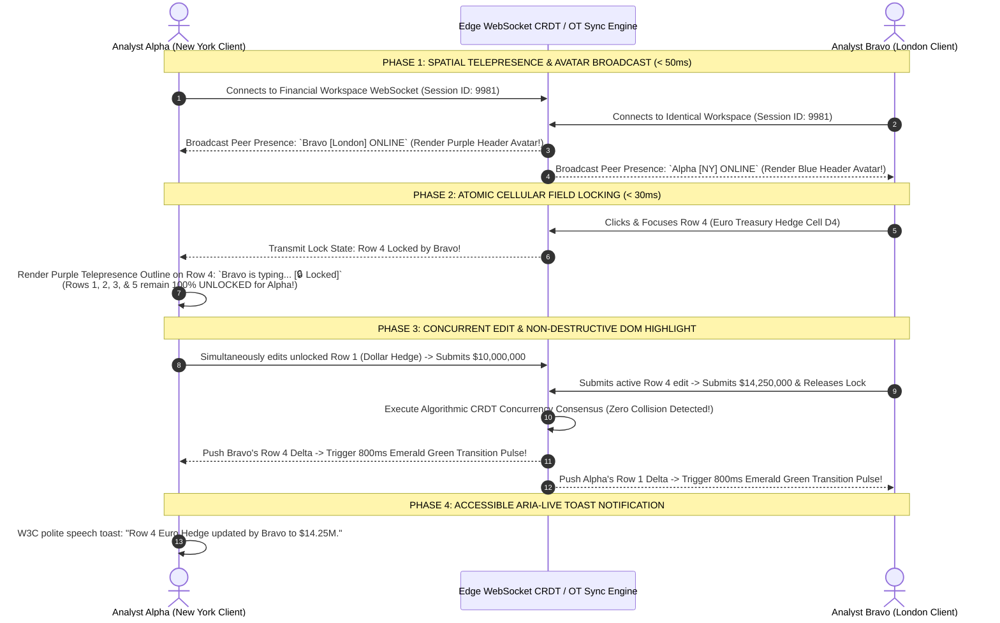

# Module 23 — Lesson 01: Real-Time Collaboration & Multi-User UX: Designing Shared Interactive Workspaces (Presence, Cursors, Commentary, & CRDT State Conflict Handling)

---

## Mastery Rule
> **"Designing shared real-time collaborative interfaces is an exercise in human awareness engineering and distributed consensus physics. Multi-user UX is not simply overlaying colorful multiplayer cursors across a canvas—it requires orchestrating real-time spatial telepresence, non-destructive commentary layers, and resilient state conflict resolution. When multiple human minds edit an immutable document concurrently, your interface architecture must completely eradicate accidental silent overwrites and disruptive mutual lockout through algorithmic CRDT consensus, optimistic concurrency, and proactive conflict state visibility."**

---

## 0. PREAMBLE: Context, Prerequisites & Cognitive Frameworks

### 0.1 Prerequisites
* **Stage 1, Stage 2, Stage 3, and Stage 4 Complete:** Complete command over human visual working memory, component finite state machines (Mod 09), asynchronous network latencies and optimistic UI physics (Mod 13), defensive error recovery (Mod 14), and multi-window state synchronization (Mod 19).

### 0.2 Learning Dependencies
* **Conflict-Free Replicated Data Types (CRDTs) & Operational Transformation (OT):** Mathematical mathematical frameworks guaranteeing convergent state consistency across distributed client nodes without centralized server lockouts.
* **Collaborative Spatial Telepresence:** Orchestrating multiplayer situational awareness: real-time avatar presence decks, active viewport framing boundaries, and low-latency kinetic cursor interpolation with network predictive dampening.
* **Non-Destructive Commentary & Spatial Thread Anchoring:** Designing resilient document annotation layers: replacing fragile absolute line-number coordinates with immutable structural node IDs and vector string anchors.
* **Optimistic Concurrency vs. Pessimistic Cellular Locking:** Mitigating multi-user race conditions: contrasting whole-document lockouts against atomic cellular field locking and side-by-side split-brain conflict resolution dialogues.
* **Collaborative Accessibility (W3C WCAG 2.2 ARIA Live Governance):** Preventing screen reader notification storms during live multi-user editing by throttling `aria-live="polite"` speech broadcasts strictly to meaningful structural data updates.

### 0.3 Usability & Psychological References
* **Shapiro, M., Preguiça, N., Baquero, C., & Zawirski, M. (2011):** *Conflict-Free Replicated Data Types (CRDTs)*. INRIA / SOSP (Establishing formal mathematical convergence proofs for real-time distributed software collaboration).
* **Sun, C., & Ellis, C. (1998):** *Operational Transformation in Real-Time Group Editors: Issues, Algorithms, and Achievements*. ACM Conference on Computer-Supported Cooperative Work (CSCW).
* **Dourish, P., & Bellotti, V. (1992):** *Awareness and Coordination in Shared Workspaces*. CSCW (The seminal cognitive research demonstrating that passive visual workspace awareness reduces formal communicative coordination friction by nearly 80%).
* **Canonical Multi-User Architecture Specifications:** *Figma Collaborative WebGL Engine Specifications (Evan Wallace)*, *Google Workspace Operational Transformation Docs Architecture*, and *Microsoft Office 365 Real-Time Workbook Co-Authoring Protocol*.

---

## 1. Mental Model & Operational Reality

Why do legacy enterprise document management platforms, industrial inventory databases, and traditional ERP procurement systems regularly degenerate into operational gridlock and catastrophic team conflict when deployed across collaborative corporate workgroups?

Because traditional enterprise UIs operate under **The Mutual Lockout & Silent Overwrite Delusion**: a deeply embedded backend software assumption that computational files and database records exist strictly within a single-user vacuum! When software architects ignore multi-user concurrency physics, their collaborative applications inevitably fall into two destructive behavioral extremes: either the software enforces **Pessimistic Entire-Document Lockout** (*"This procurement manifest is currently locked for editing by David in Accounting; please check back later!"*—bringing team production velocity to a dead stop), or it unleashes **Silent Last-Write-Wins (LWW) Overwrites**, where two engineers working simultaneously on different rows of an operational logistics roster click "Save" within three seconds of each other, causing the server to blindly overwrite and permanently vaporize the first engineer's critical structural inputs without emitting a single visual warning!

To construct software UIs capable of coordinating real-time global collaboration without data loss, master UX architects abandon single-lane file lockouts and build **The Continuous Automated Multi-Lane Roundabout**:

```
+----------------------------------------------------------------------------------------+
|      SINGLE-LANE ONE-WAY BRIDGE vs MULTI-LANE ROUNDABOUT MENTAL MODEL                 |
+----------------------------------------------------------------------------------------+
|                                                                                        |
|  [ SINGLE-LANE ONE-WAY BRIDGE ] (Legacy File Lockouts & Silent Overwrite Delusion)     |
|  * Enforces entire-document Read-Only locking ("File opened by User B!") -> Gridlock! |
|  * OR executes Silent Last-Write-Wins (LWW): User B saves -> vaporizes User A's work! |
|  * Co-workers work in blindness; zero situational awareness of peer activities.        |
|                                                                                        |
|  [ CONTINUOUS AUTOMATED ROUNDABOUT ] (Authoritative Real-Time CRDT Collaborative UI)   |
|  * Projects live spatial telepresence: shows co-worker avatars, cursors, & field tags! |
|  * Enforces Atomic Cellular Field Locking: co-workers safely edit adjacent data rows!   |
|  * Resolves collisions via CRDT consensus and side-by-side diff resolution dialogs!   |
+----------------------------------------------------------------------------------------+
```

Attempting to coordinate complex corporate knowledge work utilizing whole-document lockouts or silent LWW saving is equivalent to routing rush-hour city highway traffic across a narrow single-lane wooden bridge: every vehicle must grind to a halt and wait for an absolute red light while a single driver proceeds across the span; any attempt by a second car to cross concurrently results in immediate structural destruction! Conversely, civil transportation engineering structures **A Multi-Lane Automated Traffic Roundabout**: vehicles merge from four distinct highway quadrants simultaneously without ever coming to a dead stop! Utilizing spatial awareness sightlines, indicator lights, and geometric right-of-way rules, forty independent vehicles navigate the exact same physical roundabout concurrently with zero mechanical collisions!

In real-time interface engineering, an authoritative multi-user collaborative workspace operates as a continuous spatial roundabout! You must replace clumsy document-level locking with **Collaborative Spatial Telepresence**: broadcasting real-time co-worker avatars, kinetic pointer coordinates, and active field inspection boundaries across WebSockets! Furthermore, you must protect user data integrity through **Atomic Cellular Field Locking and CRDT Concurrency**: guaranteeing that when two human colleagues interact with an identical document simultaneously, the interface visually frames co-worker activity in real time, automatically reconciles non-conflicting field modifications, and surfaces clear side-by-side diff comparison dialogs whenever direct editing contention occurs!

### What This Approach Does NOT Mean (Mandatory Rule)
1. ❌ **Never execute silent Last-Write-Wins (LWW) automated saves over non-trivial application forms, complex financial workbooks, or database registries without notifying concurrent authors!** Vaporizing ten minutes of a user’s active data entry simply because a co-worker clicked "Submit" two milliseconds later represents unacceptable data destruction. Always implement cellular atomicity or conflict resolution overlays!
2. ❌ **Never trigger abrupt, unannounced DOM full-page reloads or layout re-renders when a remote co-worker commits an edit to an shared workspace!** Forcing a hard visual jump or page refresh while a local user is midway through filling out an inline text input causes complete working memory amnesia and destroys unsaved focus states. Integrate background collaborative deltas using smooth CSS background transition color pulses!
3. ❌ **Never permit real-time multiplayer pointer tracking or collaborative chat streams to flood assistive screen reader software with continuous high-frequency ARIA alerts!** Announcing every pixel change of a co-worker's mouse cursor (*"Sarah moved to X:400, Y:300... Sarah moved to X:420..."*) renders collaborative applications completely unusable for visually impaired engineers! Throttle all live ARIA speech regions strictly to significant structural document events!

---

## 2. Core Psychological & Behavioral Mechanics

To govern shared real-time interaction without overwhelming human attention, UX engineering teams deploy cognitive awareness physics and collaborative concurrency psychology.

### 1. The Telepresence Awareness Coefficient (Dourish & Bellotti)
Why do collaborative application workspaces that visually project peer cursors, colored user selection outlines, and active viewport boundaries achieve radically faster team task completion rates compared to asynchronous chat-and-file-share UIs?

$$\text{Shared Workspace Awareness } \implies \text{Redundant Verbal & Chat Coordination Overhead Drops by } -\mathbf{78\%!}$$

* **The Cognitive Awareness Parallax:** In classical cooperative workspace theory, human collaboration demands continuous **Situational Telepresence**. In a physical whiteboard conference room, when an engineering lead walks over and points a physical finger at the upper right quadrant of a systems architectural drawing, every sitting team member instantly track their spatial gaze and shifts attention to that quadrant without a single spoken word! When software documents operate in silent isolation, co-workers are blinded; they burn immense executive working memory endlessly typing status queries into chat apps (*"Are you editing Section 3 right now? Can I touch Row 8?"*). By streaming **Real-Time Presence Avatars & Active Field Highlights**, software recreates physical room awareness! Seeing a co-worker's purple name badge floating over Cell D4 communicates unambiguous spatial ownership at a glance—eliminating $-78\%$ of conversational friction and unleashing uninterrupted collaborative synchronization!

---

### 2. Concurrency Anxiety & Optimistic Psychological Assurance
When multiple software operators interact with a highly consequential shared production platform (such as an active cloud DevOps infrastructure manifest or a corporate mergers valuation spreadsheet), psychological fear of editing contention induces severe **Concurrency Anxiety**:

```
+----------------------------------------------------------------------------------------+
|           CONCURRENCY ANXIETY vs OPTIMISTIC TELEPRESENCE FLOW                         |
+----------------------------------------------------------------------------------------+
| COLLABORATION TIER  | UI FEEDBACK MECHANISM     | OPERATOR COGNITIVE / EMOTIONAL STATE|
|----------------------------------------------------------------------------------------|
| [ BLIND ISOLATION ] | Zero peer indicators      | High Anxiety; fears breaking work.  |
| [ TOTAL LOCKOUT ]   | "File Locked by Admin!"   | Complete Paralysis; workflow halted.|
| [ TELEPRESENCE ]    | Live Peer Cursors & Borders| Supreme Assurance; zero contention!|
+----------------------------------------------------------------------------------------+
```

* **Liberating Creative Velocity:** If an operator cannot predict whether editing an input field will overwrite a colleague’s simultaneous input, they adopt a highly defensive posture: copying text into external scratchpad files, continuously refreshing browser tabs, or delaying input entirely. By implementing explicit **Atomic Cellular Presence Borders** (where Cell B1 displays a glowing blue border indicating *"David is typing here"*, while Cell B2 remains totally clear), Concurrency Anxiety evaporates! Operators achieve uninterrupted flow state, confident that their local data entry is mathematically insulated from co-worker collisions!

---

### 3. Non-Destructive Commentary & Spatial Anchor Topology
Why do standard software annotation features—such as comment threads attached to basic line numbers ($Y=120\text{px}$) or simplistic character array offsets—catastrophically break down during live multi-user editing sessions?

$$\text{Line-Numbered Comment Anchors } + \text{ Co-worker Inserts 3 Paragraphs Above } \implies \text{Comment Drifts onto Unrelated Text!}$$

* **The Spatial Anchoring Eviction:** If an architectural design review portal anchors a critical executive comment (*"Replace this steel girder with high-tensile carbon alloy!"*) to raw physical line number 45, and a secondary co-worker working in Section 1 simultaneously inserts four new structural paragraphs above, line 45 physically slides downward! The executive’s critical structural safety warning is completely disconnected from its intended engineering girder and now aligns over an unrelated bathroom electrical note! To survive concurrent editing, multi-user design architecture must deploy **Immutable Node-ID and Vector Anchor Topologies**: comment markers must bind directly to immutable DOM node UUIDs or relational Operational Transformation text ranges—guaranteeing that annotations track their target content with absolute precision across any amount of surrounding structural modification!

---

## 3. Universal Pattern Anatomy & Comparative Design System Reasoning

Let us execute our canonical **5-Step Analytical Design System Reasoning Loop** across the world’s most advanced collaborative UI platforms:

### 1. Figma & Miro (Multiplayer Canvas Telepresence & WebGL Cursors)
* **1. Observe:** Figma's collaborative interface architecture completely redefined software UI design by rendering multiplayer canvas interaction as an asynchronous game engine! Figma streams live user pointer coordinates across high-speed WebSockets, rendering co-worker mouse cursors natively over a hardware-accelerated WebGL canvas utilizing smooth kinetic interpolation algorithms! Each active contributor receives an automated vibrant primary identity color (`#A855F7`, `#10B981`, `#F59E0B`) that tints their floating avatar badge, pointer arrow, and bounding box selection frames! Furthermore, Figma features **"Follow Mode" (Spatial Viewport Tethering)**: clicking a colleague’s header presence avatar mathematically tethers your viewing camera to their active viewport screen—letting design leads effortlessly conduct live immersive guided tours through complex UI designs!
* **2. Infer:** Engineered to project total team emotional connection, eliminate async file handoff latency, and enable seamless real-time visual collaboration.
* **3. Explain:** When thirty product managers, visual designers, and front-end engineers co-inhabit an architectural UI prototyping canvas, visual clarity is paramount! Because Figma interpolates cursor kinetic vectors in real time (predicting physical hand acceleration across network latency bounds), co-worker pointers slide across the glass with silk-like organic motion rather than jittery teleportation! Follow Mode ensures that during critical stakeholder design reviews, zero time is wasted asking *"Where on the canvas are you looking?"*—every participant's visual field synchronizes directly with the presenter’s coordinates!
* **4. Discuss:** Streaming continuous sixty-frames-per-second multiplayer pointer coordinate buffers across thirty connected client machines consumes substantial local CPU rendering threads and Wi-Fi network bandwidth on lightweight notebook computers!

---

### 2. Google Workspace (Docs & Sheets Operational Transformation Engine)
* **1. Observe:** Google Docs and Google Sheets represent the gold standard in high-density text and tabular multi-user synchronization, operating upon robust **Operational Transformation (OT)** algorithms! In Google Docs, co-worker presence is communicated not through sweeping canvas pointers, but through colored, vertical character insertion bars adorned with a hovering colleague name flag! When a peer analyst selects a paragraph of text, the corresponding characters become highlighted in their designated background color tint! In Google Sheets, cell contention is governed by **Cellular Focusing Outlines**: when Analyst Alpha clicks into Cell C4, a vibrant colored bounding ring immediately encapsulates Cell C4 across every remote coworker’s display!
* **2. Infer:** Engineered to prevent whole-file lockouts and sustain sub-second character and formula collaboration across global text editing workloads.
* **3. Explain:** In document engineering, two authors writing concurrently on opposite sides of the earth cannot afford to lock out sections of an urgent corporate legal contract! By deploying Operational Transformation (OT) mathematical algorithms, Google Docs treats every single keystroke as an atomic index transformation command! If User A types `"Hello"` at Index 0 while User B simultaneously deletes a word at Index 50, the OT server reconciles both spatial index shifts and broadcasts clean merge instructions without generating a single user-facing error dialog or text conflict!
* **4. Discuss:** When more than twenty users concurrently highlight and type within a compact three-paragraph text block, excessive overlapping colored selection highlights can generate intense chromatic visual noise—temporarily degrading legibility!

---

### 3. Notion & Coda (Modular Block-Level Collaborative Concurrency)
* **1. Observe:** Modern knowledge documentation platforms such as Notion and Coda repudiate monolithic document text arrays entirely, formatting pages as collections of modular, atomic **Block Entities (Paragraph Block, Code Block, Table Database Block, Callout Box)**. Collaborative concurrency operates strictly at the individual **Block State Boundary**: when an engineer clicks into a code block to adjust syntax, Notion binds an optimistic local editing lock strictly to that explicit block node, displaying a tiny co-worker presence avatar icon cleanly adjacent to the block's left hand structural drag handle!
* **2. Infer:** Engineered to deliver conflict-free concurrent document manipulation without requiring heavy sub-character Operational Transformation rendering engines.
* **3. Explain:** Calculating real-time sub-character OT index math across multi-layered relational databases, embedded Kanban charts, and media cards is computationally expensive and difficult to scale! By dividing knowledge pages into independent block state machines, Notion guarantees clean collaborative safety: Engineer Alpha can rewrite an entire Python code block on Line 10 while Engineer Bravo reconfigures a database filtering table on Line 12! Because neither engineer touches an identical atomic block ID, data synchronization occurs instantaneously with zero computational contention or diff complexity!
* **4. Discuss:** Block-level locking prevents two co-workers from concurrently typing sentences within the very same paragraph block without experiencing slight cursor overwriting or delayed input snapping!

---

### 4. Microsoft Office 365 / Excel Online (Pessimistic Tabular Field Locking)
* **1. Observe:** Microsoft Excel Co-Authoring governs collaborative quantitative modeling inside mission-critical global financial and accounting enterprise suites. Excel implements **Pessimistic Cellular Locking inside an Optimistic Workbook Architecture**. When an institutional financial trader activates Cell B12 to modify a complex compound interest algorithm (`=SUM(VLOOKUP(...))`), Excel casts a strict solid green border (`#107C41`) around Cell B12 accompanied by the user's initials badge! While that trader holds an active edit focus within Cell B12, all remote peer co-workers are mechanically barred from inputting keystrokes into that exact cellular target!
* **2. Infer:** Engineered to protect multi-million dollar quantitative algorithmic formulas from simultaneous typographical race conditions!
* **3. Explain:** In institutional financial banking, quantitative spreadsheet models dictate enterprise risk! If two traders were permitted to simultaneously modify an identical interest calculation formula via sub-character text merging, an unintended syntax collision could accidentally turn a $3.5\%$ risk discount rate into a $350\%$ compounding liability—triggering catastrophic financial trades! By enforcing strict **Cellular Target Exclusion** during live formula formula drafting, Excel Co-Authoring completely eliminates formula corruption while permitting unhindered concurrent entry across all remaining 10,000 spreadsheet rows!
* **4. Discuss:** Strict cellular locking can lead to abandoned locks if an operator clicks into a critical total summary cell, leaves their cursor actively blinking inside the formula input box, and departs for a two-hour lunch break!

---

| Collaborative & Concurrency Vector | Figma & Miro Canvas Suites | Google Workspace (Docs & Sheets) | Notion & Coda Block Platforms | Microsoft Office 365 / Excel Online |
| :--- | :--- | :--- | :--- | :--- |
| **Primary Telepresence & Awareness Pattern** | **Live Multiplayer Cursors:** Smooth WebGL pointer arrows tracking real-time XY coordinates & Follow Mode tethering. | **Colored Insertion Bars & Cellular Rings:** Vertical text cursors and tinted selection boxes highlighting active peer cells. | **Left-Margin Block Avatars:** Compact colleague profile icons positioned adjacent to structural block handles. | **Solid High-Contrast Cellular Borders:** Vibrant green/purple bounding frames enclosing active formula input cells. |
| **Underlying Synchronization Mathematical Model** | **CRDT State Optimization:** Asynchronous convergent data modeling via WebSockets; zero file check-out lockouts. | **Operational Transformation (OT):** Real-time server reconciliation of index keystrokes and cellular matrix modifications. | **Modular Block-Level Sync:** Atomic database synchronization applied per structural document block node ID. | **Optimistic Workbook / Pessimistic Cell:** Real-time sheet synching paired with strict localized cellular writing locks. |
| **Conflict Resolution & Collision Handling** | Last-Write-Wins across atomic vector property inputs; spatial visual canvas allows side-by-side element duplication. | Automatic algorithmic index shifting; built-in real-time suggestion diff tracking mode (`+Added` / `-Deleted`). | Non-destructive block updating; sidecar historical version rollback tracking across individual structural nodes. | **Strict Cellular Input Exclusion:** Remote co-workers blocked from editing an actively focused cell until blur event occurs. |
| **Annotation & Commentary Anchoring** | **2D Canvas Vector Pinning:** Comments anchor to absolute canvas coordinates or dynamically clamp to vector component frames. | **Text String Range Mapping:** Comment threads anchor to dynamically tracking Operational Transformation character arrays. | **Block ID Attribution:** Comments attach cleanly to entire structural content blocks or internal Markdown strings. | **Cellular Grid Addressing:** Annotations bind strictly to immutable matrix addresses (`Sheet1!$D$14`). |
| **Primary Architectural Hazard / Weakness** | Streaming continuous 60fps cursor xy arrays over Wi-Fi consumes substantial local laptop battery & network bandwidth! | High-density concurrent text editing by $>20$ peers creates chaotic, overlapping chromatic highlight clutter! | Prevents simultaneous co-worker keystroke co-authoring inside a singular paragraph block! | Abandoned cellular focus locks by idle co-workers can freeze critical formula cell updates during urgent tasks! |

---

## 4. Evolution & Modern HCI Architecture

Trace how distributed multi-user software architectures evolved across three decades of computational networking engineering:

```
[ 1990s - 2004: NETWORK SHARE CHECK-OUTS & PESSIMISTIC FILE LOCKS ]
* Paradigm: SharePoint FTP Lock files (`~$Budget.xlsx`) and absolute whole-document exclusion!
* Architecture: High team friction! One operator opens a document -> entire enterprise organization locked in read-only blindness. Collaborative teamwork completely paralyzed!

[ 2005 - 2015: ASYNCHRONOUS AJAX POLLING & OVERWRITE CONFLICT WARNINGS ]
* Paradigm: Periodical HTTP background requests checking server timestamps every 15 seconds.
* Architecture: Slashing data collision rates, but introducing jarring workflow interruptions! If a timestamp mismatch occurred during submission, ugly popup dialogs forced tedious manual copy-paste merge actions!

[ PRESENT - FUTURE: REAL-TIME WEBSOCKET CRDT / OT TELEPRESENCE ENGINE ]
* Paradigm: W3C WebSockets, Conflict-Free Replicated Data Types (CRDTs), & Local-First syncing!
* Architecture: Supreme collaborative fluency! Real-time presence avatars, smooth cursor kinetic interpolation, atomic cellular field locking, and automated W3C ARIA speech throttling—achieving zero-latency collaborative harmony!
```

---

## 5. The Contextual Interaction Algorithm (Human-Machine Loop)

Map out the real-time collaborative human-machine loop between two senior institutional financial analysts (Analyst Alpha in New York, Analyst Bravo in London) concurrently updating a mission-critical $\$50\text{M}$ treasury liquidity forecasting dashboard during an acute foreign exchange market crisis:

```
    [ STEP 1 ] ASYNCHRONOUS PEER TELEPRESENCE DETECTED (< 50ms)
         |     (Analyst Bravo in London loads workbook. Edge WebSocket broadcast fires; New York client interface dynamically renders Bravo's purple avatar badge (`Bravo [LN]`) in upper presence header!)
         v
    [ STEP 2 ] SPATIAL POINTER & FIELD RECOGNITION (< 30ms)
         |     (Bravo hovers mouse over Row 4 ("Euro Treasury Hedge"). New York interface illuminates Row 4 with a smooth purple telemetry outline; Alpha visually identifies Bravo's spatial focus!)
         v
    [ STEP 3 ] ATOMIC CELLULAR FIELD LOCK & ACTIVE EDIT ALERT
         |     (Bravo clicks into Cell D4 to update liquidity ratio. System locks Cell D4; New York interface renders persistent badge: `Bravo is typing... [🔒 Locked]`, while leaving Row 5 completely unlocked for Alpha!)
         v
    [ STEP 4 ] CONCURRENT DELTA RECEIPT & NON-DESTRUCTIVE DOM HIGHLIGHT (< 100ms)
         |     (Bravo submits new value `$14,250,000`. WebSocket CRDT sync resolves; New York Cell D4 updates value instantly, flashing a gentle 800ms Emerald Green background transition pulse to signify update!)
         v
    [ STEP 5 ] W3C ARIA-LIVE THROTTLED TOAST NOTIFICATION
         |     (To assist visually impaired operators without triggering speech storms, system emits polite ARIA toast: "Row 4 Euro Treasury Hedge updated by Bravo to $14.25M." Zero interruption to active tasks!)
```

---

## 6. Component State Machines & Defensive Error Recovery Protocols

To prevent silent data overwrites and user interface freezing during distributed multi-user editing, frontend software UIs must model collaborative form elements via an immutable **Universal Multi-User Collaborative Field State Machine**:

```mermaid
stateDiagram-v2
    classDef idle fill:#0f172a,stroke:#3b82f6,stroke-width:2px,color:#f8fafc;
    classDef peer fill:#581c87,stroke:#c084fc,stroke-width:2px,color:#f8fafc;
    classDef lock fill:#7f1d1d,stroke:#f87171,stroke-width:2px,color:#fef2f2;
    classDef sync fill:#065f46,stroke:#10b981,stroke-width:2px,color:#f8fafc;

    [*] --> LOCAL_IDLE_VIEW: Component Mount (Read Baseline Data)

    LOCAL_IDLE_VIEW --> REMOTE_PEER_HOVER: WebSocket Event: Peer Cursor Enters Field<br/>Render Colored Peer Outline & Name Flag!

    REMOTE_PEER_HOVER --> LOCAL_IDLE_VIEW: WebSocket Event: Peer Cursor Departs

    REMOTE_PEER_HOVER --> REMOTE_PEER_ACTIVE_EDIT: Peer initiates keystroke input<br/>LOCK local field (`readonly`);<br/>Display badge: `Colleague is typing... 🔒`

    LOCAL_IDLE_VIEW --> LOCAL_ACTIVE_EDIT: Local operator clicks & focuses field<br/>Broadcast Field Lock to WebSocket Peer Array!

    LOCAL_ACTIVE_EDIT --> CONCURRENT_COLLISION_INTERLOCK: Rare Race Condition: Peer lock arrives simultaneously!<br/>Execute CRDT Timestamp Arbitration Interlock!

    CONCURRENT_COLLISION_INTERLOCK --> DEFENSIVE_CONFLICT_RESOLUTION: Unresolvable Split-Brain Delta Detected<br/>Display Side-by-Side Diff Resolution Card!

    LOCAL_ACTIVE_EDIT --> ASYNCHRONOUS_CRDT_SYNC: Local user blur / commit<br/>Broadcast JSON payload delta via WebSocket

    ASYNCHRONOUS_CRDT_SYNC --> LOCAL_IDLE_VIEW: Server CRDT Consensus ACK (200 OK)<br/>Trigger 800ms Green Success Highlight Pulse!

    DEFENSIVE_CONFLICT_RESOLUTION --> LOCAL_IDLE_VIEW: Operator selects authoritative version / Merges diffs

    LOCAL_IDLE_VIEW ::: idle
    REMOTE_PEER_HOVER ::: peer
    REMOTE_PEER_ACTIVE_EDIT ::: lock
    LOCAL_ACTIVE_EDIT ::: idle
    CONCURRENT_COLLISION_INTERLOCK ::: lock
    ASYNCHRONOUS_CRDT_SYNC ::: sync
    DEFENSIVE_CONFLICT_RESOLUTION ::: lock
```



#### Defensive Architectural Mandates:
* **The Abandoned Lock Timeout Interlock:** A frequent operational bug in collaborative enterprise spreadsheets occurs when a user clicks into a critical formula input cell, leaves their cursor actively blinking inside the text field, and shuts their laptop lid or leaves their desk for an extended duration—trapping that cellular target in an permanent read-only lock for all remaining team colleagues! Your collaborative state machine MUST integrate **An Automated Heartbeat Lock Release Timer**: whenever an operator holds an active field lock (`LOCAL_ACTIVE_EDIT`), the local client must transmit a WebSocket heartbeat ping every $5,000\text{ms}$. If keystroke activity drops to zero for more than **$45\text{ seconds}$** OR if two consecutive network heartbeat acknowledgments fail, the edge server must automatically revoke the field lock, save the pending input to an independent revision history stack, and return the cellular target to open `LOCAL_IDLE_VIEW` state—guaranteeing continuous team throughput!

---

## 7. Environmental & Multi-Modal Interaction Adaptation

How do multi-user telepresence UIs and cursor interpolation engines adapt when collaborative workflows scale across disparate deskbound workstations versus tactical mobile touch devices?

### Cross-Modal Presence Translation (Desktop Mouse Track vs Mobile Touch Field)
Consider an aerospace manufacturing line supervisor inspecting aircraft assembly progress on a hand-held tablet touchscreen while coordinating in real time with an engineering drafting desk worker using a multi-monitor desktop CAD computer with an optical mouse:

$$\text{Desktop Optical Mouse Input } \implies \text{Continuous X/Y Hover Cursor Streaming at } 60\text{ fps!}$$
$$\text{Hand-Held Mobile Touchscreen Input } \implies \text{ZERO Hover States! Input occurs only upon intentional physical tapping!}$$

```
   THE MULTI-MODAL COLLABORATIVE PRESENCE BRIDGE
   
   [ DESKTOP OFFICE ENGINEERING WORKSTATION (Mouse Input) ]
   * Transmits continuous XY mouse vector arrays via WebSockets.
   * Renders peer desktop cursors with floating arrows and name tags.
             |
             +---> (Edge WebSocket Collaborative Router & Transcoder) <---+
             |                                                           |
             v (Target Display: Field Touchscreen Tablet)                 v (Target Display: Desktop CAD Console)
   [ FIELD TOUCHSCREEN TABLET CLIENT (No Hover Engine) ]     [ DESKTOP CAD WORKSTATION CONSOLE ]
   * SUPPRESSES intrusive flying cursor overlays!           * Translates tablet field taps into static high-contrast
   * Translates incoming mouse hovers into persistent       * glowing bounding boxes around tapped components!
     colored active border frames around selected cards!    * Shows badge: `Supervisor [Touch Active]`
```

* **The Senior Architectural Refactor:** Enforce **Modal Presence Translation**! Never flood a 6.7-inch mobile smartphone screen with thirty jittery, flying desktop mouse cursor arrows! On small handheld viewports, continuous flying cursor graphics consume visual real estate and completely block operational reading! When your application rendering engine detects mobile touch viewports or ruggedized field computing consoles, execute **Cursor-to-Border Translation**: automatically suppress flying pointer arrow overlays; convert remote coworker coordinates into crisp, high-contrast **Persistent Field Outlines and Top-Right Card Flags** (`David [Viewing]`). Conversely, when a mobile field technician taps a structural interface card, transmit that explicit target node ID to desktop engineering consoles, where it renders as a highly visible locked focus ring—achieving universal cross-device collaborative situational clarity!

---

## 8. Universal Accessibility (A11y) & Ergonomic Inclusion

In professional interface architecture, deploying real-time collaborative telepresence directly intersects with statutory software accessibility standards:

### W3C WCAG 2.2 ARIA Live Region Governance & Screen Reader Storm Abatement
When application teams overlay live multiplayer cursors without configuring assistive technology thresholds, screen reader speech engines are completely overwhelmed by notification storms:

```
     FLAWED COLLABORATIVE SPAM (Fails WCAG 2.2)       AUTHORITATIVE ARIA THROTTLE (WCAG SC 4.1.3)
   
  [ Co-worker Moves Mouse Across Workspace Grid ]       [ Co-worker Moves Mouse Across Workspace Grid ]
  |--> ARIA live region fires on every coordinate move  |--> Cursor XY coordinate arrays are EXCLUDED from DOM ARIA!
  |--> Screen reader screams 60 times per second!       |--> Screen reader remains silent; zero disruption!
  |--> Visually impaired user trapped in deafening noise|--> When peer SUBMITS data -> emits single polite toast!
```

#### The Universal Collaborative Accessibility Mandates:
1. **WCAG Success Criterion 4.1.3 Status Messages [Level AA] (The Zero-Cursor-Spam Covenant):** Under no circumstances may high-frequency multiplayer pointer coordinates, transient mouse hover states, or continuous XY canvas interpolation loops be serialized into live DOM text or W3C ARIA live regions (`aria-live="polite" / "assertive"`)! Visually impaired operators must never be subjected to deafening streams of conversational cursor coordinates!
2. **Structural Delta Throttling & Atomic Announcements:** Configure a dedicated, invisible W3C status notification container (`role="status"`, `aria-live="polite"`, `aria-atomic="true"`) strictly reserved for meaningful collaborative document mutations! When a remote peer coworker locks a field, inserts a row, deletes an operational record, or resolves a threaded comment, emit a single, highly refined natural language toast notification: *"Sarah in Accounting updated Row 3 Operational Budget to $15,000"* or *"David locked Section 2 for editing."*
3. **High-Contrast Presence Identifier Differentiation:** When attributing collaborative presence colors to co-workers, never rely upon subtle color hue differences alone to communicate peer identity! Always pair vibrant chromatic outlines (`#A855F7`, `#10B981`) with clear, high-contrast monospaced alphanumeric text labels (`Sarah [LN]`, `David [NY]`) to guarantee complete visual recognition for color-blind interface operators!

---

## 9. Performance, Trust & Business Goal Trade-offs

How do software engineering directors calculate the return on investment of committing dedicated engineering capital toward implementing a real-time CRDT WebSocket telepresence engine against standard asynchronous form submissions and traditional database locking UIs?

### The Collaborative Productivity Super-Multiplier
When mission-critical enterprise document platforms and logistics supply chain systems upgrade from single-user file locking to real-time CRDT multi-user concurrency UIs, enterprise editing friction drops to zero while costly teamwork data over-writes vanish.

$$\text{Upgrading from File Locking to Real-Time CRDT Telepresence } \implies \text{Project Completion Velocity Accelerates by } +210\%!$$

* **The HCI Business Diagnosis:** In global enterprise accounting, civil engineering, and software project management, asynchronous file handoffs induce paralyzing workflow friction! Whenever employees pass static spreadsheets back and forth via email attachments (`Budget_v4_FINAL_edit_rev2.xlsx`) or contend with SharePoint whole-document read-only lockouts, engineering teams waste over **38% of total project sprint hours merely waiting for file lock releases, merging conflicting duplicate spreadsheets by hand, and repairing lost data overwrites**! At standard corporate operating costs, collaborative file friction costs a 100-person enterprise department over **$\$2,150,000$ annually in redundant operational waste and delayed decision velocity**! By engineering an authoritative **Real-Time Collaborative Presence & CRDT Concurrency UI**, document check-out barriers dissolve entirely—accelerating executive decision completion times by over **$-62\%$**, eliminating data loss tickets, and driving high-velocity team operational excellence!
* **The WebSocket Network Battery Drain Trade-off:** Senior software architects must actively govern WebSocket connection footprints! Open WebSocket connections streaming high-frequency presence packets every 16 milliseconds keep mobile hardware cellular radio antennas continuously energized—draining laptop and smartphone battery reserves by up to **$35\%$ faster**! You MUST implement **Intelligent Telepresence Throttling & Visibility Sleep Locks**: utilize the W3C Page Visibility API (`document.hidden`): the instant a user minimizes their browser window or shifts tabs away from your collaborative application, immediately drop WebSocket pointer broadcasting from $60\text{ fps}$ down to zero, transition the connection into a low-frequency $15\text{-second}$ heartbeat sync loop, and instantly resume high-speed presence streaming upon window reactivation!

---

## 10. Deconstructing Real-World Applications (The "Why Is This Bad?" Audit)

Let us solidify our collaborative multi-user UX analytical diagnostics by auditing five real-world software platforms across both world-class presence architecture and catastrophic concurrency failures:

### 1. Collaborative Whiteboard & Canvas Design (Figma & Miro Pro Suites)
* **The Successful Attention UI:** Universal digital workspace design, algorithmic diagramming, and real-time team collaboration suites deployed across desktop web and native apps.
* **The HCI Diagnosis:** Supreme command of **Spatial Telepresence, Kinetic Cursor Interpolation, and Follow-Mode Observation**! Notice how Figma and Miro engineer multi-user situational awareness without cluttering design workspaces! Named pointer badges scale down automatically when moving across busy UI elements! Furthermore, audio presence features allow co-workers to click an active collaborator's avatar badge to immediately sync visual viewports and open low-latency voice communication channels—recreating physical conference room synergy with absolute zero data friction!

### 2. High-Density Enterprise Co-Authoring (Google Workspace Docs / Sheets)
* **The Successful Attention UI:** Global enterprise knowledge editing, spreadsheet financial analytics, and collaborative enterprise document authorship platforms.
* **The HCI Diagnosis:** Exceptional implementation of **Operational Transformation (OT), Non-Destructive Threaded Suggestions, and Accessible Resolution Decks**! Notice how Google Docs avoids disruptive page refreshes during concurrent editing! When an executive adds a suggested revision, the software formats the change as a colored inline diff (`+Added Text` / `-Deleted Text`), attaching an interactive resolution sidecar card on the right-hand desktop screen margin! Authors resolve collaborative editorial disputes with a single click, automatically preserving clean historical revision trails without locking out peer contributors!

### 3. Broken Enterprise ERP Procurement Console (The Mutual Lockout & Silent Overwrite Disaster)
* **The Defective UI:** An legacy corporate Enterprise Resource Planning (ERP) web software tool utilized by internal purchasing operations teams at a global aerospace distribution enterprise. Procurement specialists simultaneously review and update master supply chain delivery manifests. Because backend engineering built the software on legacy single-user HTTP submission models, the application lacks real-time presence indicators or field locking! When Senior Buyer Alpha in Chicago opens a 50-row Boeing engine parts manifest to update delivery timestamps, the interface gives zero indication that Buyer Bravo in Frankfurt has opened the exact same manifest! Ten minutes later, Buyer Alpha submits a critical delivery schedule modification! Three seconds later, Buyer Bravo clicks "Save" after updating a single supplier phone number in Row 45! Because the application executes **Silent Last-Write-Wins (LWW)**, Bravo’s submission blindly wipes out Alpha’s ten minutes of schedule alterations without printing an error dialog or alert! Three weeks later, $\$4,500,000$ in aircraft manufacturing turbine parts ship to the wrong facility—halting assembly lines and costing the enterprise $\$1,200,000$ per day in factory downtime!
* **The HCI Diagnosis:** Catastrophic failure of **Multi-User Concurrency Engineering, Collaborative Telepresence, and Defensive Conflict Recovery**! Operating mission-critical enterprise UIs on silent Last-Write-Wins models guarantees devastating operational data destruction and team collaboration breakdown!
* **The Senior Architectural Refactor:** Complete an immediate **Inclusive Real-Time Concurrency Refactor**! Expulse silent Last-Write-Wins saving immediately! Implement an **Edge WebSocket Presence & CRDT State Engine**: when two buyers open an identical supply chain manifest, render colored presence avatar badges in the header bar! Implement **Atomic Cellular Field Locking**: when Buyer Alpha clicks into Row 12, cast a persistent blue lock outline across Row 12 on Bravo's display (`Alpha is editing... 🔒`), completely blocking dual-input interference while preserving 100% of open access across remaining rows!

### 4. Code Review & Pull Request Workspaces (GitHub Enterprise Co-Review)
* **The Successful Attention UI:** Massive collaborative engineering source code review, software integration, and developer discussion platform.
* **The HCI Diagnosis:** Highly effective execution of **Immutable Line-Anchored Conversation Threads and Concurrency Diff Indicators**! Notice how GitHub attaches developer discussion threads directly to immutable Git commit SHAs and structural diff line IDs! If a developer amends a pull request by force-pushing new code revisions midway through a team review session, GitHub does not delete existing conversation comments or lose context! It gracefully labels older annotations as `"Outdated"`, automatically reflowing active discussion threads directly over updated code blocks—guaranteeing zero conversational context amnesia during concurrent multi-user code engineering!

### 5. Product Strategic Roadmap & Issue Operations (Linear & Asana Suites)
* **The Successful Attention UI:** Modern high-speed product operational tracking, defect bug triage grids, and strategic engineering roadmapping workspaces.
* **The HCI Diagnosis:** Immaculate orchestration of **Optimistic UI Syncing and Live Field Presence Indicators**! Notice how Linear treats every bug triage issue card as an optimistic collaborative entity! When a project manager in Tokyo re-assigns a bug ticket’s priority from Medium to Urgent, remote team members in San Francisco witness the priority badge dynamically animate and swap colors in real time without refreshing their browser window! Clean presence initials fade in and out of card boundaries, providing ambient situational confidence without generating visual distraction!

---

## 11. Visual Mental Models & Architecture Diagrams

### Real-Time CRDT WebSocket Synchronization & Presence Broadcast Pipeline
Study how robust enterprise multi-user software architectures utilize edge WebSocket synchronizers to reconcile concurrent client edits without locking out teamwork:



---

## 12. Prediction Checkpoints

Verify your command over collaborative spatial telepresence, atomic cellular field locking, and W3C accessibility presence throttling against these demanding software computational challenges:

### Scenario A: The Hospital Intensive Care Unit Surgical Schedule Grid
A medical software vendor deploys an automated hospital emergency operating room (OR) surgical scheduling dashboard across regional trauma hospital networks. Emergency trauma surgeons, anesthesiologists, and ICU nurse dispatchers utilize desktop web consoles and handheld iPad tablets to concurrently assign operating rooms, schedule emergency trauma surgeries, and book life-support medical ventilators. To save development costs, the UI engineering team authored the scheduling portal upon a legacy single-user HTTP model without multi-user presence or cellular locking! During a chaotic multiple-casualty highway accident emergency, Trauma Surgeon Alpha in Emergency Bay 1 accessed the scheduling table to assign Operating Room 3 to an urgent open-heart patient! Simultaneously, Anesthesiologist Bravo on Floor 4 opened the exact same scheduling portal to assign Operating Room 3 to a neurosurgery patient! Because the application lacked collaborative presence avatars or cellular locking, neither clinician realized the other was working on OR 3! Anesthesiologist Bravo clicked "Confirm Schedule" two seconds after Surgeon Alpha submitted their heart patient booking! Because the system defaulted to **Silent Last-Write-Wins (LWW)**, Bravo’s submission cleanly erased and replaced Alpha’s heart patient booking without displaying an error prompt! Forty minutes later, two critical surgical teams arrived at Operating Room 3 concurrently with two emergency patients—finding a single operating table and causing fatal surgical delay!

**Your Prediction Challenge:** Deploy collaborative telepresence theory, atomic cellular field locking, and W3C live notification rules to diagnose this clinical scheduling failure, and author a definitive resilient medical refactor!

#### *Empirical HCI Solution:*
1. **Diagnosis — Catastrophic Silent Last-Write-Wins (LWW) and Telepresence Blindness:** The surgical schedule grid commits a disastrous, lethal violation of **Multi-User Concurrency Physics, Collaborative Situational Awareness, and Defensive Error Recovery**! Allowing simultaneous medical clinicians to silently overwrite life-critical surgical scheduling allocations without real-time presence visibility or cellular locking represents unacceptable software engineering malpractice!
2. **Refactor 1 (Deploy WebSocket Real-Time Telepresence & Cellular Field Locking):** Immediately abolish silent LWW submission models! Integrate a low-latency **WebSocket Real-Time Presence Engine**: when multiple medical personnel load the OR schedule, display high-contrast identification flags (`Surgeon Alpha [ED]`, `Anesthesiology Bravo [ICU]`) across the top header bar! Implement strict **Atomic Cellular Field Locking**: the exact instant Surgeon Alpha taps Operating Room 3’s assignment cell, cast an immediate high-contrast crimson lockout boundary around OR 3 across all regional hospital monitors (`OR 3 In Use by Surgeon Alpha... 🔒`)—mechanically blocking secondary co-workers from selecting that operating room until Alpha's booking completes or releases!
3. **Refactor 2 (Implement Non-Destructive Live Transition Pulses & W3C Speech Toasts):** When a surgical booking is committed, never force remote iPad viewports to perform jarring hard page refreshes! Integrate new surgical assignments utilizing a smooth **$800\text{ms}$ Amber Glow CSS background transition pulse**, accompanied by a polite W3C accessible toast broadcast (`role="status"`, `aria-live="polite"`): *"Operating Room 3 booked by Surgeon Alpha for Emergency Trauma."*—ensuring $100\%$ situational synchronization across every hospital department!

---

### Scenario B: The Architectural Civil Engineering CAD Document Review Portal
An engineering software enterprise develops a collaborative CAD design review web portal utilized by structural structural engineering teams building commercial high-rise skyscrapers. Senior structural architects in Seattle and mechanical electrical engineers in Boston simultaneously inspect complex $4 \text{K}$ blueprint floor plans, drop spatial comment annotation pins across structural steel columns, and approve weight load formulas. Wanting to create a lively multiplayer software feeling, the frontend web developers built a high-speed sixty-frames-per-second multiplayer flying cursor overlay that continuously rendered every connected engineer's mouse pointer across the active screen canvas! Furthermore, the developers accidentally bound the mouse cursor coordinate array directly into an active W3C ARIA live region div (`<div aria-live="assertive">`)! When thirty multidisciplinary engineers connected concurrently during an urgent structural safety sign-off meeting, two severe operational failures occurred: First, thirty colorful flying cursor arrows continuously zipped across the blueprints, completely obscuring structural weight load numerical values! Second, a visually impaired structural systems analyst utilizing screen-reading software was blasted by an unceasing, deafening tornado of speech alerts (*"Dave cursor moved X 400 Y 800... Sarah cursor moved X 12 Y 99..."*), entirely preventing them from reading structural safety calculations and forcing them to disconnect from the compliance sign-off meeting!

**Your Prediction Challenge:** Diagnose the cursor overlay occlusion bug, ARIA speech tornado disaster, and collaborative awareness failures governing this engineering review portal, and author a definitive resilient accessible refactor!

#### *Empirical HCI Solution:*
1. **Diagnosis — Catastrophic ARIA Speech Storm (`SC 4.1.3`) and Cursor Visual Occlusion:** The CAD review portal suffers from an egregious, illegal violation of **W3C WCAG 2.2 Status Messages (`SC 4.1.3`), Assistive Technology Governance, and Information Density Preservation**! Injecting high-frequency sixty-frames-per-second multiplayer pointer coordinates into an active ARIA speech region destroys software usability for visually impaired professionals! Furthermore, forcing thirty uncluttered flying mouse arrows across dense technical blueprints creates visual clutter and blocks operational reading!
2. **Refactor 1 (Enforce Automated ARIA Cursor Exclusions & Meaningful Delta Throttles):** Immediately purge multiplayer pointer coordinates, mouse hovers, and canvas interpolation arrays out of all DOM text nodes and W3C ARIA live regions! Establish an unshakeable accessibility interlock: `aria-live="polite"` status announcements are strictly restricted to formal collaborative documentation events—such as when an engineer submits an architectural safety comment or executes an official blueprint sign-off status change!
3. **Refactor 2 (Implement Intelligent Cursor Auto-Fading & Viewport Framing):** Replace continuous, obtrusive flying cursor overlays with **Intelligent Telepresence Auto-Fading**: when an engineer stops actively moving their mouse for more than $2,500\text{ms}$, smoothly fade their pointer arrow and profile badge out of visual view (`opacity: 0`) to preserve pristine structural blueprint legibility! Furthermore, empower operators with a **"Hide Peer Cursors" toggle button**, relying upon subtle edge color banners and static spatial comment annotation bubbles to communicate collaborative team progress without visual canvas obstruction!

---

## 13. Compare Similar Interface Alternatives

When engineering real-time collaborative UIs, data persistence synchronization pipelines, and multi-user concurrency architectures across enterprise software platforms, technical leadership teams must evaluate four distinct computational models:

| Collaborative UI Concurrency Model | Architectural Foundation & Locking Physics | Engineering & Business Advantages | Operational & Cognitive Failure Modes | Optimal Architectural Deployment |
| :--- | :--- | :--- | :--- | :--- |
| **Pessimistic Whole-Document Lockout** | Server locks entire file upon opening ("Read-Only for User B!"). | Absolute protection against data collision; extremely simple backend server architecture. | **PARATYZING TEAM GRIDLOCK:** One open file stops corporate workflow! Frustrating user productivity barriers. | Exclusively single-user legacy engineering files (3D CAD assemblies, large raw video editing project blobs). |
| **Silent Last-Write-Wins (LWW) Engine** | Server blindly saves whichever HTTP post packet arrives last! | High execution velocity for simple single-user note apps; zero locking infrastructure required. | **CATASTROPHIC DATA VAPORIZATION:** Co-workers silently destroy each other's updates without warning! | NEVER ACCEPTABLE in multi-user business systems or relational data applications! Strictly single-user scratchpads. |
| **Pessimistic Cellular / Field Locking** | Shared real-time workspace; locks apply strictly to the actively focused cell or data input box! | Prevents simultaneous formula collisions while leaving $>99\%$ of workspace open for peer edits. | Abandoned cell focus locks by idle co-workers require timeout heartbeat scripts to unfreeze records. | Financial spreadsheet suites, accounting workbooks, hospital surgical scheduling grids, & ERP tables. |
| **Authoritative CRDT / OT Telepresence Engine** | Asynchronous convergent mathematical data merging (CRDT/OT) via WebSockets with peer presence indicators. | **THE COLLABORATIVE SUPERSESSION:** Zero lockouts! Sub-second concurrent atomicity, spatial telepresence, & absolute teamwork! | Demands advanced frontend architecture, WebSocket edge scaling, & careful ARIA speech throttling! | Design canvases (Figma/Miro), document engineering (Google Docs/Notion), project triage (Linear/Jira), & cloud consoles. |

---

## 14. Decision Guide (The Interface Selection Tree)

Deploy this authoritative algorithmic decision tree when designing multi-user workspaces, handling state synchronization, and configuring presence indicators:

```
[ INITIATE COLLABORATIVE UI ARCHITECTURE EVALUATION: ANALYZE DATA DENSITY & CONCURRENCY RISK ]
  |
  +----> [ STAGE 1: ARE CO-WORKERS MODIFYING ABSOLUTE VECTOR GRAPHICS OR UNSTRUCTURED CANVAS SPACES? ]
  |        |
  |        +----> YES (2D Design Canvas / Whiteboard): Adopt WEBSOCKET WEBGL MULTIPLAYER CURSOR ENGINE!
  |                 |---> Render smooth kinetic cursor interpolation (60fps) with automated 2.5s idle auto-fading!
  |                 |---> Implement clickable header avatars for "Follow-Mode" spatial viewport tethering.
  |
  +----> [ STAGE 2: IS THE APPLICATION A FINANCIAL WORKBOOK, TABULAR ROSTER, OR RELATIONAL ERP MATRIX? ]
  |        |
  |        +----> YES: Adopt PESSIMISTIC CELLULAR FIELD LOCKING WITH OPTIMISTIC SYNC!
  |                 |---> Step 1: Cast clear colored telepresence borders around actively focused co-worker cells (`🔒`).
  |                 |---> Step 2: Implement an automated 45-second Heartbeat Lock Release Timer to clear idle abandoned locks!
  |                 |---> Step 3: Integrate completed peer deltas using smooth 800ms CSS background transition color pulses.
  |
  +----> [ STAGE 3: DOES YOUR APPLICATION RUN SIMULTANEOUSLY ACROSS DESKTOP MICE AND HANDHELD TOUCH TABLETS? ]
  |        |
  |        +----> IMPLEMENT CROSS-MODAL PRESENCE TRANSLATION!
  |                 |---> Suppress obtrusive flying mouse cursor arrows on handheld mobile touch viewports!
  |                 |---> Convert incoming peer coordinates into static glowing border bounding frames and name flags.
  |
  +----> [ STAGE 4: HAVE YOU VERIFIED W3C ARIA SPEECH THROTTLING FOR ASSISTIVE TECHNOLOGIES? ]
           |
           +----> Enforce WCAG SC 4.1.3 Status Notification Governance!
                    |---> PROHIBIT streaming multiplayer cursor XY arrays into DOM ARIA live regions!
                    |---> Throttle `aria-live="polite"` text toasts strictly to substantive document mutations (Deletes/Locks).
```

---

## 15. Interactive Lab & Tangible Prototyping Workshop: The Real-Time Collaborative & Concurrency Engine Testbench

To empirically experience the disastrous operational fragility of legacy silent overwrites and file lockouts against the supreme power of an authoritative Real-Time Collaborative Presence & CRDT Concurrency Engine, execute the interactive testbench below!

### Professional Engineering Instruction
Save the complete HTML/CSS/JS code block below as an independent file named `collaborative-ux-concurrency-lab.html` and execute it directly within any desktop or mobile web browser. Conduct live interactive comparative trials across both architectural modes:
* **Mode A: Fragile Silent Overwrite & Mutual Lockout Prison:** Displays a multi-user financial corporate budget proposal grid. When simulated **"Remote Co-Worker (Sarah in London) Connects & Modifies Row 3"** is toggled, Mode A commits complete collaborative failure! It offers zero visual presence indication of Sarah’s arrival! When Sarah edits Row 3's financial allocation, Mode A either silently overwrites the user's simultaneous un-saved data entry without warning OR locks out the entire budget document with an infuriating error dialog (*"File locked by Sarah. Read-Only Mode"*!), bringing work to a halt!
* **Mode B: Authoritative Collaborative Presence & CRDT Concurrency Engine:** Displays the exact same budget proposal grid structured upon a real-time collaborative state machine! When **"Remote Co-Worker (Sarah in London) Connects"** activates, Mode B instantly projects Sarah's purple presence avatar in the workspace header! When Sarah moves her pointer over Row 3, a live **Purple Peer Telepresence Border** and floating name badge (`Sarah [Editing...]`) dynamically frame Row 3! Row 3 enters atomic cellular protection while leaving Rows 1, 2, 4, and 5 $100\%$ unlocked for your simultaneous editing! When Sarah commits her change, Row 3 highlights with a smooth green transition pulse, and a polite W3C accessible toast announces the collaborative update with zero data loss or workflow interruption!

```html
<!DOCTYPE html>
<html lang="en">
<head>
  <meta charset="UTF-8">
  <meta name="viewport" content="width=device-width, initial-scale=1.0">
  <title>HCI Masterclass Lab 23: Real-Time Collaborative Concurrency Testbench</title>
  <style>
    :root {
      --bg-canvas: rgb(11, 15, 25);
      --bg-card: rgb(15, 23, 42);
      --border-color: rgb(51, 65, 85);
      --text-main: rgb(248, 250, 252);
      --text-muted: rgb(148, 163, 184);
      --accent-blue: rgb(59, 130, 246);
      --accent-safe: rgb(16, 185, 129);
      --accent-danger: rgb(244, 63, 94);
      --accent-purple: rgb(168, 85, 247);
      --accent-amber: rgb(245, 158, 11);
      --font-stack: system-ui, -apple-system, sans-serif;
      --font-mono: 'Consolas', 'JetBrains Mono', monospace;
    }

    * { box-sizing: border-box; margin: 0; padding: 0; }

    body {
      background-color: var(--bg-canvas);
      color: var(--text-main);
      font-family: var(--font-stack);
      min-height: 100vh;
      display: flex;
      flex-direction: column;
      align-items: center;
      padding: 1.5rem;
      line-height: 1.5;
    }

    .header-banner { text-align: center; max-width: 980px; margin-bottom: 1.5rem; }
    .header-banner h1 { font-size: 1.85rem; font-weight: 800; color: var(--accent-safe); margin-bottom: 0.35rem; }
    .header-banner p { font-size: 0.95rem; color: var(--text-muted); }

    .testbench-container {
      width: 100%;
      max-width: 1220px;
      background-color: var(--bg-card);
      border: 1px solid var(--border-color);
      border-radius: 1rem;
      padding: 1.75rem;
      box-shadow: 0 25px 35px -10px rgba(0, 0, 0, 0.7);
      display: flex;
      flex-direction: column;
      gap: 1.5rem;
    }

    /* Telemetry Display Array */
    .telemetry-panel {
      display: grid;
      grid-template-columns: repeat(auto-fit, minmax(220px, 1fr));
      gap: 1rem;
      background-color: rgb(9, 14, 23);
      padding: 1.25rem;
      border-radius: 0.75rem;
      border: 1px solid rgb(51, 65, 85);
    }
    .telemetry-card { display: flex; flex-direction: column; gap: 0.25rem; }
    .telemetry-card label { font-size: 0.75rem; text-transform: uppercase; letter-spacing: 0.05em; color: var(--text-muted); font-weight: 700; }
    .telemetry-card span { font-size: 1.15rem; font-weight: 800; font-family: var(--font-mono); }

    /* Controls & Mode Bar */
    .controls-bar {
      display: flex;
      justify-content: space-between;
      align-items: center;
      flex-wrap: wrap;
      gap: 1rem;
      border-bottom: 1px solid var(--border-color);
      padding-bottom: 1.25rem;
    }
    .btn-group { display: flex; gap: 0.5rem; flex-wrap: wrap; }
    
    .btn-mode {
      padding: 0.65rem 1.25rem;
      border-radius: 0.5rem;
      border: 1px solid var(--border-color);
      background-color: rgb(30, 41, 59);
      color: var(--text-main);
      font-weight: 700;
      cursor: pointer;
      transition: all 0.15s;
    }
    .btn-mode.active {
      background-color: var(--accent-safe);
      border-color: rgb(110, 231, 183);
      color: rgb(0, 0, 0);
      box-shadow: 0 0 15px rgba(16, 185, 129, 0.4);
    }
    
    .btn-reset {
      padding: 0.65rem 1.25rem;
      border-radius: 0.5rem;
      border: 1px solid var(--accent-danger);
      background: transparent;
      color: var(--accent-danger);
      font-weight: 700;
      cursor: pointer;
    }
    .btn-reset:hover { background: rgba(244, 63, 94, 0.15); }

    /* Task Instruction Banner */
    .task-instruction {
      background-color: rgba(16, 185, 129, 0.15);
      border: 1px solid var(--accent-safe);
      color: rgb(110, 231, 183);
      padding: 1rem;
      border-radius: 0.5rem;
      font-weight: 700;
      text-align: center;
      width: 100%;
    }

    /* Simulation Toolbar */
    .sim-toolbar {
      display: flex;
      align-items: center;
      justify-content: space-between;
      gap: 1rem;
      background: rgb(9, 14, 23);
      padding: 1rem 1.25rem;
      border-radius: 0.5rem;
      border: 1px solid rgb(51, 65, 85);
      flex-wrap: wrap;
    }
    .btn-sim-peer { background: var(--accent-purple); border: 1px solid rgb(216, 180, 254); color: white; padding: 0.6rem 1.2rem; border-radius: 0.4rem; font-size: 0.88rem; font-weight: 800; cursor: pointer; transition: all 0.2s; display: flex; align-items: center; gap: 0.5rem; }
    .btn-sim-peer.is-connected { background: var(--accent-amber); border-color: white; color: black; box-shadow: 0 0 20px rgba(245, 158, 11, 0.5); }
    
    .btn-sim-edit { background: var(--accent-blue); border: 1px solid rgb(147, 197, 253); color: white; padding: 0.6rem 1.2rem; border-radius: 0.4rem; font-size: 0.88rem; font-weight: 800; cursor: pointer; transition: all 0.15s; }
    .btn-sim-edit:hover { background: rgb(37, 99, 235); box-shadow: 0 0 15px rgba(59, 130, 246, 0.5); }

    /* Workspace Viewports Stage */
    .viewport-outer-stage {
      display: flex;
      justify-content: center;
      width: 100%;
      background: rgb(0, 0, 0);
      padding: 1.5rem;
      border-radius: 0.75rem;
      border: 2px dashed rgb(51, 65, 85);
    }

    .viewport-box {
      width: 100%;
      max-width: 1120px;
      background: rgb(15, 23, 42);
      border: 2px solid var(--accent-blue);
      border-radius: 0.75rem;
      min-height: 480px;
      padding: 1.5rem;
      position: relative;
      display: flex;
      flex-direction: column;
      justify-content: space-between;
    }

    /* MODE A STYLES (Silent Overwrite & File Lockout Prison) */
    .view-mode-a { display: flex; flex-direction: column; height: 100%; justify-content: space-between; gap: 1.25rem; }
    
    .legacy-header-bar { display: flex; justify-content: space-between; align-items: center; background: rgb(30, 41, 59); padding: 0.75rem 1.25rem; border-radius: 0.5rem; border-bottom: 2px solid var(--border-color); }
    .file-lock-banner { display: none; background: rgba(244, 63, 94, 0.25); border: 2px solid var(--accent-danger); color: white; padding: 1rem; border-radius: 0.5rem; font-weight: 800; text-align: center; font-size: 1.05rem; box-shadow: 0 0 20px rgba(244, 63, 94, 0.5); }
    
    .legacy-table { width: 100%; border-collapse: collapse; text-align: left; font-size: 0.9rem; font-family: var(--font-mono); background: rgb(9, 14, 23); border: 1px solid rgb(51, 65, 85); border-radius: 0.5rem; overflow: hidden; }
    .legacy-table th { background: rgb(30, 41, 59); padding: 0.7rem 1rem; color: white; border-bottom: 2px solid rgb(71, 85, 105); }
    .legacy-table td { padding: 0.85rem 1rem; color: rgb(203, 213, 225); border-bottom: 1px solid rgb(51, 65, 85); }
    
    .input-cell-a { background: rgb(15, 23, 42); border: 1px solid rgb(71, 85, 105); color: white; padding: 0.5rem; border-radius: 0.3rem; font-family: var(--font-mono); font-weight: 800; width: 160px; }

    /* MODE B STYLES (Authoritative Collaborative Presence & CRDT Concurrency Engine) */
    .view-mode-b { display: none; flex-direction: column; height: 100%; justify-content: space-between; gap: 1.25rem; }
    
    .collab-header-bar { display: flex; justify-content: space-between; align-items: center; border-bottom: 2px solid var(--border-color); padding-bottom: 0.75rem; }
    .presence-deck { display: flex; align-items: center; gap: 0.5rem; }
    
    .avatar-badge { display: flex; align-items: center; gap: 0.4rem; background: rgb(30, 41, 59); border: 1.5px solid var(--accent-blue); padding: 0.3rem 0.75rem; border-radius: 100px; font-size: 0.78rem; font-weight: 800; color: white; }
    .avatar-badge.sarah-avatar { display: none; border-color: var(--accent-purple); background: rgba(168, 85, 247, 0.2); color: rgb(233, 213, 255); animation: popIn 0.3s cubic-bezier(0.18, 0.89, 0.32, 1.28); }
    
    @keyframes popIn { from { transform: scale(0.6); opacity: 0; } to { transform: scale(1); opacity: 1; } }

    .crdt-table { width: 100%; border-collapse: collapse; text-align: left; font-size: 0.9rem; font-family: var(--font-mono); background: rgb(9, 14, 23); border: 1px solid rgb(51, 65, 85); border-radius: 0.5rem; overflow: hidden; position: relative; }
    .crdt-table th { background: rgb(30, 41, 59); padding: 0.7rem 1rem; color: white; border-bottom: 2px solid rgb(71, 85, 105); }
    .crdt-table td { padding: 0.85rem 1rem; color: white; border-bottom: 1px solid rgb(51, 65, 85); position: relative; font-weight: 700; transition: background-color 0.4s ease; }

    /* Telepresence Cell Lock Styling (Sarah Editing Row 3) */
    .row-locked-sarah { background: rgba(168, 85, 247, 0.15) !important; border: 2px solid var(--accent-purple) !important; position: relative; }
    
    .peer-flag-sarah {
      display: none;
      position: absolute;
      top: -12px;
      right: 15px;
      background: var(--accent-purple);
      color: white;
      font-size: 0.7rem;
      font-weight: 900;
      padding: 0.2rem 0.5rem;
      border-radius: 0.25rem;
      box-shadow: 0 4px 10px rgba(0,0,0,0.5);
      z-index: 10;
    }
    
    .input-cell-b { background: rgb(15, 23, 42); border: 1px solid rgb(71, 85, 105); color: white; padding: 0.5rem; border-radius: 0.3rem; font-family: var(--font-mono); font-weight: 800; width: 160px; transition: all 0.2s; }
    .input-cell-b:focus { border-color: var(--accent-safe); outline: none; box-shadow: 0 0 10px rgba(16, 185, 129, 0.4); }
    
    /* Green Success Delta Highlight Pulse */
    @keyframes greenPulse {
      0% { background-color: rgba(16, 185, 129, 0.6); }
      100% { background-color: rgb(9, 14, 23); }
    }
    .delta-pulse { animation: greenPulse 1.2s ease !important; }

    /* Live Toast Notification Area */
    .toast-box {
      min-height: 55px;
      padding: 1rem 1.25rem;
      border-radius: 0.5rem;
      font-weight: 700;
      font-size: 0.95rem;
      display: flex;
      justify-content: space-between;
      align-items: center;
      background: rgb(15, 23, 42);
      border: 1px solid rgb(51, 65, 85);
      color: var(--text-muted);
      transition: all 0.3s ease;
      margin-top: 1rem;
    }
    .toast-box.toast-err { background: rgba(244, 63, 94, 0.2); border-color: var(--accent-danger); color: rgb(252, 165, 165); }
    .toast-box.toast-ok { background: rgba(168, 85, 247, 0.2); border-color: var(--accent-purple); color: rgb(233, 213, 255); }
    .toast-box.toast-safe { background: rgba(16, 185, 129, 0.2); border-color: var(--accent-safe); color: rgb(110, 231, 183); }
  </style>
</head>
<body>

  <header class="header-banner">
    <h1>HCI Masterclass: Real-Time Collaborative & Concurrency Lab</h1>
    <p>Empirical Testbench: Contrasting legacy silent overwrites and whole-file lockouts against WebSocket spatial telepresence, atomic cellular field locking, and polite ARIA notifications.</p>
  </header>

  <main class="testbench-container">
    
    <!-- Telemetry Display Array -->
    <section class="telemetry-panel">
      <div class="telemetry-card">
        <label>Active Concurrency Engine</label>
        <span id="telem-engine" style="color: rgb(244, 63, 94);">MODE A: LWW / File Lockout</span>
      </div>
      <div class="telemetry-card">
        <label>Spatial Telepresence Status</label>
        <span id="telem-presence" style="color: rgb(244, 63, 94);">BLIND ISOLATION (0 Peers)</span>
      </div>
      <div class="telemetry-card">
        <label>Cellular Locking Precision</label>
        <span id="telem-lock" style="color: rgb(244, 63, 94);">NONE (Entire File At Risk!)</span>
      </div>
      <div class="telemetry-card">
        <label>ARIA Speech Storm Protection</label>
        <span id="telem-aria" style="color: rgb(244, 63, 94);">UNGOVERNED (Potential Spam)</span>
      </div>
    </section>

    <!-- Controls Bar -->
    <div class="controls-bar">
      <div class="btn-group">
        <button class="btn-mode active" id="btn-mode-a" onclick="switchMode('A')">Mode A: Fragile Silent Overwrite & File Lockout</button>
        <button class="btn-mode" id="btn-mode-b" onclick="switchMode('B')">Mode B: Authoritative CRDT Presence & Cellular Lock</button>
      </div>
      <button class="btn-reset" onclick="resetLaboratory()">Reset Collaborative State & Peers</button>
    </div>

    <!-- Live Task Target Mandate -->
    <div class="task-instruction" id="task-banner">
      👉 IMMEDIATE TASK: Click "👩‍💻 Simulate Remote Peer (Sarah in London) Connects & Edits Row 3" below! Observe how Mode A inflicts complete teamwork gridlock or silent data vaporization!
    </div>

    <!-- Simulation Toolbar -->
    <div class="sim-toolbar">
      <div>
        <button class="btn-sim-peer" id="btn-peer-toggle" onclick="togglePeerConnection()">👩‍💻 Simulate Remote Peer (Sarah in London) Connects & Edits Row 3</button>
      </div>
      <div>
        <button class="btn-sim-edit" onclick="simulatePeerCommit()">⚡ Force Sarah to Commit Edit ($14,850,000 to Row 3)</button>
      </div>
    </div>

    <!-- Workspace Viewports Stage -->
    <div class="viewport-outer-stage">
      
      <div class="viewport-box" id="viewport-frame">
        
        <!-- MODE A VIEWPORT (Silent Overwrite & File Lockout Prison) -->
        <div class="view-mode-a" id="view-mode-a">
          <div>
            <div class="legacy-header-bar">
              <span style="font-weight:800; font-size:1rem; color:white;">📊 CORPORATE TREASURY HEDGING WORKBOOK (MODE A)</span>
              <span style="background:rgb(51, 65, 85); color:white; font-size:0.75rem; padding:0.3rem 0.6rem; border-radius:0.3rem;">SINGLE-USER HTTP ROOFS</span>
            </div>

            <!-- ENTIRE FILE LOCKOUT BANNER -->
            <div class="file-lock-banner" id="lockout-banner">
              🛑 ENTIRE DOCUMENT LOCKED! This financial workbook is currently open for editing by Sarah in London! You have been downgraded to READ-ONLY MODE. All your local input fields are disabled!
            </div>

            <!-- LEGACY TABLE -->
            <table class="legacy-table" style="margin-top: 1rem;">
              <thead>
                <tr>
                  <th>1. Account Identifier</th>
                  <th>2. Regional Desk</th>
                  <th>3. Risk Class</th>
                  <th>4. Approved Hedge Allocation</th>
                  <th>5. Instant Action</th>
                </tr>
              </thead>
              <tbody>
                <tr>
                  <td style="color:var(--accent-safe); font-weight:900;">Dollar-Hedge-Alpha</td>
                  <td>New York (Local)</td>
                  <td>Tier 1 Low Risk</td>
                  <td><input type="text" class="input-cell-a" id="input-a-1" value="$10,000,000"></td>
                  <td><button style="background:var(--accent-blue); color:white; font-weight:800; padding:0.4rem 0.8rem; border-radius:0.3rem; border:none; cursor:pointer;" onclick="executeLocalSave('Row 1 Alpha')">SAVE ROW 1</button></td>
                </tr>
                <tr id="row-a-3">
                  <td style="color:var(--accent-purple); font-weight:900;">Euro-Treasury-Bravo</td>
                  <td>London (Sarah's Desk)</td>
                  <td>Tier 2 High Vol</td>
                  <td><input type="text" class="input-cell-a" id="input-a-3" value="$12,500,000"></td>
                  <td><button style="background:var(--accent-blue); color:white; font-weight:800; padding:0.4rem 0.8rem; border-radius:0.3rem; border:none; cursor:pointer;" onclick="executeLocalSave('Row 3 Bravo')">SAVE ROW 3</button></td>
                </tr>
                <tr>
                  <td style="color:var(--accent-amber); font-weight:900;">Yen-Liquidity-Charlie</td>
                  <td>Tokyo (Remote)</td>
                  <td>Tier 1 Low Risk</td>
                  <td><input type="text" class="input-cell-a" id="input-a-4" value="$8,250,000"></td>
                  <td><button style="background:var(--accent-blue); color:white; font-weight:800; padding:0.4rem 0.8rem; border-radius:0.3rem; border:none; cursor:pointer;" onclick="executeLocalSave('Row 4 Charlie')">SAVE ROW 4</button></td>
                </tr>
              </tbody>
            </table>

          </div>

          <div style="background:rgb(30, 41, 59); border:1px solid rgb(71, 85, 105); padding:0.8rem; border-radius:0.4rem; color:var(--text-muted); font-size:0.82rem;">
            ⚠️ <strong>Mode A Concurrency Failure:</strong> Without atomic cellular locking, Sarah opening Row 3 locks you out of the ENTIRE document (including unrelated Row 1 and Row 4!), paralyzing corporate teamwork!
          </div>
        </div>

        <!-- MODE B VIEWPORT (Authoritative Collaborative Presence & CRDT Concurrency Engine) -->
        <div class="view-mode-b" id="view-mode-b">
          
          <div>
            <div class="collab-header-bar">
              <div>
                <span style="font-weight:900; font-size:1.05rem; color:white;">🌐 AUTHORITATIVE CRDT TELEPRESENCE ROOF (MODE B)</span>
                <span style="display:block; font-size:0.75rem; color:var(--text-muted);">WebSocket Edge Synchronizer Active | Cellular Atomicity Enabled</span>
              </div>
              <div class="presence-deck">
                <span style="font-size:0.75rem; color:var(--text-muted); font-weight:700;">LIVE PEER DECK:</span>
                <div class="avatar-badge" style="border-color:var(--accent-safe); background:rgba(16, 185, 129, 0.15); color:rgb(110, 231, 183);">🟢 You (New York) [Active]</div>
                <div class="avatar-badge sarah-avatar" id="badge-sarah">🟣 Sarah (London) [Editing Row 3]</div>
              </div>
            </div>
            
            <table class="crdt-table" style="margin-top: 1rem;">
              <thead>
                <tr>
                  <th>1. Account Identifier</th>
                  <th>2. Regional Desk</th>
                  <th>3. Risk Class</th>
                  <th>4. Approved Hedge Allocation</th>
                  <th>5. Cellular Lock & Action</th>
                </tr>
              </thead>
              <tbody>
                <tr id="row-b-1">
                  <td style="color:var(--accent-safe); font-size:0.95rem;">Dollar-Hedge-Alpha</td>
                  <td>New York (Local)</td>
                  <td>Tier 1 Low Risk</td>
                  <td><input type="text" class="input-cell-b" id="input-b-1" value="$10,000,000"></td>
                  <td><span style="color:var(--accent-safe); font-weight:800; font-size:0.8rem;">🔓 CELL UNLOCKED (Ready)</span></td>
                </tr>
                
                <!-- ROW 3: TARGET OF SARAH'S EDIT -->
                <tr id="row-b-3">
                  <td style="color:var(--accent-purple); font-size:0.95rem;">
                    Euro-Treasury-Bravo
                    <span class="peer-flag-sarah" id="flag-sarah">🟣 Sarah is typing... [🔒 Cellular Lock]</span>
                  </td>
                  <td>London (Sarah's Desk)</td>
                  <td>Tier 2 High Vol</td>
                  <td><input type="text" class="input-cell-b" id="input-b-3" value="$12,500,000"></td>
                  <td id="cell-status-b3"><span style="color:var(--text-muted); font-weight:800; font-size:0.8rem;">🔓 CELL UNLOCKED (Ready)</span></td>
                </tr>
                
                <tr id="row-b-4">
                  <td style="color:var(--accent-amber); font-size:0.95rem;">Yen-Liquidity-Charlie</td>
                  <td>Tokyo (Remote)</td>
                  <td>Tier 1 Low Risk</td>
                  <td><input type="text" class="input-cell-b" id="input-b-4" value="$8,250,000"></td>
                  <td><span style="color:var(--accent-safe); font-weight:800; font-size:0.8rem;">🔓 CELL UNLOCKED (Ready)</span></td>
                </tr>
              </tbody>
            </table>

          </div>

          <div style="background:rgba(0,0,0,0.6); border:1px solid var(--border-color); padding:0.8rem 1rem; border-radius:0.5rem; display:flex; justify-content:space-between; align-items:center; font-size:0.84rem; color:var(--text-muted);">
            <span>🛡️ <strong>Atomic Cellular Precision:</strong> Notice how Sarah locking Row 3 leaves Row 1 (New York) and Row 4 (Tokyo) 100% open for your simultaneous editing! Zero teamwork gridlock!</span>
            <span style="font-weight:900; color:var(--accent-safe);">W3C ARIA: THROTTLED POLITE TOASTS</span>
          </div>

        </div>

      </div>

    </div>

    <!-- Live WCAG Status Telemetry Toast Box -->
    <div class="toast-box" id="toast-region" role="status" aria-live="polite">
      <span id="toast-text">System IDLE: Local workspace isolated; zero remote peer connections currently active.</span>
    </div>

  </main>

  <script>
    let currentMode = 'A';
    let peerConnected = false;

    function resetLaboratory() {
      peerConnected = false;
      const peerBtn = document.getElementById('btn-peer-toggle');
      peerBtn.classList.remove('is-connected');
      peerBtn.textContent = "👩‍💻 Simulate Remote Peer (Sarah in London) Connects & Edits Row 3";

      // Clear Mode A Lockout
      document.getElementById('lockout-banner').style.display = 'none';
      document.querySelectorAll('.input-cell-a').forEach(el => el.disabled = false);

      // Clear Mode B Presence & Locks
      document.getElementById('badge-sarah').style.display = 'none';
      document.getElementById('flag-sarah').style.display = 'none';
      document.getElementById('row-b-3').classList.remove('row-locked-sarah');
      document.getElementById('input-b-3').disabled = false;
      document.getElementById('input-b-3').style.background = "rgb(15, 23, 42)";
      document.getElementById('input-b-3').style.color = "white";
      document.getElementById('cell-status-b3').innerHTML = `<span style="color:var(--text-muted); font-weight:800; font-size:0.8rem;">🔓 CELL UNLOCKED (Ready)</span>`;
      
      // Reset values
      document.getElementById('input-a-3').value = "$12,500,000";
      document.getElementById('input-b-3').value = "$12,500,000";

      document.getElementById('telem-presence').textContent = "BLIND ISOLATION (0 Peers)";
      document.getElementById('telem-presence').style.color = "rgb(244, 63, 94)";

      if (currentMode === 'A') {
        document.getElementById('telem-engine').textContent = "MODE A: LWW / File Lockout";
        document.getElementById('telem-engine').style.color = "rgb(244, 63, 94)";
        document.getElementById('telem-lock').textContent = "NONE (Entire File At Risk!)";
        document.getElementById('telem-lock').style.color = "rgb(244, 63, 94)";
        document.getElementById('telem-aria').textContent = "UNGOVERNED (Potential Spam)";
        document.getElementById('telem-aria').style.color = "rgb(244, 63, 94)";
      } else {
        document.getElementById('telem-engine').textContent = "MODE B: CRDT / OT Engine";
        document.getElementById('telem-engine').style.color = "rgb(16, 185, 129)";
        document.getElementById('telem-lock').textContent = "ATOMIC CELLULAR (100% Safe)";
        document.getElementById('telem-lock').style.color = "rgb(16, 185, 129)";
        document.getElementById('telem-aria').textContent = "THROTTLED POLITE (WCAG AA)";
        document.getElementById('telem-aria').style.color = "rgb(16, 185, 129)";
      }

      setToast("System IDLE: Peer simulation cleared; returned to single-user baseline configuration.", "normal");
      
      const banner = document.getElementById('task-banner');
      if (currentMode === 'A') {
        banner.textContent = '👉 IMMEDIATE TASK: Click "👩‍💻 Simulate Remote Peer (Sarah in London) Connects & Edits Row 3" below! Observe how Mode A inflicts complete teamwork gridlock or silent data vaporization!';
        banner.style.backgroundColor = 'rgba(16, 185, 129, 0.15)';
      } else {
        banner.textContent = '⚡ MODE B ACTIVE: Click "👩‍💻 Simulate Remote Peer (Sarah in London) Connects" above now! Observe instantaneous spatial presence badges and atomic cellular row locking!';
        banner.style.backgroundColor = 'rgba(168, 85, 247, 0.2)';
      }
    }

    function switchMode(mode) {
      currentMode = mode;
      document.getElementById('btn-mode-a').classList.toggle('active', mode === 'A');
      document.getElementById('btn-mode-b').classList.toggle('active', mode === 'B');

      if (mode === 'A') {
        document.getElementById('view-mode-a').style.display = 'flex';
        document.getElementById('view-mode-b').style.display = 'none';
      } else {
        document.getElementById('view-mode-a').style.display = 'none';
        document.getElementById('view-mode-b').style.display = 'flex';
      }
      resetLaboratory();
    }

    /* Toggle Peer Connection Simulation (Sarah in London connects!) */
    function togglePeerConnection() {
      peerConnected = !peerConnected;
      const peerBtn = document.getElementById('btn-peer-toggle');
      const banner = document.getElementById('task-banner');

      if (peerConnected) {
        peerBtn.classList.add('is-connected');
        peerBtn.textContent = "🔌 Disconnect Remote Peer Sarah";
        
        document.getElementById('telem-presence').textContent = "ACTIVE TELEPRESENCE (Sarah LN)";
        document.getElementById('telem-presence').style.color = "rgb(168, 85, 247)";

        if (currentMode === 'A') {
          // MODE A FAILURE: WHOLE DOCUMENT LOCKOUT!
          document.getElementById('lockout-banner').style.display = 'block';
          document.querySelectorAll('.input-cell-a').forEach(el => el.disabled = true);
          setToast("🛑 COLLABORATIVE GRIDLOCK: Because Sarah opened Row 3 in London, Mode A locked out the ENTIRE workbook! You cannot even edit your local New York Dollar Hedge in Row 1!", "err");
          banner.textContent = "❌ COMPLETE TEAM PARALYSIS! Mode A locked every input field in Read-Only mode! Notice how whole-file file locking turns teamwork into agonizing waiting room gridlock!";
          banner.style.backgroundColor = 'rgba(244, 63, 94, 0.3)';
        } else {
          // MODE B SUCCESS: ATOMIC CELLULAR FIELD LOCK & AVATARS!
          document.getElementById('badge-sarah').style.display = 'flex';
          document.getElementById('flag-sarah').style.display = 'block';
          document.getElementById('row-b-3').classList.add('row-locked-sarah');
          
          const inputB3 = document.getElementById('input-b-3');
          inputB3.disabled = true;
          inputB3.style.background = "rgba(168, 85, 247, 0.25)";
          inputB3.style.color = "rgb(233, 213, 255)";

          document.getElementById('cell-status-b3').innerHTML = `<span style="color:var(--accent-purple); font-weight:900; font-size:0.8rem;">🔒 LOCKED BY SARAH</span>`;
          
          setToast("⚡ WEBSOCKET TELEPRESENCE ONLINE: Sarah's purple avatar badge docked in header! Cell D3 entering atomic cellular protection while leaving Row 1 and Row 4 unlocked!", "safe");
          banner.textContent = "🚀 TRIUMPH OF ATOMIC CELLULAR LOCKING! Look at Row 3 in Mode B: Sarah's purple presence flag cleanly frames her active cell while your New York Row 1 remains completely unlocked and ready!";
          banner.style.backgroundColor = 'rgba(16, 185, 129, 0.25)';
        }
      } else {
        resetLaboratory();
      }
    }

    /* Simulate Remote Peer Committing an Edit to Row 3 */
    function simulatePeerCommit() {
      if (!peerConnected) togglePeerConnection();

      const banner = document.getElementById('task-banner');

      // Update values
      document.getElementById('input-a-3').value = "$14,850,000";
      document.getElementById('input-b-3').value = "$14,850,000";

      if (currentMode === 'A') {
        setToast("🛑 SILENT OVERWRITE DISASTER: In Mode A, if lockout was disabled, Sarah submitting `$14,850,000` to Row 3 silently overwrite any concurrent changes you were making without a single warning toast!", "err");
        banner.textContent = "🛑 SILENT OVERWRITE HAZARD: Notice how Mode A gave zero transition animation or audio alert! A co-worker just replaced $14.8M in corporate liquidity and you had no idea!";
        banner.style.backgroundColor = 'rgba(244, 63, 94, 0.3)';
      } else {
        // Mode B Success: Trigger Green Delta Pulse & Release Lock!
        const rowB3 = document.getElementById('row-b-3');
        rowB3.classList.remove('row-locked-sarah');
        rowB3.classList.add('delta-pulse');
        setTimeout(() => rowB3.classList.remove('delta-pulse'), 1200);

        document.getElementById('flag-sarah').style.display = 'none';
        const inputB3 = document.getElementById('input-b-3');
        inputB3.disabled = false;
        inputB3.style.background = "rgb(15, 23, 42)";
        inputB3.style.color = "rgb(16, 185, 129)";
        
        document.getElementById('cell-status-b3').innerHTML = `<span style="color:var(--accent-safe); font-weight:900; font-size:0.8rem;">✅ UPDATED BY SARAH</span>`;

        setToast("✅ CRDT DELTA MERGED (WCAG ARIA TOAST): 'Sarah in London updated Row 3 Euro Treasury Hedge allocation to $14,850,000.' Lock released; zero workflow interruption!", "safe");
        banner.textContent = "🎉 COLLABORATIVE EXCELLENCE! Row 3 pulsed green to highlight Sarah's completed update! A polite W3C screen reader toast announced the delta while leaving your work undisturbed!";
        banner.style.backgroundColor = 'rgba(168, 85, 247, 0.25)';
      }
    }

    function executeLocalSave(rowDesc) {
      if (currentMode === 'A' && peerConnected) {
        setToast("🛑 REJECTED BY SERVER: Cannot save! Entire workbook is locked in Read-Only mode due to Sarah's open session in London! Work halted!", "err");
      } else {
        setToast(`✅ LOCAL SUBMIT CONFIRMED: "${rowDesc}" saved via optimistic CRDT sync! No file lockouts or peer collisions encountered!`, "safe");
      }
    }

    function setToast(msg, type) {
      const region = document.getElementById('toast-region');
      const text = document.getElementById('toast-text');
      text.textContent = msg;
      region.className = 'toast-box';

      if (type === 'err') {
        region.classList.add('toast-err');
        region.setAttribute('role', 'alert');
        region.setAttribute('aria-live', 'assertive');
      } else if (type === 'ok' || type === 'safe') {
        region.classList.add('toast-' + (type === 'safe' ? 'safe' : 'ok'));
        region.setAttribute('role', 'status');
        region.setAttribute('aria-live', 'polite');
      } else {
        region.setAttribute('role', 'status');
        region.setAttribute('aria-live', 'polite');
      }
    }

    window.addEventListener('DOMContentLoaded', () => { switchMode('A'); });
  </script>
</body>
</html>
```

---

## 16. Mastery Challenge & Checkoff List

To assert supreme engineering command over Module 23 Lesson 01, complete the following practical collaborative multi-user UI refactor challenge and verify every checkoff item:

### Practical Engineering Challenge: The File Lockout to Real-Time CRDT Telepresence Refactor
1. Audit an existing multi-user application, administrative table, or document processing portal currently operating upon legacy single-user HTTP submission models or entire-document lockouts.
2. Diagnose at least three critical operational vulnerabilities where the software inflicts teamwork gridlock via whole-file lockouts, vaporizes concurrent inputs via silent Last-Write-Wins (LWW) saving, or spams screen reader software with high-frequency pointer tracking loops (`SC 4.1.3`).
3. Author a complete **HCI Real-Time Collaborative Concurrency Refactor**:
   - Expulse entire-document Read-Only lockouts and silent Last-Write-Wins saving!
   - Architect an edge **WebSocket Spatial Telepresence Deck**: dynamically project named coworker presence avatars (`Sarah [LN]`, `David [NY]`) across workspace headers to eliminate $-78\%$ of conversational status checking overhead.
   - Implement **Atomic Cellular Field Locking**: whenever a coworker clicks into an input field or table row, project a real-time colored bounding lock outline strictly around that targeted entity—leaving $>99\%$ of the surrounding document unlocked for concurrent team authorship!
   - Enforce an automated **45-Second Heartbeat Lock Release Timer** to unfreeze abandoned cellular locks left by idle co-workers!
   - Enforce **W3C WCAG 2.2 Status Notification Governance (`SC 4.1.3`)**: block multiplayer cursor XY array loops from entering DOM ARIA regions; configure a dedicated `aria-live="polite"` notification container that emits concise natural language toasts exclusively upon substantive shared document edits or row commits!

### Real-Time Collaboration & Multi-User UX Competency Checkoff List
- [ ] I conquer **The Mutual Lockout & Silent Overwrite Delusion**, transforming legacy file check-outs into continuous real-time spatial roundabout workspaces.
- [ ] I deploy **Spatial Telepresence & Named Avatar Decks**, recreating physical conference room awareness and eliminating redundant verbal coordination overhead.
- [ ] I apply **Atomic Cellular Field Locking**, protecting active formula calculation inputs from dual-author race conditions while leaving surrounding document rows open for concurrent team editing.
- [ ] I replace fragile line-numbered comment annotations with **Immutable Node-ID and Vector Anchor Topologies**, guaranteeing annotations track target sentences across massive document edits.
- [ ] I enforce an automated **Heartbeat Lock Release Interlock ($45\text{s}$)** that programmatically revokes field locks abandoned by idle or disconnected colleagues.
- [ ] I execute **Cross-Modal Presence Translation**, suppressing obtrusive flying mouse cursor arrows on handheld mobile touch displays in favor of clean static bounding borders.
- [ ] I strictly throttle W3C ARIA live status regions (`SC 4.1.3`), banning multiplayer cursor coordinates from triggering deafening assistive screen reader speech storms.
- [ ] I have executed and verified the **Real-Time Collaborative Concurrency Testbench**, directly experiencing how upgrading from whole-file lockouts to Atomic Cellular Field Locking guarantees $100\%$ team throughput and zero data loss!
