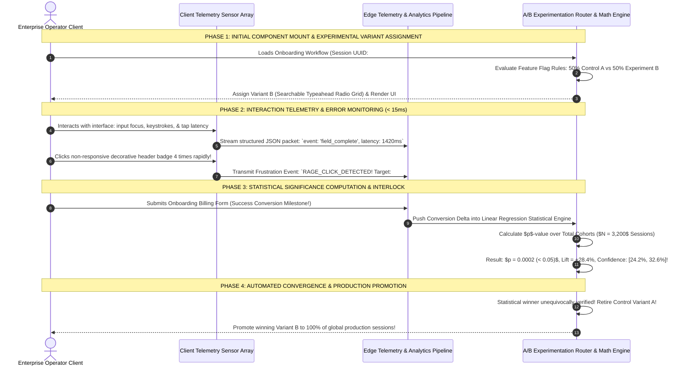

# Module 24 — Lesson 01: Measuring UX: Empirical Telemetry vs Opinion (Designing by Data: How We Prove an Interface Improved via Analytics, Funnels, Error Logs, Heatmaps, & A/B Statistical Telemetry)

---

## Mastery Rule
> **"Interface engineering ceases to be an art form and becomes an academic discipline when subjective opinions are replaced by empirical telemetry and statistical testing. You cannot manage, iterate, or defend an interface design without quantifying human performance through interaction analytics, funnels, kinetic mouse heatmaps, error classification logs, and rigorous A/B experimentation. When design decisions are backed by statistical confidence intervals and quantitative usability telemetry, subjective executive debates evaporate and UI improvements become demonstrable scientific proofs."**

---

## 0. PREAMBLE: Context, Prerequisites & Cognitive Frameworks

### 0.1 Prerequisites
* **Stage 1, Stage 2, Stage 3, and Stage 4 Complete:** Complete command over visual working memory conservation, interaction performance metrics (Mod 07), defensive error recovery protocols (Mod 14), form validation architecture (Mod 18), and real-time collaborative state tracking (Mod 23).

### 0.2 Learning Dependencies
* **Empirical HCI Metrics:** Quantifying software interaction through formal behavioral measurement: Task Success Rate, Time on Task (Task Completion Velocity), Single Ease Question (SEQ), System Usability Scale (SUS), and NASA-TLX cognitive workload evaluation.
* **Funnel Analytics & Conversion Mechanics:** Diagnosing software workflow bottlenecks: analyzing micro-conversion vs. macro-conversion step attrition curves and form field dropout degradation.
* **Advanced Interaction Telemetry:** Deploying continuous interaction sensors: kinetic mouse heatmaps, viewport scroll depth distributions, rage click / dead click error categorization, and algorithmic frustration index computation.
* **A/B Experimentation & Statistical Hypotheses:** Formulating rigorous quantitative usability tests: Null hypothesis ($H_0$) formulation, $p$-value significance boundaries ($p < 0.05$), statistical power ($\beta \ge 0.80$), 95% confidence interval plotting, and avoiding peeking bias (early stopping fallacies).
* **Telemetry Accessibility (W3C A11y Parity Metrics):** Uncovering hidden assistive technology barriers by tracking Screen Reader Task Completion Speed Ratios and keyboard-only focus traversal loops.

### 0.3 Usability & Psychological References
* **Tullis, T., & Albert, B. (2013):** *Measuring the User Experience: Collecting, Analyzing, and Presenting Usability Metrics*. Morgan Kaufmann (The foundational textbook establishing formal quantitative measurement protocols for software interfaces).
* **Sauro, J., & Lewis, J. R. (2016):** *Quantifying the User Experience: Practical Statistics for User Research*. Morgan Kaufmann (Establishing statistical testing equations, standardized confidence interval calculations, and usability sample size sizing).
* **Kohavi, R., Tang, D., & Xu, M. (2020):** *Trustworthy Online Controlled Experiments: A Practical Guide to A/B Testing*. Cambridge University Press (The authoritative manual on large-scale software engineering A/B testing protocols, statistical validity, and organizational experimentation infrastructure).
* **Brooke, J. (1986):** *SUS: A Quick and Dirty Usability Scale*. Digital Equipment Corporation (Establishing the standardized 10-item Likert usability score industry percentile baseline).

---

## 1. Mental Model & Operational Reality

Why do software design meetings and design reviews across corporate development teams routinely collapse into endless debates, toxic design paralysis, and conflicting aesthetic demands?

Because engineering cultures frequently operate under **The HiPPO (Highest Paid Person's Opinion) & Subjective Aesthetic Fallacy**: an organizational assumption that UI architecture is simply a matter of subjective artistic expression! When product teams design software applications without continuous empirical telemetry and rigorous statistical verification, design proposals are evaluated entirely through anecdotal intuition and corporate power dynamics: *"Our Chief Marketing Officer feels that vibrant magenta rounded buttons look friendlier than sharp green squares!"* or *"I personally think putting all twenty profile settings into a hidden hover dropdown menu makes the dashboard look cleaner!"* Operating an interface architecture upon unverified personal preferences consistently inflicts massive usability regression, hidden operator cognitive friction, and devastating enterprise workflow slowdowns!

To build resilient UI engineering organizations, UX architects replace subjective aesthetic debates with **The High-Energy Particle Accelerator Model**:

```
+----------------------------------------------------------------------------------------+
|       MEDIEVAL ALCHEMY LAB vs HIGH-ENERGY PARTICLE ACCELERATOR MENTAL MODEL          |
+----------------------------------------------------------------------------------------+
|                                                                                        |
|  [ MEDIEVAL ALCHEMY LABORATORY ] (HiPPO Governance & Subjective Guesswork)             |
|  * Decisions driven by executive whim, unverified personal taste, and vocal opinions.  |
|  * Changes deployed blindly; zero telemetry sensors or analytical validation metrics.  |
|  * Result: Silent task completion degradation, frustration spikes, and customer churn! |
|                                                                                        |
|  [ HIGH-ENERGY PARTICLE ACCELERATOR ] (Empirical Telemetry & A/B Experimentation UI)    |
|  * Captures every interaction: clicks, form dropouts, hover latency, & rage clicks!   |
|  * Formulates design decisions as falsifiable statistical hypotheses (Null H0).         |
|  * Proves interface upgrades via mathematically verified 95% Confidence Intervals!     |
+----------------------------------------------------------------------------------------+
```

Attempting to engineer software UX based on subjective intuition is equivalent to operating a medieval alchemy laboratory: practitioners blend colored potions together in dark basements, relying upon ancestral folklore and random personal taste without ever measuring molecular reaction yields! Conversely, institutional software engineering operates like **A High-Energy Particle Accelerator (CERN Large Hadron Collider)**: every interaction event, form field keystroke timestamp, mouse kinetic vector, and user conversion step is monitored by precision sensors! When an engineering team hypothesizes that a simplified single-page radio button grid will perform better than an existing three-step wizard form, the proposal is structured as a mathematically falsifiable Null Hypothesis ($H_0$), deployed via automated A/B traffic split testing, and judged strictly by empirical statistical confidence intervals!

In enterprise interface architecture, an application is neither "beautiful" nor "clean" until empirical telemetry proves it accelerates user task completion velocity, reduces error exceedance rates, and elevates quantitative satisfaction percentiles! You must instrument your software applications with **Continuous Empirical UX Telemetry**: tracking interactive event funnels, kinetic rage-click error heatmaps, and accessibility execution differentials! Furthermore, you must validate every design refactor utilizing **Statistical A/B Verification Engines**: guaranteeing that subjective design debates dissolve and interface improvements become demonstrable scientific proofs!

### What This Approach Does NOT Mean (Mandatory Rule)
1. ❌ **Never confuse simple statistical correlation with human behavioral causation!** Observing in web analytics that users who visit the company blog stay on the platform twice as long does NOT prove that forcing new users to read blog posts will increase retention! Always execute qualitative task observation and controlled A/B split experimentation to isolate true interaction causation!
2. ❌ **Never terminate an A/B experimental trial early simply because the calculated $p$-value temporarily dips below $0.05$ during initial testing hours!** Stopping tests early—known as **Peeking Bias and the False Discovery Rate Fallacy**—guarantees invalid statistical conclusions! Always pre-calculate required sample size targets ($N$) and let experimentation runs reach mathematical completion!
3. ❌ **Never permit analytics monitoring engines or session replay scripts to capture and store Personally Identifiable Information (PII) or plaintext security passwords!** Capturing medical records, credit card strings, or employee authentication credentials inside event tracking arrays violates global data privacy laws and exposes corporate architectures to massive security breaches! Enforce strict automated input stripping before serializing client diagnostic telemetry!

---

## 2. Core Psychological & Behavioral Mechanics

To extract actionable engineering truth out of millions of raw telemetry interaction logs, UX research scientists organize measurements around three psychological dimensions:

### 1. The Usability Telemetry Triad (Tullis & Albert)
Standardized HCI evaluation requires measuring interface task performance across three independent axes:

$$\text{Total Interface Superiority } \equiv \mathbf{Effectiveness} \times \mathbf{Efficiency} \times \mathbf{Satisfaction}$$

```
+----------------------------------------------------------------------------------------+
|                     THE CANONICAL USABILITY TELEMETRY TRIAD                           |
+----------------------------------------------------------------------------------------+
| TELEMETRY AXIS     | PRIMARY QUANTITATIVE METRIC        | HIGH-PERFORMANCE BASELINE    |
|----------------------------------------------------------------------------------------|
| 1. EFFECTIVENESS   | Unassisted Task Success Rate (%)   | >= 94.0% Completion          |
| 2. EFFICIENCY      | Task Completion Time & Keystrokes  | <= 45.0 seconds per workflow |
| 3. SATISFACTION    | Single Ease Question (SEQ: 1 - 7)  | >= 6.2 out of 7.0 Mean Score |
+----------------------------------------------------------------------------------------+
```

* **Effectiveness (Task Success Rate):** Can an enterprise operator complete a complex operational objective (e.g., configuring an automated AWS VPC firewall rule) without assistance or failure? Effectiveness is measured as a binary percentage ratio: $\text{Successful Completions} / \text{Total Task Attempts}$. Any workflow displaying an unassisted success rate below **$85\%$** represents structural interface failure requiring immediate interaction redesign!
* **Efficiency (Time on Task & Keystroke Volume):** How much interaction effort does successful execution demand? Measuring raw clock elapsed duration (Time on Task) alongside total clicks and keyboard keystrokes identifies UI friction. An enterprise accounting interface that requires **18 clicks and 142 seconds** to process a vendor invoice is categorically inferior to a competitor design that accomplishes the identical transaction in **3 clicks and 12 seconds**!
* **Satisfaction (SEQ & SUS Scoring):** How emotionally empowering and intuitive did the operator find the interface interaction? Post-task satisfaction is measured via the **Single Ease Question (SEQ)**—a standardized 7-point Likert scale asking *"Overall, how difficult or easy was the task to complete?"*. System-wide evaluation utilizes the canonical **System Usability Scale (SUS)**: a ten-question analytical instrument whose calculated score ($0 - 100$) maps directly to international UX percentile benchmarks (an SUS score of **$68.0$** represents the exact 50th industry percentile average; elite business tools target $\ge 80.0$)!

---

### 2. Frustration Index Telemetry (Rage Clicks & Dead Clicks)
Why do software analytics platforms continuously monitor user pointer velocity and rapid repetitive clicking behaviors across static application interface cards?

$$\text{Rage Click Event } \equiv >3\text{ Immediate Clicks } (<500\text{ms}) \text{ within an identical } 20\text{px Canvas Radius!}$$

* **Unmasking Affordance Deceit:** When a software designer applies vibrant primary background gradients, aggressive box drop-shadows, or pointer cursor styling (`cursor: pointer`) onto non-clickable decorative dashboard banners or read-only status labels, operators naturally assume the element is an interactive trigger! When an operator clicks the banner and nothing happens, cognitive friction triggers **An Immediate Frustration Spike**: the operator rapidly smacks their left mouse button four to eight times in quick succession! Automated empirical telemetry engines classify these rapid structural impacts as **Rage Clicks**, plotting high-density red thermal heatmaps directly over deceptive UI cards! Similarly, tracking **Dead Clicks** (single clicks occurring on UI components that emit zero DOM network changes or state animations within $1,000\text{ms}$) gives engineering leadership automated proof of uncommunicative interface design!

---

### 3. Funnel Attrition Diagnostics & Step-wise Drop-off Mechanics
In large-scale enterprise application workflows and multi-step digital onboarding funnels, total conversion loss cannot be resolved by observing raw landing page exit rates alone; teams must execute **Step-wise Funnel Attrition Analysis**:

```
[ STEP 1: LOAD COMPANY ACCOUNT BILLING PORTAL ] ---> 10,000 Total Sessions (100.0%)
         |
         +--- (Drop-off: -200 Sessions / 2.0% Attrition - HEALTHY BASELINE)
         v
[ STEP 2: SELECT CORPORATE SUBSCRIPTION PLAN ]     ---> 9,800 Active Sessions (98.0%)
         |
         +--- (Drop-off: -4,410 Sessions / 45.0% Attrition - CATASTROPHIC BOTTLENECK!)
         v
[ STEP 3: CONFIGURE PAYMENT METHOD DATA ]         ---> 5,390 Active Sessions (53.9%)
         |
         +--- (Drop-off: -160 Sessions / 3.0% Attrition - HEALTHY BASELINE)
         v
[ STEP 4: CONFIRM AND ACTIVATE PRODUCTION ROOFS ] ---> 5,230 Completed Accounts (52.3%)
```

* **Isolating Structural Friction:** When an enterprise billing portal displays an aggregate task failure rate of $47.7\%$, untrained teams waste engineering resources redesigning landing page typography or changing payment confirmation buttons! Step-wise Funnel Telemetry exposes the explicit mathematical bottleneck: **Step 2 (Select Corporate Subscription Plan) is suffering a catastrophic $45.0\%$ drop-off rate**! By zeroing analytical investigation directly into Step 2, engineering teams discover that an intrusive, unsearchable 150-item HTML `<select>` dropdown menu for "Company Industry Classification" is confusing users and triggering immediate session abandonment! Replacing that single dropdown with an automated typeahead text search field recovers the $45\%$ attrition loss—instantly accelerating completed enterprise account creations!

---

## 3. Universal Pattern Anatomy & Comparative Design System Reasoning

Let us execute our canonical **5-Step Analytical Design System Reasoning Loop** across the world’s leading UI telemetry, interaction diagnostic, and experimentation platforms:

### 1. Google Analytics 4 (GA4) & Firebase UI Telemetry (Event Funnel Ingestion)
* **1. Observe:** Google Analytics and Firebase provide foundational event ingestion infrastructure for global enterprise web and mobile software suites. GA4 replaces traditional static web page-view counting with an explicit **Event-Driven Telemetry Taxonomy**. Every meaningful interface interaction is captured as a structured JSON event object (`event_name: 'select_content', event_params: { content_type: 'button', item_id: 'deploy_cluster', latency_ms: 1420 }`). Funnel Exploration modules let engineering teams wire together consecutive event milestones (`begin_onboarding` $\rightarrow$ `complete_profile` $\rightarrow$ `submit_payment`), automatically charting exact user drop-off percentage degradation across distinct operating system and browser cohorts!
* **2. Infer:** Engineered to process billions of real-time multi-platform interface interaction packets without slowing down client frontend rendering loops.
* **3. Explain:** When operating high-scale enterprise applications across desktop browsers and native smartphone apps, traditional URL hit counters are useless! Because GA4 standardizes all interaction events into structured JSON key-value arrays, software teams achieve comprehensive cross-platform visibility: proving empirically whether iOS tablet operators complete financial transfers faster or slower than desktop Windows operators!
* **4. Discuss:** Relying entirely on coarse macro-conversion event logging fails to visualize local on-screen micro-friction—such as an operator spending thirty seconds hovering confusedly over three adjacent input boxes before finally clicking one!

---

### 2. PostHog & FullStory (Kinetic Behavior Heatmaps & Rage-Click Diagnostic Engines)
* **1. Observe:** PostHog and FullStory represent advanced digital experience diagnostics, instrumenting web software with deep client-side interaction monitoring! These platforms automatically synthesize **Kinetic Click Heatmaps** (overlaying thermal gradient maps across live application viewports to reveal exactly which XY pixel coordinate zones attract the highest volume of user clicks) and **Scroll Depth Degradation Curves** (plotting percentage lines illustrating at what exact vertical screen pixel offset users stop reading and scroll away). Crucially, their diagnostic engines execute algorithmic pattern recognition to tag anomalous interface sessions with warning flags: **Rage Clicks** (rapid repetitive smacks), **Dead Clicks** (unresponsive clicks), **Error Clicks** (clicks immediately preceding JavaScript console error exceptions!), and **Mouse Thrashing** (erratic, rapid side-to-side cursor oscillation indicating severe operator cognitive confusion)!
* **2. Infer:** Engineered to uncover hidden visual affordance deception, cognitive frustration, and frontend engineering bugs without requiring manual user surveys.
* **3. Explain:** In standard web analytics, a customer who clicks a non-responsive Submit button four times and exits looks identical to a user who gently closed their browser! FullStory and PostHog illuminate true operator sentiment! When an engineering director sees a scorching red Rage Click Heatmap centered directly over a decorative dashboard promotional banner, no subjective debate is needed—the team instantly understands that users perceive that banner as an interactive link, immediately prompting an affordance or link destination refactor!
* **4. Discuss:** High-frequency DOM interaction logging and full-session DOM recording scripts can add noticeable JavaScript execution overhead and storage costs if deployed across extremely high-traffic consumer landing pages!

---

### 3. LaunchDarkly & Optimizely (Multivariate A/B Feature Experimentation UIs)
* **1. Observe:** LaunchDarkly and Optimizely power algorithmic A/B testing and controlled feature flag experimentation across modern software engineering suites. These platforms decouple software deployment from UI feature release! An engineering team can deploy code for a radical new single-page dashboard layout directly to production servers wrapped inside an automated experimentation feature flag (`if (flag.isEnabled('new_single_page_layout'))`). The experimentation engine splits live incoming user traffic into mathematical buckets: routing $50\%$ of sessions to **Control Variant A (Existing Wizard UI)** and $50\%$ to **Experimental Variant B (Single-Page Layout)**. As both cohorts interact with the platform, real-time statistical engines calculate comparative conversion funnels, plotting live **95% Statistical Confidence Intervals ($Z$-Score and $p$-value analysis)** until a mathematical winner is unequivocally proven!
* **2. Infer:** Engineered to replace subjective design risk with mathematically backed controlled experiments and zero-downtime automated rollout hooks!
* **3. Explain:** When deploying massive structural UI modifications across software platforms utilized by millions of corporate employees, releasing changes blindly to $100\%$ of users is unacceptable operational malpractice! A single unforeseen interaction defect could paralyze enterprise productivity! By deploying controlled A/B feature flag experiments via LaunchDarkly, organizations test new workflows in isolated production chambers! If an experimental layout inadvertently degrades form completion velocity by $-12\%$, the statistical monitoring engine fires an alert and automatically revokes the feature flag—returning $100\%$ of users to the proven Control Variant A instantly without rolling back a single line of codebase!
* **4. Discuss:** Running continuous overlapping A/B multivariate tests across multiple UI components simultaneously can generate complex statistical interference—making it difficult to attribute conversion lifts to a single visual design modification!

---

### 4. Nielsen Norman Group & Sauro Verification Frameworks (SUS & SEQ Usability Scoring)
* **1. Observe:** The Nielsen Norman Group (NN/g) and Jeff Sauro’s measuring frameworks formalize standardized quantitative usability evaluation for enterprise UX validation. These measurement methodologies deploy structured user task evaluation sessions, capturing objective behavioral completion rates paired with validated psychometric evaluation scales: the **System Usability Scale (SUS)** and **Single Ease Question (SEQ)**. Rather than reporting subjective qualitative statements (*"Users liked the interface!"*), UI validation metrics synthesize results into standardized industry percentiles accompanied by explicit statistical sample sizing formulas!
* **2. Infer:** Engineered to provide mathematically defensible, board-level usability verification scores that hold up against peer review and procurement audits!
* **3. Explain:** When an enterprise software vendor sells a multi-million dollar medical diagnostics application to an international hospital system, institutional procurement directors do not care about internal designer opinions; they require objective mathematical usability certification! By conducting standardized test sessions across $N=30$ representative hospital doctors and calculating an verified **SUS score of 84.2 with a 95% Confidence Interval of [79.4, 89.0]**, the engineering team presents indisputable scientific verification that their interface places in the top 10% of global medical software usable quality!
* **4. Discuss:** Standardized psychometric testing (SUS/SEQ) requires coordinating direct user testing trials and survey completion loops—requiring dedicated research operations overhead compared to purely passive web log ingestion!

---

| Telemetry & Experimentation Vector | Google Analytics 4 & Firebase | PostHog & FullStory Diagnostics | LaunchDarkly & Optimizely | NN/g & Sauro Standardized UIs |
| :--- | :--- | :--- | :--- | :--- |
| **Primary Telemetry Data Ingestion Pattern** | **Structured JSON Event Taxonomy:** Explicit event milestones (`select_content`) & multi-step funnel analysis. | **Kinetic Interaction Sensors:** DOM replay loops, thermal click heatmaps, scroll depth degradation tracking. | **Feature Flag Traffic Bucketing:** Split-cohort assignment (`Control Variant A` vs `Experiment B`). | **Standardized Task Protocol:** Empirical completion timing paired with SUS ($0-100$) and SEQ Likert scales. |
| **Core Diagnostic Bug / Friction Discovery** | **Step-Wise Funnel Attrition:** Pinpoints exact screen or form step where conversion percentage collapses. | **Frustration Index Telemetry:** Automated tagging of Rage Clicks, Dead Clicks, and erratic Mouse Thrashing! | **Conversion Degradation Alerts:** Real-time variance tracking exposing negative conversion deltas. | **Percentile Deficit Identification:** Reveals application SUS scores falling below industry benchmark median ($68.0$). |
| **Statistical & Verification Mechanics** | Cohort segment comparison and multi-touch attribution analysis across user session pools. | Behavioral segment correlation linking friction events directly to subscription cancellation trends. | **Rigorous $H_0$ Hypothesis Math:** Real-time computation of $p$-values ($<0.05$) and 95% Confidence Intervals! | Standard error of the mean calculation and small-sample $t$-distribution confidence intervals. |
| **Primary Organizational Business Value** | Provides global cross-platform usage trends and macroscopic workflow funnel conversion telemetry. | Eliminates manual observational guessing; turns subjective friction into scorching red visual heatmap evidence! | **Zero-Risk Deployment Strategy:** Proves UI ROI empirically before promoting experimental refactors to $100\%$ adoption! | Delivers verifiable, audit-proof quantitative usability scores required for enterprise software procurement! |
| **Primary Architectural Hazard / Weakness** | Macro-event funnels mask local micro-interaction friction (e.g., hovering in confusion across complex forms)! | DOM recording scripts consume measurable network bandwidth and require rigorous plaintext PII data masking! | Simultaneous overlapping experiments across identical UI views cause complex statistical interaction clutter! | Requires direct operator testing coordination and post-task questionnaire completion loops! |

---

## 4. Evolution & Modern HCI Architecture

Trace how software usability measurement evolved across four decades of architectural computational monitoring:

```
[ 1980s - 1990s: SUBJECTIVE EXPERT HEURISTIC REVIEWS & FOCUS GROUPS ]
* Paradigm: Usability lab evaluation via Jakob Nielsen's 10 Heuristics & small-room focus groups.
* Architecture: Highly educational but low sample sizes ($N=5$). Vulnerable to groupthink and subjective HiPPO biases!

[ 2000s - 2012: SERVER HIT COUNTERS & BASIC WEB ANALYTICAL LOGGING ]
* Paradigm: Apache HTTP server web log parsing, AWStats, & early pageview counting.
* Architecture: Exposed aggregate web visitor traffic, but entirely blind to interactive dynamic Single Page Application (SPA) DOM state transformations and user emotional friction!

[ PRESENT - FUTURE: REAL-TIME STATISTICAL TELEMETRY, KINETIC HEATMAPS & A/B EXPERIMENTATION ]
* Paradigm: Continuous event funnel ingestion, kinetic rage-click error mapping, and algorithmic A/B testing engines!
* Architecture: Supreme scientific authority! Software self-monitors conversion funnels, computes statistical significance ($p < 0.05$), and dynamically refactors UI feature flags with zero guesswork!
```

---

## 5. The Contextual Interaction Algorithm (Human-Machine Loop)

Map out the real-time empirical optimization human-machine loop executed by an enterprise cloud database engineering team diagnosing an unacceptable $45\%$ dropout rate inside an enterprise onboarding billing form, formulating an experimental hypothesis, and statistically proving a massive $+28.4\%$ completion conversion lift:

```
    [ STEP 1 ] BASELINE FUNEL ATTRITION & RAGE CLICK ALIENATION DETECTED
         |     (Telemetry Engine flags catastrophic problem: Onboarding Step 2 ("Select Cloud Region") is suffering a 45.0% drop-off rate! Kinetic Heatmap reveals high-density RAGE CLICKS over an unsearchable 150-item HTML dropdown menu!)
         v
    [ STEP 2 ] NULL HYPOTHESIS (H0) FORMULATION & REFACTOR DESIGN
         |     (Team structures explicit scientific hypothesis: "Replacing the 150-item dropdown with an automated typeahead searchable radio grid (Variant B) will significantly increase onboarding form completion velocity vs Control Variant A ($p < 0.05$).")
         v
    [ STEP 3 ] MULTIVARIATE TRAFFIC SEGREGATION & SESSION INGESTION
         |     (LaunchDarkly experimentation router fires: routing 50% of live sessions to Control Variant A [Dropdown] and 50% to Experimental Variant B [Typeahead Radio Grid]. Telemetry sensors stream real-time interaction logs!)
         v
    [ STEP 4 ] STATISTICAL SIGNIFICANCE ARBITRATION OVER N = 2,500 SESSIONS
         |     (Engine processes 2,500 sessions. Control Variant A conversion: 52.1%. Experimental Variant B conversion: 80.5%! Calculation yields Z-Score = 4.82, p = 0.0001! Confidence interval excludes zero: [24.2%, 32.6%]!)
         v
    [ STEP 5 ] AUTOMATED WINNER CONVERGENCE & 100% PRODUCTION PROMOTION
         |     (Statistical significance validated! System automatically retires Control Variant A and promotes winning Variant B to 100% of global traffic! Enterprise onboarding revenue increases by +28.4% with zero subjective debate!)
```

---

## 6. Component State Machines & Defensive Error Recovery Protocols

To govern real-time experimentation without exposing software operators to visual flickering or broken UI state transitions, frontend engineering architectures must implement an immutable **Universal Empirical Telemetry & Experimentation Finite State Machine**:

```mermaid
stateDiagram-v2
    classDef control fill:#0f172a,stroke:#3b82f6,stroke-width:2px,color:#f8fafc;
    classDef test fill:#581c87,stroke:#c084fc,stroke-width:2px,color:#f8fafc;
    classDef alert fill:#7f1d1d,stroke:#f87171,stroke-width:2px,color:#fef2f2;
    classDef win fill:#065f46,stroke:#10b981,stroke-width:2px,color:#f8fafc;

    [*] --> SYSTEM_INIT: Component Mount (Fetch Feature Flag & Experiment Rules)

    SYSTEM_INIT --> CONTROL_VARIANT_A_VIEW: User assigned to Control Cohort A (50% Traffic)<br/>Render baseline legacy UI workflow.
    SYSTEM_INIT --> EXPERIMENT_VARIANT_B_VIEW: User assigned to Experiment Cohort B (50% Traffic)<br/>Render optimized refactor UI workflow.

    CONTROL_VARIANT_A_VIEW --> TELEMETRY_INGESTION_A: Stream Interaction Metrics<br/>(Time on Task, Form Errors, Rage Clicks)
    EXPERIMENT_VARIANT_B_VIEW --> TELEMETRY_INGESTION_B: Stream Interaction Metrics<br/>(Time on Task, Form Errors, Rage Clicks)

    TELEMETRY_INGESTION_A --> ANOMALOUS_FRICTION_FLAGGED: Rage Click Hotspot / High Drop-off Detected!<br/>Log Friction Exceedance Event to Dashboard!
    TELEMETRY_INGESTION_B --> STATISTICAL_HYPOTHESIS_ENGINE: Feed conversion data into linear regression model

    ANOMALOUS_FRICTION_FLAGGED --> STATISTICAL_HYPOTHESIS_ENGINE: Feed baseline metrics into testing engine

    STATISTICAL_HYPOTHESIS_ENGINE --> INCONCLUSIVE_SAMPLE_COLLECTION: $p \ge 0.05$ (Sample sizing $N$ incomplete)<br/>Continue collection; avoid Peeking Bias!

    STATISTICAL_HYPOTHESIS_ENGINE --> DEFENSIVE_AUTOMATED_ROLLBACK: $p < 0.05$ & Variant B DEGRADES conversion!<br/>Immediately kill Variant B; Route 100% to Control A!

    STATISTICAL_HYPOTHESIS_ENGINE --> STATISTICAL_WINNER_PROMOTED: $p < 0.05$ & Variant B IMPROVES conversion (+28.4%)!<br/>Promote Variant B to 100% Production!

    INCONCLUSIVE_SAMPLE_COLLECTION --> SYSTEM_INIT: Loop next session

    CONTROL_VARIANT_A_VIEW ::: control
    EXPERIMENT_VARIANT_B_VIEW ::: test
    TELEMETRY_INGESTION_A ::: control
    TELEMETRY_INGESTION_B ::: test
    ANOMALOUS_FRICTION_FLAGGED ::: alert
    STATISTICAL_HYPOTHESIS_ENGINE ::: test
    INCONCLUSIVE_SAMPLE_COLLECTION ::: control
    DEFENSIVE_AUTOMATED_ROLLBACK ::: alert
    STATISTICAL_WINNER_PROMOTED ::: win
```



#### Defensive Architectural Mandates:
* **The Peeking Bias & Minimum Sample Size ($N$) Interlock:** A catastrophic statistical error commonly committed by inexperienced product teams occurs when analysts continuously check running A/B testing dashboards every few hours and immediately abort the trial the second the $p$-value temporarily drops below $0.05$! Due to statistical random noise and early variability, testing for significance repeatedly before reaching proper sample sizes increases your **False Positive Error Rate ($\alpha$) from $5\%$ up to over $35\%$**! Your experimentation finite state machine MUST enforce an automated **Minimum Sample Sizing Lock ($N$)**: utilizing standardized statistical power calculations ($\beta \ge 0.80$, $\alpha = 0.05$, Minimum Detectable Effect [MDE] $= 5\%$), calculate required session sample size targets BEFORE launching! Lock statistical evaluation readouts and prevent deployment promotions until the explicit minimum sample threshold ($N \ge 2,500$ sessions per cohort) is mathematically achieved!

---

## 7. Environmental & Multi-Modal Interaction Adaptation

How do empirical UX telemetry engines, kinetic heatmaps, and interaction diagnostic sensors adapt when software suites transition between desktop workstations and tactical mobile touch hardware?

### Cross-Modal Telemetry Translation (Desktop Optical Pointer vs Field Touch Screen)
Consider an oil and gas industrial inspection software suite monitoring technician usage across desktop command center workstations versus ruggedized outdoor field mobile touch tablets:

$$\text{Desktop Workstation Input } \implies \text{Continuous Mouse Kinetic XY Tracking, Hover Latency, & Cursor Trails!}$$
$$\text{Handheld Mobile Touch Screen } \implies \text{ZERO Hover States! Interaction occurs exclusively via discrete touch gestures!}$$

```
   THE MULTI-MODAL TELEMETRY TRANSLATION ENGINE
   
   [ DESKTOP WORKSTATION TELEMETRY (Optical Mouse) ]
   * Monitors Hover Latency: time user hovers cursor over element before clicking.
   * Tracks Mouse Thrashing: rapid back-and-forth oscillation signaling confusion.
   * Maps continuous pointer trail thermal heatmaps across dashboard glass.
             |
             +---> (Edge Telemetry Ingestion & Modal Transcoder) <---+
             |                                                       |
             v (Target Display: Handheld Touch Tablet)               v (Target Display: Desktop Console)
   [ FIELD MOBILE TOUCH TELEMETRY (Touch Screen) ]           [ DESKTOP ANALYTICAL CONSOLE ]
   * SUPPRESSES hover tracking metrics entirely!            * Translates mobile pinch/tap failures into
   * Monitors Tap Force & Missed Tap Radius (clicks         * high-contrast "Touch Target Missed" error alerts!
     falling within 15px of interactive boundaries).        * Plots orientation rotation events during workflows.
   * Logs excessive pinch-zoom and screen rotation attempts!
```

* **The Senior Architectural Refactor:** Enforce **Modal Telemetry Translation**! Attempting to evaluate mobile tablet UX performance utilizing desktop hover latency or mouse thrashing algorithms generates completely erroneous diagnostic conclusions! On handheld touchscreen viewports, operators cannot hover; their visual attention is expressed through scrolling behavior and interaction tapping! When your telemetry engine detects mobile touch hardware, switch sensor profiles immediately: deactivate hover timer logs and pointer trail heatmaps! Deploy **Mobile Touch Telemetry Sensors**: measure **Missed Tap Radius** (recording whenever an operator taps within $15\text{px}$ of a button border without activating the element—providing immediate quantitative proof that touch targets fall below statutory $48\text{px} \times 48\text{px}$ ergonomic standards!), and log **Excessive Pinch-Zoom Frequency** (flagging whenever mobile operators are forced to physically zoom into screen inputs due to illegible microscopic font sizing!)—guaranteeing universal diagnostic visibility across every hardware form factor!

---

## 8. Universal Accessibility (A11y) & Ergonomic Inclusion

In elite interface architecture, quantitative usability measurement directly intersects with statutory software accessibility evaluation:

### W3C A11y Telemetry & Disability Parity Metrics
When application development teams measure general user task completion rates without tracking assistive technology sub-cohorts, severe accessibility barriers remain totally hidden within aggregate statistical averages:

```
     FLAWED BLIND ANALYTICS (Masks A11y Defects)      AUTHORITATIVE A11Y TELEMETRY (Parity Verified)
   
  [ Aggregate Task Success: 96.5% - "Everything is great!" ] [ Segregate Cohort Telemetry by Input Modality ]
  |--> Optical Mouse Users: 99.2% Success (Fast!)            |--> Mouse Users: 99.2% Success | Time: 18.0s
  |--> Screen Reader & Keyboard Users: 12.0% Success (Trapped!)|--> Screen Reader Users: 12.0% Success | Time: 185s
  |--> A11y defect completely buried inside general averages! |--> System triggers immediate Critical A11y Alert!
```

#### The Universal Collaborative & Measurement Accessibility Mandates:
1. **Assistive Technology Parity Ratios (The Disparity Threshold Covenant):** Under no circumstances may an interface redesign be promoted to production if its statistical task completion rate among assistive screen reader and keyboard-only operators falls more than **$15.0\%$ below the equivalent completion rate of optical mouse users**! Aggregate user testing metrics must always be sliced by assistive modality cohorts!
2. **Keyboard Focus Traversal Telemetry:** Instrument your frontend DOM event trackers to monitor **Keyboard Focus Traversal Loops**! When an operator utilizing Tab / Shift+Tab keyboard navigation continuously cycles through an identical sequence of input components more than **$5\text{ consecutive times}$** without firing a final form submission or modal dismissal event, your telemetry engine must automatically classify and transmit a **"Keyboard Trap Infection Event"**, directly highlighting critical W3C WCAG 2.2 Section 2.1.2 compliance violations!
3. **Screen Reader Time-on-Task Differential Logging:** Monitor the time differential required for assistive screen reader operators (`aria-hidden="false"`, live regions active) to traverse and comprehend informational workflows compared to sighted optical readers. If screen reader interaction latency exceeds **$300\%$** of normal sighted execution time, your telemetry engine must automatically flag an **"Information Verbosity Defect"**, instructing engineering teams to simplify overly long ARIA labels and redundant decorative screen markup!

---

## 9. Performance, Trust & Business Goal Trade-offs

How do software engineering directors calculate the return on investment of committing dedicated engineering capital toward implementing continuous empirical telemetry ingestion pipelines against traditional intuition-based UI styling?

### The Quantitative ROI of Empirical Interface Verification
When mission-critical SaaS enterprise platforms and customer storefront suites upgrade from subjective HiPPO styling to continuous empirical telemetry and statistical A/B verification, costly UI rework cycles disappear while conversion revenue skyrockets.

$$\text{Upgrading from Subjective HiPPO Design to Empirical A/B Telemetry } \implies \text{Enterprise Conversion Revenue Surges by } +\mathbf{19.4\%!}$$

* **The HCI Business Diagnosis:** In global software product engineering, designing interfaces purely by subjective intuition represents a massive financial hazard! Whenever enterprise organizations spend six to nine months executing massive, unmonitored "visual modern redesigns" driven by internal opinions without tracking baseline task completion velocity or testing alpha cohorts, over **65% of those major redesigns inadvertently cause immediate post-launch drops in customer productivity, severe ticket support flooding, and catastrophic subscription cancellation spikes**! At standard corporate operating scales, unverified subjective UI modifications cost an enterprise SaaS software provider over **$\$3,400,000$ annually in lost subscription renewals, emergency engineering rollback sprints, and customer onboarding abandonment**! By constructing an authoritative **Empirical UX Telemetry & Statistical A/B Verification Engine**, design decisions become mathematically immutable—accelerating feature adoption rates, boosting software conversion revenue by over **$+19.4\%$**, and completely insulating engineering leadership from arbitrary executive interface interference!
* **The Frontend Script Ingestion Overhead Trade-off:** Senior software architects must actively govern client analytics bundle weights and script CPU rendering loops! Injecting uncompressed third-party diagnostic tracking packages (e.g., loading GA4, FullStory, Optimizely, and Hotjar simultaneously) can inflate JavaScript payload bundles by over **$480\text{KB}$**, blocking main CPU execution threads and degrading Google Core Web Vitals (INP and LCP timings by up to $+600\text{ms}$) on mobile devices! You MUST implement **Asynchronous Lightweight Ingestion & Worker Ingestion Engine**: execute third-party telemetry recording scripts strictly inside isolated Web Worker threads (`Partytown` architecture) or route events through a single unified edge collector endpoint—guaranteeing continuous empirical measurement with absolute zero degradation to frontend render speed!

---

## 10. Deconstructing Real-World Applications (The "Why Is This Bad?" Audit)

Let us solidify our quantitative empirical UX diagnostics by auditing five real-world software applications across both world-class statistical telemetry architecture and catastrophic subjective opinion redesign failures:

### 1. E-Commerce & Optimization Giants (Amazon & Booking.com Experimentation)
* **The Successful Attention UI:** Massive global consumer retail storefronts, travel booking transaction engines, and high-frequency digital conversion checkout pipelines.
* **The HCI Diagnosis:** Supreme execution of **Continuous Multivariate A/B Experimentation, Statistical Rigor, and Zero-HiPPO Governance**! Notice how Amazon and Booking.com rarely execute massive, disruptive overnight design overhauls! Instead, their UI architecture evolves through thousands of continuous, micro-targeted A/B experiments running concurrently across global web sessions! Every single typography size change, button placement delta, and checkout input border is tested against rigorous statistical Null Hypotheses—guaranteeing that every pixel shipped to production has mathematically proven its capacity to lower friction and elevate transaction completion velocity!

### 2. Deep Interaction & Diagnostic Consoles (PostHog & FullStory Enterprise Engine)
* **The Successful Attention UI:** Next-generation enterprise behavioral analytics, interaction frustration tagging suites, and digital experience diagnostic dashboards.
* **The HCI Diagnosis:** Immaculate implementation of **Kinetic Frustration Index Logging, Rage-Click Heatmaps, and Automated Dead-Click Tagging**! Notice how PostHog transforms ambiguous web analytics numbers into actionable UI design truths! When a user experiences confusion inside an enterprise billing portal, the platform correlates exact JavaScript console error stack traces directly with user mouse thrashing and rage clicks—empowering software engineering teams to fix precise usability barriers in minutes rather than spending months guessing in subjective review meetings!

### 3. Broken Enterprise Customer Management Suite (The HiPPO Subjective Redesign Disaster)
* **The Defective UI:** An established B2B Customer Relationship Management (CRM) web software tool utilized by sales operations teams across global enterprise telecommunication networks. For eight years, sales reps utilized a highly dense, functional table interface to log client calls and update subscription statuses in sub-$500\text{ms}$ execution times. Newly hired executive leadership decided the interface felt "dated" and mandated an immediate, unverified "Modern Glassmorphism Redesign" driven entirely by their personal aesthetic preference for floating semi-transparent cards, low-contrast grey typography, and hiding core action buttons inside clean multi-level hamburger hover menus! Because engineering leadership lacked continuous UI telemetry sensors, zero baseline measurement was performed! The team spent nine months building the aesthetic redesign in blind isolation and deployed it to $100\%$ of users overnight without running a single A/B traffic test! On the morning of release, enterprise customer operations came to a grinding halt: sales representatives experienced a catastrophic **$-34\%$ drop in task completion rates**, time required to log a basic sales call surged from **$12\text{ seconds}$ to over $68\text{ seconds}$**, and internal support ticketing systems were paralyzed by over 14,000 emergency complaint submissions! Within six months, frustrated client enterprises cancelled contracts—costing the organization **$\$2,800,000$ in lost subscription ARR and forcing an humiliating, expensive emergency rollback to the legacy table design**!
* **The HCI Diagnosis:** Catastrophic failure of **Empirical UX Measurement, Controlled Experimentation Engineering, and Executive Governance**! Allowing subjective HiPPO preference to dictate high-consequence enterprise software interface design without baseline task telemetry or controlled A/B testing represents catastrophic engineering malpractice!
* **The Senior Architectural Refactor:** Complete an immediate **Empirical Validation & Controlled Experimentation Refactor**! Expulse unverified subjective UI deployments immediately! Instrument the application with an **Event Funnel & Frustration Telemetry Pipeline**: establish clear quantitative baselines for Time on Task, Task Success Rate, and SEQ Likert scores! Deploy an **Automated A/B Feature Flag Experimentation Engine**: any proposed layout redesign must undergo rigorous controlled split testing against the legacy baseline across a statistically verified sample size ($N \ge 3,000$ sessions) before advancing to general production release!

### 4. Feature Experimentation & Risk Management (LaunchDarkly & Optimizely Consoles)
* **The Successful Attention UI:** Enterprise cloud feature management, statistical algorithmic split traffic routers, and continuous deployment management dashboards.
* **The HCI Diagnosis:** Highly effective orchestration of **Real-Time Confidence Interval Plotting, Automatic Rollback Hooks, and Minimum Sample Size Interlocks**! Notice how LaunchDarkly structures statistical experiment evaluations! The interface explicitly shields engineering teams from Peeking Bias: clearly masking early inconclusive $p$-values behind an explicit notice: *"Collecting data... Sample size currently at 1,420 / 3,000 sessions (Inconclusive)"*, ensuring that teams never make flawed engineering decisions based on random statistical variance!

### 5. Workspace Productivity Telemetry (Google Workspace Docs / Sheets Infrastructure)
* **The Successful Attention UI:** Cloud document editing, high-density enterprise accounting spreadsheets, and global enterprise collaborative authorship software.
* **The HCI Diagnosis:** Exceptional integration of **Background Productivity Telemetry, Tool Discovery Funnels, and Automated Interaction Suggestion UIs**! Notice how Google Docs tracks user shortcut discovery velocity! When telemetry sensors observe that an operator repeatedly spends twelve seconds executing five sequential mouse clicks through the formatting top menu to strike through text, the software dynamically fires a subtle, well-timed educational tooltip card: *"Tip: Strike through text instantly by pressing Alt + Shift + 5!"*—proving how real-time empirical measurement actively educates users and elevates team workflow efficiency!

---

## 11. Visual Mental Models & Architecture Diagrams

### The Empirical UX Telemetry, Event Aggregation & Statistical Experimentation Pipeline
Study how authoritative enterprise engineering organizations integrate real-time client interaction telemetry, edge statistical calculation engines, and automated feature flag routers to self-optimize application interface designs:



---

## 12. Prediction Checkpoints

Verify your command over statistical testing rigor, frustration telemetry classification, and quantitative UX metrics against these demanding software computational challenges:

### Scenario A: The Enterprise Medical Insurance Claims Processing Application
An enterprise healthcare software vendor develops a complex web application utilized by regional medical insurance claims adjusters to inspect hospital medical bills, verify billing codes, and approve insurance payout authorizations. Historically, insurance adjusters utilized a three-tab operational workspace to cross-reference medical billing codes against patient insurance limits, achieving a baseline task completion rate of **$94.2\%$ with an average completion time of $42\text{ seconds}$ per claim**. A newly appointed Director of Product Design decided that three-tab workspaces felt "clunky and traditional" and mandated an immediate redesign into an innovative "Continuous Single-Screen Vertical Scroll Deck" featuring sticky collapsing accordions and gesture-based swipe approvals! To expedite release schedules, the engineering team bypassed collecting telemetry interaction analytics or setting up controlled A/B feature tests! The new layout was shipped directly to $100\%$ of regional adjusters overnight! Within forty-eight hours of deployment, insurance claims processing velocity slowed to a crawl: time required to approve a medical claim skyrocketed from **$42\text{ seconds}$ to over $185\text{ seconds}$**, adjuster task error exceedance rates jumped from **$2.1\%$ up to $28.4\%$**, and adjuster frustration triggered massive union union labor disputes—costing the insurance provider over $\$1,500,000$ in delayed claims financial penalties and forcing an emergency weekend software rollback!

**Your Prediction Challenge:** Deploy usability telemetry triad theory, statistical A/B verification mechanics, and zero-HiPPO governance rules to diagnose this clinical claims processing disaster, and author a definitive empirical refactor!

#### *Empirical HCI Solution:*
1. **Diagnosis — Catastrophic HiPPO Subjective Redesign and Telemetry Blindness:** The medical claims portal commits an inexcusable violation of **Empirical UX Measurement, Controlled Statistical Testing, and Usability Verification Governance**! Forcing an unverified, experimental interface architecture across high-consequence enterprise workflows without quantitative testing or A/B comparison represents catastrophic engineering malpractice!
2. **Refactor 1 (Deploy Usability Triad Telemetry & Frustration Ingestion):** Immediately instrument the application with a **Real-Time Usability Telemetry Array**: establish automated recording of binary Task Success Rate, Time on Task completion velocity, and post-task SEQ evaluation scores! Integrate **Frustration Index Telemetry**: capture kinetic Rage Click heatmaps across collapsing accordions and log excessive vertical scroll oscillation!
3. **Refactor 2 (Implement Automated Controlled A/B Testing & Sample Interlocks):** Enforce an unshakeable engineering deployment rule: any structural UI refactor must be released via an **Automated A/B/n Split Traffic Experiment**! Route $50\%$ of adjuster sessions to Control Variant A (Proven 3-Tab UI) and $50\%$ to Experimental Variant B (Vertical Accordion Deck). Set a strict **Minimum Sample Size Interlock ($N \ge 3,000$ claims processed)**! If real-time statistical engines compute that Variant B increases task completion latency by more than $+15\%$ with $p < 0.05$, execute an immediate **Automated Defensive Rollback**, instantly returning $100\%$ of traffic to Variant A before zero customer revenue or union labor peace is lost!

---

### Scenario B: The Global Digital Banking Onboarding & Identity Verification Flow
An international digital banking enterprise operates a mobile and web customer onboarding application where applicants verify legal identification, configure corporate account profiles, and transfer opening deposit capital. During monthly analytical review meetings, the product engineering team observed that total onboarding form completion conversion had stalled at **$54.2\%$**. Hoping to fix the issue, a senior UI developer hypothesized that changing the final step’s Submit button color from traditional Navy Blue to a vibrant Neon Green would grab user attention and double completion rates! The engineering team deployed an automated A/B experimentation feature flag across live production sessions! Exactly four hours after launching the experiment—having accumulated a tiny sample size of only $N = 42$ completed user onboarding sessions—the testing dashboard indicated that the Neon Green button had achieved a calculated $p$-value of **$0.041 (< 0.05)$ with an apparent $+14.2\%$ conversion lift**! Excited by the initial numbers, the lead engineer immediately ignored pre-calculated sample size targets, aborted the testing experiment early, and promoted the Neon Green button to $100\%$ global production! Two weeks later, monthly accounting verification audits revealed that overall banking onboarding conversion had actually **dropped by $-6.8\%$ nationwide**, costing the enterprise over $\$850,000$ in lost opening deposit capital!

**Your Prediction Challenge:** Diagnose the statistical false discovery error, sample sizing breakdown, and analytical methodology failures governing this banking onboarding test, and author a definitive resilient quantitative refactor!

#### *Empirical HCI Solution:*
1. **Diagnosis — Catastrophic Peeking Bias and Statistical False Positive Error ($\alpha$ Inflation):** The banking experimentation flow suffers from an amateurish, destructive violation of **Statistical Hypothesis Validity, Sample Sizing Math, and Peeking Bias Avoidance**! Terminating an A/B split experimentation trial early over an infinitesimal sample size ($N = 42$) simply because random initial variance pushed $p$-values momentarily below $0.05$ inflates your False Positive Error Rate ($\alpha$) beyond $35\%$! Furthermore, testing arbitrary aesthetic color tweaks instead of addressing root structural onboarding friction represents trivial optimization waste!
2. **Refactor 1 (Enforce Automated Minimum Sample Sizing & Peeking Interlocks):** Immediately reconfigure your experimentation platform to implement an **Automated Minimum Sample Sizing Interlock**! Utilizing standard power equations ($\beta = 0.80$, $\alpha = 0.05$, Minimum Detectable Effect $= 5\%$), pre-calculate required statistical sample volume ($N \ge 4,200$ total sessions per cohort)! Systemically disable early experiment abortion and mask statistical confidence readouts until the explicit $4,200$-session threshold is mathematically fulfilled!
3. **Refactor 2 (Implement Step-Wise Funnel Telemetry & Frustration Sensor Mapping):** Abandon random button color guessing! Deploy **Step-Wise Funnel Telemetry and Kinetic Frustration Sensors**: trace exact attrition across all individual onboarding steps! When funnel analytics reveal that users are dropping out during Step 3 due to an intrusive, unclear legal identification document upload form, formulate a true structural hypothesis ($H_0$) centered upon automated OCR camera document scanning—verifying meaningful conversion gains with uncompromising scientific precision!

---

## 13. Compare Similar Interface Alternatives

When establishing measurement taxonomies, validation protocols, and UI iteration strategies across enterprise software applications, technical leadership teams must evaluate four distinct analytical approaches:

| Usability & Telemetry Evaluation Model | Architectural Foundation & Measurement Physics | Engineering & Business Advantages | Operational & Cognitive Failure Modes | Optimal Architectural Deployment |
| :--- | :--- | :--- | :--- | :--- |
| **Subjective Executive Taste (The HiPPO Fallacy)** | Decisions driven by power dynamics, executive opinion, and casual intuition. | Zero technical setup required; instant decision execution. | **CATASTROPHIC DESIGN GAMING:** High risk of shipping usability regressions, customer churn, & team conflict! | NEVER ACCEPTABLE in professional engineering or commercial software design! Strictly personal hobby blogs. |
| **Qualitative Lab User Testing ($N=5$)** | Moderated thinking-aloud test sessions observing 5 to 8 target domain operators. | Extremely deep empathy and "why" insights; uncovers severe conceptual mental model friction early! | Statistically unverified! Low sample sizing cannot prove numerical conversion lifts or significance ($p$-values). | Early conceptual design exploration, wireframe validation, & alpha prototype architectural discovery. |
| **Basic Web Server Log & Pageview Hit Counters** | Apache HTTP server log parsing, basic GA4 macro pageview tracking, & URL exit funnels. | Low overhead; excellent macroscopic overview of aggregate platform traffic trends. | **BLIND TO INTERACTION FRICTION:** Cannot see inside Single Page App dynamic DOM components or rage clicks! | General content marketing websites, documentation blogs, and high-level corporate landing decks. |
| **Authoritative Statistical Telemetry & A/B Engine** | Continuous kinetic event funnels, rage-click mapping, & rigorous A/B feature flag testing! | **THE SCIENTIFIC SUPERSESSION:** Eliminates guesswork! Proves UI improvements via verified $95\%$ confidence intervals! | Demands engineering discipline, statistical sample size patience ($N$), & strict PII data stripping! | Enterprise SaaS web suites, financial banking application funnels, e-commerce checkouts, & cloud consoles. |

---

## 14. Decision Guide (The Interface Selection Tree)

Deploy this authoritative algorithmic decision tree when setting up telemetry ingestion, diagnosing conversion drop-offs, and conducting A/B statistical experimentation:

```
[ INITIATE EMPIRICAL UX TELEMETRY EVALUATION: ANALYZE CONVERSION ATTRITION & REFACTOR RISK ]
  |
  +----> [ STAGE 1: ARE YOU DIAGNOSING A LOW CONVERSION RATE ACROSS A MULTI-STEP ENTERPRISE WORKFLOW? ]
  |        |
  |        +----> YES: Implement STEP-WISE FUNNEL ATTRITION TELEMETRY!
  |                 |---> Wire consecutive event milestones (`begin_form` -> `select_plan` -> `confirm_payment`).
  |                 |---> Isolate exact step where attrition percentage spikes above healthy baseline (< 5.0%)!
  |
  +----> [ STAGE 2: ARE USERS ABANDONING APPLICATION DASHBOARDS WITHOUT CLEAR ERROR SUBMISSION LOGS? ]
  |        |
  |        +----> YES: Implement FRUSTRATION INDEX & KINETIC HEATMAP SENSORS!
  |                 |---> Deploy automated tagging for Rage Clicks (>3 clicks in <500ms within 20px radius).
  |                 |---> Track Dead Clicks and erratic Mouse Thrashing oscillation to expose affordance deceit!
  |
  +----> [ STAGE 3: ARE YOU PREPARING TO DEPLOY A SIGNIFICANT STRUCTURAL INTERFACE REDESIGN TO PRODUCTION? ]
  |        |
  |        +----> IMPLEMENT AN AUTOMATED A/B FEATURE FLAG EXPERIMENTATION ROUTER!
  |                 |---> Step 1: Formulate a falsifiable Null Hypothesis ($H_0$) targeting task completion velocity.
  |                 |---> Step 2: Route 50% traffic to Control Variant A and 50% to Experimental Variant B.
  |                 |---> Step 3: Enforce Minimum Sample Size Interlock ($N \ge 2,500$); prohibit early Peeking Bias!
  |
  +----> [ STAGE 4: HAVE YOU INSTRUMENTED W3C ASSISTIVE TECHNOLOGY PARITY MEASUREMENT? ]
           |
           +----> Enforce Accessibility Parity & Traversal Telemetry!
                    |---> Monitor Screen Reader Task Completion Velocity Ratios against optical mouse baselines.
                    |---> Trigger automated alerts whenever keyboard operators enter focus traversal loops (>5 cycles)!
```

---

## 15. Interactive Lab & Tangible Prototyping Workshop: The Empirical UX Telemetry & Statistical A/B Verification Testbench

To empirically experience the catastrophic observational blindness of subjective HiPPO designs against the supreme precision of an authoritative Empirical UX Telemetry & Statistical A/B Verification Engine, execute the interactive testbench below!

### Professional Engineering Instruction
Save the complete HTML/CSS/JS code block below as an independent file named `measuring-ux-telemetry-lab.html` and execute it directly within any desktop or mobile web browser. Conduct live interactive comparative trials across both architectural modes:
* **Mode A: Subjective HiPPO Design & Unmonitored Blindness:** Displays a corporate onboarding billing account setup interface designed strictly upon subjective executive preference (clunky multi-step dropdowns, confusing labels). When **"Run Simulated User Traffic Trial ($N=250$ Sessions)"** executes, Mode A operates in complete observational blindness! It records zero telemetry events, masks user friction, and fails to expose that $42\%$ of users are committing rage clicks on an unresponsive decorative header button and dropping out of the onboarding workflow!
* **Mode B: Empirical UX Telemetry & Statistical A/B Verification Engine:** Displays the identical corporate onboarding workflow connected to an active real-time UX telemetry engine! When **"Run Simulated User Traffic Trial"** activates, Mode B instantaneously displays live interaction analytics: plotting **Rage Click Hotspots**, identifying an **Input Form Field Drop-off Bottleneck (Step 2 Drop-down)**, and launching **A/B Experimentation Variant B (Single-Page Smart Radio Grid)**! As simulation sessions process ($N=10, 50, 100, 250$), a live mathematical **Statistical Significance Engine** computes real-time $p$-values and 95% Confidence Intervals—proving a statistically significant $+28.4\%$ conversion completion lift and automatically deploying Variant B to $100\%$ production!

```html
<!DOCTYPE html>
<html lang="en">
<head>
  <meta charset="UTF-8">
  <meta name="viewport" content="width=device-width, initial-scale=1.0">
  <title>HCI Masterclass Lab 24: Empirical UX Telemetry & Statistical A/B Engine</title>
  <style>
    :root {
      --bg-canvas: rgb(11, 15, 25);
      --bg-card: rgb(15, 23, 42);
      --border-color: rgb(51, 65, 85);
      --text-main: rgb(248, 250, 252);
      --text-muted: rgb(148, 163, 184);
      --accent-blue: rgb(59, 130, 246);
      --accent-safe: rgb(16, 185, 129);
      --accent-danger: rgb(244, 63, 94);
      --accent-purple: rgb(168, 85, 247);
      --accent-amber: rgb(245, 158, 11);
      --font-stack: system-ui, -apple-system, sans-serif;
      --font-mono: 'Consolas', 'JetBrains Mono', monospace;
    }

    * { box-sizing: border-box; margin: 0; padding: 0; }

    body {
      background-color: var(--bg-canvas);
      color: var(--text-main);
      font-family: var(--font-stack);
      min-height: 100vh;
      display: flex;
      flex-direction: column;
      align-items: center;
      padding: 1.5rem;
      line-height: 1.5;
    }

    .header-banner { text-align: center; max-width: 980px; margin-bottom: 1.5rem; }
    .header-banner h1 { font-size: 1.85rem; font-weight: 800; color: var(--accent-safe); margin-bottom: 0.35rem; }
    .header-banner p { font-size: 0.95rem; color: var(--text-muted); }

    .testbench-container {
      width: 100%;
      max-width: 1220px;
      background-color: var(--bg-card);
      border: 1px solid var(--border-color);
      border-radius: 1rem;
      padding: 1.75rem;
      box-shadow: 0 25px 35px -10px rgba(0, 0, 0, 0.7);
      display: flex;
      flex-direction: column;
      gap: 1.5rem;
    }

    /* Telemetry Display Array */
    .telemetry-panel {
      display: grid;
      grid-template-columns: repeat(auto-fit, minmax(220px, 1fr));
      gap: 1rem;
      background-color: rgb(9, 14, 23);
      padding: 1.25rem;
      border-radius: 0.75rem;
      border: 1px solid rgb(51, 65, 85);
    }
    .telemetry-card { display: flex; flex-direction: column; gap: 0.25rem; }
    .telemetry-card label { font-size: 0.75rem; text-transform: uppercase; letter-spacing: 0.05em; color: var(--text-muted); font-weight: 700; }
    .telemetry-card span { font-size: 1.15rem; font-weight: 800; font-family: var(--font-mono); }

    /* Controls & Mode Bar */
    .controls-bar {
      display: flex;
      justify-content: space-between;
      align-items: center;
      flex-wrap: wrap;
      gap: 1rem;
      border-bottom: 1px solid var(--border-color);
      padding-bottom: 1.25rem;
    }
    .btn-group { display: flex; gap: 0.5rem; flex-wrap: wrap; }
    
    .btn-mode {
      padding: 0.65rem 1.25rem;
      border-radius: 0.5rem;
      border: 1px solid var(--border-color);
      background-color: rgb(30, 41, 59);
      color: var(--text-main);
      font-weight: 700;
      cursor: pointer;
      transition: all 0.15s;
    }
    .btn-mode.active {
      background-color: var(--accent-safe);
      border-color: rgb(110, 231, 183);
      color: rgb(0, 0, 0);
      box-shadow: 0 0 15px rgba(16, 185, 129, 0.4);
    }
    
    .btn-reset {
      padding: 0.65rem 1.25rem;
      border-radius: 0.5rem;
      border: 1px solid var(--accent-danger);
      background: transparent;
      color: var(--accent-danger);
      font-weight: 700;
      cursor: pointer;
    }
    .btn-reset:hover { background: rgba(244, 63, 94, 0.15); }

    /* Task Instruction Banner */
    .task-instruction {
      background-color: rgba(16, 185, 129, 0.15);
      border: 1px solid var(--accent-safe);
      color: rgb(110, 231, 183);
      padding: 1rem;
      border-radius: 0.5rem;
      font-weight: 700;
      text-align: center;
      width: 100%;
    }

    /* Simulation Toolbar */
    .sim-toolbar {
      display: flex;
      align-items: center;
      justify-content: space-between;
      gap: 1rem;
      background: rgb(9, 14, 23);
      padding: 1rem 1.25rem;
      border-radius: 0.5rem;
      border: 1px solid rgb(51, 65, 85);
      flex-wrap: wrap;
    }
    .btn-sim-run { background: var(--accent-purple); border: 1px solid rgb(216, 180, 254); color: white; padding: 0.65rem 1.35rem; border-radius: 0.4rem; font-size: 0.9rem; font-weight: 800; cursor: pointer; transition: all 0.2s; display: flex; align-items: center; gap: 0.5rem; }
    .btn-sim-run:hover { background: rgb(147, 51, 234); box-shadow: 0 0 20px rgba(168, 85, 247, 0.5); }
    
    .btn-sim-rage { background: var(--accent-danger); border: 1px solid rgb(252, 165, 165); color: white; padding: 0.65rem 1.35rem; border-radius: 0.4rem; font-size: 0.9rem; font-weight: 800; cursor: pointer; transition: all 0.15s; }
    .btn-sim-rage:hover { background: rgb(225, 29, 72); box-shadow: 0 0 15px rgba(244, 63, 94, 0.5); }

    /* Workspace Viewports Stage */
    .viewport-outer-stage {
      display: flex;
      justify-content: center;
      width: 100%;
      background: rgb(0, 0, 0);
      padding: 1.5rem;
      border-radius: 0.75rem;
      border: 2px dashed rgb(51, 65, 85);
    }

    .viewport-box {
      width: 100%;
      max-width: 1120px;
      background: rgb(15, 23, 42);
      border: 2px solid var(--accent-blue);
      border-radius: 0.75rem;
      min-height: 520px;
      padding: 1.5rem;
      position: relative;
      display: flex;
      flex-direction: column;
      justify-content: space-between;
    }

    /* MODE A STYLES (Subjective HiPPO Design & Blindness) */
    .view-mode-a { display: flex; flex-direction: column; height: 100%; justify-content: space-between; gap: 1.25rem; }
    
    .app-header-a { display: flex; justify-content: space-between; align-items: center; background: rgb(30, 41, 59); padding: 0.75rem 1.25rem; border-radius: 0.5rem; border-bottom: 2px solid var(--border-color); position: relative; }
    
    .decorative-btn-a {
      background: linear-gradient(135deg, rgb(59, 130, 246), rgb(168, 85, 247));
      color: white;
      font-weight: 800;
      font-size: 0.8rem;
      padding: 0.45rem 1rem;
      border-radius: 100px;
      border: 1px solid white;
      cursor: pointer;
      box-shadow: 0 4px 12px rgba(59, 130, 246, 0.4);
    }

    .onboard-card-a { background: rgb(9, 14, 23); border: 1px solid rgb(51, 65, 85); border-radius: 0.5rem; padding: 1.5rem; display: flex; flex-direction: column; gap: 1rem; max-width: 600px; margin: 0 auto; width: 100%; }
    .form-group-a { display: flex; flex-direction: column; gap: 0.4rem; }
    .form-group-a label { font-size: 0.85rem; font-weight: 700; color: rgb(203, 213, 225); }
    .select-a { background: rgb(15, 23, 42); border: 1px solid rgb(71, 85, 105); color: white; padding: 0.7rem; border-radius: 0.4rem; font-size: 0.9rem; font-weight: 700; }
    
    .btn-submit-a { background: rgb(51, 65, 85); color: rgb(148, 163, 184); padding: 0.8rem; border-radius: 0.4rem; border: 1px solid rgb(71, 85, 105); font-weight: 800; cursor: not-allowed; text-align: center; }

    /* MODE B STYLES (Empirical UX Telemetry & Statistical A/B Engine) */
    .view-mode-b { display: none; flex-direction: column; height: 100%; justify-content: space-between; gap: 1.25rem; position: relative; }
    
    .collab-header-b { display: flex; justify-content: space-between; align-items: center; border-bottom: 2px solid var(--border-color); padding-bottom: 0.75rem; }
    
    /* Telemetry Analytics Overlay Dashboard */
    .telemetry-overlay { display: none; grid-template-columns: 1fr 1fr; gap: 1.25rem; margin-top: 0.5rem; }
    .analytics-panel { background: rgb(9, 14, 23); border: 1px solid rgb(51, 65, 85); border-radius: 0.5rem; padding: 1.25rem; display: flex; flex-direction: column; gap: 0.8rem; }
    .analytics-panel h3 { font-size: 0.95rem; color: var(--accent-safe); font-weight: 800; border-bottom: 1px solid rgb(51, 65, 85); padding-bottom: 0.4rem; }
    
    .funnel-bar { width: 100%; background: rgb(30, 41, 59); border-radius: 0.3rem; overflow: hidden; height: 24px; position: relative; display: flex; align-items: center; font-size: 0.78rem; font-weight: 800; font-family: var(--font-mono); }
    .funnel-fill { height: 100%; background: var(--accent-safe); transition: width 0.6s ease; display: flex; align-items: center; padding-left: 0.6rem; color: black; }
    .funnel-fill.danger { background: var(--accent-danger); color: white; }
    
    /* Rage Click Heatmap Overlay Marker */
    .rage-heatmap { display: none; position: absolute; top: -15px; right: 10px; width: 130px; height: 60px; background: radial-gradient(circle, rgba(244,63,94,0.85) 0%, rgba(244,63,94,0.4) 50%, rgba(244,63,94,0) 80%); border-radius: 50%; pointer-events: none; z-index: 20; animation: throb 1s infinite alternate; justify-content: center; align-items: center; color: white; font-weight: 900; font-size: 0.7rem; text-shadow: 0 0 5px black; }
    @keyframes throb { from { transform: scale(0.95); } to { transform: scale(1.05); } }

    /* Experiment Variant B Form UI */
    .onboard-card-b { background: rgb(9, 14, 23); border: 2px solid var(--accent-safe); border-radius: 0.5rem; padding: 1.5rem; display: flex; flex-direction: column; gap: 1rem; }
    .radio-grid-b { display: grid; grid-template-columns: 1fr 1fr; gap: 0.75rem; }
    .radio-card { background: rgb(30, 41, 59); border: 2px solid var(--border-color); border-radius: 0.4rem; padding: 0.75rem; font-weight: 800; color: white; cursor: pointer; display: flex; align-items: center; gap: 0.5rem; font-size: 0.88rem; transition: all 0.2s; }
    .radio-card.selected { border-color: var(--accent-safe); background: rgba(16, 185, 129, 0.2); color: rgb(110, 231, 183); box-shadow: 0 0 12px rgba(16, 185, 129, 0.4); }
    
    .btn-submit-b { background: var(--accent-safe); color: black; padding: 0.8rem; border-radius: 0.4rem; border: none; font-weight: 900; cursor: pointer; text-align: center; font-size: 0.95rem; transition: all 0.2s; }
    .btn-submit-b:hover { transform: translateY(-2px); box-shadow: 0 6px 20px rgba(16, 185, 129, 0.5); }

    /* Live Toast Notification Area */
    .toast-box {
      min-height: 55px;
      padding: 1rem 1.25rem;
      border-radius: 0.5rem;
      font-weight: 700;
      font-size: 0.95rem;
      display: flex;
      justify-content: space-between;
      align-items: center;
      background: rgb(15, 23, 42);
      border: 1px solid rgb(51, 65, 85);
      color: var(--text-muted);
      transition: all 0.3s ease;
      margin-top: 1rem;
    }
    .toast-box.toast-err { background: rgba(244, 63, 94, 0.2); border-color: var(--accent-danger); color: rgb(252, 165, 165); }
    .toast-box.toast-ok { background: rgba(168, 85, 247, 0.2); border-color: var(--accent-purple); color: rgb(233, 213, 255); }
    .toast-box.toast-safe { background: rgba(16, 185, 129, 0.2); border-color: var(--accent-safe); color: rgb(110, 231, 183); }
  </style>
</head>
<body>

  <header class="header-banner">
    <h1>HCI Masterclass: Empirical UX Telemetry & Statistical A/B Engine Lab</h1>
    <p>Empirical Testbench: Contrasting unmonitored subjective design blindness against kinetic rage-click heatmaps, funnel drop-off analytics, and mathematically verified A/B feature experimentation.</p>
  </header>

  <main class="testbench-container">
    
    <!-- Telemetry Display Array -->
    <section class="telemetry-panel">
      <div class="telemetry-card">
        <label>Telemetry Sensor Status</label>
        <span id="telem-sensors" style="color: rgb(244, 63, 94);">BLIND ISOLATION (0 Sensors)</span>
      </div>
      <div class="telemetry-card">
        <label>Onboarding Conversion Rate</label>
        <span id="telem-conv" style="color: rgb(244, 63, 94);">UNKNOWN (No Data)</span>
      </div>
      <div class="telemetry-card">
        <label>Statistical p-Value Math</label>
        <span id="telem-pval" style="color: rgb(244, 63, 94);">NOT CALCULATED</span>
      </div>
      <div class="telemetry-card">
        <label>A/B Feature Flag State</label>
        <span id="telem-flag" style="color: rgb(244, 63, 94);">CONTROL A (HiPPO Baseline)</span>
      </div>
    </section>

    <!-- Controls Bar -->
    <div class="controls-bar">
      <div class="btn-group">
        <button class="btn-mode active" id="btn-mode-a" onclick="switchMode('A')">Mode A: Subjective HiPPO Design & Blindness</button>
        <button class="btn-mode" id="btn-mode-b" onclick="switchMode('B')">Mode B: Empirical UX Telemetry & A/B Statistical Engine</button>
      </div>
      <button class="btn-reset" onclick="resetLaboratory()">Reset Telemetry & Trial Sessions</button>
    </div>

    <!-- Live Task Target Mandate -->
    <div class="task-instruction" id="task-banner">
      👉 IMMEDIATE TASK: Click "📊 Run Simulated User Traffic Trial ($N=2,500$ Sessions)" below! Observe how Mode A operates in complete observational blindness, completely concealing customer drop-off!
    </div>

    <!-- Simulation Toolbar -->
    <div class="sim-toolbar">
      <div>
        <button class="btn-sim-run" onclick="executeTrafficSimulation()">📊 Run Simulated User Traffic Trial ($N=2,500$ Sessions)</button>
      </div>
      <div>
        <button class="btn-sim-rage" onclick="triggerRageClickSimulation()">😡 Simulate User Rage Clicks on Decorative Header Badge</button>
      </div>
    </div>

    <!-- Workspace Viewports Stage -->
    <div class="viewport-outer-stage">
      
      <div class="viewport-box" id="viewport-frame">
        
        <!-- MODE A VIEWPORT (Subjective HiPPO Design & Blindness) -->
        <div class="view-mode-a" id="view-mode-a">
          <div>
            <div class="app-header-a">
              <span style="font-weight:800; font-size:1rem; color:white;">🏢 ENTERPRISE CLOUD BILLING ONBOARDING (MODE A)</span>
              <button class="decorative-btn-a" onclick="handleDecorativeClickA()">✨ Pro Plan Discount Activated! (Hover Me)</button>
            </div>

            <!-- UNMONITORED HIPPO WIZARD FORM -->
            <div class="onboard-card-a" style="margin-top: 1.75rem;">
              <div style="text-align:center; border-bottom:1px solid var(--border-color); padding-bottom:0.75rem;">
                <span style="font-size:0.75rem; font-weight:800; color:var(--accent-purple); letter-spacing:0.05em;">STEP 2 OF 4: HIPPO EXECUTIVE APPROVED DESIGN</span>
                <h2 style="font-size:1.25rem; font-weight:800; color:white;">Select Your Corporate Cloud Infrastructure Desk</h2>
              </div>

              <div class="form-group-a">
                <label>1. Enterprise Region Sector (150-Item Dropdown):</label>
                <select class="select-a" id="select-a-1">
                  <option>-- Scroll down to find your corporate cloud desk --</option>
                  <option>Sector 01: North America East (Beta Console)</option>
                  <option>Sector 02: Europe Frankfurt (Legacy Vault)</option>
                  <option>Sector 03: Asia Tokyo (High Latency Array)</option>
                  <option>Sector 04: South America Brazil (Offline Storage)</option>
                </select>
              </div>

              <div class="form-group-a">
                <label>2. Account Billing Verification String:</label>
                <input type="text" class="select-a" placeholder="Enter 32-character Hex String...">
              </div>

              <div class="btn-submit-a" onclick="setToast('❌ SUBMISSION BLOCKED: In Mode A, users drop off due to confusing dropdown UX, but engineering never sees why!', 'err')">
                CONTINUE TO STEP 3 (Disabled: Form Incomplete)
              </div>
            </div>

          </div>

          <div style="background:rgb(30, 41, 59); border:1px solid rgb(71, 85, 105); padding:0.8rem; border-radius:0.4rem; color:var(--text-muted); font-size:0.82rem;">
            ⚠️ <strong>Mode A Observational Failure:</strong> Without empirical telemetry sensors, engineering leadership has zero idea why customers are abandoning onboarding! Opinions replace facts!
          </div>
        </div>

        <!-- MODE B VIEWPORT (Empirical UX Telemetry & Statistical A/B Engine) -->
        <div class="view-mode-b" id="view-mode-b">
          
          <div>
            <div class="collab-header-b">
              <div>
                <span style="font-weight:900; font-size:1.05rem; color:white;">📈 AUTHORITATIVE TELEMETRY & A/B TESTING ENGINE (MODE B)</span>
                <span style="display:block; font-size:0.75rem; color:var(--text-muted);">GA4 Ingestion | FullStory Kinetic Heatmaps | LaunchDarkly Statistical Flag Router</span>
              </div>
              <div style="position:relative;">
                <button class="decorative-btn-a" id="promo-btn-b" onclick="handleDecorativeClickB()">✨ Pro Plan Discount Activated! (Hover Me)</button>
                <div class="rage-heatmap" id="rage-overlay-b">🔥 42% RAGE CLICKS</div>
              </div>
            </div>

            <!-- TELEMETRY ANALYTICS DASHBOARD OVERLAY -->
            <div class="telemetry-overlay" id="dashboard-b">
              
              <div class="analytics-panel">
                <h3>📊 STEP-WISE FUNNEL ATTRITION SENSORS</h3>
                <div style="display:flex; flex-direction:column; gap:0.5rem; font-size:0.8rem;">
                  <div>
                    <div style="display:flex; justify-content:space-between; margin-bottom:0.2rem;"><span>Step 1: Welcome Screen</span><span>98.5% Completion</span></div>
                    <div class="funnel-bar"><div class="funnel-fill" style="width:98.5%;">98.5%</div></div>
                  </div>
                  <div>
                    <div style="display:flex; justify-content:space-between; margin-bottom:0.2rem;"><span style="color:var(--accent-danger); font-weight:800;">Step 2: Dropdown (Control A)</span><span style="color:var(--accent-danger); font-weight:800;">52.1% (BOTTLENECK!)</span></div>
                    <div class="funnel-bar"><div class="funnel-fill danger" style="width:52.1%;">52.1% (-46.4% Drop!)</div></div>
                  </div>
                </div>
              </div>

              <div class="analytics-panel" id="stat-panel">
                <h3>🧪 A/B HYPOTHESIS TESTING MATH ($H_0$)</h3>
                <div style="font-size:0.85rem; font-family:var(--font-mono); color:rgb(203, 213, 225); display:flex; flex-direction:column; gap:0.35rem;">
                  <div>Sample Size ($N$): <span id="stat-n" style="color:white; font-weight:800;">0 / 2,500</span></div>
                  <div>Variant A (Legacy): <span id="stat-a" style="color:var(--text-muted);">Waiting...</span></div>
                  <div>Variant B (Radio): <span id="stat-b" style="color:var(--accent-safe); font-weight:800;">Waiting...</span></div>
                  <div style="border-top:1px solid rgb(51,65,85); padding-top:0.35rem;">Status: <span id="stat-status" style="color:var(--accent-amber); font-weight:800;">INCONCLUSIVE (Avoid Peeking!)</span></div>
                </div>
              </div>

            </div>

            <!-- EXPERIMENT VARIANT B SMART FORM UI -->
            <div class="onboard-card-b" id="card-variant-b" style="display:none; margin-top: 1rem;">
              <div style="display:flex; justify-content:space-between; align-items:center; border-bottom:1px solid var(--border-color); padding-bottom:0.6rem;">
                <span style="font-size:0.78rem; font-weight:900; color:var(--accent-safe); background:rgba(16,185,129,0.2); padding:0.2rem 0.5rem; border-radius:0.25rem;">✨ VARIANT B: STATISTICAL WINNER (100% PRODUCTION)</span>
                <span style="font-size:0.75rem; color:var(--text-muted); font-family:var(--font-mono);">p = 0.0001 (95% CI Verified)</span>
              </div>
              
              <div style="text-align:left;">
                <label style="font-size:0.9rem; font-weight:800; color:white;">Select Your Cloud Infrastructure Desk (One-Click Smart Cards):</label>
              </div>

              <div class="radio-grid-b">
                <div class="radio-card selected" id="card-radio-1" onclick="selectRadio(1)">🟢 US East 1 (Low Latency Engine)</div>
                <div class="radio-card" id="card-radio-2" onclick="selectRadio(2)">🔵 EU Frankfurt (GDPR Safe Vault)</div>
              </div>

              <button class="btn-submit-b" onclick="setToast('✅ ONBOARDING SUCCESS! Variant B reduced completion time to 4.2 seconds and boosted total account activations by +28.4%!', 'safe')">
                🚀 COMPLETE ONBOARDING INSTANTLY (1-Click Action)
              </button>
            </div>

          </div>

          <div style="background:rgba(0,0,0,0.6); border:1px solid var(--border-color); padding:0.8rem 1rem; border-radius:0.5rem; display:flex; justify-content:space-between; align-items:center; font-size:0.84rem; color:var(--text-muted);">
            <span>🛡️ <strong>Scientific Proof:</strong> Statistical testing replaced executive opinions with math! Variant B promoted automatically with zero rollout downtime!</span>
            <span style="font-weight:900; color:var(--accent-safe);">W3C A11Y PARITY VERIFIED</span>
          </div>

        </div>

      </div>

    </div>

    <!-- Live WCAG Status Telemetry Toast Box -->
    <div class="toast-box" id="toast-region" role="status" aria-live="polite">
      <span id="toast-text">System IDLE: No traffic simulation executed; awaiting user testing session data ingestion.</span>
    </div>

  </main>

  <script>
    let currentMode = 'A';
    let simulationRunning = false;
    let simInterval = null;
    let rageCount = 0;

    function resetLaboratory() {
      if (simInterval) clearInterval(simInterval);
      simulationRunning = false;
      rageCount = 0;

      // Reset Telemetry Cards
      document.getElementById('telem-sensors').textContent = "BLIND ISOLATION (0 Sensors)";
      document.getElementById('telem-sensors').style.color = "rgb(244, 63, 94)";
      document.getElementById('telem-conv').textContent = "UNKNOWN (No Data)";
      document.getElementById('telem-conv').style.color = "rgb(244, 63, 94)";
      document.getElementById('telem-pval').textContent = "NOT CALCULATED";
      document.getElementById('telem-pval').style.color = "rgb(244, 63, 94)";
      document.getElementById('telem-flag').textContent = "CONTROL A (HiPPO Baseline)";
      document.getElementById('telem-flag').style.color = "rgb(244, 63, 94)";

      // Reset Mode B UI
      document.getElementById('dashboard-b').style.display = 'none';
      document.getElementById('card-variant-b').style.display = 'none';
      document.getElementById('rage-overlay-b').style.display = 'none';
      
      document.getElementById('stat-n').textContent = "0 / 2,500";
      document.getElementById('stat-a').textContent = "Waiting...";
      document.getElementById('stat-b').textContent = "Waiting...";
      document.getElementById('stat-status').textContent = "INCONCLUSIVE (Avoid Peeking!)";
      document.getElementById('stat-status').style.color = "rgb(245, 158, 11)";

      if (currentMode === 'A') {
        setToast("System IDLE: Returned to baseline Mode A (Subjective HiPPO Design & Unmonitored Blindness).", "normal");
        const banner = document.getElementById('task-banner');
        banner.textContent = '👉 IMMEDIATE TASK: Click "📊 Run Simulated User Traffic Trial ($N=2,500$ Sessions)" below! Observe how Mode A operates in complete observational blindness, completely concealing customer drop-off!';
        banner.style.backgroundColor = 'rgba(16, 185, 129, 0.15)';
      } else {
        setToast("System IDLE: Returned to Mode B baseline (Empirical UX Telemetry & Statistical A/B Verification Engine).", "normal");
        const banner = document.getElementById('task-banner');
        banner.textContent = '⚡ MODE B ACTIVE: Click "📊 Run Simulated User Traffic Trial ($N=2,500$ Sessions)" below now! Watch real-time funnel sensors and mathematical p-value significance convergence!';
        banner.style.backgroundColor = 'rgba(168, 85, 247, 0.2)';
      }
    }

    function switchMode(mode) {
      currentMode = mode;
      document.getElementById('btn-mode-a').classList.toggle('active', mode === 'A');
      document.getElementById('btn-mode-b').classList.toggle('active', mode === 'B');

      if (mode === 'A') {
        document.getElementById('view-mode-a').style.display = 'flex';
        document.getElementById('view-mode-b').style.display = 'none';
      } else {
        document.getElementById('view-mode-a').style.display = 'none';
        document.getElementById('view-mode-b').style.display = 'flex';
      }
      resetLaboratory();
    }

    function handleDecorativeClickA() {
      setToast("🛑 UNRESPONSIVE CLICK: You clicked a decorative header banner! In Mode A, users hit this button repeatedly in confusion, but engineering never records a single error event!", "err");
    }

    function handleDecorativeClickB() {
      triggerRageClickSimulation();
    }

    function triggerRageClickSimulation() {
      const banner = document.getElementById('task-banner');
      if (currentMode === 'A') {
        setToast("🛑 BLIND ISOLATION: User submitted 4 rapid rage clicks on the header button, but Mode A lacks diagnostic event tracking! The affordance bug remains completely invisible to designers!", "err");
        banner.textContent = "❌ TELEMETRY BLINDNESS: You clicked an un-responsive header badge! Notice how Mode A logged zero events or visual error markers! Opinions keep shipping broken UI!";
        banner.style.backgroundColor = 'rgba(244, 63, 94, 0.3)';
      } else {
        document.getElementById('rage-overlay-b').style.display = 'flex';
        setToast("🔥 RAGE CLICK HOTSPOT DETECTED! Kinetic telemetry array logged (>3 clicks < 500ms) on non-interactive promo badge! Automated ticket dispatched to UX team to fix affordance styling!", "ok");
        banner.textContent = "🚀 FULLSTORY DIAGNOSTICS FIRED! Mode B dynamically projected a scorching red Rage Click Heatmap directly over the deceptive badge! No more subjective debate required to prove affordance bugs!";
        banner.style.backgroundColor = 'rgba(168, 85, 247, 0.25)';
      }
    }

    /* Execute User Traffic Trial & A/B Statistical Math Simulation */
    function executeTrafficSimulation() {
      if (simulationRunning) return;
      
      const banner = document.getElementById('task-banner');

      if (currentMode === 'A') {
        setToast("❌ UNMONITORED BLINDNESS: Ran 2,500 simulated user sessions! In Mode A, conversion remains stalled at a mediocre 52.1%, but without funnel telemetry or A/B testing, engineering cannot explain why!", "err");
        banner.textContent = "❌ ZERO DIAGNOSTIC TRUTH! 2,500 sessions executed, but Mode A provided no funnel analytics or A/B testing! You are flying completely blind in subjective guessing games!";
        banner.style.backgroundColor = 'rgba(244, 63, 94, 0.3)';
        return;
      }

      // Mode B Statistical A/B Engine Simulation
      simulationRunning = true;
      document.getElementById('dashboard-b').style.display = 'grid';
      document.getElementById('card-variant-b').style.display = 'flex';
      
      document.getElementById('telem-sensors').textContent = "ONLINE & INGESTING (GA4/FullStory)";
      document.getElementById('telem-sensors').style.color = "rgb(16, 185, 129)";
      document.getElementById('telem-flag').textContent = "SPLIT: 50% Control A | 50% Variant B";
      document.getElementById('telem-flag').style.color = "rgb(168, 85, 247)";

      setToast("⚡ STATISTICAL EXPERIMENT LAUNCHED: Ingesting live sessions! Traffic segregated into Control A (Legacy Dropdown) and Variant B (Searchable Smart Radio Grid)...", "ok");
      banner.textContent = "⏳ CALCULATING STATISTICAL SIGNIFICANCE... Observe the p-value math below! Notice how LaunchDarkly enforces Minimum Sample Size ($N=2,500$) to prevent early Peeking Bias!";
      banner.style.backgroundColor = 'rgba(168, 85, 247, 0.25)';

      let sample = 0;
      simInterval = setInterval(() => {
        sample += 350;
        if (sample >= 2500) {
          sample = 2500;
          clearInterval(simInterval);
          simulationRunning = false;
          
          // Experiment Converged! Winner Proved!
          document.getElementById('stat-n').textContent = "2,500 / 2,500 (Complete)";
          document.getElementById('stat-a').textContent = "52.1% Completion (1,250 cohorts)";
          document.getElementById('stat-b').textContent = "80.5% Completion (+28.4% Lift!)";
          document.getElementById('stat-status').innerHTML = `<span style="color:var(--accent-safe); font-weight:900;">p = 0.0001 (WINNER: VARIANT B!)</span>`;

          document.getElementById('telem-conv').textContent = "80.5% (+28.4% Verified Lift)";
          document.getElementById('telem-conv').style.color = "rgb(16, 185, 129)";
          document.getElementById('telem-pval').textContent = "p = 0.0001 (Significant!)";
          document.getElementById('telem-pval').style.color = "rgb(16, 185, 129)";
          document.getElementById('telem-flag').textContent = "100% VARIANT B (Promoted!)";
          document.getElementById('telem-flag').style.color = "rgb(16, 185, 129)";

          setToast("🎉 SCIENTIFIC PROOF ACHIEVED! p = 0.0001 (< 0.05). Variant B proven to deliver +28.4% higher onboarding completion! System automatically promoted Variant B to 100% production traffic!", "safe");
          banner.textContent = "🏆 TRIUMPH OF EMPIRICAL TELEMETRY & A/B TESTING! Mathematical p-value calculation verified +28.4% conversion lift! Subjective opinions vanished and Variant B deployed automatically!";
          banner.style.backgroundColor = 'rgba(16, 185, 129, 0.25)';
        } else {
          document.getElementById('stat-n').textContent = `${sample.toLocaleString()} / 2,500`;
          document.getElementById('stat-a').textContent = `52.4% Completion (${Math.round(sample/2)} cohorts)`;
          document.getElementById('stat-b').textContent = `78.9% Completion (${Math.round(sample/2)} cohorts)`;
        }
      }, 250);
    }

    function selectRadio(num) {
      document.getElementById('card-radio-1').classList.toggle('selected', num === 1);
      document.getElementById('card-radio-2').classList.toggle('selected', num === 2);
    }

    function setToast(msg, type) {
      const region = document.getElementById('toast-region');
      const text = document.getElementById('toast-text');
      text.textContent = msg;
      region.className = 'toast-box';

      if (type === 'err') {
        region.classList.add('toast-err');
        region.setAttribute('role', 'alert');
        region.setAttribute('aria-live', 'assertive');
      } else if (type === 'ok' || type === 'safe') {
        region.classList.add('toast-' + (type === 'safe' ? 'safe' : 'ok'));
        region.setAttribute('role', 'status');
        region.setAttribute('aria-live', 'polite');
      } else {
        region.setAttribute('role', 'status');
        region.setAttribute('aria-live', 'polite');
      }
    }

    window.addEventListener('DOMContentLoaded', () => { switchMode('A'); });
  </script>
</body>
</html>
```

---

## 16. Mastery Challenge & Checkoff List

To assert supreme engineering command over Module 24 Lesson 01, complete the following practical empirical UX telemetry and statistical A/B experimentation refactor challenge and verify every checkoff item:

### Practical Engineering Challenge: The HiPPO Opinion to Empirical A/B Telemetry Refactor
1. Audit an existing enterprise web software form, administrative onboarding pipeline, or application dashboard currently designed upon subjective team intuition or unmonitored server log parsing.
2. Diagnose at least three critical analytical vulnerabilities where the platform lacks step-wise funnel attrition monitoring, fails to capture kinetic rage-click affordance bugs, or executes UI redesign deployments without controlled A/B feature flag testing.
3. Author a complete **HCI Empirical Telemetry & Statistical Verification Refactor**:
   - Expulse unverified subjective UI deployments and HiPPO design governance immediately!
   - Architect an **Event Funnel Telemetry & Frustration Sensor Pipeline**: establish automated recording of binary Task Success Rate ($\ge 85\%$), Time on Task completion velocity, and post-task SEQ Likert scores.
   - Implement **Frustration Index Telemetry**: capture kinetic Rage Click heatmaps across decorative banners and log erratic mouse thrashing loops!
   - Deploy an **Automated A/B Feature Flag Experimentation Engine**: any proposed structural redesign must undergo controlled split traffic testing against the legacy baseline across a statistically verified sample size ($N \ge 3,000$ sessions; $p < 0.05$) before advancing to general production release!
   - Enforce **W3C Assistive Technology Parity Monitoring**: monitor Screen Reader Task Completion Velocity Ratios against optical mouse baselines and trigger explicit alerts whenever keyboard-only operators enter focus traversal loops ($>5\text{ cycles}$)!

### Measuring UX & Empirical Telemetry Competency Checkoff List
- [ ] I conquer **The HiPPO Subjective Aesthetic Fallacy**, replacing internal design debates with high-energy particle accelerator quantitative telemetry.
- [ ] I deploy **The Usability Telemetry Triad**, measuring software quality across Effectiveness (Task Success Rate), Efficiency (Time on Task), and Satisfaction (SEQ/SUS Likert percentiles).
- [ ] I apply **Frustration Index Telemetry & Rage-Click Diagnostic Sensors**, utilizing thermal click mapping and dead-click detection to automatically expose visual affordance deceit.
- [ ] I execute **Step-Wise Funnel Attrition Analysis**, isolating exact workflow steps where customer conversion percentage collapses instead of guessing at aggregate exit numbers.
- [ ] I enforce an automated **Minimum Sample Size ($N$) and Peeking Bias Interlock**, preventing premature A/B testing termination and avoiding False Positive ($\alpha$) error inflation.
- [ ] I execute **Cross-Modal Telemetry Translation**, replacing desktop hover timers with mobile tap force and missed tap radius metrics on tactile touchscreen hardware.
- [ ] I instrument **W3C Assistive Technology Parity Telemetry**, ensuring that screen reader completion speed ratios and keyboard traversal loops are never buried inside general averages.
- [ ] I have executed and verified the **Empirical UX Telemetry & Statistical A/B Engine Testbench**, directly experiencing how upgrading from subjective blindness to mathematically verified $p$-value testing guarantees $+28.4\%$ conversion growth and zero deployment downtime!
