# Module 25 — Lesson 01: Interface Architecture at Scale: Where UX Meets Large-Scale Software Engineering (Internationalization [i18n], Right-to-Left [RTL] Bidirectionality, Dynamic Theming Tokens, Feature Flags, & Component Versioning at Scale)

---

## Mastery Rule
> **"Interface engineering at enterprise scale requires decoupling visual presentation from structural software architecture. When an application serves tens of millions of global operators, UX design is no longer a matter of authoring static visual components—it is the orchestration of resilient, multi-dimensional rendering pipelines capable of dynamically absorbing Internationalization (i18n) string inflation, Right-to-Left (RTL) bidirectional layout reflection, multi-brand semantic token theming, gradual canary feature flags, and non-breaking component library deprecations without triggering client layout fracturing or deployment downtime."**

---

## 0. PREAMBLE: Context, Prerequisites & Cognitive Frameworks

### 0.1 Prerequisites
* **Stage 1, Stage 2, Stage 3, Stage 4, and Module 22 Complete:** Complete command over visual working memory conservation, component state machines (Mod 09), defensive error recovery (Mod 14), form validation architecture (Mod 18), responsive container morphosis (Mod 21), design system token hierarchies (Mod 22), and statistical telemetry verification (Mod 24).

### 0.2 Learning Dependencies
* **Internationalization (i18n) & Localization (L10n) Engine Mechanics:** Controlling linguistic text string expansion and contraction physics: navigating German string inflation ($+65\%$) against dense Asian ideographic symbol rendering without breaking fixed DOM component structures.
* **Bidirectional (BiDi) & Right-to-Left (RTL) Spatial Reflection:** Replacing static physical Cartesian coordinates (`left`, `right`) with adaptive **CSS Logical Properties** (`inline-start`, `inline-end`). Managing automatic horizontal reflection of reading flow, navigation icons, and tabular data while preserving invariant Cartesian numerical chart orientations!
* **Semantic Multi-Brand Theme Token Architecture:** Decoupling aesthetic values into dynamic runtime CSS custom properties (`var(--token)`); orchestrating real-time multi-brand visual theme switching and automated W3C WCAG 2.2 Level AAA contrast compliance without re-compiling frontend stylesheet bundles.
* **At-Scale Feature Flag & Canary Ring Orchestration:** Decoupling codebase software deployments from UX user feature exposure; deploying automated circuit breaker fallbacks, progressive canary ring traffic routing, and rigorous conditional tech debt eradication sprints.
* **Non-Breaking Component Versioning (SemVer Governance):** Architecting enterprise UI component libraries capable of seamless updates: implementing automated runtime deprecation console warning hooks, compiling automated Codemod structural AST transformation scripts, and managing headless component wrapper patterns.

### 0.3 Usability & Psychological References
* **W3C Internationalization (i18n) & Bidirectional Working Group:** *Unicode Bidirectional Algorithm Specifications (RFC 5895 / UAX #9)* and W3C Text Directionality Rules for Web Applications.
* **Addleman, J., & Humble, J. (2010):** *Continuous Delivery: Reliable Software Releases through Build, Test, and Deployment Automation*. Addison-Wesley (Establishing the fundamental computational engineering architecture for zero-downtime automated deployment pipelines and feature toggle governance).
* **Canonical Enterprise Design System Specifications:** *Microsoft Fluent UI Bidirectional Engineering Standard*, *Atlassian Design System Localization Guidelines*, and *Shopify Polaris White-Label Runtime Theme Architecture*.

---

## 1. Mental Model & Operational Reality

Why do standard commercial consumer applications, startup design systems, and conventional UI codebase repositories routinely disintegrate into unmaintainable, fragmented visual chaos when scaled across global enterprise engineering organizations?

Because engineering culture frequently operates under **The Monolinear Static Component Delusion**: an embedded architectural assumption that user interface views exist strictly within an un-changing English linguistic vacuum, read in a rigid Left-to-Right (LTR) horizontal flow, display one unchanging corporate color palette, and release simultaneously to $100\%$ of users! When frontend development teams code components utilizing hard-coded physical screen geometry (`margin-left: 24px`, `width: 340px`) and static string arrays, introducing enterprise scaling variables triggers complete architectural collapse! When an international German user opens the interface, compound nouns inflate by over $+65\%$, completely bursting out of rigid button containers and overlapping adjacent input fields! When an Arabic or Hebrew customer loads the software, the Left-to-Right layout ignores reading directionality entirely: labels remain locked on the physical left, back arrows point backwards into the future, and visual comprehension dissolves into complete paralysis! Furthermore, whenever central design system architects ship breaking changes to a core button CSS stylesheet, thousands of downstream corporate consumer platforms break in production—unleashing deployment gridlock across the enterprise!

To engineer frontend software architectures capable of scaling globally without structural failure, master UX engineers discard monolinear static setups and construct **The All-Terrain Planetary Rover Architecture**:

```
+----------------------------------------------------------------------------------------+
|    FRAGILE GLASS TERRARIUM vs ALL-TERRAIN PLANETARY ROVER MENTAL MODEL                |
+----------------------------------------------------------------------------------------+
|                                                                                        |
|  [ FRAGILE GLASS TERRARIUM ] (Monolinear Static Component Delusion & Physical CSS)     |
|  * Built with hardcoded physical CSS coordinates (`margin-left: 24px`, `width: 320px`). |
|  * English-only assumption; shatters completely when German words expand by +65%!    |
|  * Ignores RTL Arabic/Hebrew BiDi flow; major library updates break downstream apps!   |
|                                                                                        |
|  [ ALL-TERRAIN PLANETARY ROVER ] (At-Scale Logical i18n, BiDi & Canary UI Engine)      |
|  * Built upon CSS Logical Properties (`margin-inline-start`, `inset-inline-start`).    |
|  * Dynamically absorbs +65% text dilation without clipping a single character pixel!  |
|  * Mirrors flawlessly into Arabic RTL flow & updates safely via Codemod compiler scripts!|
+----------------------------------------------------------------------------------------+
```

Attempting to scale global software UX utilizing physical static coordinates and hardcoded language strings is equivalent to engineering a decorative fragile glass terrarium: it looks pristine sitting undisturbed on an indoor desk, but the instant it experiences an outside environmental variance, the glass shatters! Conversely, large-scale enterprise interface architecture operates like **An All-Terrain Planetary Rover (NASA Perseverance Mars Rover)**: internal components operate upon adaptive flexible gimbals! Utilizing **CSS Logical Properties**, dynamic runtime semantic custom properties, and progressive canary experimentation routers, an identical modular UI component smoothly inflates to absorb lengthy German text strings, instantaneously mirrors horizontally into native Right-to-Left Arabic bidirectional reading flows, changes visual theme palettes in sub-$16\text{ms}$ animation frames, and upgrades across thousands of enterprise engineering software repositories without breaking a single downstream deployment!

In at-scale software engineering, an interface component is neither complete nor production-ready until it has been verified across multi-language string inflation curves, tested inside reverse RTL reading viewports, and proven resilient under runtime token mutations! You must replace clumsy physical CSS coordinates with **Universal Logical Bidirectional Geometry** and protect software deployments via **Progressive Canary Feature Flag Isolation**: guaranteeing that your interface architecture scales across global borders and millions of concurrent operators with zero layout fracturing!

### What This Approach Does NOT Mean (Mandatory Rule)
1. ❌ **Never utilize hard-coded directional physical CSS dimensions (`margin-left`, `padding-right`, `text-align: left`, `left: 0`) inside reusable design system library components!** Physical coordinates paralyze interface adaptability in Right-to-Left reading cultures. Strictly mandate logical CSS properties (`margin-inline-start`, `padding-inline-end`, `text-align: start`, `inset-inline-start`) across every component repository!
2. ❌ **Never distribute a breaking major component library release (Semantic Versioning 2.0.0 $\rightarrow$ 3.0.0) without publishing an automated Codemod AST Transformation Script!** Forcing fifty downstream enterprise development teams to spend three weeks manually rewriting button syntax tags by hand represents unacceptable engineering waste! Always ship executable AST refactoring scripts that upgrade downstream syntax code automatically in seconds!
3. ❌ **Never abandon temporary canary feature flags and boolean conditional branching switches inside production software repositories indefinitely!** Permitting dead feature flags to persist after an experiment has achieved general release piles up unmaintainable conditional code rot! Enforce mandatory post-release cleanup sprints to remove obsolete conditional switches from production codebase trees!

---

## 2. Core Psychological & Behavioral Mechanics

To govern complex enterprise software adaptation across international linguistic borders without overwhelming human cognitive working memory, UX engineering teams apply rigorous linguistic mathematical physics and organizational psychological frameworks.

### 1. The Linguistic Character Expansion Coefficient (i18n Dilation)
Why do standard English interface forms, navigation header bars, and operational confirmation buttons systematically overflow and break when deployed into European and Asian corporate markets?

$$\text{String Translation from English } \implies \text{Character Dilation Coefficient up to } +\mathbf{300\%!}$$

```
+----------------------------------------------------------------------------------------+
|          THE LINGUISTIC CHARACTER EXPANSION MATRIX (i18n DILATION)                    |
+----------------------------------------------------------------------------------------+
| ENGLISH STRING LENGTH | AVERAGE GERMAN / FRENCH DILATION | HIGH-RISK SHORT STRING EXPANSION |
|----------------------------------------------------------------------------------------|
| 1 to 10 characters    | +100% to +300% (Massive risk!)   | "New" -> "Neu erstellen" (+180%)|
| 11 to 20 characters   | +60% to +100% Dilation           | "Save Draft" -> "Entwurf speichern" |
| 21 to 50 characters   | +30% to +60% Dilation            | "Account Configuration Profile"   |
| > 50 characters       | +15% to +30% Dilation            | Full sentence instructional text|
+----------------------------------------------------------------------------------------+
```

* **The Short-String Inflation Danger:** In mathematical linguistic architecture, the shorter an original English interface string is, the proportionally larger its translation expansion ratio becomes! A highly compact English button label such as `"New"` ($3\text{ characters}$) translated into French becomes `"Nouveau"` ($7\text{ characters}$, an immediate **$+133\%$ width expansion**), and in German operational menus frequently becomes `"Neu erstellen"` ($13\text{ characters}$, an explosive **$+333\%$ width dilation**)! If a frontend engineering team designs a navigation button with a rigid physical width (`width: 64px`) or attempts to fix overflows utilizing simplistic ellipses truncation (`text-overflow: ellipsis`), global operators face severely degraded operational clarity: reading unintelligible clipped labels such as `"Neu er..."` or `"Entw..."`! To maintain cognitive fluidity across languages, interface layout engines must implement **Intrinsic Fluid Flex Container Morphosis**: container boundaries must scale dynamically to accommodate up to **$+300\%$ short-string dilation** without clipping a single character glyph!

---

### 2. Spatial Reading Flow & Right-to-Left (RTL) Bidirectional Mapping
When software interfaces expand into Arabic, Hebrew, Urdu, or Farsi operating regions, visual reading psychology completely inverses its horizontal spatial directional trajectory:

$$\text{Right-to-Left (RTL) Culture } \implies \text{Horizontal Visual Gaze Traverses from Right Margin } \longrightarrow \text{ Left Margin!}$$

* **The Bidirectional Reflection Law:** In Left-to-Right (LTR) English reading architectures, human spatial psychology naturally links the physical left side of a screen with "The Past / Source / Start" and the physical right side of a screen with "The Future / Destination / Action". In Right-to-Left (RTL) reading cultures, this cognitive timeline reflects across the vertical Y-axis! Consequently, interface architecture cannot merely translate textual characters into Arabic; the structural interface layout must undergo **Horizontal Bidirectional Reflection**:
  - **Reflect These Elements Horizontally:** Navigation breadcrumbs, workflow wizard steps (Step 1 starts on the physical right; Step 3 finishes on the physical left!), directional icons (back arrows, forward arrows, volume progress bars, chat bubble speech tails), and form input icon attachments!
  - **NEVER Reflect These Elements (The Immutable Cartesian Exceptions):** Scientific numerical data visualizations (Cartesian $X$-axis timelines must always increase chronologically from left to right!), standardized universal corporate logos, analog clocks, Media Play/Pause controls, and direct mathematical operators ($+$, $-$, $\times$, $\div$)!

---

### 3. The Canary Ring Exposure Horizon (Progressive Organizational Trust)
In complex enterprise engineering environments (such as international air traffic control systems or global investment banking platforms), deploying major interface layout refactors simultaneously to $100\%$ of users induces crippling cognitive disruption and procedural disorientation:

```
[ CANARY RING 0: INTERNAL DOGFOODING ]   ---> 1% Traffic (Engineering Internal Test Benches)
         |
         v
[ CANARY RING 1: ALPHA CORPORATE COHORT ] ---> 5% Traffic (Opt-in Advanced Enterprise Testers)
         |
         v
[ CANARY RING 2: REGIONAL BETA PRODUCTION ] ---> 25% Traffic (Isolated Regional Hubs / Dubai / NY)
         |
         v
[ CANARY RING 3: GLOBAL GENERAL RELEASE ]  ---> 100% Traffic (Zero Disruption General Availability!)
```

* **Mitigating Change Shock:** When millions of trained corporate workers rely upon muscle memory to complete daily production workflows, suddenly rearranging navigation toolbars overnight triggers massive frustration, ticket storms, and temporary production drops! By staging releases through **Progressive Canary Feature Exposure Rings**, engineering architects eliminate cognitive change shock! If an unexpected interface defect or RTL layout crash is detected within Canary Ring 1 ($5\%$ exposure), automated statistical telemetry monitors immediately trip an **Automated Circuit Breaker**, reverting that isolated cohort back to the baseline control layout in milliseconds while protecting the remaining $95\%$ of global production operations!

---

## 3. Universal Pattern Anatomy & Comparative Design System Reasoning

Let us execute our canonical **5-Step Analytical Design System Reasoning Loop** across the world’s most powerful at-scale enterprise interface platforms:

### 1. Microsoft Fluent UI & Office 365 (Global Bidirectional RTL Engine)
* **1. Observe:** Microsoft Fluent UI drives mission-critical productivity across Microsoft Office 365, Teams, and Windows enterprise ecosystems across more than 180 global languages! Fluent UI completely eradicates physical CSS geometry from its design language, operating exclusively upon **CSS Logical Properties (`margin-inline-start`, `padding-inline-end`)**. When an Office 365 customer switches their locale to Arabic (`ar-AE`) or Hebrew (`he-IL`), the root application container updates its reading directionality attribute (`<html dir="rtl">`). Because every Fluent UI button, card, and navigation dropdown is styled using logical inline axes, the entire application layout reflects horizontally in real time with zero duplicated stylesheet code! Furthermore, Fluent implements **Automated Directional Icon Reflection**: vector SVG icons representing progressive directionality (e.g., Undo/Redo arrows, bullets) automatically invert along the vertical Y-axis while invariant Cartesian chart symbols remain solidly fixed!
* **2. Infer:** Engineered to deliver native bidirectional reading parity and zero-duplication global localization across worldwide enterprise desktops and web platforms.
* **3. Explain:** When software products operate inside global institutional finance and government administrations, broken Arabic or Hebrew interfaces create catastrophic communication failure! By forcing every developer on the Fluent design system to write logical CSS coordinates rather than physical directional pixels, Microsoft guarantees that an engineering feature built in Seattle in English automatically renders with absolute spatial perfection in Dubai in Arabic without requiring a separate RTL code fork!
* **4. Discuss:** Older legacy desktop browsers and embedded industrial webview clients can lack full CSS logical property rendering support—requiring build-time PostCSS fallback compilers!

---

### 2. Atlassian Design System (Enterprise i18n & Fluid Text Reflow Engines)
* **1. Observe:** Atlassian (Jira, Confluence) operates massive global collaboration software architectures utilized by thousands of multinational development teams. To combat the severe short-string character dilation inherent in software bug tracking (where English status labels like `"Done"` or `"To Do"` expand into lengthy German compound phrases), Atlassian Design System implements strict **Intrinsic Fluid Container Reflow Guidelines**. Interface button arrays and status badges never enforce fixed pixel widths (`width: 120px`); they operate upon adaptive CSS Flexbox and Grid container wrapping rules (`flex-wrap: wrap; width: fit-content; max-width: 100%`). When a translation exceeds button container boundaries, the label gracefully wraps across a second vertical line while automatically expanding vertical card heights via CSS container queries—completely preventing clipped ellipses string loss!
* **2. Infer:** Engineered to preserve unambiguous operational legibility and prevent interface truncation during heavy multi-language text expansion.
* **3. Explain:** In software bug tracking and continuous deployment pipelines, ambiguity is dangerous! If a QA engineer checking a Jira ticket in German sees a deployment status button truncated to `"Bereit zum..."`, they cannot distinguish whether the system means `"Bereit zum Bereitstellen"` (Ready to Deploy) or `"Bereit zum Löschen"` (Ready to Delete)! By enforcing fluid container wrapping and prohibiting simple ellipsis truncation across actionable controls, Atlassian guarantees 100% syntactic clarity across all linguistic translations!
* **4. Discuss:** Allowing buttons and table rows to expand across multi-line text wraps can generate uneven vertical table cell alignment and visually jagged interface list layouts!

---

### 3. Shopify Polaris & Stripe (Multi-Brand Runtime Theming Token Engine)
* **1. Observe:** Shopify Polaris and Stripe manage high-volume international e-commerce and financial software suites serving millions of custom retail brand identities and global financial merchants. Rather than distributing monolithic pre-compiled CSS stylesheet blobs for different brand colors and dark modes, Polaris and Stripe deploy a **Multi-Brand Runtime Custom Property Token Engine**. Application interface primitives reference abstract semantic token variables (`background: var(--surface-primary-interactive); color: var(--text-on-interactive)`). When a merchant configures their white-label store brand color from Stripe Blue to Luxury Gold, the engine does not download or recompile a single external CSS file! Instead, it injects a small JSON configuration delta directly into the root DOM node (`document.documentElement.style.setProperty('--surface-primary-interactive', '#D4AF37')`), mutating the visual styling of thousands of DOM buttons instantly in sub-$16\text{ms}$ execution!
* **2. Infer:** Engineered to deliver instant multi-brand white-label customization and automated dark-mode switching with zero network compilation latency!
* **3. Explain:** When operating SaaS commerce platforms scaling to hundreds of thousands of independent brand identities, generating static pre-compiled CSS stylesheets for every brand variation would create gigabytes of unmaintainable network bloat! By organizing visual presentation into abstract runtime CSS custom properties, Shopify and Stripe achieve total decoupling of layout logic from visual styling! Furthermore, automated color math engines verify in real time that custom brand color tokens strictly satisfy W3C WCAG 2.2 Level AA Contrast ratios ($\ge 4.5:1$) against label text before applying mutations to production viewports!
* **4. Discuss:** Excessive cascading CSS custom property chains running across tens of thousands of deeply nested DOM nodes can generate measurable styling recalculation CPU spikes on low-end smartphone processors!

---

### 4. Google Workspace & GitHub (Canary Feature Engines & Codemod Governance)
* **1. Observe:** Google Workspace and GitHub maintain massive software design systems consumed across thousands of internal developer teams and external open-source contributors. To maintain evolutionary speed without breaking downstream deployments, these engineering titans enforce two uncompromising architectural rules: **Canary Ring Feature Flag Isolation** (powered by edge routing systems such as LaunchDarkly and internal Google experiment engines, allowing teams to test radical UI changes inside isolated $1\%$ staff canary rings) and **Automated Codemod Component Governance**. When GitHub’s Primer Design System team updates a core React button primitive—replacing an outdated prop property `<Button variant="danger" small>` with a newly standardized schema `<Button variant="destructive" size="sm">`—they never release the update as a breaking failure! They ship an automated Abstract Syntax Tree (AST) transformer script (a **Codemod**): consuming corporate product teams simply run `npx @primer/codemods upgrade-buttons`, which programmatically analyzes downstream source code repositories, locates every legacy button syntax usage, and automatically rewrites the code to the new schema in seconds!
* **2. Infer:** Engineered to eliminate breaking component library update paralysis and guarantee safe, continuous zero-downtime evolutionary architecture!
* **3. Explain:** In an enterprise software organization employing 5,000 engineers across 400 software code repositories, manually refactoring a breaking component library change across thousands of screen files can waste millions of dollars in developer labor and stall feature releases for months! By bundling compiler Codemod AST scripts alongside every Semantic Versioning (SemVer) release, GitHub and Google turn terrifying breaking migrations into seamless automated command-line refactors!
* **4. Discuss:** Authoring robust AST transformations capable of parsing complex edge cases, custom component wrappers, and nested JSX ternary expressions requires specialized syntactic compiler engineering expertise!

---

| At-Scale Architecture Vector | Microsoft Fluent UI (RTL Engine) | Atlassian Design System (i18n) | Shopify Polaris (Theme Tokens) | Google / GitHub (Canary & Codemods) |
| :--- | :--- | :--- | :--- | :--- |
| **Primary Directionality & Styling Pattern** | **100% Logical CSS Properties:** Zero physical `left/right` geometry; automated BiDi reflection via `<html dir="rtl">`. | **Fluid Container Morphosis:** Dynamic flex container wrapping that effortlessly absorbs $+65\%$ German text dilation! | **Runtime Custom Property Engine:** Injected semantic CSS custom property variables (`var(--token)`); zero pre-compiled bloat! | **AST Codemod Refactor Scripts:** Executable compiler CLI scripts that programmatically update downstream component syntax! |
| **Core Scalability Friction Solved** | **Eliminates Forked Codebases:** Prevents maintaining isolated LTR and RTL interface source code repositories! | **Prevents Truncated Label Loss:** Eliminates ambiguous ellipsis text clipping across critical operational interface buttons! | **Eliminates Stylesheet Bloat:** Precludes compiling gigabytes of static CSS theme files for white-label enterprise clients! | **Eliminates Upgrade Gridlock:** Turns breaking UI library updates from three-week manual slogs into 10-second CLI tasks! |
| **Deployment Risk & Canary Mechanics** | Multi-tier ring verification across internal dogfooding and staged regional language releases. | Automated build-time linting for string length thresholds and missing translation dictionary strings. | Automated runtime color contrast verification ($\ge 4.5:1$ WCAG) prior to custom token application! | **Edge Feature Flag Routing:** Circuit-breaker fallbacks instantly retract experimental features upon anomaly detection! |
| **Primary Organizational Business Value** | Guarantees instant regulatory global usability compliance across Middle Eastern and Asian enterprise software markets! | Preserves high-consequence operational safety and clarity across worldwide software developer teams! | Empowers sub-$16\text{ms}$ real-time multi-brand white-label theming without forcing slow browser page refreshes! | Unlocks zero-downtime design system evolution across thousands of concurrent enterprise engineering code repositories! |
| **Primary Architectural Hazard / Weakness** | Older industrial embedded webview engines may require build-time PostCSS logical syntax fallbacks! | Multi-line wrapped text labels can break uniform table row alignments and visual vertical rhythm! | Extremely deep custom property cascading across massive DOM trees can cause minor style recalculation delay! | Writing bulletproof AST codemod scripts for highly complex nested JSX ternary operations demands specialized skill! |

---

## 4. Evolution & Modern HCI Architecture

Trace how enterprise scalable interface engineering evolved across three decades of distributed computational software scaling:

```
[ 1990s - 2005: FORKED REGIONAL CODEBASES & PHYSICAL CSS GEOMETRY ]
* Paradigm: Hardcoded physical coordinates (`left: 15px`, `width: 300px`); isolated duplicated web codebase forks for different country domains (`.de`, `.jp`, `.fr`).
* Architecture: Crippling tech debt! Fixing a single bug required patching twelve identical forked codebase repositories by hand! Complete structural failure during translation dilation.

[ 2006 - 2016: SASS PRE-COMPILER BLOBS & STATIC DICTIONARY BUNDLES ]
* Paradigm: Pre-compiled monolithic CSS theme files (`theme-red.css`, `theme-blue.css`); static JSON translation dictionary files loaded into browser memory.
* Architecture: Improved modularity, but inflicted heavy network file bloat and forced jarring hard page refreshes whenever themes or languages switched!

[ PRESENT - FUTURE: LOGICAL BIDI CSS, RUNTIME TOKENS, & CODEMOD VERSIONING ]
* Paradigm: Universal CSS Logical Properties (`inline-start`), dynamic runtime custom property tokens (`var(--token)`), canary feature flag routing, & AST Codemod CLI migrations!
* Architecture: Supreme global resilience! Single unified codebase absorbs any language text inflation, reflects natively in RTL viewports, changes brand palettes instantaneously, and upgrades across thousands of repositories without downtime!
```

---

## 5. The Contextual Interaction Algorithm (Human-Machine Loop)

Map out the real-time empirical scaling human-machine loop executed by an international financial software architecture dynamically adapting from an English desktop operator in London to an Arabic RTL touch operator in Dubai under an active dark-mode runtime theme and a Stage 1 canary feature flag:

```
    [ STEP 1 ] CLIENT LOCALE & RUNTIME ENVIRONMENT DETECTION (< 15ms)
         |     (Dubai Financial Operator loads enterprise trading console. Browser reports locale `ar-AE`, dark system theme preference, and touchscreen tablet form factor!)
         v
    [ STEP 2 ] ROOT BIDIRECTIONAL DOM & RUNTIME TOKEN MUTATION (< 10ms)
         |     (Application sets `<html lang="ar" dir="rtl">`. Token Engine injects high-contrast dark theme semantic CSS properties into root node: `--bg-surface: #0f172a; --text-main: #f8fafc`. Zero stylesheet re-downloads required!)
         v
    [ STEP 3 ] LOGICAL CSS GEOMETRY & ICON BIDI REFLECTION (< 16ms)
         |     (CSS Logical Properties fire: `margin-inline-start` anchors navigation badges to the physical right margin! Directional back arrow vector icons invert along the Y-axis! Cartesian financial stock timeline charts remain immutably left-to-right!)
         v
    [ STEP 4 ] EDGE CANARY FEATURE ROUTING & EXPOSURE VERIFICATION (< 25ms)
         |     (LaunchDarkly Edge Switchboard queries operator session ID against active canary flags: Operator matches Dubai 5% Alpha Cohort! System renders experimental "One-Click Instant Liquidity Trade" UI component!)
         v
    [ STEP 5 ] DEFENSIVE CIRCUIT BREAKER MONITORING
         |     (Telemetry array monitors execution. If an RTL layout calculation bug or JavaScript exception occurs during trade submission, automated Circuit Breaker trips: revokes canary flag and reverts operator to baseline stable UI in < 100ms!)
```

---

## 6. Component State Machines & Defensive Error Recovery Protocols

To govern global multi-language scaling and dynamic feature flag experimentation without exposing operators to broken layout shifts or Javascript application crashes, enterprise frontend architectures must implement an immutable **Universal Enterprise Scalability & Canary Feature Finite State Machine**:

```mermaid
stateDiagram-v2
    classDef init fill:#0f172a,stroke:#3b82f6,stroke-width:2px,color:#f8fafc;
    classDef i18n fill:#581c87,stroke:#c084fc,stroke-width:2px,color:#f8fafc;
    classDef canary fill:#065f46,stroke:#10b981,stroke-width:2px,color:#f8fafc;
    classDef alert fill:#7f1d1d,stroke:#f87171,stroke-width:2px,color:#fef2f2;

    [*] --> SYSTEM_BOOTSTRAP: Component Mount (Ingest Session Parameters)

    SYSTEM_BOOTSTRAP --> LOCALE_PARING_EN: Locale Detected: `en-US` / LTR / Default Theme
    SYSTEM_BOOTSTRAP --> LOCALE_PARING_DE: Locale Detected: `de-DE` (German +65% Text Dilation!)
    SYSTEM_BOOTSTRAP --> LOCALE_PARING_AR: Locale Detected: `ar-AE` (Arabic RTL Bidirectional!)

    LOCALE_PARING_DE --> INTRINSIC_FLUID_REFLOW: Apply Flex Wrap & Expand Button Height<br/>Prevent ellipsis label truncation!
    LOCALE_PARING_AR --> BIDI_SPATIAL_REFLECTION: Apply `dir="rtl"` & CSS Logical Axis<br/>Mirror navigation; invert directional icons!

    LOCALE_PARING_EN --> TOKEN_THEME_ENGINE: Query User Theme Preference
    INTRINSIC_FLUID_REFLOW --> TOKEN_THEME_ENGINE: Query User Theme Preference
    BIDI_SPATIAL_REFLECTION --> TOKEN_THEME_ENGINE: Query User Theme Preference

    TOKEN_THEME_ENGINE --> EDGE_CANARY_ROUTER: Inject Runtime Custom Properties (`var(--token)`)<br/>Verify $\ge 4.5:1$ WCAG Contrast!

    EDGE_CANARY_ROUTER --> BASELINE_STABLE_VIEW: Canary Flag Disabled (95% Standard Traffic)<br/>Render verified production UI component.
    EDGE_CANARY_ROUTER --> CANARY_EXPERIMENT_VIEW: Canary Flag Active (5% Alpha Cohort)<br/>Render experimental refactored UI component.

    CANARY_EXPERIMENT_VIEW --> DEFENSIVE_CIRCUIT_BREAKER: Layout overflow exception or JS crash detected!<br/>Trip Automated Circuit Breaker!

    DEFENSIVE_CIRCUIT_BREAKER --> BASELINE_STABLE_VIEW: Revoke Canary Flag instantly in < 100ms<br/>Return user to stable UI; dispatch bug telemetry!

    SYSTEM_BOOTSTRAP ::: init
    LOCALE_PARING_EN ::: i18n
    LOCALE_PARING_DE ::: i18n
    LOCALE_PARING_AR ::: i18n
    INTRINSIC_FLUID_REFLOW ::: i18n
    BIDI_SPATIAL_REFLECTION ::: i18n
    TOKEN_THEME_ENGINE ::: i18n
    EDGE_CANARY_ROUTER ::: canary
    BASELINE_STABLE_VIEW ::: init
    CANARY_EXPERIMENT_VIEW ::: canary
    DEFENSIVE_CIRCUIT_BREAKER ::: alert
```



#### Defensive Architectural Mandates:
* **The Automated Canary Circuit-Breaker Interlock:** When shipping experimental interface components or major layout structural refactors to global enterprise cohorts via canary feature flags, relying upon human support ticket submissions to identify production UI breakage is unacceptable! Your feature flag routing architecture MUST integrate an automated **Real-Time Circuit Breaker**: link frontend error telemetry (capturing DOM render exceptions, layout overflow anomalies, and excessive rage-click events) directly to your feature flag controller! If an active canary feature flag exceeds a **$1.5\%$ operational anomaly threshold** among active sessions, the edge router must automatically trip the circuit breaker, shut down the feature toggle in $< 100\text{ms}$, return all exposed operators immediately to the stable control interface without requiring a code deploy, and dispatch high-priority diagnostic logs to engineering Slack channels!

---

## 7. Environmental & Multi-Modal Interaction Adaptation

How do at-scale interface localization engines and dynamic runtime theming systems adapt when enterprise application suites move from climate-controlled desktop workstations to tactical industrial mobile computing devices?

### Cross-Modal Scaling Translation (Desktop Console vs Outdoor High-Luminance Scanner)
Consider an international maritime shipping port application utilized simultaneously by container routing directors sitting in dark indoor desktop monitoring rooms versus crane yard field operators handling ruggedized outdoor mobile touchscreen scanners under direct blinding sunlight:

$$\text{Indoor Dark Room Workstation } \implies \text{Standard Dark Mode Theme (Luminance Contrast Ratio } 4.5:1\text{ is sufficient).}$$
$$\text{Outdoor Blinding Sunlight Touch Screen } \implies \text{Direct Sunlight Glare! Standard Dark Mode washes out completely!}$$

```
   THE MULTI-MODAL AT-SCALE THEMING & TARGET EXPANSION BRIDGE
   
   [ INDOOR DESKTOP MONITORING WORKSTATION (Mouse Input / Dark Room) ]
   * Renders standard Dark Mode semantic theme token profile (`--bg: #0f172a`).
   * Standard compact button target dimensions ($36\text{px} \times 36\text{px}$).
             |
             +---> (Edge Runtime Theming & Target Scaling Engine) <---+
             |                                                       |
             v (Target Display: Outdoor Ruggedized Touch Tablet)     v (Target Display: Desktop Console)
   [ OUTDOOR INDUSTRIAL TOUCH SCANNER (Direct Sunlight Glare) ] [ DESKTOP ANALYTICAL CONSOLE ]
   * AUTOMATICALLY mutates theme to HIGH-LUMINANCE MONOCHROME! * Maintains high-density layout table view
   * Enforces extreme WCAG AAA contrast ratios ($\ge 12:1$)!      * without excessive target inflation!
   * Expands touch button target dimensions to $54\text{px} \times 54\text{px}$ to
     absorb multi-line German wrapped text without mis-taps!
```

* **The Senior Architectural Refactor:** Enforce **Environmental Runtime Theme & Target Scaling Translation**! A standard sleek dark-mode palette (`#0f172a` background with `#94a3b8` muted text) that looks stunning inside a dim office command center washes out into completely unreadable grey invisibility when viewed on a ruggedized touch tablet under direct outdoor sunlight! Configure your runtime semantic token engine to interface with browser system media queries (`@media (forced-colors: active)` and luminance detection): when outdoor field hardware is detected, immediately mutate semantic tokens to an **Ultra-High-Luminance Monochrome Industrial Palette**—forcing solid pure black backgrounds (`#000000`) paired with piercing white (`#FFFFFF`) and vibrant emerald green text (`#10b981`), pushing contrast ratios beyond an unshakeable **$12:1$ threshold**! Furthermore, when German or Finnish translation string expansion causes button text to wrap across two lines on handheld mobile screens, programmatically expand physical touch target heights to $\ge 54\text{px}$—ensuring that field technicians wearing industrial protective gloves never mis-tap an overlapping multi-line control!

---

## 8. Universal Accessibility (A11y) & Ergonomic Inclusion

In professional interface engineering, at-scale internationalization directly intersects with statutory software accessibility standards:

### W3C BiDi Accessibility & Universal Token Luminance Parity
When application development teams translate visual UI text strings into Arabic or Hebrew without declaring proper semantic DOM language and directionality attributes, assistive screen reader software experiences catastrophic vocal failure:

```
     FLAWED BLIND TRANSLATION (Fails W3C BiDi)          AUTHORITATIVE BIDI A11Y PARITY (W3C SC 3.1.1)
   
  [ Arabic text rendered inside `<html lang="en">` ]     [ Explicit DECLARATION: `<html lang="ar" dir="rtl">` ]
  |--> Screen reader uses English acoustic voice engine    |--> Screen reader engages native Arabic speech synthesis!
  |--> Arabic glyphs spoken as gibberish phonetic noise! |--> Speaks fluent Arabic phonetics; reflects focus order!
  |--> Visually impaired operator entirely locked out!   |--> Absolute assistive technology functional parity!
```

#### The Universal At-Scale Accessibility & Localization Mandates:
1. **WCAG Success Criterion 3.1.1 Language of Page [Level A] & BiDi Parity (The Directionality Covenant):** Under no circumstances may multi-language translations be injected into DOM views without simultaneously setting the correct explicit W3C language attribute (`<html lang="ar">`, `<html lang="de">`) and bidirectional directional orientation (`dir="rtl"` / `dir="ltr"`) on the root container node! Failing to declare these attributes forces assistive screen readers to pronounce translated foreign text strings using incompatible default voice phonetics—turning critical business instructions into indecipherable audio gibberish!
2. **Automated Runtime Theme Token Luminance Verification:** Configure an automated CI/CD style linting step and runtime computational verification loop for your semantic custom property token engine! Whenever a white-label client or system theme customizes interactive component colors, an automated mathematical contrast algorithm MUST calculate relative luminance ratios in real time! If a runtime theme mutation causes button text contrast to dip below statutory **WCAG 2.2 Level AA ($\ge 4.5:1$) or Level AAA ($\ge 7:1$)** boundaries against its container background, the token engine must automatically intercept and darken or lighten the foreground custom property variable until compliance is restored!
3. **Keyboard Focus Order Bidirectional Reflection:** When an interface transitions into Right-to-Left (`dir="rtl"`) reading mode, assistive technology keyboard focus order (Tab and Shift+Tab navigation traversal) MUST reflect horizontally to match visual reading trajectories! Operators tabbing through an Arabic card grid must see focus bounding indicators traverse cleanly from the top right-hand corner across horizontally to the left margin—guaranteeing complete spatial predictability for keyboard-only screen reader users!

---

## 9. Performance, Trust & Business Goal Trade-offs

How do engineering directors calculate the return on investment of committing dedicated software architecture capital toward authoring universal logical CSS properties, dynamic runtime theming tokens, and compiler Codemod automation scripts against writing simple hard-coded regional layouts?

### The Global Architectural Scaling Super-Multiplier
When mission-critical enterprise software suites and global commercial applications upgrade from duplicated regional codebase forks to an integrated Logical BiDi, Runtime Token, and Codemod architecture, international expansion engineering schedules shrink while global SaaS conversion revenue explodes.

$$\text{Upgrading to Logical CSS, Runtime Tokens & Codemods } \implies \text{Global Expansion Delivery Schedules Accelerate by } +280\%!$$

* **The HCI Business Diagnosis:** In global enterprise software architecture, maintaining duplicated static codebase forks for international localization represents an insurmountable financial anchor! Whenever organizations attempt to scale into European and Middle Eastern markets utilizing hardcoded physical CSS coordinates (`margin-left: 24px`), static English string buffers, and breaking manual component library updates, development teams waste over **45% of available engineering hours continuously fixing UI layout wrapping overflows, repairing broken right-to-left layout alignment bugs, and manually updating breaking component syntax tags across downstream repositories**! At standard commercial operating costs, architecture fragmentation costs an international software enterprise over **$\$4,200,000$ annually in redundant engineering bug remediation, delayed regional market expansion, and lost international software adoptions**! By engineering an authoritative **All-Terrain Planetary Rover UI Architecture (Logical BiDi CSS, Runtime Theme Tokens, & Canary Codemod Engines)**, code duplication evaporates entirely—slashing new regional market deployment times from six months down to two days, accelerating component library upgrade adoption rates by over **$+350\%$**, and unlocking high-margin international enterprise market dominance!
* **The AST Compilation & Translation Dictionary Memory Trade-off:** Senior software architects must actively govern application localization memory footprints! Injecting entire multi-language JSON translation dictionaries (e.g., loading English, German, Japanese, and Arabic strings simultaneously into initial browser JavaScript execution memory) can inflate client bundles by over **$1,200\text{KB}$**, stalling initial main thread execution and degrading Google Core Web Vitals on mobile cellular networks! You MUST implement **Asynchronous Code-Split Locale Bundling**: utilize Webpack / Vite dynamic import boundaries (`import(./locales/${currentLang}.json)`) to stream exclusively the exact active user language dictionary into memory on demand—guaranteeing comprehensive international support with zero impact to initial page load velocity!

---

## 10. Deconstructing Real-World Applications (The "Why Is This Bad?" Audit)

Let us solidify our at-scale interface architectural diagnostics by auditing five real-world software platforms across both world-class scalable localization architecture and catastrophic physical static UI failures:

### 1. Enterprise Productivity Engine (Microsoft Office 365 & Fluent UI Suite)
* **The Successful Attention UI:** Massive international cloud workspace editing, spreadsheet analytics, and enterprise communication software deployed across more than 180 global languages and reading cultures.
* **The HCI Diagnosis:** Supreme command of **Logical CSS Bidirectional Reflection, Automated Directional Icon Flipping, and Dynamic Density Scaling**! Notice how Microsoft Word and Excel Online handle Right-to-Left Arabic layouts! Because Fluent UI strictly prohibits physical coordinates in design tokens, switching to Arabic reflects the entire complex application workspace horizontally without loading a single duplicated stylesheet! Crucially, the software respects invariant Cartesian exceptions: while formatting toolbars mirror from right to left, embedded quantitative spreadsheet charts preserve standard Left-to-Right numeric chronological axes—preventing disastrous financial misinterpretation!

### 2. Multi-Brand Commerce Infrastructure (Shopify Admin & Polaris Architecture)
* **The Successful Attention UI:** International e-commerce management consoles, global retail merchant storefronts, and customizable white-label checkout transaction pipelines.
* **The HCI Diagnosis:** Exceptional execution of **Runtime Semantic Theme Custom Properties and Sub-$16\text{ms}$ White-Label Theming**! Notice how Polaris handles visual brand customizations! When an enterprise retail client applies a custom brand color palette to their storefront checkout, Polaris does not force a network stylesheet download or slow page reload! Instead, dynamic CSS custom properties recalculate visual state across thousands of DOM elements instantaneously—while real-time automated contrast math ensures that input labels maintain W3C WCAG AA ($\ge 4.5:1$) legibility against customized primary backgrounds!

### 3. Broken Global E-Commerce Portal (The Hard-Coded L10n & Physical CSS Disaster)
* **The Defective UI:** An American high-growth digital consumer software storefront planning an aggressive commercial expansion into Western Europe and Middle Eastern regional markets. Because the frontend UI developers built the software over four years utilizing strictly hard-coded physical CSS coordinates (`margin-left: 20px`, `padding-right: 15px`, fixed card widths of $310\text{px}$) and hardcoded English string buffers, zero structural elasticity existed! On the morning of their multi-million dollar European and Middle Eastern market launch, the application experienced a complete structural breakdown: When German consumers opened the checkout pipeline, lengthy compound nouns such as `"Kreditkartenabrechnungsadresse"` (Credit Card Billing Address) inflated by **$+75\%$**, completely bursting out of rigid card borders, clipping over payment submission inputs, and rendering confirmation buttons un-clickable! When Arabic consumers in Dubai loaded the portal, the application ignored Right-to-Left bidirectional flow entirely: forms remained awkwardly locked on the physical left, progression navigation arrows pointed backward into the past, and input labels overlapped text fields in unintelligible visual chaos! Within seventy-two hours of deployment, European and Middle Eastern customers abandoned the portal en masse—inflicting a catastrophic **$-88\%$ international conversion collapse, generating over 22,000 support complaint tickets, and destroying $\$5,400,000$ in wasted expansion advertising and remediation capital**!
* **The HCI Diagnosis:** Catastrophic failure of **At-Scale Interface Architecture, Internationalization (i18n) String Dilation Tolerance, and Right-to-Left Bidirectional Engineering**! Operating enterprise software upon hard-coded physical CSS geometry and monolinear static English assumptions guarantees disastrous global operational failure and massive financial loss!
* **The Senior Architectural Refactor:** Complete an immediate **At-Scale Logical Architecture Refactor**! Expulse rigid physical CSS dimensions immediately! Replace all directional coordinates with **CSS Logical Properties** (`margin-inline-start`, `padding-inline-end`)! Convert fixed component widths into **Intrinsic Fluid Flex Wrapping Containers** (`width: fit-content; min-width: 300px; flex-wrap: wrap`) capable of safely absorbing $+65\%$ German text expansion without clipping! Configure root bidirectional detection (`<html dir="rtl">`) to enable instantaneous horizontal layout reflection and automated directional icon inversion across Arabic viewports!

### 4. Continuous Deployment Workspaces (Google Workspace & GitHub Codemods)
* **The Successful Attention UI:** Massive open-source software engineering repositories, enterprise cloud computing dashboards, and collaborative developer code review platforms.
* **The HCI Diagnosis:** Immaculate orchestration of **Progressive Canary Feature Exposure Rings, Automated Circuit Breakers, and SemVer Codemod Governance**! Notice how GitHub governs updates to its Primer design system! Whenever the engineering team deprecates an outdated UI button property across thousands of enterprise repositories, they ship an automated compiler Codemod CLI tool! Downstream engineers execute a single command line script (`npx @primer/codemods upgrade`), automatically transforming thousands of JSX syntax files to the modern standard in seconds without a single production bug or developer argument!

### 5. Enterprise Collaboration Platforms (Atlassian Jira & Confluence Suite)
* **The Successful Attention UI:** Global software project ticket tracking, agile Scrum kanban boards, and enterprise documentation knowledge wikis.
* **The HCI Diagnosis:** Robust execution of **Multi-Language String Dilation Management and Zero-Truncation Action Controls**! Notice how Jira handles dense multi-language workflows! When an agile software board renders in German or Japanese, status action pills (`"In Progress"`, `"Under Review"`) refuse to rely upon lazy ellipsis string truncation! Instead, containers effortlessly morph their vertical heights and flex wrapping rules—ensuring that global software engineers never misinterpret clipped operational deployment status flags!

---

## 11. Visual Mental Models & Architecture Diagrams

### The Enterprise At-Scale UI Ingestion, Translation, BiDi Reflection & Canary Routing Pipeline
Study how professional software engineering architectures integrate dynamic localization parsing, logical CSS reflection, runtime theme token injection, and edge canary experimentation routing to operate self-adapting global interfaces:

```mermaid
sequenceDiagram
    autonumber
    actor User as Global Enterprise Client (Dubai)
    participant Edge as Edge Localization & Canary Switchboard
    participant Token as Runtime Custom Property Token Engine
    participant DOM as Client Browser Viewport Rendering Engine

    Note over User, DOM: PHASE 1: ASYNCHRONOUS LOCALE & RUNTIME THEME INGESTION (< 20ms)
    User->>Edge: Requests Application Portal (Session ID: #44901; IP Locale: Dubai)
    Edge->>Edge: Detect Locale: `ar-AE` (Arabic RTL) & Dark Mode System Theme
    Edge-->>DOM: Stream code-split localized string dictionary: `ar-AE.json`
    Edge->>Token: Request dark theme high-contrast custom property tokens

    Note over User, DOM: PHASE 2: ROOT BIDI REFLECTION & DYNAMIC TOKEN INJECTION (< 15ms)
    Token-->>DOM: Inject Runtime Tokens: `style="--bg-surface: #0f172a; --text-main: #f8fafc"`
    DOM->>DOM: Set Root Attributes: `<html lang="ar" dir="rtl">` (Engage Arabic A11y Phonetics!)
    DOM->>DOM: CSS Logical Properties Fire (`margin-inline-start`) -> Mirror Layout Right-to-Left!
    DOM->>DOM: Automatically invert directional progressive navigation arrow SVG icons along Y-Axis!

    Note over User, DOM: PHASE 3: EDGE CANARY FEATURE EVALUATION & RENDER (< 15ms)
    Edge->>Edge: Evaluate Canary Flag Rules: Operator belongs to Dubai 5% Alpha Cohort!
    Edge-->>DOM: Render Experimental Feature: "One-Click Customs Clearance Refactor Card"

    Note over User, DOM: PHASE 4: DEFENSIVE CIRCUIT BREAKER TELEMETRY VERIFICATION
    User->>DOM: Interacts with RTL interface: executes multi-line text input & submission
    DOM->>Edge: Transmit interaction telemetry: zero layout clipping; zero JS runtime crashes!
    Edge->>Edge: Confirm Canary Feature Stability! Keep experimental feature active!
```

---

## 12. Prediction Checkpoints

Verify your command over CSS logical properties, bidirectional reflection exceptions, and canary rollout safety against these demanding software computational challenges:

### Scenario A: The International Freight Maritime Shipping Logistics Console
A multinational transportation software enterprise develops a mission-critical logistics shipping freight management console utilized by container shipyard operators across Amsterdam, Frankfurt, Singapore, and Dubai. To save upfront development labor, the UI engineering team authored the management console using rigid physical CSS coordinates (`margin-left: 28px`, `padding-right: 16px`, fixed cargo card widths of $320\text{px}$) and hardcoded English textual label strings. During an urgent global software modernization release, the application was deployed simultaneously across all international terminal hubs! Within two hours of launch, international shipping operations disintegrated into complete procedural chaos: In Frankfurt, lengthy German operational terms such as `"Zollabfertigungsbestätigungsnummer"` (Customs Clearance Confirmation Number) dilated by over **$+80\%$**, bursting outside the fixed $320\text{px}$ cargo cards, totally occluding container destination routing numbers, and forcing crane operators to halt loading operations! In Dubai, Arabic terminal directors loaded the application to find an completely un-reflected Left-to-Right layout: navigation tabs remained locked on the far left, progress arrows pointed backwards, and numeric weight charts displayed backward chronological axes—causing terminal supervisors to dispatch container vessels to incorrect geographical ports, incurring **$\$2,400,000$ in international shipping delay penalties and forcing an emergency global shutdown of the software system**!

**Your Prediction Challenge:** Deploy logical CSS bidirectional theory, i18n string expansion mechanics, and at-scale design token architecture to diagnose this maritime shipping disaster, and author a definitive resilient international refactor!

#### *Empirical HCI Solution:*
1. **Diagnosis — Catastrophic Monolinear Static Component Delusion and Physical CSS Rigid Gridlock:** The maritime shipping console suffers from an egregious, indefensible violation of **At-Scale Interface Architecture, International String Expansion Tolerances, and Right-to-Left Bidirectional Engineering**! Operating global logistics suites upon hard-coded physical CSS coordinates and fixed pixel dimensions guarantees catastrophic operational layout failure during foreign text expansion and RTL reading translations!
2. **Refactor 1 (Deploy CSS Logical Properties & Intrinsic Fluid Container Wrapping):** Expulse rigid physical CSS coordinates instantly! Replace all directional margins and paddings with **CSS Logical Properties** (`margin-inline-start`, `padding-inline-end`, `inset-inline-start`)! Refactor cargo shipping cards from fixed pixel widths ($320\text{px}$) into **Adaptive Fluid Flex Wrapping Containers** (`min-width: 300px; width: fit-content; max-width: 100%; flex-wrap: wrap`), guaranteeing that lengthy $+80\%$ German customs terminology smoothly expands container heights without clipping or overlapping critical container routing inputs!
3. **Refactor 2 (Implement Automated RTL Bidirectional Reflection with Cartesian Exceptions):** Configure dynamic root locale declaration (`<html lang="ar" dir="rtl">`) upon detecting Arabic viewports! Enable instantaneous horizontal layout reflection: navigation controls glide smoothly to the right margin and directional progression arrows invert! Establish explicit **Cartesian Axis Exception Overrides**: strictly bind numerical freight weight graphs to invariant Left-to-Right coordinate timelines (`dir="ltr"`) to prevent financial or operational chronological timeline inversion!

---

### Scenario B: The Global SaaS Financial Accounting Design System Library Update
An enterprise fintech organization manages an internal UI component library consumed across 140 distinct financial engineering production applications. During a quarterly modernization sprint, the central design system core architecture team decided to clean up component API technical debt by executing a breaking major SemVer release (Version 3.0.0): they deprecated five widely used props on the universal financial transaction `<Modal>` and `<Button>` primitives, replacing legacy syntax (`<Modal onDismiss={...} primaryButtonText="Save">`) with a radically altered nested child schema (`<Modal.Root><Modal.Action>Save</Modal.Action></Modal.Root>`). Wanting to force fast modernization, the central team released Version 3.0.0 directly into enterprise NPM package feeds without publishing an automated Codemod migration compiler script or configuring temporary deprecation warnings! On Monday morning, automated Continuous Integration (CI) deployment build pipelines attempted to compile production releases across all 140 downstream financial application repositories—and experienced a catastrophic 100% build failure! Over 600 application engineers were forced to stop planned new feature engineering sprints and spend three excruciating weeks manually rewriting modal syntax tags across 8,500 file files by hand! The manual migration introduced 42 unexpected regressions into live customer financial transaction workflows, costing the enterprise **$\$3,100,000$ in lost developer engineering hours, emergency bug fix hot-patches, and delayed product releases**!

**Your Prediction Challenge:** Diagnose the component versioning governance breakdown, missing Codemod AST automation error, and SemVer release management failures governing this fintech upgrade disaster, and author a definitive resilient component design system refactor!

#### *Empirical HCI Solution:*
1. **Diagnosis — Catastrophic Breaking Library Deployment and Missing Codemod Automation:** The design system upgrade suffers from an amateurish, highly destructive violation of **At-Scale Component Library Governance, Semantic Versioning (SemVer) Protocols, and Automated AST Codemod Distribution**! Shoving breaking component schema changes down onto 140 consuming corporate engineering repositories without automated compiler codemod translation tools turns software modernization into crippling developer paralysis and massive production bug injection!
2. **Refactor 1 (Enforce Automated Runtime Deprecation Hooks & Graceful Dual-Support Windows):** Immediately establish an unshakeable component release interlock: breaking syntax updates must first pass through a **Graceful Minor-Version Deprecation Window** (Version 2.9.0)! Maintain internal backwards-compatible wrapper wrappers for old props while emitting descriptive console developer warnings during debugging: `"Warning: [Fluent UI] <Modal onDismiss> is deprecated and will be removed in v3.0.0. Please run our Codemod migration CLI to upgrade automatically."`!
3. **Refactor 2 (Develop & Bundle Automated AST Codemod Migration Scripts):** Never ship breaking SemVer major releases (Version 3.0.0) without distributing an executable **AST Codemod Transformation CLI Tool** (`npx @fintech-ui/codemods migrate-modals-v3`)! Empower downstream application teams to execute a single terminal command that programmatically parses downstream repository syntax trees, identifies legacy modal prop instances, and cleanly rewrites source code files to the new nested schema in ten seconds flat—guaranteeing continuous zero-downtime evolutionary UI architecture!

---

## 13. Compare Similar Interface Alternatives

When engineering at-scale internationalization architectures, dynamic theming token pipelines, and component library versioning strategies across global software suites, technical leadership teams must evaluate four distinct computational models:

| At-Scale Engineering Model | Architectural Foundation & Scaling Physics | Engineering & Business Advantages | Operational & Cognitive Failure Modes | Optimal Architectural Deployment |
| :--- | :--- | :--- | :--- | :--- |
| **Duplicated Regional Codebase Forks** | Completely isolated codebase repositories for distinct languages and country domains (`.fr`, `.de`). | Simple single-language syntax; zero complex i18n logic required inside views. | **CATASTROPHIC TECH DEBT:** Bug fixes require patching 12 repositories by hand! Massive development overhead. | NEVER ACCEPTABLE in professional engineering or scalable SaaS platforms! Strictly standalone hobby websites. |
| **Monolinear Physical CSS & Compiled Sass** | Hardcoded physical coordinates (`margin-left: 20px`); static compiled CSS stylesheet blobs per brand theme. | Easy upfront writing for native English developers; low early conceptual friction. | **GLOBAL STRUCTURAL COLLAPSE:** Shatters during German $+65\%$ dilation & Arabic RTL flow! Gigabit theme bloat! | Single-language internal legacy administrative tools strictly confined to English-speaking workforces. |
| **Runtime Custom Property & Logical i18n Engine** | Universal CSS Logical Properties (`inline-start`), dynamic runtime tokens (`var(--token)`), & fluid container wrapping. | **THE GLOBAL SUPERSESSION:** Single unified codebase effortlessly absorbs translation dilation, reflects RTL flow, and switches themes in $<16\text{ms}$! | Demands developer architectural discipline & strict enforcement of logical CSS style linting hooks! | Global SaaS cloud suites, international e-commerce platforms, financial trading applications, & enterprise tools. |
| **Canary Flag Router & Codemod Library Governance** | Edge routing switches with real-time statistical circuit breakers paired with AST Codemod migration CLI scripts. | Eliminates deployment downtime and turns breaking library migrations from 3-week manual slogs into 10-second automation tasks! | Requires engineering specialized syntactic compiler script developers and diligent feature flag cleanup sprints! | High-velocity enterprise continuous deployment organizations (Google, GitHub, Microsoft, Atlassian). |

---

## 14. Decision Guide (The Interface Selection Tree)

Deploy this authoritative algorithmic decision tree when setting up at-scale localization, designing dynamic theme token architectures, and governing feature flag deployments:

```
[ INITIATE AT-SCALE INTERFACE ARCHITECTURE EVALUATION: ANALYZE GLOBAL EXPANSION & LIBRARY RISK ]
  |
  +----> [ STAGE 1: ARE YOU DEPLOYING AN APPLICATION TO EUROPEAN OR MIDDLE EASTERN REGIONAL MARKETS? ]
  |        |
  |        +----> YES: Implement LOGICAL CSS PROPERTIES & FLUID CONTAINER WRAPPING!
  |                 |---> Eradicate all physical CSS coordinates (`left`, `right`, `margin-left`).
  |                 |---> Enforce `margin-inline-start`, `inset-inline-start`, and fluid wrapping (`width: fit-content`).
  |                 |---> Configure automatic root attribute mutation (`<html lang="ar" dir="rtl">`).
  |
  +----> [ STAGE 2: DOES YOUR PLATFORM REQUIRE SUB-SECOND MULTI-BRAND OR DARK MODE THEME SWITCHING? ]
  |        |
  |        +----> YES: Implement DYNAMIC RUNTIME CUSTOM PROPERTY TOKEN ENGINE!
  |                 |---> Inject semantic CSS variables (`var(--surface-primary)`) directly into root DOM nodes.
  |                 |---> Integrate real-time automated WCAG contrast math ($\ge 4.5:1$) before applying token mutations!
  |
  +----> [ STAGE 3: ARE YOU PREPARING TO RELEASE A BREAKING COMPONENT LIBRARY UPDATE (V3.0.0)? ]
  |        |
  |        +----> SHIP AUTOMATED AST CODEMOD COMPILER TRANSFORMATION SCRIPTS!
  |                 |---> Step 1: Execute a Minor-Version Graceful Deprecation Window (V2.9.0) with console warnings.
  |                 |---> Step 2: Publish CLI tool (`npx @library/codemod upgrade`) to update consuming code automatically.
  |
  +----> [ STAGE 4: HAVE YOU CONFIGURED EDGE CANARY RINGS WITH AUTOMATED CIRCUIT BREAKERS? ]
           |
           +----> Enforce Staged Canary Ring Exposure Horizons!
                    |---> Route traffic through consecutive rings: Dogfood (1%) -> Alpha (5%) -> Beta (25%) -> Global (100%).
                    |---> Wire automated UI anomaly sensors directly to edge switchboard: trip circuit breaker in <100ms!
```

---

## 15. Interactive Lab & Tangible Prototyping Workshop: The Enterprise At-Scale Localization & Feature Canary Engine Testbench

To empirically experience the disastrous layout fragility of physical CSS and static English assumptions against the supreme, resilient adaptability of an authoritative At-Scale Logical i18n, BiDi, and Canary Feature Engine, execute the interactive testbench below!

### Professional Engineering Instruction
Save the complete HTML/CSS/JS code block below as an independent file named `interface-architecture-at-scale-lab.html` and execute it directly within any desktop or mobile web browser. Conduct live interactive comparative trials across both architectural modes:
* **Mode A: Fragile Physical CSS & Hardcoded English Prison:** Displays an enterprise supply chain logistics shipping invoice interface built strictly with hardcoded physical CSS coordinates (`margin-left`, `left: 0`), rigid fixed component dimensions ($340\text{px}$ width), and English-only assumptions. When **"Simulate Global Translation (German +65% Expansion)"** or **"Switch to Arabic Right-to-Left (RTL) Locale"** executes, Mode A suffers catastrophic layout destruction! German compound words burst out of fixed card boundaries, clipping over financial dollar input fields! When Arabic RTL mode toggles, Mode A ignores bidirectional flow entirely: labels remain locked on the physical left, back arrows point backwards, and interface legibility collapses completely!
* **Mode B: Authoritative At-Scale Logical i18n & Canary Feature Engine:** Displays the identical logistics shipping invoice structured upon CSS Logical Properties (`margin-inline-start`, `inset-inline-start`), flexible container query fluid widths, dynamic runtime semantic tokens, and an active **Edge Canary Feature Flag Switchboard**! When **"Simulate Global Translation (German)"** activates, Mode B effortlessly inflates input containers and reflows multi-line strings without a single clipped pixel! When **"Switch to Arabic RTL Locale (`ar-AE`)"** toggles, Mode B executes instantaneous bidirectional structural reflection: interface labels glide smoothly to the right margin, input icons invert directionality automatically, and an accessible W3C ARIA language toast announces the seamless global adaptation with absolute zero visual fracturing! Furthermore, students can simulate a **"Canary Feature Flag Deployment (Variant X: One-Click Customs Clearance)"**, observing real-time automated circuit-breaker fallbacks!

```html
<!DOCTYPE html>
<html lang="en" id="root-html" dir="ltr">
<head>
  <meta charset="UTF-8">
  <meta name="viewport" content="width=device-width, initial-scale=1.0">
  <title>HCI Masterclass Lab 25: At-Scale Logical i18n, BiDi & Canary Testbench</title>
  <style>
    :root {
      --bg-canvas: rgb(11, 15, 25);
      --bg-card: rgb(15, 23, 42);
      --border-color: rgb(51, 65, 85);
      --text-main: rgb(248, 250, 252);
      --text-muted: rgb(148, 163, 184);
      --accent-blue: rgb(59, 130, 246);
      --accent-safe: rgb(16, 185, 129);
      --accent-danger: rgb(244, 63, 94);
      --accent-purple: rgb(168, 85, 247);
      --accent-amber: rgb(245, 158, 11);
      --font-stack: system-ui, -apple-system, sans-serif;
      --font-mono: 'Consolas', 'JetBrains Mono', monospace;
      
      /* Dynamic Runtime Theme Custom Property Tokens */
      --surface-interactive: rgb(30, 41, 59);
      --text-interactive: rgb(248, 250, 252);
      --primary-brand: rgb(16, 185, 129);
      --primary-text: rgb(0, 0, 0);
    }

    * { box-sizing: border-box; margin: 0; padding: 0; }

    body {
      background-color: var(--bg-canvas);
      color: var(--text-main);
      font-family: var(--font-stack);
      min-height: 100vh;
      display: flex;
      flex-direction: column;
      align-items: center;
      padding: 1.5rem;
      line-height: 1.5;
      transition: all 0.3s ease;
    }

    .header-banner { text-align: center; max-width: 980px; margin-bottom: 1.5rem; }
    .header-banner h1 { font-size: 1.85rem; font-weight: 800; color: var(--accent-safe); margin-bottom: 0.35rem; }
    .header-banner p { font-size: 0.95rem; color: var(--text-muted); }

    .testbench-container {
      width: 100%;
      max-width: 1220px;
      background-color: var(--bg-card);
      border: 1px solid var(--border-color);
      border-radius: 1rem;
      padding: 1.75rem;
      box-shadow: 0 25px 35px -10px rgba(0, 0, 0, 0.7);
      display: flex;
      flex-direction: column;
      gap: 1.5rem;
    }

    /* Telemetry Display Array */
    .telemetry-panel {
      display: grid;
      grid-template-columns: repeat(auto-fit, minmax(220px, 1fr));
      gap: 1rem;
      background-color: rgb(9, 14, 23);
      padding: 1.25rem;
      border-radius: 0.75rem;
      border: 1px solid rgb(51, 65, 85);
    }
    .telemetry-card { display: flex; flex-direction: column; gap: 0.25rem; text-align: left; }
    .telemetry-card label { font-size: 0.75rem; text-transform: uppercase; letter-spacing: 0.05em; color: var(--text-muted); font-weight: 700; }
    .telemetry-card span { font-size: 1.1rem; font-weight: 800; font-family: var(--font-mono); }

    /* Controls & Mode Bar */
    .controls-bar {
      display: flex;
      justify-content: space-between;
      align-items: center;
      flex-wrap: wrap;
      gap: 1rem;
      border-bottom: 1px solid var(--border-color);
      padding-bottom: 1.25rem;
    }
    .btn-group { display: flex; gap: 0.5rem; flex-wrap: wrap; }
    
    .btn-mode {
      padding: 0.65rem 1.25rem;
      border-radius: 0.5rem;
      border: 1px solid var(--border-color);
      background-color: rgb(30, 41, 59);
      color: var(--text-main);
      font-weight: 700;
      cursor: pointer;
      transition: all 0.15s;
    }
    .btn-mode.active {
      background-color: var(--accent-safe);
      border-color: rgb(110, 231, 183);
      color: rgb(0, 0, 0);
      box-shadow: 0 0 15px rgba(16, 185, 129, 0.4);
    }
    
    .btn-reset {
      padding: 0.65rem 1.25rem;
      border-radius: 0.5rem;
      border: 1px solid var(--accent-danger);
      background: transparent;
      color: var(--accent-danger);
      font-weight: 700;
      cursor: pointer;
    }
    .btn-reset:hover { background: rgba(244, 63, 94, 0.15); }

    /* Task Instruction Banner */
    .task-instruction {
      background-color: rgba(16, 185, 129, 0.15);
      border: 1px solid var(--accent-safe);
      color: rgb(110, 231, 183);
      padding: 1rem;
      border-radius: 0.5rem;
      font-weight: 700;
      text-align: center;
      width: 100%;
    }

    /* Simulation Toolbar */
    .sim-toolbar {
      display: flex;
      align-items: center;
      justify-content: space-between;
      gap: 1rem;
      background: rgb(9, 14, 23);
      padding: 1rem 1.25rem;
      border-radius: 0.5rem;
      border: 1px solid rgb(51, 65, 85);
      flex-wrap: wrap;
    }
    .btn-sim { background: rgb(30, 41, 59); border: 1px solid rgb(148, 163, 184); color: white; padding: 0.6rem 1.1rem; border-radius: 0.4rem; font-size: 0.85rem; font-weight: 800; cursor: pointer; transition: all 0.2s; }
    .btn-sim:hover { background: var(--accent-blue); border-color: white; }
    
    .btn-canary { background: var(--accent-purple); border: 1px solid rgb(216, 180, 254); color: white; padding: 0.6rem 1.2rem; border-radius: 0.4rem; font-size: 0.85rem; font-weight: 800; cursor: pointer; transition: all 0.15s; }
    .btn-canary:hover { background: rgb(147, 51, 234); box-shadow: 0 0 15px rgba(168, 85, 247, 0.5); }

    /* Workspace Viewports Stage */
    .viewport-outer-stage {
      display: flex;
      justify-content: center;
      width: 100%;
      background: rgb(0, 0, 0);
      padding: 1.5rem;
      border-radius: 0.75rem;
      border: 2px dashed rgb(51, 65, 85);
      overflow-x: auto;
    }

    .viewport-box {
      width: 100%;
      max-width: 1120px;
      background: rgb(15, 23, 42);
      border: 2px solid var(--accent-blue);
      border-radius: 0.75rem;
      min-height: 520px;
      padding: 1.5rem;
      position: relative;
      display: flex;
      flex-direction: column;
      justify-content: space-between;
      overflow: hidden;
    }

    /* MODE A STYLES (Fragile Physical CSS & Hardcoded English Prison) */
    .view-mode-a { display: flex; flex-direction: column; height: 100%; justify-content: space-between; gap: 1.25rem; }
    
    .legacy-nav-a { display: flex; justify-content: space-between; align-items: center; background: rgb(30, 41, 59); padding: 0.75rem 1.25rem; border-radius: 0.5rem; border-bottom: 2px solid var(--border-color); text-align: left; }
    
    /* Rigid Physical Form Card (Fails under German & Arabic!) */
    .physical-card-a {
      background: rgb(9, 14, 23);
      border: 1px solid rgb(51, 65, 85);
      border-radius: 0.5rem;
      padding: 1.5rem;
      width: 580px; /* Rigid fixed width! */
      margin: 0 auto;
      text-align: left; /* Physical left alignment! */
      position: relative;
    }
    
    .row-physical { display: flex; align-items: center; justify-content: space-between; margin-bottom: 1rem; position: relative; }
    
    /* Rigid Fixed Width Label (German overflows this!) */
    .label-physical { width: 180px; font-size: 0.88rem; font-weight: 700; color: rgb(203, 213, 225); white-space: nowrap; overflow: hidden; text-overflow: ellipsis; /* Causes clipping! */ }
    .label-physical.overflow-active { white-space: normal; width: 180px; color: var(--accent-danger); border: 1px dashed var(--accent-danger); background: rgba(244, 63, 94, 0.15); position: absolute; z-index: 10; left: 0; top: -5px; }
    
    .input-physical { background: rgb(15, 23, 42); border: 1px solid rgb(71, 85, 105); color: white; padding: 0.55rem; border-radius: 0.3rem; font-family: var(--font-mono); width: 260px; margin-left: 20px; /* Physical margin! */ }
    
    .btn-physical-a { background: var(--accent-blue); color: white; width: 180px; /* Fixed physical width! */ padding: 0.6rem; border-radius: 0.3rem; font-weight: 800; border: none; cursor: pointer; white-space: nowrap; overflow: hidden; text-overflow: ellipsis; text-align: center; }

    /* MODE B STYLES (Authoritative At-Scale Logical i18n, BiDi & Canary Feature Engine) */
    .view-mode-b { display: none; flex-direction: column; height: 100%; justify-content: space-between; gap: 1.25rem; }
    
    .collab-header-b { display: flex; justify-content: space-between; align-items: center; border-bottom: 2px solid var(--border-color); padding-bottom: 0.75rem; text-align: start; /* Logical text align! */ }
    
    /* Adaptive Fluid Logical Form Card (Succeeds under all locales!) */
    .logical-card-b {
      background: rgb(9, 14, 23);
      border: 2px solid var(--accent-safe);
      border-radius: 0.5rem;
      padding: 1.5rem;
      width: 100%;
      max-width: 720px;
      margin-inline: auto; /* CSS Logical property! */
      text-align: start; /* CSS Logical directionality! */
      display: flex;
      flex-direction: column;
      gap: 1.25rem;
    }

    .row-logical { display: flex; flex-wrap: wrap; /* Fluid container reflow! */ align-items: center; justify-content: space-between; gap: 1rem; border-bottom: 1px solid rgb(30, 41, 59); padding-bottom: 0.8rem; }
    
    .label-logical { flex: 1 1 240px; font-size: 0.92rem; font-weight: 800; color: white; line-height: 1.3; text-align: start; }
    
    .input-logical { background: var(--surface-interactive); border: 1px solid var(--border-color); color: var(--text-interactive); padding: 0.65rem 1rem; border-radius: 0.4rem; font-family: var(--font-mono); flex: 1 1 280px; max-width: 100%; text-align: start; font-weight: 800; font-size: 0.95rem; }
    
    /* Directional SVG Icon Reflection in Mode B */
    .bidi-icon { display: inline-block; transition: transform 0.3s ease; }
    [dir="rtl"] .bidi-icon { transform: scaleX(-1); /* Flips icon horizontally in RTL! */ }
    
    .btn-logical-b {
      background: var(--primary-brand);
      color: var(--primary-text);
      padding: 0.75rem 1.5rem;
      border-radius: 0.4rem;
      font-weight: 900;
      border: none;
      cursor: pointer;
      width: fit-content; /* Intrinsic fluid width! */
      min-width: 220px;
      max-width: 100%;
      white-space: normal; /* Safe wrapping! */
      display: flex;
      align-items: center;
      gap: 0.6rem;
      font-size: 0.95rem;
      transition: all 0.2s;
    }

    /* Canary Feature Flag Refactor Box */
    .canary-box { display: none; background: rgba(168, 85, 247, 0.15); border: 2px dashed var(--accent-purple); border-radius: 0.5rem; padding: 1rem; align-items: center; justify-content: space-between; gap: 1rem; flex-wrap: wrap; animation: pulseCanary 2s infinite alternate; }
    @keyframes pulseCanary { from { border-color: rgb(168, 85, 247); } to { border-color: rgb(216, 180, 254); } }

    /* Live Toast Notification Area */
    .toast-box {
      min-height: 55px;
      padding: 1rem 1.25rem;
      border-radius: 0.5rem;
      font-weight: 700;
      font-size: 0.95rem;
      display: flex;
      justify-content: space-between;
      align-items: center;
      background: rgb(15, 23, 42);
      border: 1px solid rgb(51, 65, 85);
      color: var(--text-muted);
      transition: all 0.3s ease;
      margin-top: 1rem;
      text-align: start;
    }
    .toast-box.toast-err { background: rgba(244, 63, 94, 0.2); border-color: var(--accent-danger); color: rgb(252, 165, 165); }
    .toast-box.toast-ok { background: rgba(168, 85, 247, 0.2); border-color: var(--accent-purple); color: rgb(233, 213, 255); }
    .toast-box.toast-safe { background: rgba(16, 185, 129, 0.2); border-color: var(--accent-safe); color: rgb(110, 231, 183); }
  </style>
</head>
<body>

  <header class="header-banner">
    <h1>HCI Masterclass: At-Scale Logical i18n, BiDi & Canary Lab</h1>
    <p>Empirical Testbench: Contrasting rigid physical CSS and English-only assumptions against CSS logical properties, bidirectional reflection, runtime theme tokens, and canary feature flags.</p>
  </header>

  <main class="testbench-container">
    
    <!-- Telemetry Display Array -->
    <section class="telemetry-panel">
      <div class="telemetry-card">
        <label>Active Locale & Direction</label>
        <span id="telem-locale" style="color: rgb(59, 130, 246);">en-US / LTR (Physical Left)</span>
      </div>
      <div class="telemetry-card">
        <label>String Dilation Tolerance</label>
        <span id="telem-dilation" style="color: rgb(244, 63, 94);">NONE (Rigid Fixed Width)</span>
      </div>
      <div class="telemetry-card">
        <label>Runtime Theme Customization</label>
        <span id="telem-theme" style="color: rgb(148, 163, 184);">STATIC SASS BLOB</span>
      </div>
      <div class="telemetry-card">
        <label>Canary Feature Ring State</label>
        <span id="telem-canary" style="color: rgb(148, 163, 184);">DISABLED (100% Monolith)</span>
      </div>
    </section>

    <!-- Controls Bar -->
    <div class="controls-bar">
      <div class="btn-group">
        <button class="btn-mode active" id="btn-mode-a" onclick="switchMode('A')">Mode A: Fragile Physical CSS & English Prison</button>
        <button class="btn-mode" id="btn-mode-b" onclick="switchMode('B')">Mode B: At-Scale Logical i18n, BiDi & Canary Engine</button>
      </div>
      <button class="btn-reset" onclick="resetLaboratory()">Reset Localization & Feature Flags</button>
    </div>

    <!-- Live Task Target Mandate -->
    <div class="task-instruction" id="task-banner">
      👉 IMMEDIATE TASK: Click "DE Simulate German Translation (+65% Expansion)" below! Observe how Mode A's rigid fixed-width buttons and cards shatter under translation dilation!
    </div>

    <!-- Simulation Toolbar -->
    <div class="sim-toolbar">
      <div style="display:flex; gap:0.5rem; flex-wrap:wrap;">
        <button class="btn-sim" onclick="simulateLocale('de')">🇩🇪 Simulate German (+65% Dilation)</button>
        <button class="btn-sim" onclick="simulateLocale('ar')">🇦🇪 Simulate Arabic (RTL Reflection)</button>
        <button class="btn-sim" onclick="simulateThemeMutation()">🎨 Toggle Runtime High-Luminance Theme</button>
      </div>
      <div>
        <button class="btn-canary" id="btn-canary-toggle" onclick="toggleCanaryFeature()">🚀 Deploy Canary Feature (5% Dubai Alpha Cohort)</button>
      </div>
    </div>

    <!-- Workspace Viewports Stage -->
    <div class="viewport-outer-stage">
      
      <div class="viewport-box" id="viewport-frame">
        
        <!-- MODE A VIEWPORT (Fragile Physical CSS & English Prison) -->
        <div class="view-mode-a" id="view-mode-a">
          <div>
            <div class="legacy-nav-a">
              <span style="font-weight:800; font-size:1rem; color:white;">🚢 GLOBAL MARITIME LOGISTICS INVOICE (MODE A)</span>
              <span style="background:rgb(51, 65, 85); color:white; font-size:0.75rem; padding:0.3rem 0.6rem; border-radius:0.3rem;">PHYSICAL CSS `margin-left`</span>
            </div>

            <!-- RIGID PHYSICAL FORM CARD -->
            <div class="physical-card-a" style="margin-top: 1.5rem;">
              <div style="border-bottom:1px solid var(--border-color); padding-bottom:0.75rem; margin-bottom:1rem;">
                <h3 style="color:white; font-size:1.15rem;" id="a-title">Container Customs Cargo Manifest</h3>
              </div>

              <div class="row-physical">
                <span class="label-physical" id="a-lbl-1">1. Customs Clearance Number:</span>
                <input type="text" class="input-physical" value="EUR-8914-2026-X">
              </div>

              <div class="row-physical">
                <span class="label-physical" id="a-lbl-2">2. Destination Routing Terminal:</span>
                <input type="text" class="input-physical" value="Frankfurt Hub Sector 4">
              </div>

              <div class="row-physical">
                <span class="label-physical" id="a-lbl-3">3. Approved Shipping Tariffs:</span>
                <input type="text" class="input-physical" value="$450,000.00 USD">
              </div>

              <div style="margin-top: 1.5rem; text-align: left;">
                <button class="btn-physical-a" id="a-btn" onclick="setToast('❌ ACTION FAILED: In Mode A, German and Arabic field operators cannot read truncated buttons and abandon invoices!', 'err')">
                  Confirm Shipment ->
                </button>
              </div>
            </div>

          </div>

          <div style="background:rgb(30, 41, 59); border:1px solid rgb(71, 85, 105); padding:0.8rem; border-radius:0.4rem; color:var(--text-muted); font-size:0.82rem; text-align:left;">
            ⚠️ <strong>Mode A Scaling Failure:</strong> Because developers used fixed component widths ($180\text{px}$) and physical left margins, German translations overflow and clip while Arabic RTL users face a totally unreadable backwards UI!
          </div>
        </div>

        <!-- MODE B VIEWPORT (Authoritative At-Scale Logical i18n, BiDi & Canary Feature Engine) -->
        <div class="view-mode-b" id="view-mode-b">
          
          <div>
            <div class="collab-header-b">
              <div>
                <span style="font-weight:900; font-size:1.05rem; color:white;">🌐 AUTHORITATIVE AT-SCALE LOGICAL BIDI ROOF (MODE B)</span>
                <span style="display:block; font-size:0.75rem; color:var(--text-muted);">CSS Logical Properties (`inline-start`) | Runtime Theme Engine | Canary Switchboard Active</span>
              </div>
              <div>
                <span class="bidi-icon" style="font-size:1.4rem; color:var(--accent-safe);">➔</span>
              </div>
            </div>

            <!-- CANARY FEATURE FLAG CARD OVERLAY -->
            <div class="canary-box" id="canary-card-b" style="margin-top:1rem;">
              <div>
                <span style="font-size:0.75rem; font-weight:900; color:var(--accent-purple); letter-spacing:0.05em;">🧪 CANARY RING 1 (5% ALPHA COHORT ACTIVE)</span>
                <h4 style="color:white; font-size:1.05rem; margin-top:0.2rem;">⚡ Automated AI Customs Tariff Clearance Enabled!</h4>
                <p style="color:rgb(216, 180, 254); font-size:0.82rem;">This component is decoupled from deployment code! If layout errors exceed 1.5%, the circuit breaker will auto-rollback!</p>
              </div>
              <div>
                <button style="background:var(--accent-safe); color:black; font-weight:900; padding:0.5rem 1rem; border-radius:0.3rem; border:none; cursor:pointer;" onclick="setToast('🎉 CANARY VERIFIED: Automated AI Customs clearance executed in 1.2 seconds! Telemetry confirms zero RTL exceptions!', 'safe')">Execute AI Clearance</button>
              </div>
            </div>

            <!-- ADAPTIVE FLUID LOGICAL FORM CARD -->
            <div class="logical-card-b" style="margin-top: 1.25rem;">
              <div style="border-bottom:1px solid var(--border-color); padding-bottom:0.65rem;">
                <h3 style="color:white; font-size:1.2rem; font-weight:800;" id="b-title">Container Customs Cargo Manifest</h3>
              </div>

              <div class="row-logical">
                <label class="label-logical" id="b-lbl-1">1. Customs Clearance Number:</label>
                <input type="text" class="input-logical" id="b-inp-1" value="EUR-8914-2026-X">
              </div>

              <div class="row-logical">
                <label class="label-logical" id="b-lbl-2">2. Destination Routing Terminal:</label>
                <input type="text" class="input-logical" id="b-inp-2" value="Frankfurt Hub Sector 4">
              </div>

              <div class="row-logical">
                <label class="label-logical" id="b-lbl-3">3. Approved Shipping Tariffs:</label>
                <input type="text" class="input-logical" id="b-inp-3" value="$450,000.00 USD">
              </div>

              <div style="margin-top: 0.5rem; display:flex; justify-content:flex-start;">
                <button class="btn-logical-b" id="b-btn" onclick="setToast('✅ SUCCESS: Mode B effortlessly handled translation dilation and RTL reflection! Shipment authorized globally!', 'safe')">
                  <span>Confirm Shipment</span>
                  <span class="bidi-icon" style="font-weight:900;">➔</span>
                </button>
              </div>
            </div>

          </div>

          <div style="background:rgba(0,0,0,0.6); border:1px solid var(--border-color); padding:0.8rem 1rem; border-radius:0.5rem; display:flex; justify-content:space-between; align-items:center; font-size:0.84rem; color:var(--text-muted);">
            <span>🛡️ <strong>Universal Resilience:</strong> Logical CSS properties and intrinsic flex containers absorb +65% German text dilation and Arabic RTL reflection with zero broken layout bugs!</span>
            <span style="font-weight:900; color:var(--accent-safe);">W3C BIDI & A11Y PARITY VERIFIED</span>
          </div>

        </div>

      </div>

    </div>

    <!-- Live WCAG Status Telemetry Toast Box -->
    <div class="toast-box" id="toast-region" role="status" aria-live="polite">
      <span id="toast-text">System IDLE: Default English (en-US / LTR) baseline active; awaiting international localization simulation.</span>
    </div>

  </main>

  <script>
    let currentMode = 'A';
    let currentLocale = 'en';
    let isHighContrast = false;
    let canaryActive = false;

    // Translation Dictionaries
    const dict = {
      en: {
        title: "Container Customs Cargo Manifest",
        lbl1: "1. Customs Clearance Number:",
        lbl2: "2. Destination Routing Terminal:",
        lbl3: "3. Approved Shipping Tariffs:",
        btn: "Confirm Shipment",
        inp1: "EUR-8914-2026-X",
        inp2: "Frankfurt Hub Sector 4",
        inp3: "$450,000.00 USD"
      },
      de: {
        title: "Zollabfertigungsladungsmanifest",
        lbl1: "1. Zollabfertigungsbestätigungsnummer:",
        lbl2: "2. Bestimmungsweiterleitungsterminal:",
        lbl3: "3. Genehmige Frachtfrachtzölle:",
        btn: "Frachtenlieferungsvertragsbestätigung",
        inp1: "EUR-8914-2026-X (DE-Zoll)",
        inp2: "Frankfurt Hub Sektor 4 (Haupt)",
        inp3: "450.000,00 € EUR"
      },
      ar: {
        title: "بيان حمولة التخليص الجمركي للحاويات",
        lbl1: "١. رقم تأكيد التخليص الجمركي الرسمي:",
        lbl2: "٢. محطة توجيه الوجهة اللوجستية:",
        lbl3: "٣. التعريفات الجمركية لمرسلات الشحن:",
        btn: "تأكيد وإرسال الشحنة الرسمية",
        inp1: "DXB-9981-2026-AR",
        inp2: "قطاع محطة جبي الة دبى ٤",
        inp3: "٤٥٠,٠٠٠.٠٠ درهم إماراتي"
      }
    };

    function resetLaboratory() {
      currentLocale = 'en';
      isHighContrast = false;
      canaryActive = false;
      
      const root = document.getElementById('root-html');
      root.setAttribute('lang', 'en');
      root.setAttribute('dir', 'ltr');

      // Reset runtime theme tokens
      document.documentElement.style.setProperty('--surface-interactive', 'rgb(30, 41, 59)');
      document.documentElement.style.setProperty('--text-interactive', 'rgb(248, 250, 252)');
      document.documentElement.style.setProperty('--primary-brand', 'rgb(16, 185, 129)');
      document.documentElement.style.setProperty('--primary-text', 'rgb(0, 0, 0)');
      
      document.getElementById('canary-card-b').style.display = 'none';
      const canaryBtn = document.getElementById('btn-canary-toggle');
      canaryBtn.textContent = "🚀 Deploy Canary Feature (5% Dubai Alpha Cohort)";

      // Reset Telemetry Cards
      document.getElementById('telem-locale').textContent = "en-US / LTR (Physical Left)";
      document.getElementById('telem-locale').style.color = "rgb(59, 130, 246)";
      document.getElementById('telem-theme').textContent = "STATIC SASS BLOB / STANDARD";
      document.getElementById('telem-theme').style.color = "rgb(148, 163, 184)";
      document.getElementById('telem-canary').textContent = "DISABLED (100% Monolith)";
      document.getElementById('telem-canary').style.color = "rgb(148, 163, 184)";

      if (currentMode === 'A') {
        document.getElementById('telem-dilation').textContent = "NONE (Rigid Fixed Width)";
        document.getElementById('telem-dilation').style.color = "rgb(244, 63, 94)";
      } else {
        document.getElementById('telem-dilation').textContent = "FLUID FLEX (100% Absorbent)";
        document.getElementById('telem-dilation').style.color = "rgb(16, 185, 129)";
      }

      applyTranslations('en');
      
      // Remove Mode A overflow badges
      document.querySelectorAll('.label-physical').forEach(el => el.classList.remove('overflow-active'));

      setToast("System IDLE: All locales, RTL directionality, and canary features cleared to baseline English LTR.", "normal");
      
      const banner = document.getElementById('task-banner');
      if (currentMode === 'A') {
        banner.textContent = '👉 IMMEDIATE TASK: Click "🇩🇪 Simulate German (+65% Dilation)" below! Observe how Mode A\'s rigid fixed-width buttons and cards shatter under translation dilation!';
        banner.style.backgroundColor = 'rgba(16, 185, 129, 0.15)';
      } else {
        banner.textContent = '⚡ MODE B ACTIVE: Click "🇦🇪 Simulate Arabic (RTL Reflection)" below now! Watch CSS logical properties mirror the interface horizontally with zero broken layout shifting!';
        banner.style.backgroundColor = 'rgba(168, 85, 247, 0.2)';
      }
    }

    function switchMode(mode) {
      currentMode = mode;
      document.getElementById('btn-mode-a').classList.toggle('active', mode === 'A');
      document.getElementById('btn-mode-b').classList.toggle('active', mode === 'B');

      if (mode === 'A') {
        document.getElementById('view-mode-a').style.display = 'flex';
        document.getElementById('view-mode-b').style.display = 'none';
      } else {
        document.getElementById('view-mode-a').style.display = 'none';
        document.getElementById('view-mode-b').style.display = 'flex';
      }
      resetLaboratory();
    }

    function applyTranslations(lang) {
      const d = dict[lang];
      
      // Mode A
      document.getElementById('a-title').textContent = d.title;
      document.getElementById('a-lbl-1').textContent = d.lbl1;
      document.getElementById('a-lbl-2').textContent = d.lbl2;
      document.getElementById('a-lbl-3').textContent = d.lbl3;
      document.getElementById('a-btn').textContent = d.btn + " ->";
      
      // Mode B
      document.getElementById('b-title').textContent = d.title;
      document.getElementById('b-lbl-1').textContent = d.lbl1;
      document.getElementById('b-lbl-2').textContent = d.lbl2;
      document.getElementById('b-lbl-3').textContent = d.lbl3;
      document.getElementById('b-inp-1').value = d.inp1;
      document.getElementById('b-inp-2').value = d.inp2;
      document.getElementById('b-inp-3').value = d.inp3;
      
      const bBtn = document.getElementById('b-btn');
      bBtn.innerHTML = `<span>${d.btn}</span><span class="bidi-icon" style="font-weight:900;">➔</span>`;
    }

    function simulateLocale(lang) {
      currentLocale = lang;
      applyTranslations(lang);
      
      const banner = document.getElementById('task-banner');
      const root = document.getElementById('root-html');
      
      if (lang === 'de') {
        root.setAttribute('lang', 'de');
        root.setAttribute('dir', 'ltr');
        document.getElementById('telem-locale').textContent = "de-DE / LTR (+65% Dilation)";
        document.getElementById('telem-locale').style.color = "rgb(245, 158, 11)";

        if (currentMode === 'A') {
          // Mode A Failure: Overflow German!
          document.querySelectorAll('.label-physical').forEach(el => el.classList.add('overflow-active'));
          setToast("🛑 STRUCTURAL OVERFLOW DISASTER: Because Mode A used fixed widths ($180px$), German compound words inflated by +65%, completely bursting out of labels and overlapping inputs!", "err");
          banner.textContent = "❌ GERMAN DILATION SHADED THE UI! Notice how Mode A's labels exploded out of fixed boundaries! Truncated buttons mean field operators cannot verify customs clearance!";
          banner.style.backgroundColor = 'rgba(244, 63, 94, 0.3)';
        } else {
          // Mode B Success
          document.querySelectorAll('.label-physical').forEach(el => el.classList.remove('overflow-active'));
          setToast("⚡ FLUID WRAPPING TRIUMPH: Mode B's flex container wrapping effortlessly absorbed +65% German string dilation without a single clipped pixel or ellipsis!", "safe");
          banner.textContent = "🚀 TRIUMPH OF INTRINSIC FLUID REFLOW! Look at Mode B: German compound nouns cleanly wrapped while container query rules scaled button heights to guarantee 100% operational legibility!";
          banner.style.backgroundColor = 'rgba(16, 185, 129, 0.25)';
        }
      } else if (lang === 'ar') {
        if (currentMode === 'A') {
          // Mode A fails to set dir=rtl properly or physical CSS ignores it
          root.setAttribute('lang', 'ar');
          root.setAttribute('dir', 'ltr'); // Mode A ignores BiDi
          document.getElementById('telem-locale').textContent = "ar-AE / BROKEN (Left Locked!)";
          document.getElementById('telem-locale').style.color = "rgb(244, 63, 94)";
          setToast("🛑 BIDIRECTIONAL PARALYSIS: Mode A ignored RTL reading flow entirely! Labels remain locked on the physical left, back arrows point backwards, and Arabic users are stranded!", "err");
          banner.textContent = "❌ CATASTROPHIC BIDI FAILURE! Look at Mode A in Arabic: physical CSS (`margin-left`) completely prevented horizontal layout reflection! Enterprise usability dropped by -88%!";
          banner.style.backgroundColor = 'rgba(244, 63, 94, 0.3)';
        } else {
          // Mode B Success: Set dir=RTL!
          root.setAttribute('lang', 'ar');
          root.setAttribute('dir', 'rtl');
          document.getElementById('telem-locale').textContent = "ar-AE / RTL (Logical Mirrored)";
          document.getElementById('telem-locale').style.color = "rgb(16, 185, 129)";
          
          setToast("🌐 BIDI SPATIAL REFLECTION ONLINE: <html lang='ar' dir='rtl'> set! CSS logical properties instantly mirrored navigation to the right margin while inverting directional SVG icons!", "safe");
          banner.textContent = "🏆 SUPREME LOGICAL BIDI REFLECTION! Observe how Mode B instantaneously reflected horizontally! Navigation anchors cleanly to the right while W3C ARIA synthesis engages native Arabic speech!";
          banner.style.backgroundColor = 'rgba(168, 85, 247, 0.25)';
        }
      }
    }

    function simulateThemeMutation() {
      isHighContrast = !isHighContrast;
      const banner = document.getElementById('task-banner');

      if (isHighContrast) {
        if (currentMode === 'A') {
          setToast("🛑 FAILED TO APPLY THEME: Mode A relies upon static compiled Sass stylesheets! Switching themes requires a slow network file re-download and jarring page refresh!", "err");
          banner.textContent = "❌ THEME SWITCHING BLOCKED: Mode A cannot dynamically mutate colors at runtime because developers compiled styles into monolithic static Sass files!";
          banner.style.backgroundColor = 'rgba(244, 63, 94, 0.3)';
        } else {
          // Mutate Mode B runtime custom properties in sub-16ms!
          document.documentElement.style.setProperty('--surface-interactive', '#000000');
          document.documentElement.style.setProperty('--text-interactive', '#00FF66');
          document.documentElement.style.setProperty('--primary-brand', '#FFD700');
          document.documentElement.style.setProperty('--primary-text', '#000000');
          
          document.getElementById('telem-theme').textContent = "HIGH-LUMINANCE (12:1 Contrast)";
          document.getElementById('telem-theme').style.color = "rgb(245, 158, 11)";

          setToast("🎨 RUNTIME TOKEN MUTATION COMPLETE (< 16ms): Applied High-Luminance Outdoor Industrial palette! Verified WCAG AAA 12:1 contrast ratio without stylesheet re-downloads!", "safe");
          banner.textContent = "⚡ SUB-16MS RUNTIME TOKEN POWER! Observe Mode B's instant transition to high-luminance gold and emerald neon! Zero page reloads required!";
          banner.style.backgroundColor = 'rgba(16, 185, 129, 0.25)';
        }
      } else {
        resetLaboratory();
      }
    }

    function toggleCanaryFeature() {
      canaryActive = !canaryActive;
      const canaryBtn = document.getElementById('btn-canary-toggle');
      const banner = document.getElementById('task-banner');

      if (canaryActive) {
        canaryBtn.textContent = "⚡ Trip Canary Circuit-Breaker (Simulate Layout Crash)";
        
        if (currentMode === 'A') {
          setToast("🛑 CANARY ROUTING UNAVAILABLE: Mode A ships monolinear monolithic releases to 100% of users simultaneously! You cannot stage experimental canary rings without feature flag routing!", "err");
          banner.textContent = "❌ CANARY RING BLOCKED: Mode A lacks feature flag infrastructure! Major releases must go live to 100% of seats simultaneously—maximizing corporate risk and change shock!";
          banner.style.backgroundColor = 'rgba(244, 63, 94, 0.3)';
        } else {
          document.getElementById('canary-card-b').style.display = 'flex';
          document.getElementById('telem-canary').textContent = "RING 1 (5% Dubai Alpha Cohort)";
          document.getElementById('telem-canary').style.color = "rgb(168, 85, 247)";
          
          setToast("🚀 CANARY FEATURE RING LAUNCHED: Edge routing exposed experimental 'AI Customs Clearance' strictly to 5% Dubai Alpha Cohort while keeping 95% on stable production!", "safe");
          banner.textContent = "🧪 CANARY FEATURE EXPOSED! Look at Mode B above: the experimental AI Customs card docked smoothly! Now click '⚡ Trip Canary Circuit-Breaker' above to test zero-downtime rollback!";
          banner.style.backgroundColor = 'rgba(168, 85, 247, 0.25)';
        }
      } else {
        // Trip Circuit Breaker Simulation
        document.getElementById('canary-card-b').style.display = 'none';
        document.getElementById('telem-canary').textContent = "CIRCUIT TRIPPED (Reverted to Stable)";
        document.getElementById('telem-canary').style.color = "rgb(244, 63, 94)";
        canaryBtn.textContent = "🚀 Deploy Canary Feature (5% Dubai Alpha Cohort)";
        
        setToast("🛑 CIRCUIT BREAKER TRIPPED! Simulated layout crash exceeded 1.5% exception rate. Edge switchboard revoked feature flag in < 100ms and returned user to baseline UI with zero downtime!", "ok");
        banner.textContent = "🛡️ TRIUMPH OF AUTOMATED CIRCUIT BREAKERS! The experimental canary feature crashed, but LaunchDarkly retracted the toggle instantly! Zero customer revenue lost!";
        banner.style.backgroundColor = 'rgba(168, 85, 247, 0.25)';
      }
    }

    window.addEventListener('DOMContentLoaded', () => { switchMode('A'); });
  </script>
</body>
</html>
```

---

## 16. Mastery Challenge & Checkoff List

To assert supreme engineering command over Module 25 Lesson 01, complete the following practical at-scale internationalization, theming token, and canary feature flag refactor challenge and verify every checkoff item:

### Practical Engineering Challenge: The Monadic Physical CSS to At-Scale Logical Refactor
1. Audit an existing commercial web dashboard, design system component repository, or application administrative pipeline currently built with hardcoded physical CSS coordinates (`margin-left: 20px`, `text-align: left`), rigid pixel widths, or static compiled stylesheet blobs.
2. Diagnose at least three critical architectural vulnerabilities where the component shatters under German text dilation ($+65\%$), ignores Right-to-Left bidirectional layout reflection, or fails to provide automated Codemod migration tools during breaking releases.
3. Author a complete **HCI At-Scale Logical Architecture & Canary Refactor**:
   - Expulse rigid physical CSS coordinates instantly! Re-author all dimensional spacing utilizing **CSS Logical Properties** (`margin-inline-start`, `padding-inline-end`, `inset-inline-start`).
   - Implement **Intrinsic Fluid Flex Container Wrapping**: refactor rigid fixed component dimensions into flexible wrapping rules (`width: fit-content; min-width: 280px; flex-wrap: wrap`) capable of safely absorbing $+65\%$ German text expansion without a single clipped ellipsis!
   - Configure **Bidirectional Root Reflection (`dir="rtl"`) with Cartesian Exceptions**: ensure navigation elements reflect horizontally in Arabic and Hebrew while binding numerical financial charts strictly to invariant Left-to-Right chronological axes (`dir="ltr"`).
   - Implement a **Runtime Semantic Theme Custom Property Engine**: inject CSS custom property variables (`var(--token)`) directly into root DOM nodes and enforce automated real-time WCAG AA ($\ge 4.5:1$) contrast mathematical checks!
   - Deploy **Progressive Canary Ring Feature Flags with Automated Circuit Breakers**: link edge feature routing directly to interaction exception telemetry—guaranteeing automatic rollback in $<100\text{ms}$ upon layout anomaly exceedance!

### Interface Architecture at Scale Competency Checkoff List
- [ ] I conquer **The Monolinear Static Component Delusion**, replacing hard-coded physical CSS coordinates and English-only assumptions with all-terrain planetary rover architecture.
- [ ] I deploy **Universal CSS Logical Properties (`inline-start`, `inline-end`)**, guaranteeing instantaneous Right-to-Left bidirectional structural reflection in Arabic and Hebrew without forked codebase repositories.
- [ ] I apply **Intrinsic Fluid Container Morphosis**, ensuring interface controls dynamically expand to absorb $+65\%$ German translation dilation without generating dangerous ellipsis string clipping.
- [ ] I respect **Cartesian Axis Exception Overrides**, preventing numerical data visualization graphs and chronological charts from accidentally flipping horizontally in RTL reading viewports.
- [ ] I execute **Runtime Semantic Custom Property Theming**, enabling sub-$16\text{ms}$ multi-brand white-label customizations and automated high-luminance outdoor sunlight contrast scaling ($\ge 12:1$).
- [ ] I enforce **Progressive Canary Ring Exposure Horizons and Circuit Breakers**, decoupling software deployments from UI exposure and guaranteeing instant automated failover upon error detection.
- [ ] I distribute **Automated AST Codemod Compiler Migration Scripts** alongside breaking SemVer releases, converting multi-week manual consumer library updates into 10-second automation tasks.
- [ ] I have executed and verified the **At-Scale Logical i18n, BiDi & Canary Testbench**, directly experiencing how upgrading from physical static blindness to universal logical resilience unlocks global software scale and absolute zero deployment downtime!
