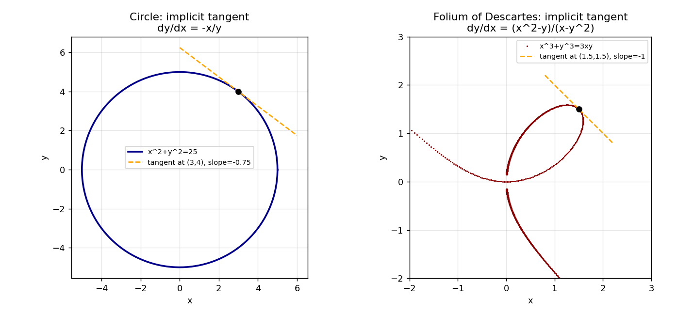

# Stage 5, Lesson 5.10 — Implicit Differentiation

**Threads:** Math, CS
**Estimated time:** 60–75 minutes

---

## What This Lesson Is About

Every derivative so far has been of a function written explicitly as $y=f(x)$ — plug in $x$, get $y$ out directly. But plenty of curves worth studying are defined by an equation relating $x$ and $y$ together, like $x^2+y^2=25$, where $y$ is never isolated on one side by itself. You *could* solve for $y$ explicitly here ($y=\pm\sqrt{25-x^2}$), but for many curves that's impossible or hopelessly messy. **Implicit differentiation** sidesteps the problem entirely: differentiate both sides of the equation as they stand, treating $y$ as an unnamed function of $x$ the whole time, and use the Chain Rule from Lesson 5.9 every time $y$ appears. This lesson is really just the Chain Rule applied to $y$ itself.

---

## Historical Context

In 1638, René Descartes proposed the curve $x^3+y^3=3xy$ — now called the Folium of Descartes — as a challenge to Pierre de Fermat, betting that Fermat's tangent-line method couldn't handle it. Descartes was right that solving the equation explicitly for $y$ as a function of $x$ is extremely unwieldy. It took the development of Leibniz's differential calculus, decades later, before mathematicians could find the tangent line to this curve directly from the implicit equation itself — without ever solving for $y$ first — which is exactly the technique in this lesson. That same folium curve is one of the two worked examples below.

---

## What You Need To Know First

- **The Chain Rule** (Lesson 5.9): implicit differentiation is the Chain Rule applied to $y$, treated as an unspecified function of $x$, every time $y$ appears in an expression.
- **The Product Rule** (Lesson 5.7): needed whenever $x$ and $y$ are multiplied together, as in the folium example below.
- **Circles and their equations** (Lesson 3.2): the first worked example.

---

## The Lesson

### The Method of Implicit Differentiation

**The problem.** Given an equation like $x^2+y^2=25$ that relates $x$ and $y$ without isolating $y$, how do we find $\frac{dy}{dx}$ without first solving for $y$ explicitly?

**The idea.** Treat $y$ as if it were some (unknown, unnamed) differentiable function of $x$ — call it $y(x)$ in your head, even though we never write it that way on paper. Then differentiate *both sides* of the equation with respect to $x$, applying the Chain Rule every time $y$ appears: since $y$ is secretly a function of $x$, $\frac{d}{dx}[y^n] = n\,y^{n-1}\cdot\frac{dy}{dx}$, by the exact same Generalized Power Rule from Lesson 5.9 — just with $y$ playing the role of the inner function $u$. After differentiating both sides, every occurrence of $\frac{dy}{dx}$ can be collected and solved for algebraically.

**Geometric picture.** The curve defined by $x^2+y^2=25$ is not the graph of a single function — it's a full circle, failing the vertical line test. But at any *specific point* on that circle (away from the very top and bottom), the curve locally looks just like the graph of some function, and it has a well-defined tangent line there. Implicit differentiation finds the slope of that tangent line directly, at whatever point you plug in, without ever needing a global formula for "$y$ as a function of $x$."

---

### Hand-Worked Example — Circle

We will find $\frac{dy}{dx}$ for $x^2+y^2=25$, and the tangent line at the point $(3,4)$.

**Step 1 — differentiate both sides with respect to $x$.**
$$\frac{d}{dx}\big[x^2+y^2\big] = \frac{d}{dx}[25]$$

**Step 2 — differentiate term by term, applying the Chain Rule to the $y^2$ term.**
$$2x + 2y\cdot\frac{dy}{dx} = 0$$
(The right side is $0$ since $25$ is a constant.)

**Step 3 — solve for $\frac{dy}{dx}$.**
$$2y\frac{dy}{dx} = -2x \implies \frac{dy}{dx} = -\frac{x}{y}$$

**Step 4 — evaluate at the point $(3,4)$.** Confirm this point is actually on the circle first: $3^2+4^2=9+16=25$. ✓. Then:
$$\frac{dy}{dx}\bigg|_{(3,4)} = -\frac{3}{4}$$

**Step 5 — write the tangent line.** Using point-slope form: $y - 4 = -\frac{3}{4}(x-3)$.

**Step 6 — verify symbolically.** Confirmed by SymPy's `idiff` in the code block below, matching Step 3 exactly.

**Step 7 — generalize.** For *any* circle $x^2+y^2=r^2$, the same steps give $\frac{dy}{dx}=-\frac{x}{y}$ regardless of the radius $r$ — notice this also says the tangent line's slope is the negative reciprocal of the slope from the origin to that point, i.e. the tangent is always perpendicular to the radius — a fact you may already know from geometry, now derived from calculus instead.

---

### Hand-Worked Example — The Folium of Descartes

We will find $\frac{dy}{dx}$ for $x^3+y^3=3xy$, and the tangent line at $\left(\frac{3}{2},\frac{3}{2}\right)$.

**Step 1 — differentiate both sides with respect to $x$.**
$$\frac{d}{dx}\big[x^3+y^3\big] = \frac{d}{dx}\big[3xy\big]$$

**Step 2 — differentiate the left side, using the Chain Rule on $y^3$.**
$$3x^2 + 3y^2\frac{dy}{dx}$$

**Step 3 — differentiate the right side, using the Product Rule** (Lesson 5.7) **on $3xy$**, since both $x$ and $y$ depend on $x$:
$$\frac{d}{dx}[3xy] = 3\cdot\frac{d}{dx}(xy) = 3\left(1\cdot y + x\cdot\frac{dy}{dx}\right) = 3y + 3x\frac{dy}{dx}$$

**Step 4 — set the two sides equal.**
$$3x^2 + 3y^2\frac{dy}{dx} = 3y + 3x\frac{dy}{dx}$$

**Step 5 — collect every $\frac{dy}{dx}$ term on one side.**
$$3y^2\frac{dy}{dx} - 3x\frac{dy}{dx} = 3y - 3x^2$$
$$\frac{dy}{dx}\big(3y^2 - 3x\big) = 3y-3x^2$$

**Step 6 — solve for $\frac{dy}{dx}$.**
$$\frac{dy}{dx} = \frac{3y-3x^2}{3y^2-3x} = \frac{y - x^2}{y^2 - x} = \frac{x^2-y}{x-y^2}$$
(the last form obtained by multiplying numerator and denominator by $-1$, matching the code output below).

**Step 7 — evaluate at $\left(\frac32,\frac32\right)$.** Confirm the point lies on the curve: $\left(\frac32\right)^3+\left(\frac32\right)^3 = 2\cdot\frac{27}{8}=\frac{27}{4}$, and $3\cdot\frac32\cdot\frac32=\frac{27}{4}$. ✓ Then:
$$\frac{dy}{dx}\bigg|_{(3/2,\,3/2)} = \frac{(3/2)^2-3/2}{3/2-(3/2)^2} = \frac{9/4-6/4}{6/4-9/4} = \frac{3/4}{-3/4} = -1$$

**Step 8 — verify symbolically and numerically.** SymPy's `idiff` reproduces the exact same formula and value; a completely independent check — numerically solving the curve's equation for $y$ at $x$-values just barely to either side of $1.5$ and taking a finite difference — gives $-1.0000003$, matching to 6 decimal places, confirmed in the code block below.

**Step 9 — generalize.** Even though we never solved $x^3+y^3=3xy$ for $y$ as an explicit function of $x$ (which would be extremely messy — this is exactly the curve Descartes challenged Fermat with), implicit differentiation found the exact tangent slope at a specific point in a few algebraic steps.

---

### Code — Verifying Both Derivatives Symbolically and Numerically

**Purpose.** Use SymPy's implicit-differentiation routine to confirm both hand-derived formulas exactly, then independently check the harder (folium) result using root-finding plus a finite difference — a check that never uses calculus at all.

```python
import sympy as sp
from scipy.optimize import brentq

x, y = sp.symbols('x y')

eq1 = sp.Eq(x**2 + y**2, 25)
dydx1 = sp.idiff(eq1.lhs - eq1.rhs, y, x)
print("Circle x^2+y^2=25:  dy/dx =", dydx1)
print("At (3,4):", dydx1.subs({x: 3, y: 4}))

eq2 = sp.Eq(x**3 + y**3, 3*x*y)
dydx2 = sp.idiff(eq2.lhs - eq2.rhs, y, x)
print("\nFolium x^3+y^3=3xy:  dy/dx =", sp.simplify(dydx2))
print("At (3/2, 3/2):", sp.simplify(dydx2.subs({x: sp.Rational(3,2), y: sp.Rational(3,2)})))

# Independent numerical check: solve the folium for y near x=1.5, both sides, and take a finite difference
def curve_residual(y_val, x_val):
    return x_val**3 + y_val**3 - 3*x_val*y_val

x0, h = 1.5, 1e-4
y_plus = brentq(lambda yy: curve_residual(yy, x0+h), 1.3, 1.7)
y_minus = brentq(lambda yy: curve_residual(yy, x0-h), 1.3, 1.7)
print(f"\nNumerical dy/dx at x=1.5 (root-finding + finite diff): {(y_plus - y_minus) / (2*h)}")
```

**Real output, this session:**
```
Circle x^2+y^2=25:  dy/dx = -x/y
At (3,4): -3/4

Folium x^3+y^3=3xy:  dy/dx = (x**2 - y)/(x - y**2)
At (3/2, 3/2): -1

Numerical dy/dx at x=1.5 (root-finding + finite diff): -1.00000028444458
```



**Walkthrough.** `sp.idiff(expr, y, x)` performs exactly the steps you did by hand — differentiate `expr` with respect to `x`, treating `y` as a function of `x`, then solve algebraically for `dy/dx` — automating Steps 1–6 of each hand-worked example. The numerical check is genuinely independent of calculus: `brentq` finds the actual $y$-value on the folium at $x=1.5\pm h$ by root-finding (bisection-family search, the same family of idea as Lesson 5.5's bisection method), and a plain finite difference of those two $y$-values estimates the slope from raw numbers alone — its agreement with the symbolic answer to 6 decimal places is strong evidence the implicit differentiation was carried out correctly.

**Connection.** Both panels show the same idea: draw the (non-function) curve, then draw the one specific tangent line implicit differentiation predicts at one chosen point — a straight line touching a curve that could never be written as one single explicit function $y=f(x)$ over its whole domain.

---

## Connect the Pieces

Implicit differentiation is nothing more than the Chain Rule (Lesson 5.9) applied to $y$ treated as an unnamed function of $x$, combined with the Product Rule (Lesson 5.7) whenever $x$ and $y$ are multiplied together. It directly enables **Related Rates** (Lesson 5.12), where two or more quantities are linked by an implicit equation and you need the rate of change of one with respect to *time* rather than $x$ — the exact same collect-and-solve-for-$\frac{dy}{dx}$ algebra used here, just with $\frac{d}{dt}$ in place of $\frac{d}{dx}$. It will also reappear directly in Lesson 5.11, differentiating inverse functions like $\arcsin(x)$, which are most naturally defined implicitly in the first place.

---

## Summary

- **Implicit differentiation:** differentiate both sides of an equation relating $x$ and $y$ with respect to $x$, treating $y$ as an unspecified differentiable function of $x$ and applying the Chain Rule ($\frac{d}{dx}[y^n]=ny^{n-1}\frac{dy}{dx}$) every time $y$ appears.
- Whenever $x$ and $y$ are multiplied together, use the **Product Rule** — both factors depend on $x$.
- After differentiating, **collect all $\frac{dy}{dx}$ terms on one side** and solve algebraically.
- This works even for curves that cannot be (easily, or at all) solved explicitly for $y$ as a function of $x$ — like the Folium of Descartes.

---

## Problems

### Computation

1. Find $\frac{dy}{dx}$ for $x^2 - y^2 = 9$.
2. Find $\frac{dy}{dx}$ for $x^2y + y^3 = 10$.
3. For the circle $x^2+y^2=25$, find the tangent line at $(0,5)$ and explain, using the formula $\frac{dy}{dx}=-\frac{x}{y}$, why this specific point requires special care.

*Answers: (1) $2x-2y\frac{dy}{dx}=0 \Rightarrow \frac{dy}{dx}=\frac{x}{y}$. (2) product rule on $x^2y$: $2xy+x^2\frac{dy}{dx}+3y^2\frac{dy}{dx}=0 \Rightarrow \frac{dy}{dx}=\frac{-2xy}{x^2+3y^2}$. (3) at $(0,5)$, $\frac{dy}{dx}=-0/5=0$ — horizontal tangent; no special care needed here since $y\ne0$, but at $(5,0)$ or $(-5,0)$ the formula divides by zero, reflecting the (vertical) tangent line there.*

### Understanding

4. Explain why implicit differentiation is really "just the Chain Rule," by describing exactly which step in the circle example uses the Chain Rule and what the "inner function" is in that step.

### Proof

5. Prove, using implicit differentiation, that every tangent line to the circle $x^2+y^2=r^2$ is perpendicular to the line from the origin to the point of tangency. (Hint: compare the implicit-differentiation slope to the slope of the radius line, and recall when two slopes are perpendicular.)

### Extension ★

6. ★ At the point $(0,0)$, the Folium of Descartes $x^3+y^3=3xy$ actually crosses itself, and the ordinary implicit-differentiation formula $\frac{dy}{dx}=\frac{x^2-y}{x-y^2}$ becomes $\frac{0}{0}$ there. Explain why this is exactly the kind of indeterminate form Lesson 5.2 taught you to be suspicious of, and what it suggests geometrically about the curve at that specific point (consider: could a single curve have more than one tangent line direction at a self-crossing point?).
