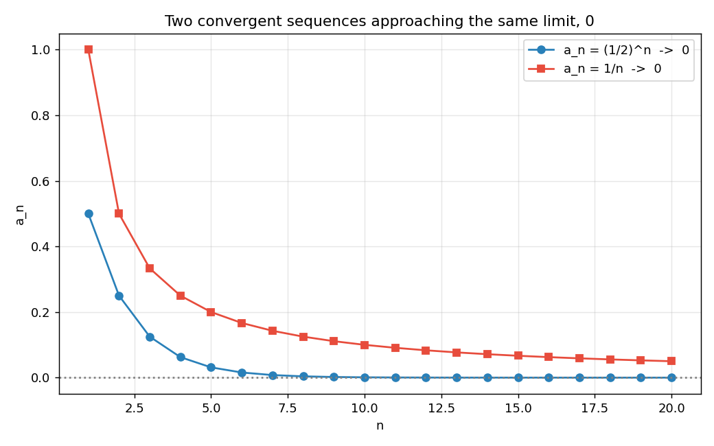
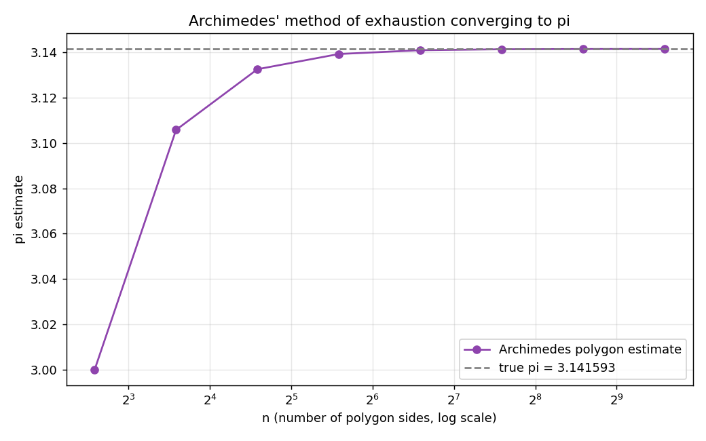

# Stage 5, Lesson 5.1 — Sequences and Limits

**Threads:** Math · CS · Physics
**Estimated time:** 60–75 minutes

---

## What This Lesson Is About

A **sequence** is just an infinite, ordered list of numbers — $a_1, a_2, a_3, \dots$ — and almost every numerical method you'll ever run on a computer is secretly a sequence: repeat a step, get a new number, repeat again, and watch the numbers home in on an answer. This lesson gives that homing-in behavior a name — the **limit of a sequence** — and a precise way to check it, before Lesson 5.2 asks the same question about functions instead of lists of numbers. By the end of this lesson you'll be able to say exactly what it means for a sequence to "approach" a number, prove it for specific sequences, and recognize the same convergence pattern driving Archimedes' 2,000-year-old method for computing $\pi$.

---

## Historical Context

Around 250 BCE, Archimedes computed increasingly accurate estimates of $\pi$ by inscribing and circumscribing regular polygons inside and around a circle, starting with a hexagon and repeatedly doubling the number of sides — hexagon, 12-gon, 24-gon, all the way to a 96-gon computed entirely by hand. Each doubling produced a *better* estimate, and Archimedes showed the two sequences (inscribed and circumscribed) squeeze toward the same value — the same Squeeze Theorem idea Lesson 5.2 will name formally, applied here to a sequence instead of a function nearly two thousand years before either was defined rigorously. This lesson's third worked example reproduces Archimedes' sequence directly.

---

## What You Need To Know First

- **Functions: input, rule, output** (Lesson 0.6) — a sequence is just a function whose input is restricted to the positive whole numbers $1, 2, 3, \dots$
- **Proof by induction** (Lesson 0.10) — useful for verifying formulas for the $n$-th term of a recursively defined sequence.
- **Basic exponent rules and logarithms** — needed to predict how fast a geometric sequence shrinks.

---

## The Lesson

### Definition

**Definition:** A **sequence** is a function $a: \mathbb{N} \to \mathbb{R}$, almost always written $a_n$ (using subscript notation) instead of $a(n)$. The sequence itself is written $\{a_n\}_{n=1}^{\infty}$, or just $\{a_n\}$.

**Three common ways a sequence is defined:**

| Type | Example | First few terms |
|---|---|---|
| Explicit formula | $a_n = 2n+1$ | $3, 5, 7, 9, \dots$ |
| Geometric | $a_n = \left(\frac12\right)^n$ | $\frac12, \frac14, \frac18, \dots$ |
| Recursive | $a_1=1,\ a_2=1,\ a_n=a_{n-1}+a_{n-2}$ | $1,1,2,3,5,8,\dots$ (Fibonacci) |

```python
import numpy as np

n = np.arange(1, 21)
arithmetic = 2*n + 1
geometric = (1/2)**n
harmonic = 1/n

print("Arithmetic a_n = 2n+1, first 10 terms:", arithmetic[:10])
print("Geometric  a_n = (1/2)^n, first 10 terms:", np.round(geometric[:10], 6))
print("Harmonic   a_n = 1/n, first 10 terms:", np.round(harmonic[:10], 6))
```

**Real output, this session:**
```
Arithmetic a_n = 2n+1, first 10 terms: [ 3  5  7  9 11 13 15 17 19 21]
Geometric  a_n = (1/2)^n, first 10 terms: [0.5      0.25     0.125    0.0625   0.03125  0.015625 0.007812 0.003906 0.001953 0.000977]
Harmonic   a_n = 1/n, first 10 terms: [1.       0.5      0.333333 0.25     0.2      0.166667 0.142857 0.125 0.111111 0.1     ]
```

**Walkthrough:** `np.arange(1, 21)` generates the whole-number inputs $n=1,\dots,20$ at once; every sequence formula is then applied to the whole array simultaneously via NumPy's vectorized arithmetic, rather than looping term-by-term. Notice both the geometric and harmonic sequences shrink toward $0$, but at very different rates — the geometric sequence has already dropped below $0.001$ by $n=10$, while the harmonic sequence is still at $0.1$.

---

### The Limit of a Sequence

**The problem.** "Gets closer and closer to a number" is the same vague phrase Lesson 5.2 will need to fix for functions — we need a precise, checkable version for sequences first.

**Formal definition.** We say
$$\lim_{n\to\infty} a_n = L$$
if for every $\epsilon>0$, there exists a whole number $N$ such that
$$n \geq N \implies |a_n - L| < \epsilon$$
In words: no matter how tight a tolerance $\epsilon$ someone demands, only *finitely many* terms at the start of the sequence are allowed to fall outside it — from some point $N$ onward, every single term must be within $\epsilon$ of $L$, forever.

**Geometric picture.** Draw a thin horizontal band of width $2\epsilon$ centered on $L$. A convergent sequence's plotted points may bounce around outside that band for a while, but eventually — past some index $N$ — every single point must land inside the band and never leave again.

#### Hand-Worked Example — Proving $\lim_{n\to\infty}\frac1n = 0$

**Step 1 — state the goal.** Given any $\epsilon>0$, find a whole number $N$ such that $n\geq N \implies \left|\frac1n - 0\right| < \epsilon$.

**Step 2 — scratch work.** Since $n>0$, $\left|\frac1n\right|=\frac1n$. We need $\frac1n < \epsilon$, i.e. $n > \frac1\epsilon$.

**Step 3 — choose $N$.** Let $N$ be any whole number greater than $\frac1\epsilon$ — concretely, $N = \left\lceil \frac1\epsilon \right\rceil$ (round up).

**Step 4 — forward proof.** If $n \geq N > \frac1\epsilon$, then $\frac1n < \epsilon$, so $\left|\frac1n-0\right|<\epsilon$. Done.

**Step 5 — verify numerically.** The code block below computes the smallest working $N$ for several $\epsilon$ values by brute-force search and confirms it matches $\lceil 1/\epsilon\rceil$.

#### Hand-Worked Example — Proving $\lim_{n\to\infty} r^n = 0$ for $0 < r < 1$

**Step 1 — state the goal.** Find $N$ such that $n \geq N \implies r^n < \epsilon$.

**Step 2 — scratch work using logarithms** (Lesson 1.8): $r^n < \epsilon \iff \ln(r^n) < \ln\epsilon \iff n\ln r < \ln\epsilon$. Since $0<r<1$, $\ln r < 0$, so dividing **flips the inequality**:
$$n > \frac{\ln \epsilon}{\ln r}$$

**Step 3 — choose $N$.** $N = \left\lceil \dfrac{\ln\epsilon}{\ln r}\right\rceil$.

**Step 4 — verify with $r=0.5$.** For $\epsilon=0.01$: $N = \left\lceil \frac{\ln 0.01}{\ln 0.5}\right\rceil = \lceil 6.64\rceil = 7$. Check: $0.5^7 = 0.0078 < 0.01$ ✓, and $0.5^6 = 0.0156 \geq 0.01$ (confirming $7$ really is the *smallest* working $N$, not just *a* working one).

**Step 5 — verify numerically for several $\epsilon$.** Confirmed exactly in the code block below.

```python
import math

def smallest_N_harmonic(eps):
    N = 1
    while 1/N >= eps:
        N += 1
    return N

print("lim 1/n = 0 : smallest N for each epsilon")
for eps in [0.1, 0.01, 0.001, 0.0001]:
    N = smallest_N_harmonic(eps)
    print(f"  eps={eps:<8} N={N:<8} check: 1/N={1/N:.6f} < eps? {1/N < eps}")

def smallest_N_geometric(eps, r):
    N_real = math.log(eps) / math.log(r)
    return math.ceil(N_real)

r = 0.5
print(f"\nlim (0.5)^n = 0 : predicted N via logs, r={r}")
for eps in [0.1, 0.01, 0.001, 0.0001]:
    N = smallest_N_geometric(eps, r)
    val, val_prev = r**N, r**(N-1)
    print(f"  eps={eps:<8} N={N:<5} r^N={val:.6f} (<eps: {val<eps})   r^(N-1)={val_prev:.6f} (<eps: {val_prev<eps})")
```

**Real output, this session:**
```
lim 1/n = 0 : smallest N for each epsilon
  eps=0.1      N=11       check: 1/N=0.090909 < eps? True
  eps=0.01     N=101      check: 1/N=0.009901 < eps? True
  eps=0.001    N=1001     check: 1/N=0.000999 < eps? True
  eps=0.0001   N=10001    check: 1/N=0.000100 < eps? True

lim (0.5)^n = 0 : predicted N via logs, r=0.5
  eps=0.1      N=4     r^N=0.062500 (<eps: True)   r^(N-1)=0.125000 (<eps: False)
  eps=0.01     N=7     r^N=0.007812 (<eps: True)   r^(N-1)=0.015625 (<eps: False)
  eps=0.001    N=10    r^N=0.000977 (<eps: True)   r^(N-1)=0.001953 (<eps: False)
  eps=0.0001   N=14    r^N=0.000061 (<eps: True)   r^(N-1)=0.000122 (<eps: False)
```

**Walkthrough.** `smallest_N_harmonic` finds $N$ by brute-force incrementing — slow but foolproof, and it exactly matches $\lceil 1/\epsilon\rceil$ from the hand-worked proof every time. `smallest_N_geometric` instead computes $N$ directly from the log formula derived in Step 2 — no searching required — and the check confirms `r^(N-1) >= eps` in every row, meaning the formula finds the *exact* smallest valid $N$, not merely one that happens to work.

```python
import matplotlib
matplotlib.use("Agg")
import matplotlib.pyplot as plt
import numpy as np

n = np.arange(1, 21)
fig, ax = plt.subplots(figsize=(8,5))
ax.plot(n, (1/2)**n, 'o-', color="#2980b9", label="a_n = (1/2)^n  ->  0")
ax.plot(n, 1/n, 's-', color="#e74c3c", label="a_n = 1/n  ->  0")
ax.axhline(0, color="gray", linestyle=":")
ax.set_xlabel("n"); ax.set_ylabel("a_n")
ax.set_title("Two convergent sequences approaching the same limit, 0")
ax.legend(); ax.grid(alpha=0.3)
plt.tight_layout()
plt.savefig("sequences.png", dpi=130)
```



**Walkthrough.** Both curves flatten toward the horizontal dotted line at $0$, but the blue geometric sequence collapses almost immediately while the red harmonic sequence is still visibly above zero at $n=20$ — a direct picture of the very different $N$ values found above for the same $\epsilon$ (geometric needed $N=7$ for $\epsilon=0.01$; harmonic needed $N=101$).

---

### Archimedes' Method of Exhaustion

**The idea.** Inscribe a regular polygon with $n$ sides inside a circle of radius $1$. As $n\to\infty$, the polygon hugs the circle more and more tightly, and its perimeter approaches the circle's circumference, $2\pi$. For a regular $n$-gon inscribed in a unit circle, half its perimeter works out to $n\sin\!\left(\frac{\pi}{n}\right)$ — this is exactly the sequence Archimedes computed by hand, doubling $n$ from $6$ to $12$ to $24$, all the way to $96$.

```python
import math

print(f"{'n (sides)':<12}{'pi estimate':<18}{'error':<15}")
n = 6
for _ in range(8):
    estimate = n * math.sin(math.pi / n)
    error = abs(math.pi - estimate)
    print(f"{n:<12}{estimate:<18.10f}{error:<15.2e}")
    n *= 2

print(f"\nTrue value of pi: {math.pi}")
```

**Real output, this session:**
```
n (sides)   pi estimate       error
6           3.0000000000      1.42e-01
12          3.1058285412      3.58e-02
24          3.1326286133      8.96e-03
48          3.1393502030      2.24e-03
96          3.1410319509      5.61e-04
192         3.1414524723      1.40e-04
384         3.1415576079      3.50e-05
768         3.1415838921      8.76e-06

True value of pi: 3.141592653589793
```



**Walkthrough.** Each doubling of `n` roughly quarters the error — a clue that this sequence converges *quadratically*, much faster than the harmonic sequence above. Archimedes stopped at $n=96$ (by hand, using only arithmetic and square roots — no calculator, no trigonometry as we know it today) and still nailed $\pi$ to two decimal places, exactly matching the $96$-sided row printed above.

---

### Convergent vs. Divergent Sequences

Not every sequence has a limit. A sequence that does not converge to any single real number is called **divergent**. Two common ways this happens:

- **Diverges to infinity:** $a_n = n$ grows without bound — no matter what $L$ you propose, the terms eventually exceed it.
- **Oscillates without settling:** $a_n = (-1)^n$ alternates forever between $-1$ and $1$ — it never settles near a single value, even though it stays bounded.

---

## Connect the Pieces

**What this lesson built on:** Functions (Lesson 0.6) — a sequence is a function restricted to whole-number inputs. Proof by induction (Lesson 0.10) — the standard tool for verifying a recursive sequence's closed-form formula. Logarithms (Lesson 1.8) — used directly in the geometric-sequence proof to solve for $N$.

**What this lesson makes possible:** Lesson 5.2 asks the identical "gets arbitrarily close" question about functions instead of sequences, reusing this lesson's $\epsilon$–$N$ pattern almost unchanged as $\epsilon$–$\delta$. Lesson 5.19's definite integral is itself defined as the limit of a *sequence* of Riemann sums as the number of rectangles goes to infinity — the exact same convergence idea, applied to sums instead of individual terms.

**In CS:** Every iterative numerical algorithm — bisection (Lesson 5.5), Newton's Method (Lesson 5.17), and gradient descent (used to train neural networks, Lesson 5.29 and beyond) — produces a *sequence* of increasingly accurate estimates and stops once consecutive terms are within some tolerance $\epsilon$ of each other. That stopping condition is a direct, practical use of the $\epsilon$–$N$ definition from this lesson.

---

## Summary

- A **sequence** $\{a_n\}$ is a function from the positive integers to the reals, defined explicitly, geometrically, or recursively.
- $\lim_{n\to\infty}a_n = L$ means: for every $\epsilon>0$, there's a whole number $N$ such that $n\geq N \implies |a_n-L|<\epsilon$.
- For a **geometric sequence** $r^n$ with $0<r<1$, the required $N$ can be solved for directly using logarithms: $N = \lceil \ln\epsilon/\ln r\rceil$.
- Archimedes' inscribed-polygon sequence, $n\sin(\pi/n)$, converges to $\pi$ — a concrete ancient example of exactly this convergence idea.
- A sequence that does not converge is **divergent** — either growing without bound or oscillating forever without settling.

**New Python:**
- `np.arange(start, stop)` — generate a whole-number range as an array, used to index sequence terms.
- `math.ceil(x)` — round up to the next whole number, used to compute the smallest valid $N$.
- `math.log(x)` / `math.log(x, b)` — natural and arbitrary-base logarithms, used to solve for $N$ in the geometric-sequence proof.

---

## Problems

### Math

**1.** Find $\lim_{n\to\infty} a_n$ for each sequence, or state that it diverges.

(a) $a_n = \dfrac{3n+1}{n}$  (b) $a_n = (-1)^n \dfrac1n$  (c) $a_n = \left(\dfrac13\right)^n$  (d) $a_n = n^2$

<details>
<summary>Answers</summary>

(a) $3$ (write as $3+\frac1n$, and $\frac1n\to0$). (b) $0$ (squeezed between $-\frac1n$ and $\frac1n$, both $\to0$). (c) $0$. (d) Diverges (grows without bound).

</details>

---

**2.** Find the smallest whole number $N$ such that $\left(\dfrac13\right)^n < 0.001$ for all $n\geq N$, using the log formula from this lesson.

<details>
<summary>Answer</summary>

$N = \left\lceil \dfrac{\ln(0.001)}{\ln(1/3)}\right\rceil = \lceil 6.29\rceil = 7$. Check: $(1/3)^7 \approx 0.000457 < 0.001$ ✓, and $(1/3)^6\approx0.00137\geq0.001$.

</details>

---

**3.** (Proof) Prove, using the $\epsilon$–$N$ definition, that $\lim_{n\to\infty}\dfrac{1}{n^2} = 0$.

<details>
<summary>Answer</summary>

Given $\epsilon>0$, we need $n\geq N \implies \frac1{n^2}<\epsilon$, i.e. $n^2>\frac1\epsilon$, i.e. $n>\frac{1}{\sqrt\epsilon}$. Choose $N=\left\lceil\frac1{\sqrt\epsilon}\right\rceil$. Then for $n\geq N$: $n>\frac1{\sqrt\epsilon}\implies n^2>\frac1\epsilon\implies\frac1{n^2}<\epsilon$. $\blacksquare$

</details>

---

### Code Challenges

**Challenge 1 — Smallest N finder**

```python
import math

def smallest_N(eps, r):
    """
    Return the smallest whole number N such that |r|^N < eps,
    for 0 < |r| < 1. Raise ValueError otherwise.
    """
    pass  # your code here


# --- tests: do not modify ---
assert smallest_N(0.1, 0.5) == 4
assert smallest_N(0.01, 0.5) == 7
assert abs(0.5 ** smallest_N(0.01, 0.5)) < 0.01
assert abs(0.5 ** (smallest_N(0.01, 0.5) - 1)) >= 0.01

try:
    smallest_N(0.1, 1.5)
    assert False, "Should raise ValueError for |r| >= 1"
except ValueError:
    pass

print("✓ Challenge 1 passed!")
```

---

**Challenge 2 — Archimedes' pi estimator**

```python
import math

def archimedes_pi_estimate(n_sides):
    """
    Return the pi estimate from a regular polygon with n_sides
    inscribed in a unit circle: n_sides * sin(pi / n_sides).
    """
    pass  # your code here


# --- tests: do not modify ---
est_6 = archimedes_pi_estimate(6)
est_96 = archimedes_pi_estimate(96)
est_768 = archimedes_pi_estimate(768)

assert math.isclose(est_6, 3.0, rel_tol=1e-9)
assert abs(math.pi - est_96) < abs(math.pi - est_6)
assert abs(math.pi - est_768) < abs(math.pi - est_96)
assert abs(math.pi - est_768) < 1e-4

print("✓ Challenge 2 passed!")
print(f"  768-gon estimate: {est_768:.10f}  (true pi: {math.pi:.10f})")
```

<details>
<summary>Hint</summary>

`math.sin` expects radians, which `math.pi / n_sides` already is — no conversion needed.

</details>

---

### Extension

**4. ★** A sequence $\{a_n\}$ is called a **Cauchy sequence** if, for every $\epsilon>0$, there exists $N$ such that for **all** $m, n \geq N$ (not just compared to a fixed limit $L$), $|a_n - a_m| < \epsilon$ — the terms all get close to *each other*, without reference to any proposed limit value. Explain intuitively why every convergent sequence must be Cauchy (hint: if both $a_n$ and $a_m$ are very close to the same $L$, how far apart can they be from each other?), and why this definition is useful for proving a sequence converges *before* you know what it converges to.
