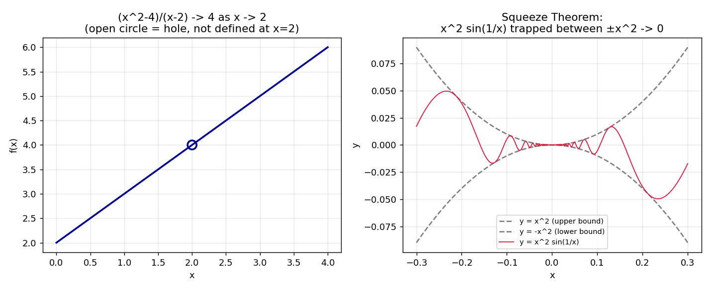

# Stage 5, Lesson 5.2 — The Limit of a Function, Informal

**Threads:** Math, CS
**Estimated time:** 45–60 minutes

---

## What This Lesson Is About

Lesson 5.1 introduced limits of *sequences* — what a list of numbers settles down to as you go further and further out. This lesson asks the same question about *functions*: as the input $x$ gets closer and closer to some value $a$, what value does $f(x)$ get closer and closer to? This is the single idea that everything else in Chapter 5 is built on top of — the derivative (5.6) is defined as a limit, the definite integral (5.19) is defined as a limit, and even a formal, rigorous definition of "limit" itself is coming in the very next lesson (5.3). For now, the goal is to build a solid, computational, hands-on feel for limits: how to read one off a table of numbers, how to compute one using algebra, and how to handle the tricky case where a function is trapped between two other functions that squeeze it toward the same value.

---

## Historical Context

Isaac Newton, in the 1687 *Principia*, described quantities that "converge continually to equality" as their difference shrinks to nothing — his informal notion of a limit, which he called the method of "ultimate ratios," used to justify the derivative decades before anyone could define a limit with full rigor. For over a century afterward, mathematicians used limits successfully in exactly this intuitive way — reasoning about quantities getting arbitrarily close to a value — without a precise definition of what "arbitrarily close" actually meant. That precise definition is the subject of the very next lesson; this lesson deliberately stays at the informal level Newton himself worked at, because that level is genuinely enough to compute with.

---

## What You Need To Know First

- **Limits of sequences** (Lesson 5.1): the idea of "getting arbitrarily close to a value" — this lesson applies that same idea to a function's output instead of a sequence's terms.
- **Rational functions and their domain restrictions** (Lesson 1.5): several examples below involve a function that is undefined at exactly the point we're taking the limit toward.
- **Basic function evaluation and algebraic manipulation** (factoring, in particular): the main computational tool for finding a limit algebraically.

---

## The Lesson

### The Informal Idea of a Limit

**The problem.** Consider $f(x) = \frac{x^2-4}{x-2}$. Plug in $x=2$ directly and you get $\frac{0}{0}$ — undefined. But what value does $f(x)$ get close to as $x$ gets close to (without ever actually reaching) $2$?

**Formal definition (informal version — a precise one is coming in 5.3).** We write
$$\lim_{x \to a} f(x) = L$$
and say "the limit of $f(x)$ as $x$ approaches $a$ is $L$" if the values of $f(x)$ get arbitrarily close to $L$ whenever $x$ gets sufficiently close to $a$ — **without $x$ ever actually equalling $a$**. Crucially, $f$ does not even need to be *defined* at $a$ for this limit to exist, exactly like the example above.

**Geometric picture.** Imagine walking your finger along the graph of $f$ from both the left and the right side, heading toward the vertical line $x=a$. If your finger from the left and your finger from the right both approach the same height, that height is the limit — whether or not there's actually a point plotted at $x=a$ itself.

#### Hand-Worked Example — Finding a Limit From a Table

We will find $\lim_{x \to 2} \frac{x^2-4}{x-2}$ two ways: numerically, then algebraically.

**Step 1 — build a table approaching from the left ($x < 2$) and the right ($x > 2$).** These values were computed directly below in the code block:

| $x$ (from left) | $f(x)$ | $x$ (from right) | $f(x)$ |
|---|---|---|---|
| 1.9 | 3.9 | 2.1 | 4.1 |
| 1.99 | 3.99 | 2.01 | 4.01 |
| 1.999 | 3.999 | 2.001 | 4.001 |
| 1.9999 | 3.9999 | 2.0001 | 4.0001 |

**Step 2 — read off the trend.** From both sides, $f(x)$ is clearly heading toward $4$, even though $f(2)$ itself is undefined ($\frac{0}{0}$).

**Step 3 — confirm algebraically by factoring.** For $x \neq 2$:
$$\frac{x^2-4}{x-2} = \frac{(x-2)(x+2)}{x-2} = x+2$$
This cancellation is valid precisely because $x \neq 2$ (which is guaranteed by the definition of a limit — $x$ never equals $a$).

**Step 4 — evaluate the simplified expression at $x=2$.** $x + 2 = 4$ when $x=2$. This matches the table exactly.

**Step 5 — state the conclusion.** $\lim_{x\to 2}\frac{x^2-4}{x-2} = 4$, even though the original function has a "hole" at $x=2$ and is not defined there.

**Step 6 — generalize.** Whenever direct substitution gives $\frac{0}{0}$, that is a signal (not a final answer) that the numerator and denominator share a common factor — factor, cancel, and *then* substitute.

---

### Limit Laws

**The problem.** Computing a limit by building a table of values, every single time, is slow. Can we build up limits of complicated expressions out of limits of simple pieces?

**Formal definition.** If $\lim_{x\to a} f(x) = L$ and $\lim_{x \to a} g(x) = M$ both exist, then:

- **Sum/Difference Law:** $\lim_{x\to a}[f(x)\pm g(x)] = L \pm M$
- **Product Law:** $\lim_{x\to a}[f(x)\cdot g(x)] = L\cdot M$
- **Quotient Law:** $\lim_{x\to a}\dfrac{f(x)}{g(x)} = \dfrac{L}{M}$, provided $M \neq 0$
- **Constant Multiple Law:** $\lim_{x\to a}[c\cdot f(x)] = c\cdot L$

**Geometric picture.** These laws say limits behave exactly the way you'd hope arithmetic should: the limit of a sum is the sum of the limits, and so on — you can compute the "destination" of each piece separately, then combine the destinations, instead of tracking the whole combined expression's approach all at once.

**CS lens.** This is the same principle behind evaluating an expression tree in a compiler: to evaluate `(a + b) * c`, you don't need one giant combined rule — you evaluate `a`, `b`, and `c` independently (recursively), then combine the *results*. Limit laws let you do exactly this with limits: break the expression into pieces, take each piece's limit independently, then recombine.

---

### The Squeeze (Sandwich) Theorem

**The problem.** What about a function like $g(x) = x^2\sin\!\left(\frac{1}{x}\right)$? As $x \to 0$, $\sin(1/x)$ oscillates faster and faster and has no limit at all — the ordinary limit laws above cannot be applied to it directly, since one of the pieces doesn't converge to anything.

**Formal definition.** If $f(x) \leq g(x) \leq h(x)$ for all $x$ near $a$ (except possibly at $a$ itself), and
$$\lim_{x\to a} f(x) = \lim_{x\to a} h(x) = L$$
then $\lim_{x\to a} g(x) = L$ as well — $g$ is "squeezed" between two functions that both converge to the same place, so it has no room to go anywhere else.

**Geometric picture.** Picture $g$'s graph trapped in a shrinking gap between the graphs of $f$ (below) and $h$ (above). As that gap narrows to a single point at $x=a$, $g$ is physically forced through that same point — it has nowhere else to be.

#### Hand-Worked Example — Squeeze Theorem

We will find $\lim_{x\to 0} x^2 \sin\!\left(\frac{1}{x}\right)$.

**Step 1 — identify the obstruction.** $\sin(1/x)$ oscillates between $-1$ and $1$ infinitely often as $x\to 0$ and has no limit itself — so we cannot use the Product Law directly (it requires *both* pieces to have a limit).

**Step 2 — find a squeeze.** Since $-1 \leq \sin(1/x) \leq 1$ for every $x \neq 0$, multiply through by $x^2 \geq 0$ (which doesn't flip the inequalities):
$$-x^2 \leq x^2\sin\!\left(\frac{1}{x}\right) \leq x^2$$

**Step 3 — take the limit of both outer bounds.** $\lim_{x\to 0}(-x^2) = 0$ and $\lim_{x\to 0} x^2 = 0$ (ordinary polynomial limits, direct substitution).

**Step 4 — apply the Squeeze Theorem.** Since both outer bounds go to $0$, the trapped function must too:
$$\lim_{x\to 0} x^2\sin\!\left(\frac{1}{x}\right) = 0$$

**Step 5 — verify numerically.** The table in the code block below shows $g(x)$ shrinking toward $0$ from both sides, even while oscillating in sign.

**Step 6 — generalize.** Whenever you have a bounded, oscillating piece (like $\sin$ or $\cos$ of anything) multiplied by a piece that goes to zero, look for a squeeze using the oscillating piece's known bounds ($-1$ and $1$) — this pattern reappears constantly in physics when damping a vibration to zero.

---

### Code — Verifying Both Examples Numerically

**Purpose.** Reproduce the two tables above computationally, and visualize both the removable hole in the first example and the squeeze in the second.

```python
import numpy as np

def f(x):
    return (x**2 - 4) / (x - 2)

print("Approaching x = 2 from the left:")
for x in [1.9, 1.99, 1.999, 1.9999]:
    print(f"  f({x}) = {f(x)}")

print("Approaching x = 2 from the right:")
for x in [2.1, 2.01, 2.001, 2.0001]:
    print(f"  f({x}) = {f(x)}")

def g(x):
    return x**2 * np.sin(1/x)

print("\nx^2 * sin(1/x) approaching x = 0:")
for x in [0.1, 0.01, 0.001, 0.0001, -0.1, -0.01, -0.001]:
    print(f"  g({x}) = {g(x)}")
```

**Real output, this session:**
```
Approaching x = 2 from the left:
  f(1.9) = 3.8999999999999977
  f(1.99) = 3.989999999999979
  f(1.999) = 3.99899999999986
  f(1.9999) = 3.9999000000006077
Approaching x = 2 from the right:
  f(2.1) = 4.099999999999998
  f(2.01) = 4.009999999999977
  f(2.001) = 4.00100000000014
  f(2.0001) = 4.000099999999392

x^2 * sin(1/x) approaching x = 0:
  g(0.1) = -0.005440211108893699
  g(0.01) = -5.063656411097588e-05
  g(0.001) = 8.268795405320025e-07
  g(0.0001) = -3.0561438888825215e-09
  g(-0.1) = 0.005440211108893699
  g(-0.01) = 5.063656411097588e-05
  g(-0.001) = -8.268795405320025e-07
```



**Walkthrough.** The first loop confirms the table from Step 1 of the first hand-worked example numerically — notice the tiny floating-point noise (`3.8999999999999977` instead of exactly `3.9`) is just how computers represent decimals, not a sign the limit is "wrong." The second loop confirms the squeeze example: `g(x)` shrinks toward `0` while its *sign* flips unpredictably (compare `g(0.1)` being negative to `g(-0.1)` being positive) — exactly the oscillating-but-shrinking behavior the Squeeze Theorem is built to handle.

**Connection.** The right-hand panel of the figure is a direct picture of Step 2–4 of the squeeze hand-worked example: the red curve is trapped between the two gray dashed bounds $\pm x^2$, and as both bounds pinch together at $x=0$, the red curve is forced to $0$ along with them.

---

## Connect the Pieces

This lesson generalizes the sequence-limit idea from Lesson 5.1 to functions, and gives you the algebraic toolkit (factor-and-cancel, limit laws, the Squeeze Theorem) you'll use constantly for the rest of Chapter 5 — most immediately, the derivative in Lesson 5.6 is *defined* as a limit of a difference quotient, and you will use exactly this same factor-and-cancel technique to evaluate it. Lesson 5.3 tightens the informal definition used here ("gets arbitrarily close") into the precise $\epsilon$–$\delta$ language mathematicians eventually needed once limits started being used to prove things, rather than just compute them. Lesson 5.4 (Continuity) then asks the natural follow-up question: when does the limit at a point actually *equal* the function's value there — i.e., when is there no hole at all?

---

## Summary

- $\lim_{x\to a} f(x) = L$ means $f(x)$ gets arbitrarily close to $L$ as $x$ gets arbitrarily close to (but never equal to) $a$; $f$ need not even be defined at $a$.
- When direct substitution gives $\frac{0}{0}$, factor and cancel first — this resolves most "removable hole" limits.
- **Limit Laws** let you compute the limit of a sum, difference, product, or quotient by taking the limits of the pieces separately, then combining them the same way.
- The **Squeeze Theorem** handles limits of oscillating expressions: trap the expression between two simpler functions that converge to the same value.

---

## Problems

### Computation

1. Find $\lim_{x\to 3}\dfrac{x^2-9}{x-3}$.
2. Find $\lim_{x\to 0} x^4\cos\!\left(\dfrac{1}{x}\right)$ using the Squeeze Theorem.
3. Given $\lim_{x\to 1} f(x) = 5$ and $\lim_{x\to 1} g(x) = 2$, find $\lim_{x\to 1}\big[3f(x) - g(x)^2\big]$.

*Answers: (1) factor: $\frac{(x-3)(x+3)}{x-3}=x+3 \to 6$. (2) $-x^4 \le x^4\cos(1/x) \le x^4$, both bounds $\to 0$, so the limit is $0$. (3) $3(5) - 2^2 = 15 - 4 = 11$.*

### Understanding

4. A student says: "$\lim_{x\to 2}\frac{x^2-4}{x-2}$ doesn't exist, because the function isn't even defined at $x=2$." Explain what's wrong with this reasoning.

### Proof

5. Prove, using the Squeeze Theorem, that $\lim_{x\to 0} x\sin\!\left(\frac{1}{x}\right) = 0$. (Hint: what are the tightest bounds you can put on $\sin(1/x)$, and what do you need to multiply them by?)

### Extension ★

6. ★ The Squeeze Theorem requires $f(x) \leq g(x) \leq h(x)$ to hold only "near $a$," not everywhere. Construct an example where this inequality fails somewhere far from $a$ but still holds close enough to $a$ for the Squeeze Theorem to apply — and explain why the theorem's conclusion is still valid despite the failure elsewhere.
