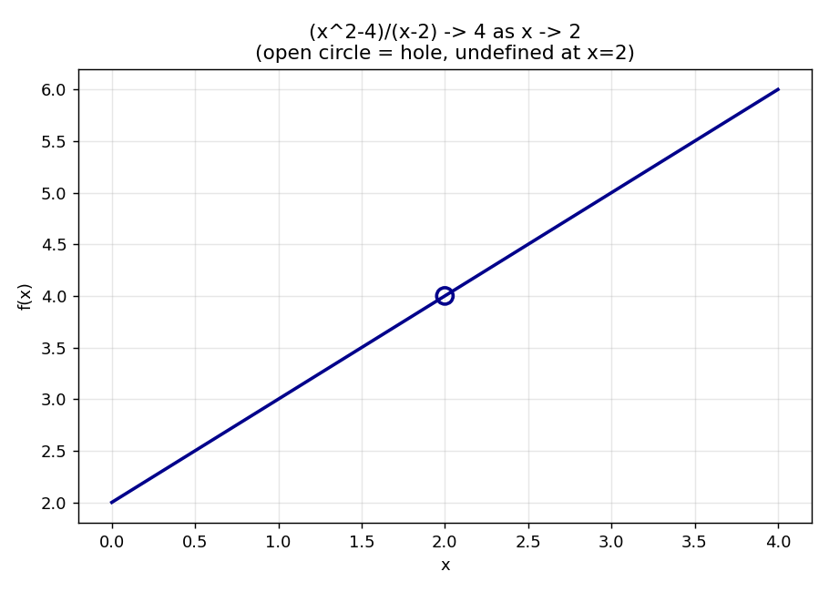
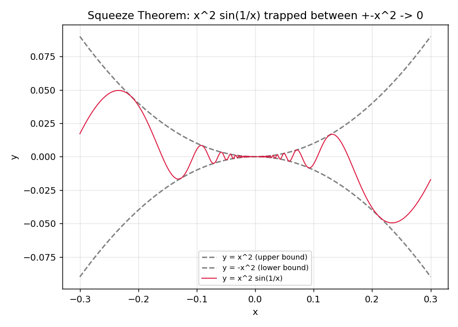

# Stage 5, Lesson 5.2 — The Limit of a Function, Informal

**Threads:** Math · CS · Physics
**Estimated time:** 60–75 minutes

---

## What This Lesson Is About

Lesson 5.1 asked what a sequence of numbers settles toward. This lesson asks the same question about a *function*: as the input $x$ gets closer and closer to some value $a$, what does $f(x)$ get closer and closer to? This is the single idea everything else in Chapter 5 stands on — the derivative (5.6) is defined as a limit, the definite integral (5.19) is defined as a limit, and a fully rigorous version of "limit" itself arrives in the very next lesson (5.3). For now, the goal is a solid, computational, hands-on feel: reading a limit off a table, computing one with algebra, and handling the case where a function is trapped between two others that squeeze it toward the same value.

---

## Historical Context

Isaac Newton, in the 1687 *Principia*, described quantities that "converge continually to equality" as their difference shrinks to nothing — his informal notion of a limit, which he called the method of "ultimate ratios," used to justify the derivative more than a century before anyone could define a limit with full rigor. For decades afterward, mathematicians used limits successfully in exactly this intuitive way — reasoning about quantities getting arbitrarily close to a value — without a precise definition of what "arbitrarily close" actually meant. That precise definition is the subject of Lesson 5.3; this lesson deliberately stays at the informal level Newton himself worked at, because that level is genuinely enough to compute with.

---

## What You Need To Know First

- **Limits of sequences** (Lesson 5.1) — the same "gets arbitrarily close" idea, now applied to a function's output instead of a sequence's terms.
- **Rational functions and domain restrictions** (Lesson 1.5) — several examples below involve a function undefined at exactly the point we're approaching.
- **Factoring polynomials** (Lesson 1.2) — the main algebraic tool for resolving a $\frac00$ form.

---

## The Lesson

### The Informal Idea of a Limit

**Definition (informal — precise version in Lesson 5.3):** We write
$$\lim_{x \to a} f(x) = L$$
if the values of $f(x)$ get arbitrarily close to $L$ whenever $x$ gets sufficiently close to $a$ — **without $x$ ever actually equalling $a$**. Crucially, $f$ does not even need to be *defined* at $a$ for this limit to exist.

**Geometric picture.** Walk your finger along the graph of $f$ from both the left and the right, heading toward the vertical line $x=a$. If your finger from the left and your finger from the right approach the same height, that height is the limit — whether or not a point is actually plotted at $x=a$ itself.

#### Hand-Worked Example — Finding a Limit From a Table

We will find $\lim_{x \to 2} \dfrac{x^2-4}{x-2}$ two ways: numerically, then algebraically.

**Step 1 — build a table** approaching from the left ($x<2$) and right ($x>2$):

| $x$ (left) | $f(x)$ | $x$ (right) | $f(x)$ |
|---|---|---|---|
| 1.9 | 3.9 | 2.1 | 4.1 |
| 1.99 | 3.99 | 2.01 | 4.01 |
| 1.999 | 3.999 | 2.001 | 4.001 |
| 1.9999 | 3.9999 | 2.0001 | 4.0001 |

**Step 2 — read the trend.** From both sides, $f(x)$ heads toward $4$, even though $f(2)$ itself is $\frac00$, undefined.

**Step 3 — confirm algebraically by factoring.** For $x\neq2$: $\dfrac{x^2-4}{x-2}=\dfrac{(x-2)(x+2)}{x-2}=x+2$ — valid precisely because $x\neq2$, which the limit's definition guarantees.

**Step 4 — evaluate the simplified expression at $x=2$.** $x+2=4$.

**Step 5 — state the conclusion.** $\lim_{x\to2}\frac{x^2-4}{x-2}=4$, even though the function has a "hole" at $x=2$.

**Step 6 — generalize.** Whenever direct substitution gives $\frac00$, factor and cancel first — that resolves most removable-hole limits.

```python
def f(x):
    return (x**2 - 4) / (x - 2)

print("Approaching x = 2 from the left:")
for x in [1.9, 1.99, 1.999, 1.9999]:
    print(f"  f({x}) = {f(x)}")

print("Approaching x = 2 from the right:")
for x in [2.1, 2.01, 2.001, 2.0001]:
    print(f"  f({x}) = {f(x)}")
```

**Real output, this session:**
```
Approaching x = 2 from the left:
  f(1.9) = 3.8999999999999977
  f(1.99) = 3.989999999999979
  f(1.999) = 3.99899999999986
  f(1.9999) = 3.9999000000006077
Approaching x = 2 from the right:
  f(2.1) = 4.099999999999998
  f(2.01) = 4.009999999999977
  f(2.001) = 4.00100000000014
  f(2.0001) = 4.000099999999392
```

**Walkthrough.** The tiny floating-point noise (`3.8999999999999977` instead of exactly `3.9`) is just how computers represent decimals — not a sign the limit is wrong. Both columns are visibly homing in on `4`.

```python
import numpy as np
import matplotlib
matplotlib.use("Agg")
import matplotlib.pyplot as plt

x = np.linspace(0, 4, 400)
x = x[np.abs(x - 2) > 0.001]
y = (x**2 - 4) / (x - 2)

fig, ax = plt.subplots(figsize=(7,5))
ax.plot(x, y, color="darkblue", linewidth=2)
ax.scatter([2], [4], facecolors='none', edgecolors='darkblue', s=100, linewidth=2, zorder=5)
ax.set_xlabel("x"); ax.set_ylabel("f(x)")
ax.set_title("(x^2-4)/(x-2) -> 4 as x -> 2\n(open circle = hole, undefined at x=2)")
ax.grid(alpha=0.3)
plt.tight_layout()
plt.savefig("hole.png", dpi=130)
```



**Walkthrough.** `np.abs(x - 2) > 0.001` deliberately excludes points extremely close to $x=2$ so the plot never tries to evaluate the function exactly at its undefined point; the open circle is drawn separately to mark where the limit points, even though no filled point exists there.

---

### Limit Laws

**Formal statement.** If $\lim_{x\to a}f(x)=L$ and $\lim_{x\to a}g(x)=M$ both exist:

- **Sum/Difference:** $\lim_{x\to a}[f(x)\pm g(x)] = L\pm M$
- **Product:** $\lim_{x\to a}[f(x)g(x)] = LM$
- **Quotient:** $\lim_{x\to a}\dfrac{f(x)}{g(x)} = \dfrac{L}{M}$, provided $M\neq0$
- **Constant Multiple:** $\lim_{x\to a}[c\cdot f(x)] = c\cdot L$

A full proof of these laws needs the formal $\epsilon$–$\delta$ machinery from Lesson 5.3 — for now, we verify them computationally and use them freely.

**CS lens.** This mirrors evaluating an expression tree in a compiler: to evaluate `(a + b) * c`, you evaluate `a`, `b`, and `c` independently (recursively), then combine the *results* — Limit Laws let you do exactly this with limits, taking each piece's limit separately and recombining.

```python
import numpy as np

def f(x): return x**2
def g(x): return x + 1

a = 2
L_f, L_g = f(a), g(a)  # 4 and 3 -- both continuous, so direct substitution gives the limit
print(f"lim f(x) = {L_f},  lim g(x) = {L_g}  (as x -> {a})\n")

xs = np.array([1.9, 1.99, 1.999, 2.001, 2.01, 2.1])

print("Sum Law: lim[f+g] should be", L_f + L_g)
print("  values of f(x)+g(x):", f(xs) + g(xs))

print("\nProduct Law: lim[f*g] should be", L_f * L_g)
print("  values of f(x)*g(x):", f(xs) * g(xs))

print("\nQuotient Law: lim[f/g] should be", L_f / L_g)
print("  values of f(x)/g(x):", np.round(f(xs) / g(xs), 6))
```

**Real output, this session:**
```
lim f(x) = 4,  lim g(x) = 3  (as x -> 2)

Sum Law: lim[f+g] should be 7
  values of f(x)+g(x): [6.51     6.9501   6.995001 7.005001 7.0501   7.51    ]

Product Law: lim[f*g] should be 12
  values of f(x)*g(x): [10.469    11.840699 11.984007 12.016007 12.160701 13.671   ]

Quotient Law: lim[f/g] should be 1.3333333333333333
  values of f(x)/g(x): [1.244828 1.324448 1.332444 1.334222 1.342226 1.422581]
```

**Walkthrough.** Each printed array closes in on its predicted value as `xs` gets closer to `2` from both directions — `f(x)+g(x)` tightens toward `7`, `f(x)*g(x)` toward `12`, `f(x)/g(x)` toward `1.3333...` — exactly the combined limits the Sum, Product, and Quotient Laws predict from `L_f` and `L_g` alone, without ever re-deriving the combined function's limit from scratch.

---

### The Squeeze (Sandwich) Theorem

**The problem.** For $g(x)=x^2\sin\!\left(\frac1x\right)$, as $x\to0$, $\sin(1/x)$ oscillates infinitely often and has no limit — the Product Law above cannot apply directly, since one piece doesn't converge.

**Formal statement.** If $f(x)\leq g(x)\leq h(x)$ near $a$ (except possibly at $a$), and $\lim_{x\to a}f(x)=\lim_{x\to a}h(x)=L$, then $\lim_{x\to a}g(x)=L$ too.

**Geometric picture.** $g$'s graph is trapped in a shrinking gap between $f$ (below) and $h$ (above). As that gap narrows to a point at $x=a$, $g$ is physically forced through it.

#### Hand-Worked Example — Squeeze Theorem

We will find $\lim_{x\to0} x^2\sin\!\left(\frac1x\right)$.

**Step 1 — identify the obstruction.** $\sin(1/x)$ has no limit as $x\to0$.

**Step 2 — find a squeeze.** Since $-1\leq\sin(1/x)\leq1$ for all $x\neq0$, multiply through by $x^2\geq0$: $-x^2 \leq x^2\sin(1/x) \leq x^2$.

**Step 3 — take the limit of both outer bounds.** $\lim_{x\to0}(-x^2)=0$ and $\lim_{x\to0}x^2=0$.

**Step 4 — apply the theorem.** Both bounds go to $0$, so $\lim_{x\to0}x^2\sin(1/x)=0$.

**Step 5 — generalize.** Whenever a bounded, oscillating piece (like $\sin$ or $\cos$ of anything) is multiplied by a piece going to zero, look for a squeeze using the oscillating piece's known $\pm1$ bounds.

```python
import numpy as np

def g(x):
    return x**2 * np.sin(1/x)

print("x^2 * sin(1/x) approaching x = 0:")
for x in [0.1, 0.01, 0.001, 0.0001, -0.1, -0.01, -0.001]:
    print(f"  g({x}) = {g(x)}")
```

**Real output, this session:**
```
x^2 * sin(1/x) approaching x = 0:
  g(0.1) = -0.005440211108893699
  g(0.01) = -5.063656411097588e-05
  g(0.001) = 8.268795405320025e-07
  g(0.0001) = -3.0561438888825215e-09
  g(-0.1) = 0.005440211108893699
  g(-0.01) = 5.063656411097588e-05
  g(-0.001) = -8.268795405320025e-07
```

**Walkthrough.** `g(x)` shrinks toward `0` while its *sign* keeps flipping unpredictably (compare `g(0.1)` negative to `g(-0.1)` positive) — exactly the oscillating-but-shrinking behavior the Squeeze Theorem handles.

```python
import numpy as np
import matplotlib
matplotlib.use("Agg")
import matplotlib.pyplot as plt

xs = np.linspace(-0.3, 0.3, 2000)
xs = xs[xs != 0]
g = xs**2 * np.sin(1/xs)

fig, ax = plt.subplots(figsize=(7,5))
ax.plot(xs, xs**2, color="gray", linestyle="--", label="y = x^2 (upper bound)")
ax.plot(xs, -xs**2, color="gray", linestyle="--", label="y = -x^2 (lower bound)")
ax.plot(xs, g, color="crimson", linewidth=1, label="y = x^2 sin(1/x)")
ax.set_xlabel("x"); ax.set_ylabel("y")
ax.set_title("Squeeze Theorem: x^2 sin(1/x) trapped between +-x^2 -> 0")
ax.legend(fontsize=8); ax.grid(alpha=0.3)
plt.tight_layout()
plt.savefig("squeeze.png", dpi=130)
```



**Walkthrough.** The red curve oscillates wildly near $x=0$ but is visibly pinned between the two gray dashed parabolas at every single point — as those bounds pinch together at the origin, the red curve has no room left except to converge to $0$ along with them.

---

## Connect the Pieces

**What this lesson built on:** Limits of sequences (Lesson 5.1) — the same "arbitrarily close" idea, now for functions. Factoring (Lesson 1.2) — the main tool for resolving $\frac00$ forms.

**What this lesson makes possible:** Lesson 5.3 tightens "gets arbitrarily close" into the precise $\epsilon$–$\delta$ language, finally supplying the proofs the Limit Laws above were missing. Lesson 5.4 (Continuity) asks when the limit at a point actually *equals* the function's value there. Lesson 5.6's derivative is itself defined as a limit of a difference quotient, using this exact factor-and-cancel technique.

**In CS:** Numerically estimating a limit from either side (as the code above does) is the same idea behind adaptive numerical differentiation and root-finding tolerances — deciding a computed sequence of values has "converged enough" by checking that it's stopped changing within some small tolerance.

---

## Summary

- $\lim_{x\to a}f(x)=L$ means $f(x)$ gets arbitrarily close to $L$ as $x$ gets arbitrarily close to (but never equal to) $a$; $f$ need not be defined at $a$.
- When direct substitution gives $\frac00$, factor and cancel first.
- **Limit Laws** let you compute the limit of a sum, product, or quotient from the limits of the pieces — proofs come in Lesson 5.3.
- The **Squeeze Theorem** handles oscillating expressions by trapping them between two simpler functions with the same limit.

**New Python:**
- `np.abs(x - 2) > 0.001` — boolean masking to exclude points near a singularity before plotting.
- `math.isclose(a, b, rel_tol=..., abs_tol=...)` — safe floating-point comparison (used in the Code Challenges below).
- `np.linspace(start, stop, n)` — generate evenly spaced sample points for a plot.

---

## Problems

### Math

**1.** Compute each limit.

(a) $\lim_{x\to3}\dfrac{x^2-9}{x-3}$  (b) $\lim_{x\to0}x^4\cos\!\left(\dfrac1x\right)$  (c) Given $\lim_{x\to1}f(x)=5$, $\lim_{x\to1}g(x)=2$, find $\lim_{x\to1}[3f(x)-g(x)^2]$

<details>
<summary>Answers</summary>

(a) Factor: $\frac{(x-3)(x+3)}{x-3}=x+3\to6$.
(b) $-x^4\leq x^4\cos(1/x)\leq x^4$, both bounds $\to0$, so the limit is $0$.
(c) $3(5)-2^2=15-4=11$.

</details>

---

**2.** A student says: "$\lim_{x\to2}\frac{x^2-4}{x-2}$ doesn't exist, because the function isn't even defined at $x=2$." Explain what's wrong.

<details>
<summary>Answer</summary>

The limit only cares about values of $f(x)$ for $x$ *near* $a$, never at $a$ itself — that's exactly why the strict "$x\neq a$" is built into the definition. The function being undefined at $x=2$ is completely irrelevant to whether the limit exists; the limit exists here and equals $4$, as the table and the algebra both confirm.

</details>

---

**3.** (Proof) Prove, using the Squeeze Theorem, that $\lim_{x\to0}x\sin\!\left(\frac1x\right)=0$.

<details>
<summary>Answer</summary>

Since $-1\leq\sin(1/x)\leq1$ for $x\neq0$, multiply through by $|x|\geq0$: $-|x|\leq x\sin(1/x)\leq|x|$ (using $|x|$ rather than $x$ keeps the inequality direction correct for negative $x$ too). Both $\lim_{x\to0}(-|x|)=0$ and $\lim_{x\to0}|x|=0$, so by the Squeeze Theorem, $\lim_{x\to0}x\sin(1/x)=0$. $\blacksquare$

</details>

---

### Code Challenges

**Challenge 1 — Numerical limit estimator**

```python
import math

def estimate_limit(f, a, h=1e-5):
    """
    Estimate lim x->a f(x) by evaluating f just to the left and right of a.
    Raise ValueError if the left and right estimates disagree (limit may not exist).
    """
    pass  # your code here


# --- tests: do not modify ---
def f1(x):
    return (x**2 - 4) / (x - 2)

est = estimate_limit(f1, 2)
assert math.isclose(est, 4.0, rel_tol=1e-3)

def f_jump(x):
    return 1 if x >= 0 else -1

try:
    estimate_limit(f_jump, 0)
    assert False, "should raise ValueError for a jump discontinuity"
except ValueError:
    pass

print("✓ Challenge 1 passed!")
```

---

**Challenge 2 — Squeeze Theorem confirmer**

```python
import numpy as np
import math

def squeeze_confirm(lower_f, g, upper_f, a, tol=1e-6):
    """
    Confirm lower_f(x) <= g(x) <= upper_f(x) near a (a small window around a),
    AND that lower_f and upper_f share the same value at a (their common limit).
    Return True or False.
    """
    pass  # your code here


# --- tests: do not modify ---
def lower(x): return -x**2
def upper(x): return x**2
def g(x): return x**2 * np.sin(1/x)

assert squeeze_confirm(lower, g, upper, 0) == True

def bad_upper(x): return 0.5 * x**2  # too tight -- g will poke outside this bound
assert squeeze_confirm(lower, g, bad_upper, 0) == False

print("✓ Challenge 2 passed!")
```

<details>
<summary>Hint</summary>

Sample `xs` in a small window around `a` (excluding `a` itself if the functions might be undefined there), and check the inequality holds at every sampled point using `np.all(...)`.

</details>

---

### Extension

**4. ★** The Squeeze Theorem requires $f(x)\leq g(x)\leq h(x)$ to hold only "near $a$," not everywhere. Construct an example where this inequality fails somewhere far from $a$ but still holds close enough to $a$ for the theorem to apply — and explain why the conclusion is still valid despite the failure elsewhere.
