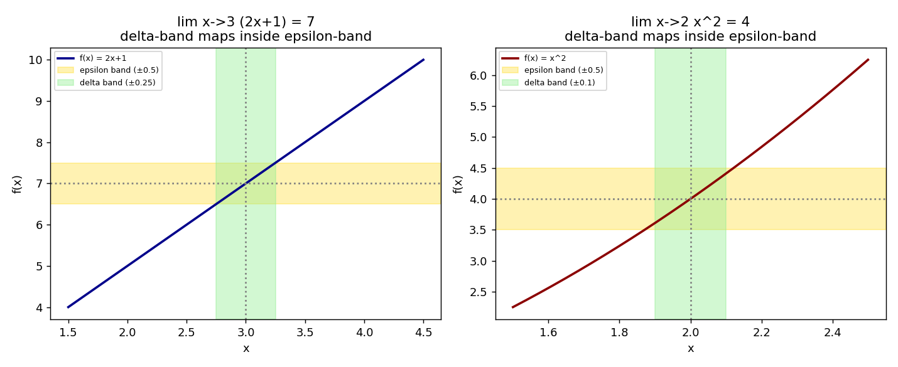

# Stage 5, Lesson 5.3 — The Limit, Formal (ε–δ)

**Threads:** Math, CS
**Estimated time:** 60–75 minutes

---

## What This Lesson Is About

Lesson 5.2 defined a limit as "$f(x)$ gets arbitrarily close to $L$ as $x$ gets arbitrarily close to $a$." That phrase did real computational work for two centuries, but it has a problem: "arbitrarily close" is not a mathematical statement, it's a feeling. You cannot plug "arbitrarily close" into a proof. This lesson replaces that feeling with an exact, checkable inequality — the **epsilon–delta ($\epsilon$–$\delta$) definition of a limit** — the same definition every rigorous calculus proof from this point forward is built on. The goal here isn't to change *how* you compute limits (Lesson 5.2's techniques still work fine for that); it's to make the word "limit" precise enough to prove things about, rather than just compute with.

---

## Historical Context

For roughly 150 years after Newton and Leibniz, mathematicians used limits productively but imprecisely, occasionally running into genuine contradictions because "infinitely small quantity" was never pinned down. Augustin-Louis Cauchy took the first serious steps toward rigor in 1821, describing limits using inequalities rather than intuition — but it was Karl Weierstrass, in his lectures at the University of Berlin in the 1850s–1861, who finalized the precise $\epsilon$–$\delta$ formulation still used today, finally closing the loopholes that had allowed subtly incorrect "proofs" to circulate for a century.

---

## What You Need To Know First

- **The informal limit and limit laws** (Lesson 5.2): the intuition this lesson is making precise.
- **Absolute value as distance**: $|x - a|$ measures the distance between $x$ and $a$ on the number line; you'll use this constantly below.
- **Solving linear and simple quadratic inequalities**: needed to isolate $\delta$ in terms of $\epsilon$.

---

## The Lesson

### The ε–δ Definition

**The problem.** We need a way to say "$f(x)$ gets close to $L$ as $x$ gets close to $a$" using only inequalities — numbers you can actually check — with no appeal to intuition about "closeness."

**Formal definition.** We say
$$\lim_{x\to a} f(x) = L$$
if for **every** number $\epsilon > 0$ (no matter how small), there **exists** a number $\delta > 0$ such that
$$0 < |x - a| < \delta \quad \implies \quad |f(x) - L| < \epsilon$$

Read this as a challenge-and-response game: someone hands you a tolerance $\epsilon$ for how close to $L$ they demand $f(x)$ to be — and no matter how absurdly small a tolerance they pick, you must be able to hand back a distance $\delta$ from $a$ that guarantees it. The limit exists exactly when you can win this game for *every* $\epsilon$ someone could throw at you, not just some of them.

**Geometric picture.** Draw a thin horizontal band of height $2\epsilon$ centered on $L$ (the "epsilon band"). Your job is to find a thin vertical band of width $2\delta$ centered on $a$ (the "delta band") narrow enough that the entire piece of the graph inside the vertical band also lands inside the horizontal band — except possibly the single point directly above $a$ itself, which is exactly what $0 < |x-a|$ (strict inequality) excludes.

**CS lens.** This definition has the exact shape of a formal correctness proof with a universally-quantified adversary: "for all $\epsilon$ (however small an adversary picks), there exists a $\delta$ (that you must construct) such that a guarantee holds." This "for all ... there exists ..." structure is identical to how formal verification tools state and check correctness properties of programs — you are not just observing behavior, you are constructing a certificate that works against every possible challenge.

---

### Proving a Limit Rigorously

**The idea.** To prove $\lim_{x\to a} f(x) = L$ using the definition, you don't get to just observe a table of values getting close (that was Lesson 5.2) — you must produce an explicit formula for $\delta$ *in terms of* $\epsilon$, and then show algebraically that your formula works for every possible $\epsilon > 0$.

#### Hand-Worked Example — A Linear Function

We will prove $\lim_{x\to 3}(2x+1) = 7$ using the $\epsilon$–$\delta$ definition.

**Step 1 — state the goal.** Given any $\epsilon > 0$, we must find a $\delta > 0$ such that $0<|x-3|<\delta \implies |(2x+1)-7|<\epsilon$.

**Step 2 — work backward from the conclusion (scratch work).** Simplify the target inequality:
$$|(2x+1)-7| = |2x - 6| = 2|x-3|$$
We want $2|x-3| < \epsilon$, which means $|x-3| < \frac{\epsilon}{2}$.

**Step 3 — choose $\delta$.** The scratch work tells us exactly what to pick: let $\delta = \dfrac{\epsilon}{2}$.

**Step 4 — write the forward proof, using the chosen $\delta$.** Suppose $0 < |x-3| < \delta = \frac{\epsilon}{2}$. Then:
$$|(2x+1)-7| = 2|x-3| < 2\cdot\frac{\epsilon}{2} = \epsilon$$
which is exactly what needed to be shown.

**Step 5 — verify numerically.** The code block below picks several concrete values of $\epsilon$, computes $\delta=\epsilon/2$ for each, samples 2000 random points inside that $\delta$-band, and confirms every single one satisfies $|f(x)-L|<\epsilon$.

**Step 6 — generalize.** For *any* linear function $f(x) = mx+b$, the same scratch-work pattern gives $\delta = \epsilon / |m|$ — the steeper the line, the smaller a $\delta$-band you need for a given $\epsilon$-band, which matches the geometric picture directly.

#### Hand-Worked Example — A Quadratic Function (the "restrict $\delta$" trick)

We will prove $\lim_{x\to 2} x^2 = 4$.

**Step 1 — state the goal.** Given $\epsilon > 0$, find $\delta > 0$ such that $0<|x-2|<\delta \implies |x^2-4|<\epsilon$.

**Step 2 — scratch work: factor the target expression.**
$$|x^2 - 4| = |(x-2)(x+2)| = |x-2|\cdot|x+2|$$
Unlike the linear case, this has *two* factors depending on $x$ — we need to control the size of $|x+2|$ too, not just $|x-2|$.

**Step 3 — the key trick: restrict $\delta$ to at most $1$ first.** Suppose we agree in advance that $\delta \leq 1$. Then $|x-2|<\delta\leq 1$ means $1 < x < 3$, so $3 < x+2 < 5$, which gives $|x+2| < 5$.

**Step 4 — combine the bounds.** With that restriction in place:
$$|x^2-4| = |x-2|\cdot|x+2| < |x-2|\cdot 5$$
We want this less than $\epsilon$, i.e. $|x-2| < \epsilon/5$.

**Step 5 — choose $\delta$.** We need *both* restrictions to hold simultaneously — the "$\delta\leq 1$" restriction from Step 3, and the "$|x-2|<\epsilon/5$" requirement from Step 4. Take the smaller of the two:
$$\delta = \min\left(1, \frac{\epsilon}{5}\right)$$

**Step 6 — write the forward proof.** Suppose $0<|x-2|<\delta$. Since $\delta \leq 1$, Step 3's bound $|x+2|<5$ applies, so:
$$|x^2-4| = |x-2|\cdot|x+2| < \delta \cdot 5 \leq \frac{\epsilon}{5}\cdot 5 = \epsilon$$
exactly as required.

**Step 7 — verify numerically.** Confirmed in the code block below for $\epsilon = 1, 0.1, 0.01, 0.001$.

**Step 8 — generalize.** The "restrict $\delta \leq 1$ (or any convenient number) first" trick is standard whenever the target expression, after factoring, has more than one $x$-dependent factor — it turns an unbounded factor like $|x+2|$ into a fixed numerical bound you can fold into the final formula for $\delta$.

---

### Code — Verifying Both Proofs by Sampling

**Purpose.** For each hand-worked $\delta$-formula, sample many random points inside the resulting $\delta$-band and confirm every single one actually satisfies the corresponding $\epsilon$-bound — turning the algebraic proof into a checkable numerical guarantee.

```python
import numpy as np

def f1(x):
    return 2*x + 1

a1, L1 = 3, 7
print("Example 1: lim x->3 (2x+1) = 7")
for eps in [1.0, 0.1, 0.01, 0.001]:
    delta = eps / 2
    rng = np.random.default_rng(0)
    xs = a1 + rng.uniform(-delta, delta, 2000)
    xs = xs[xs != a1]
    max_diff = np.max(np.abs(f1(xs) - L1))
    print(f"  eps={eps:<7} delta=eps/2={delta:<8} "
          f"max|f(x)-L| = {max_diff:.6f}  (< eps: {max_diff < eps})")

def f2(x):
    return x**2

a2, L2 = 2, 4
print("\nExample 2: lim x->2 x^2 = 4")
for eps in [1.0, 0.1, 0.01, 0.001]:
    delta = min(1, eps / 5)
    rng = np.random.default_rng(1)
    xs = a2 + rng.uniform(-delta, delta, 2000)
    xs = xs[xs != a2]
    max_diff = np.max(np.abs(f2(xs) - L2))
    print(f"  eps={eps:<7} delta=min(1,eps/5)={delta:<8} "
          f"max|f(x)-L| = {max_diff:.6f}  (< eps: {max_diff < eps})")
```

**Real output, this session:**
```
Example 1: lim x->3 (2x+1) = 7
  eps=1.0     delta=eps/2=0.5      max|f(x)-L| = 0.999620  (< eps: True)
  eps=0.1     delta=eps/2=0.05     max|f(x)-L| = 0.099962  (< eps: True)
  eps=0.01    delta=eps/2=0.005    max|f(x)-L| = 0.009996  (< eps: True)
  eps=0.001   delta=eps/2=0.0005   max|f(x)-L| = 0.001000  (< eps: True)

Example 2: lim x->2 x^2 = 4
  eps=1.0     delta=min(1,eps/5)=0.2      max|f(x)-L| = 0.839632  (< eps: True)
  eps=0.1     delta=min(1,eps/5)=0.02     max|f(x)-L| = 0.080366  (< eps: True)
  eps=0.01    delta=min(1,eps/5)=0.002    max|f(x)-L| = 0.008001  (< eps: True)
  eps=0.001   delta=min(1,eps/5)=0.0002   max|f(x)-L| = 0.000800  (< eps: True)
```



**Walkthrough.** For each $\epsilon$, the code computes the $\delta$ your hand-worked formula predicts, draws 2000 random $x$-values from inside that $\delta$-band (excluding $a$ itself, matching the strict `0 < |x-a|` in the definition), and reports the *worst* (maximum) resulting $|f(x)-L|$ across all of them. Every single row confirms `max|f(x)-L| < eps` — meaning the algebraic proof isn't just correct in principle, it holds up against thousands of concrete adversarial choices of $x$. As $\epsilon$ shrinks by a factor of 10 each row, notice $\delta$ shrinks proportionally too (exactly by a factor of 10 in Example 1, since $\delta=\epsilon/2$ is a straight proportion) — a direct numerical echo of the formula derived by hand.

**Connection.** The figure's colored bands are literally the epsilon-band and delta-band from the Geometric Picture above, drawn to scale for a specific $\epsilon$ in each example — you can see visually that the entire piece of each curve inside the green delta-band also sits inside the gold epsilon-band, which is exactly what the algebra in both hand-worked proofs guarantees for every $\epsilon$, not just the one pictured.

---

## Connect the Pieces

This lesson takes the informal "gets arbitrarily close" language from Lesson 5.2 and replaces it with the precise inequality that has defined "limit" ever since Weierstrass — every proof involving limits, derivatives, or integrals for the remainder of this curriculum ultimately rests on this definition, even when a proof doesn't spell out the $\epsilon$–$\delta$ argument explicitly. It also gives you your first real practice with the "for all ... there exists ..." proof pattern that reappears throughout upper mathematics (and, as flagged above, in formal software verification). Lesson 5.4 (Continuity) will reuse this exact definition, adding the single extra requirement that $f(a)$ must actually equal $L$ — turning a limit statement into a statement about the function having no hole or jump at all.

---

## Summary

- $\lim_{x\to a}f(x)=L$ means: for every $\epsilon>0$, there exists a $\delta>0$ such that $0<|x-a|<\delta \implies |f(x)-L|<\epsilon$.
- To prove a limit rigorously, do **scratch work** first (simplify $|f(x)-L|$ in terms of $|x-a|$), then choose $\delta$ as a formula in $\epsilon$, then write the forward proof using that $\delta$.
- For **linear functions**, $\delta = \epsilon/|m|$ (the slope) is enough on its own.
- For functions with **more than one $x$-dependent factor** after simplifying (like quadratics), first restrict $\delta \leq$ some fixed number (commonly $1$) to bound the extra factor, then combine that bound with the $\epsilon$ requirement using a minimum.

---

## Problems

### Computation

1. Use the $\epsilon$–$\delta$ definition to find a formula for $\delta$ (in terms of $\epsilon$) proving $\lim_{x\to 5}(3x-2)=13$.
2. Using the restrict-$\delta\leq 1$ trick, find a formula for $\delta$ proving $\lim_{x\to 1}(x^2+1) = 2$.

*Answers: (1) $|(3x-2)-13|=3|x-5|<\epsilon \Rightarrow \delta=\epsilon/3$. (2) $|x^2+1-2|=|x-1||x+1|$; restrict $\delta\le 1 \Rightarrow 0<x<2 \Rightarrow |x+1|<3$; need $3|x-1|<\epsilon \Rightarrow \delta=\min(1,\epsilon/3)$.*

### Understanding

3. Explain, in your own words, why the definition requires $0 < |x-a|$ (strictly greater than zero) rather than just $|x-a| < \delta$. What would go wrong with the definition of a limit at a removable hole, like Lesson 5.2's $\frac{x^2-4}{x-2}$ at $x=2$, if this strict inequality were dropped?

### Proof

4. Prove, using the $\epsilon$–$\delta$ definition, that $\lim_{x\to a} c = c$ for any constant function $f(x)=c$. (This should be the shortest proof in this lesson — think about what $|f(x)-L|$ actually equals here.)

### Extension ★

5. ★ The definition says "there exists a $\delta$" — it does not say the $\delta$ you find has to be the *largest possible* one that works. Explain why, if $\delta_0$ is a valid choice for a given $\epsilon$, then any smaller positive $\delta_1 < \delta_0$ is also automatically valid for that same $\epsilon$ — and why this fact justifies the "restrict $\delta \leq 1$" trick used in the quadratic example, where we deliberately threw away larger, possibly-valid choices of $\delta$.
