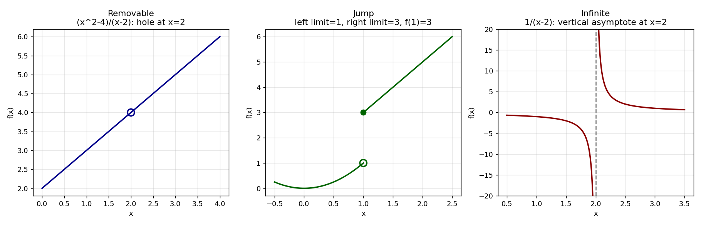

# Stage 5, Lesson 5.4 — Continuity

**Threads:** Math · Physics · CS
**Estimated time:** 60–75 minutes

---

## What This Lesson Is About

Lesson 5.2 met a function with a "hole" — $\frac{x^2-4}{x-2}$ had a perfectly good limit at $x=2$ even though the function wasn't defined there. That gap between "the limit exists" and "the function actually reaches that value" is exactly what this lesson is about. A function is **continuous** at a point when there is no gap at all — the graph can be drawn through that point without lifting your pen. This lesson reuses the $\epsilon$–$\delta$ machinery from Lesson 5.3 almost unchanged, and gives you a vocabulary — removable, jump, infinite — for classifying exactly *how* a function can fail to be continuous.

---

## Historical Context

Bernard Bolzano gave one of the first rigorous definitions of continuity in 1817, in a paper whose actual goal was to prove the Intermediate Value Theorem (the subject of the next lesson) — he needed a precise notion of "unbroken" curve before he could prove such a curve must cross every height between its endpoints. Bolzano's work was largely overlooked for decades; Cauchy independently published a similar continuity definition in 1821. It was only later, once Weierstrass supplied the full $\epsilon$–$\delta$ apparatus (Lesson 5.3), that continuity took the exact form used in this lesson.

---

## What You Need To Know First

- **The $\epsilon$–$\delta$ definition of a limit** (Lesson 5.3) — continuity is that same definition, with one small addition.
- **Removable discontinuities** from limit examples (Lesson 5.2) — you've already met one example without the vocabulary to name it.
- **Piecewise-defined functions** — reading a function defined by different formulas on different intervals.

---

## The Lesson

### The Definition of Continuity

**Formal definition.** $f$ is **continuous at $x=a$** if all three hold:
1. $f(a)$ is defined,
2. $\lim_{x\to a}f(x)$ exists,
3. $\lim_{x\to a}f(x) = f(a)$.

Equivalently, in $\epsilon$–$\delta$ language: for every $\epsilon>0$, there's $\delta>0$ such that
$$|x-a|<\delta \implies |f(x)-f(a)|<\epsilon$$
Notice there's no need for the strict $0<|x-a|$ restriction anymore — when $x=a$ exactly, $|f(a)-f(a)|=0<\epsilon$ trivially, so continuity is allowed (and required) to include the point itself.

**Physical lens.** Almost every physically measured quantity — position over time, temperature, pressure — is continuous, because physical processes don't teleport: a position can't jump from one value to another without passing through everything in between. This is precisely the intuition Bolzano and Cauchy were formalizing, and it's what makes the Intermediate Value Theorem (Lesson 5.5) physically meaningful, not just a mathematical curiosity.

```python
import numpy as np

def f_cont(x):
    return x**2 + 1

a, L = 2, 5
print("Continuity check: f(x) = x^2+1 at x=2")
for eps in [1.0, 0.1, 0.01, 0.001]:
    delta = min(1, eps / 5)
    rng = np.random.default_rng(2)
    xs = a + rng.uniform(-delta, delta, 2000)  # x = a is allowed here
    max_diff = np.max(np.abs(f_cont(xs) - L))
    print(f"  eps={eps:<7} delta={delta:<8} max|f(x)-L|={max_diff:.6f}  (< eps: {max_diff < eps})")
```

**Real output, this session:**
```
Continuity check: f(x) = x^2+1 at x=2
  eps=1.0     delta=0.2      max|f(x)-L|=0.839926  (< eps: True)
  eps=0.1     delta=0.02     max|f(x)-L|=0.080393  (< eps: True)
  eps=0.01    delta=0.002    max|f(x)-L|=0.008003  (< eps: True)
  eps=0.001   delta=0.0002   max|f(x)-L|=0.000800  (< eps: True)
```

**Walkthrough.** This reuses Lesson 5.3's exact sampling technique, but now `x = a` is allowed among the sampled points (unlike 5.3, where it was excluded) — fine here precisely because continuity guarantees $f$ behaves consistently *including* at the point itself.

---

### Classifying Discontinuities

**The three types:**

- **Removable:** the two-sided limit exists, but $f(a)$ is undefined or doesn't match it — a single "hole" patchable by (re)defining $f(a)$.
- **Jump:** the left- and right-hand limits both exist individually, but disagree with each other.
- **Infinite (essential):** the function grows without bound on one or both sides — a vertical asymptote, no finite limit at all.

#### Hand-Worked Example — Classifying a Jump Discontinuity

We will classify the discontinuity of
$$f(x) = \begin{cases} x^2 & x<1 \\ 3 & x=1 \\ 2x+1 & x>1\end{cases}$$
at $x=1$.

**Step 1 — check $f(1)$.** Defined: $f(1)=3$.

**Step 2 — left-hand limit.** $\lim_{x\to1^-}x^2=1$.

**Step 3 — right-hand limit.** $\lim_{x\to1^+}(2x+1)=3$.

**Step 4 — compare.** Left is $1$, right is $3$ — they **disagree**, so $\lim_{x\to1}f(x)$ doesn't exist, regardless of $f(1)$.

**Step 5 — classify.** Both one-sided limits exist individually but disagree — a **jump discontinuity**. No redefinition of $f(1)$ could ever patch it.

**Step 6 — generalize.** To classify any discontinuity: check both one-sided limits exist and are finite; if they disagree, it's a jump; if they agree with each other but not $f(a)$, it's removable; if either is infinite, it's an infinite discontinuity.

```python
def f_jump(x):
    if x < 1:
        return x**2
    elif x == 1:
        return 3
    else:
        return 2*x + 1

print("Jump discontinuity: approaching x=1")
print("From the left:", [f_jump(x) for x in [0.9, 0.99, 0.999]])
print("From the right:", [f_jump(x) for x in [1.1, 1.01, 1.001]])
print("f(1) =", f_jump(1))

def f_inf(x):
    return 1 / (x - 2)

print("\nInfinite discontinuity: approaching x=2")
print("From the left:", [f_inf(x) for x in [1.9, 1.99, 1.999]])
print("From the right:", [f_inf(x) for x in [2.1, 2.01, 2.001]])
```

**Real output, this session:**
```
Jump discontinuity: approaching x=1
From the left: [0.81, 0.9801, 0.998001]
From the right: [3.2, 3.02, 3.002]
f(1) = 3

Infinite discontinuity: approaching x=2
From the left: [-9.999999999999991, -99.99999999999991, -1000.0000000001102]
From the right: [9.999999999999991, 100.00000000000213, 1000.0000000001102]
```

**Walkthrough.** The jump table shows left values climbing toward `1` and right values toward `3` — two different destinations, confirming Step 4. The infinite-discontinuity table races off toward `-1000` and `+1000` as `x` gets merely three decimal places closer to `2` — no finite limit exists at all, unlike the jump case where both sides at least *settle* somewhere.



**Walkthrough.** The removable panel has one clean open circle (a single patchable hole); the jump panel shows the graph at two different heights on either side of $x=1$; the infinite panel never levels off as it approaches the dashed asymptote.

---

## Connect the Pieces

**What this lesson built on:** The $\epsilon$–$\delta$ definition of a limit (Lesson 5.3) — continuity adds exactly one condition to it. The removable-hole example first seen in Lesson 5.2.

**What this lesson makes possible:** Lesson 5.5's Intermediate Value Theorem requires continuity specifically — a jump discontinuity could let a function skip over a height entirely without ever reaching it. Later, differentiability (Lesson 5.6) will require continuity as a prerequisite: every differentiable function is continuous, though not every continuous function is differentiable.

**In CS:** A function implemented in code that returns `NaN`, throws an exception, or silently branches to a wildly different value near a boundary condition is a real-world discontinuity — the same classification vocabulary (removable/jump/infinite) is useful for diagnosing why a numerical algorithm misbehaves near a specific input.

---

## Summary

- $f$ is **continuous at $a$** if $f(a)$ is defined, $\lim_{x\to a}f(x)$ exists, and the two are equal.
- In $\epsilon$–$\delta$ form: for every $\epsilon>0$, $|x-a|<\delta\implies|f(x)-f(a)|<\epsilon$ — no need to exclude $x=a$.
- **Removable:** limit exists, doesn't match (or exist for) $f(a)$.
- **Jump:** one-sided limits both exist but disagree.
- **Infinite:** at least one one-sided limit is infinite.

**New Python:**
- `try/except (ZeroDivisionError, ValueError)` — catching an undefined function value at a specific point, used to detect "$f(a)$ not defined" programmatically.
- List comprehensions over a list of test points, `[f(x) for x in [...]]`, for compact one-sided-limit tables.

---

## Problems

### Math

**1.** Classify the discontinuity of $f(x)=\dfrac1{(x-3)^2}$ at $x=3$.

**2.** Classify the discontinuity of $g(x)=\begin{cases}x+1 & x\leq0\\x-1 & x>0\end{cases}$ at $x=0$.

**3.** Is $h(x)=\dfrac{x^2-1}{x-1}$ (with $h(1)$ undefined) continuous at $x=1$? If not, what type, and how would you patch it?

<details>
<summary>Answers</summary>

1. Both sides go to $+\infty$ — infinite discontinuity.
2. Left limit $=1$, right limit $=-1$ — jump discontinuity.
3. Not continuous ($h(1)$ undefined); the limit exists and equals $2$ (factor and cancel) — removable; patch by defining $h(1)=2$.

</details>

---

**4.** A student claims: "If $f(a)$ is defined and $\lim_{x\to a}f(x)$ exists, then $f$ must be continuous at $a$." Give a specific counterexample.

<details>
<summary>Answer</summary>

Let $f(x)=x^2$ for $x\neq2$, but define $f(2)=100$ directly. Then $f(2)$ is defined, and $\lim_{x\to2}f(x)=4$ exists — but $4\neq100=f(2)$, so $f$ is *not* continuous at $2$. This shows conditions 1 and 2 together still aren't enough — condition 3 (the limit must equal $f(a)$) is doing real work.

</details>

---

**5.** (Proof) Prove that $f(x)=3x-7$ is continuous at every real number $a$, using the $\epsilon$–$\delta$ definition.

<details>
<summary>Answer</summary>

Given $\epsilon>0$, choose $\delta=\epsilon/3$. Then for $|x-a|<\delta$: $|f(x)-f(a)|=|(3x-7)-(3a-7)|=3|x-a|<3\cdot\frac\epsilon3=\epsilon$. Since $a$ was arbitrary, this holds at every real number. $\blacksquare$

</details>

---

### Code Challenges

**Challenge 1 — Discontinuity classifier**

```python
def classify_discontinuity(f, a, h=1e-6):
    """
    Classify f's behavior at x=a as one of:
    "continuous", "removable", "jump", or "infinite".
    Use f(a-h) and f(a+h) to estimate one-sided limits,
    and try/except to detect whether f(a) itself is defined.
    """
    pass  # your code here


# --- tests: do not modify ---
def f_cont(x): return x**2 + 1
def f_hole(x): return (x**2 - 4) / (x - 2)
def f_jump(x): return x**2 if x < 1 else (3 if x == 1 else 2*x + 1)
def f_inf(x): return 1 / (x - 2)

assert classify_discontinuity(f_cont, 2) == "continuous"
assert classify_discontinuity(f_hole, 2) == "removable"
assert classify_discontinuity(f_jump, 1) == "jump"
assert classify_discontinuity(f_inf, 2) == "infinite"

print("✓ Challenge 1 passed!")
```

---

**Challenge 2 — Continuity verifier by search**

```python
import numpy as np

def is_continuous_at(f, a, eps, delta_max=1.0, steps=2000):
    """
    Search for a delta in (0, delta_max] such that |x-a|<delta
    implies |f(x)-f(a)| < eps. Return True if found, False if
    f(a) is undefined or no delta in range works.
    """
    pass  # your code here


# --- tests: do not modify ---
def f_cont(x): return x**2 + 1
def f_inf(x): return 1 / (x - 2)

assert is_continuous_at(f_cont, 2, 0.1) == True
assert is_continuous_at(f_inf, 2, 0.1) == False

print("✓ Challenge 2 passed!")
```

<details>
<summary>Hint</summary>

Compute `fa = f(a)` inside a `try/except` first — if it raises, return `False` immediately. Otherwise search deltas from large to small (as in Lesson 5.3's `find_delta`) and check `np.all(np.abs(f(xs) - fa) < eps)` over a fine grid inside each candidate delta.

</details>

---

### Extension

**6. ★** A function can be discontinuous at *every single point* of its domain — the Dirichlet function, $D(x)=1$ if $x$ is rational and $0$ if $x$ is irrational. Explain, using the definition of continuity, why no $\delta>0$ can ever work at any point $a$, no matter how small $\epsilon$ is chosen. (Hint: no matter how small an interval around $a$ you pick, it contains both rational and irrational numbers.)
