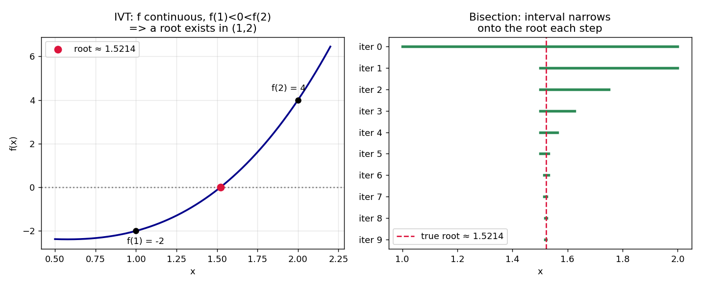

# Stage 5, Lesson 5.5 — The Intermediate Value Theorem

**Threads:** Math, CS
**Estimated time:** 45–60 minutes

---

## What This Lesson Is About

This lesson turns the everyday intuition "a continuous curve can't skip over a value" into a precise, provable theorem — the **Intermediate Value Theorem (IVT)** — and then turns that theorem into an actual algorithm for finding roots of equations you cannot solve by hand. This closes out Chapter 5A: limits (5.2, 5.3) told you what "approaching a value" means, and continuity (5.4) told you when a function has no holes or jumps; the IVT is the first real payoff of having both ideas in hand — a guarantee, with a proof behind it, that a solution exists, even before you've found it.

---

## Historical Context

Bernard Bolzano's 1817 paper had a very specific goal: prove that a continuous function taking a negative value at one point and a positive value at another must equal zero somewhere in between, without relying on a hand-wavy appeal to "you can see it on the graph." That paper's rigorous definition of continuity (Lesson 5.4) existed specifically to make this proof possible — the IVT and the modern definition of continuity were born together, in the same document, for the same purpose.

---

## What You Need To Know First

- **Continuity at a point and on an interval** (Lesson 5.4): the IVT's single hypothesis.
- **Reading function values and sign** (positive vs. negative output): the core tool used to locate a root.
- **Basic function evaluation for polynomials**: needed to check sign changes at specific points.

---

## The Lesson

### The Intermediate Value Theorem

**The problem.** If a continuous function is negative at one point and positive at another, does it have to pass through exactly zero somewhere in between — or could it somehow skip over zero entirely?

**Formal definition.** If $f$ is continuous on the closed interval $[a,b]$, and $N$ is any number between $f(a)$ and $f(b)$ (inclusive of the case $f(a) > N > f(b)$ or $f(a) < N < f(b)$), then there exists at least one $c \in [a,b]$ such that
$$f(c) = N$$

The most common special case, used constantly in practice, takes $N=0$: if $f(a)$ and $f(b)$ have opposite signs, then $f$ has a root (a zero) somewhere in $(a,b)$.

**Geometric picture.** Draw any unbroken curve from the point $(a, f(a))$ to the point $(b, f(b))$. Pick any horizontal line at height $N$ strictly between $f(a)$ and $f(b)$. Because the curve has no holes or jumps (that's exactly what continuity guarantees, from Lesson 5.4), it is physically forced to cross that horizontal line at least once on its way from one endpoint to the other — it cannot teleport past it.

**CS lens.** The IVT is not just an existence statement — it directly justifies an algorithm. If $f(a)$ and $f(b)$ have opposite signs, check the sign of $f$ at the midpoint $m=\frac{a+b}{2}$. Whichever half of $[a,b]$ still has a sign change at its endpoints must, by the IVT applied again, still contain a root — so throw away the other half and repeat. This is the **bisection method**, and it is the most direct possible translation of a pure-existence theorem into a working piece of code.

---

### Hand-Worked Example — Proving a Root Exists, Then Finding It by Bisection

We will show $f(x) = x^3 - x - 2$ has a root between $x=1$ and $x=2$, then locate it.

**Step 1 — check continuity.** $f$ is a polynomial, and polynomials are continuous everywhere (a consequence of the Limit Laws in Lesson 5.2 applied to sums and products) — so the IVT's hypothesis is satisfied on any interval, including $[1,2]$.

**Step 2 — evaluate the endpoints.**
$$f(1) = 1 - 1 - 2 = -2, \qquad f(2) = 8 - 2 - 2 = 4$$

**Step 3 — apply the IVT.** Since $f$ is continuous on $[1,2]$ and $f(1)=-2 < 0 < 4 = f(2)$, the IVT guarantees some $c\in(1,2)$ with $f(c)=0$ — **a root exists**, guaranteed, before we've done any further work to find it.

**Step 4 — begin bisection to actually locate it.** Midpoint of $[1,2]$ is $m=1.5$: $f(1.5) = 3.375 - 1.5 - 2 = -0.125$, which is negative — same sign as $f(1)$. So the root must be in $[1.5, 2]$ (the half where the sign still changes), and we discard $[1, 1.5]$.

**Step 5 — repeat.** Midpoint of $[1.5,2]$ is $1.75$: $f(1.75)\approx1.609$, positive — same sign as $f(2)$. Root is in $[1.5, 1.75]$.

**Step 6 — repeat again.** Midpoint of $[1.5,1.75]$ is $1.625$: $f(1.625)\approx0.666$, positive. Root is in $[1.5, 1.625]$.

**Step 7 — narrate the pattern.** Each step cuts the interval containing the root exactly in half — after $n$ steps, the interval has width $\frac{b-a}{2^n}$, shrinking toward a single point no matter how the function behaves in between, as long as continuity holds.

**Step 8 — verify with more iterations.** The code block below runs 10 iterations and compares the result to a reference root-finder.

---

### Code — Running Bisection to Convergence

**Purpose.** Continue the hand-worked bisection past Step 6 automatically, and check the result against NumPy's polynomial root finder.

```python
import numpy as np

def f(x):
    return x**3 - x - 2

a, b = 1, 2
print(f"{'iter':<5}{'a':<10}{'b':<10}{'mid':<10}{'f(mid)':<12}")
for i in range(10):
    mid = (a + b) / 2
    fm = f(mid)
    if fm < 0:
        a = mid
    else:
        b = mid
    print(f"{i+1:<5}{a:<10.6f}{b:<10.6f}{mid:<10.6f}{fm:<12.6f}")

print("\nMidpoint estimate after 10 iterations:", (a + b) / 2)

roots = np.roots([1, 0, -1, -2])
real_root = [r.real for r in roots if abs(r.imag) < 1e-9][0]
print("Reference root (numpy.roots):", real_root)
```

**Real output, this session:**
```
iter a         b         mid       f(mid)
1    1.500000  2.000000  1.500000  -0.125000
2    1.500000  1.750000  1.750000  1.609375
3    1.500000  1.625000  1.625000  0.666016
4    1.500000  1.562500  1.562500  0.252197
5    1.500000  1.531250  1.531250  0.059113
6    1.515625  1.531250  1.515625  -0.034054
7    1.515625  1.523438  1.523438  0.012250
8    1.519531  1.523438  1.519531  -0.010971
9    1.519531  1.521484  1.521484  0.000622
10   1.520508  1.521484  1.520508  -0.005179

Midpoint estimate after 10 iterations: 1.52099609375
Reference root (numpy.roots): 1.5213797068045682
```



**Walkthrough.** Each loop iteration reproduces exactly one hand-worked step: compute the midpoint, check the sign of $f$ there, and keep whichever half still brackets a sign change (if `fm < 0`, the root is still to the right, so move `a` up to `mid`; otherwise move `b` down to `mid`). After only 10 iterations, the estimate `1.52099...` already agrees with the reference root `1.52137...` to two decimal places — and the interval width has shrunk from $1$ down to $\frac{1}{2^{10}} \approx 0.001$, matching Step 7's prediction exactly.

**Connection.** The left panel is the IVT's geometric picture made concrete for this specific function — the curve has no choice but to cross zero between the two marked endpoints. The right panel is Steps 4–6 of the hand-worked example continued automatically: each green bar is one iteration's surviving interval, visibly tightening around the true root (the dashed red line) exactly the way the numeric table shows.

---

## Connect the Pieces

This lesson is where continuity (Lesson 5.4) stops being just a classification tool and starts proving that solutions exist — the entire bisection algorithm above is nothing more than the IVT applied repeatedly, at a smaller and smaller scale, until the bracketing interval is as tight as you need. This closes Chapter 5A. Chapter 5B picks up with the derivative (Lesson 5.6), and eventually reaches Newton's Method (Lesson 5.17) — a *faster* root-finding algorithm than bisection that uses derivative information (the tangent line) instead of just a sign check, at the cost of needing a differentiable function rather than merely a continuous one. Comparing the two once you reach 5.17 is worth doing explicitly: bisection is slower but bulletproof (it only ever needs continuity), while Newton's Method is faster but can fail if the tangent line points the wrong way.

---

## Summary

- **IVT:** if $f$ is continuous on $[a,b]$ and $N$ lies between $f(a)$ and $f(b)$, some $c\in[a,b]$ has $f(c)=N$ — most commonly used with $N=0$ to guarantee a root when $f(a)$ and $f(b)$ have opposite signs.
- The IVT is an **existence** theorem — it guarantees a root exists but does not by itself tell you where.
- **Bisection method:** repeatedly halve an interval known to contain a sign change, keeping whichever half still has one; the interval width shrinks by a factor of $2$ every iteration, converging to a root.
- Bisection only requires continuity — no derivative or formula for the root is needed.

---

## Problems

### Computation

1. Show that $f(x) = \cos(x) - x$ has a root in $[0, 1]$, using the IVT.
2. Starting from $[0,1]$ for the function in Problem 1, compute the first two bisection midpoints and determine which half-interval survives each time. ($f(0)=1$, $f(1)=\cos(1)-1\approx-0.460$.)
3. Does the IVT guarantee $f(x)=x^2$ has a root in $[-1, 2]$? Check the hypothesis carefully before answering.

*Answers: (1) $f(0)=1>0$, $f(1)=\cos(1)-1\approx-0.460<0$; $f$ continuous, sign change ⟹ root exists by IVT. (2) midpoint $0.5$: $f(0.5)=\cos(0.5)-0.5\approx0.378>0$, same sign as $f(0)$, so root is in $[0.5,1]$; next midpoint $0.75$: $f(0.75)\approx-0.018<0$, so root is in $[0.5,0.75]$. (3) No guarantee needed to invoke IVT for a root here at all — $f(-1)=1>0$ and $f(2)=4>0$ are the *same* sign, so the IVT's hypothesis (opposite signs) simply isn't met; note this doesn't prove no root exists, only that this particular application of the theorem is inconclusive.*

### Understanding

4. Explain why the IVT would fail for a *discontinuous* function, using a specific example of a function with $f(a)<0<f(b)$ but no root in between.

### Proof

5. Use the IVT to prove that every positive real number $k$ has a square root — that is, show $f(x)=x^2-k$ has a root for suitable endpoints $a$ and $b$ that you choose (in terms of $k$).

### Extension ★

6. ★ Bisection always halves the interval, regardless of where the actual root sits within it. A variant called the **False Position (Regula Falsi) method** instead draws a straight line between $(a,f(a))$ and $(b,f(b))$ and uses where that line crosses zero as the next estimate, rather than the plain midpoint. Write down a formula for this crossing point in terms of $a$, $b$, $f(a)$, and $f(b)$, and explain intuitively why it might converge faster than bisection when the function is close to linear near the root — but why it can still rely on the same IVT sign-change guarantee to know which sub-interval to keep.
