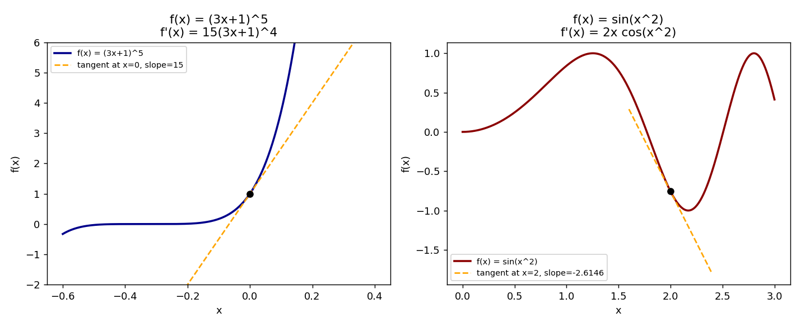

# Stage 5, Lesson 5.9 — The Chain Rule

**Threads:** Math, Physics
**Estimated time:** 60–75 minutes

---

## What This Lesson Is About

Lesson 5.7 gave you differentiation rules for sums, products, and quotients — but all of those rules assume you already know how to differentiate each individual piece directly. What happens when a function is built by *feeding one function into another* — a composite function like $\sin(x^2)$, where you first square $x$ and then take the sine of the result? None of the previous rules handle this directly. The **Chain Rule** is the missing piece: it tells you how to differentiate a composite function by multiplying together the rates of change of each stage in the chain. This is arguably the single most-used differentiation rule in all of applied mathematics, because almost every real quantity you'll differentiate — a position that depends on an angle that depends on time, a temperature that depends on a position that depends on time — is a chain of two or more functions, not just one.

---

## Historical Context

Gottfried Leibniz worked out an early version of the chain rule in a 1676 manuscript, differentiating a composite expression using his differential notation — writing $dy$ in terms of $du$ and $du$ in terms of $dx$, then combining them, exactly the notation still used below. Leibniz didn't yet have a fully general statement or proof of the rule; that came later as Euler, Lagrange, and eventually Cauchy formalized differentiation over the following century. But the core idea — that rates of change occurring in sequence should multiply together — was already visible in Leibniz's own notebook, in the same $\frac{dy}{du}\cdot\frac{du}{dx}$ form you'll use in this lesson.

---

## What You Need To Know First

- **Composition of functions** (Lesson 0.8): a composite function $f(g(x))$ feeds the output of $g$ into $f$ — the exact structure this lesson differentiates.
- **The derivative and differentiation rules** (Lessons 5.6–5.7): the Chain Rule combines with these constantly; you'll need the Power Rule and the derivatives of $\sin$, $\cos$, etc. from Lesson 5.8 in the examples below.
- **Leibniz notation**, $\frac{dy}{dx}$: this lesson leans on it heavily, since it makes the Chain Rule's "multiply the rates" structure visually obvious.

---

## The Lesson

### The Chain Rule

**The problem.** Given $h(x) = f(g(x))$ — a function built by composing $f$ with $g$ — how do you find $h'(x)$ in terms of the derivatives of $f$ and $g$ individually?

**Formal definition.** If $g$ is differentiable at $x$ and $f$ is differentiable at $g(x)$, then the composite $h(x)=f(g(x))$ is differentiable at $x$, and
$$h'(x) = f'(g(x)) \cdot g'(x)$$
In Leibniz notation, writing $u = g(x)$ and $y = f(u)$:
$$\frac{dy}{dx} = \frac{dy}{du}\cdot\frac{du}{dx}$$

**Geometric picture.** Think of $g$ and $f$ as two gears connected in sequence: turning $x$ makes $u=g(x)$ change at rate $g'(x)$; that change in $u$ then makes $y=f(u)$ change at rate $f'(u)$. The overall rate at which $y$ changes per unit of $x$ is the product of the two individual gear ratios — if the first gear turns the second gear $3$ times faster, and the second gear turns the third gear $5$ times faster, the first gear turns the third gear $15$ times faster overall. That multiplicative chaining is exactly what $\frac{dy}{du}\cdot\frac{du}{dx}$ captures.

**Physical lens.** Related-rates problems (coming up in Lesson 5.12) are almost always chain-rule problems in disguise: if a balloon's volume depends on its radius, and its radius depends on time, then the rate of change of volume with respect to time is the rate of change of volume with respect to radius, times the rate of change of radius with respect to time — precisely $\frac{dV}{dt} = \frac{dV}{dr}\cdot\frac{dr}{dt}$.

---

### Hand-Worked Example — A Power of a Linear Expression

We will differentiate $f(x) = (3x+1)^5$.

**Step 1 — identify the outer and inner functions.** The "outer" operation is "raise to the 5th power"; the "inner" operation is $u = 3x+1$. So $f(x) = u^5$ where $u=3x+1$.

**Step 2 — differentiate the outer function with respect to $u$.** By the Power Rule (Lesson 5.7): $\frac{d}{du}(u^5) = 5u^4$.

**Step 3 — differentiate the inner function with respect to $x$.** $\frac{du}{dx} = \frac{d}{dx}(3x+1) = 3$.

**Step 4 — multiply, by the Chain Rule.**
$$f'(x) = 5u^4 \cdot 3 = 15u^4 = 15(3x+1)^4$$

**Step 5 — verify symbolically.** Expanding $(3x+1)^5$ fully and differentiating term-by-term (the slow way) gives $1215x^4+1620x^3+810x^2+180x+15$ — confirmed by the code block below to be the exact expansion of $15(3x+1)^4$.

**Step 6 — verify numerically.** At $x=2$: $15(3(2)+1)^4 = 15(7)^4 = 15\times2401=36015$. The code block confirms this matches a finite-difference numerical derivative to 6 significant figures.

**Step 7 — generalize.** This is the pattern behind the **Generalized Power Rule**: for any differentiable $u(x)$, $\frac{d}{dx}\big[u(x)^n\big] = n\,u(x)^{n-1}\cdot u'(x)$ — the ordinary Power Rule, with an extra factor of $u'(x)$ tacked on for the inner function's own rate of change.

---

### Hand-Worked Example — A Trigonometric Composite

We will differentiate $f(x) = \sin(x^2)$.

**Step 1 — identify the outer and inner functions.** Outer: $\sin(u)$; inner: $u = x^2$.

**Step 2 — differentiate the outer function with respect to $u$.** From Lesson 5.8: $\frac{d}{du}\sin(u) = \cos(u)$.

**Step 3 — differentiate the inner function with respect to $x$.** $\frac{du}{dx} = \frac{d}{dx}(x^2) = 2x$.

**Step 4 — multiply, by the Chain Rule.**
$$f'(x) = \cos(u)\cdot 2x = 2x\cos(x^2)$$

**Step 5 — verify numerically at $x=2$.** $f'(2) = 2(2)\cos(4) = 4\cos(4) \approx -2.6146$, confirmed against a finite-difference derivative in the code block below.

**Step 6 — generalize.** Notice the inner function's derivative, $2x$, is tacked on as a multiplying factor exactly the same way $u'(x)$ was in the previous example — this is the universal pattern of the Chain Rule, regardless of what the outer function happens to be.

---

### Code — Symbolic and Numerical Verification

**Purpose.** Use symbolic differentiation to confirm both hand-worked derivatives exactly, then cross-check both against an independent numerical (finite-difference) derivative.

```python
import sympy as sp
import numpy as np

x = sp.symbols('x')

f1 = (3*x + 1)**5
df1 = sp.diff(f1, x)
print("f1'(x) =", sp.expand(df1))

f2 = sp.sin(x**2)
df2 = sp.diff(f2, x)
print("f2'(x) =", df2)

def f1_num(x): return (3*x+1)**5
def f2_num(x): return np.sin(x**2)

h = 1e-6
x0 = 2.0
fd1 = (f1_num(x0+h) - f1_num(x0-h)) / (2*h)
fd2 = (f2_num(x0+h) - f2_num(x0-h)) / (2*h)

print(f"\nf1'({x0}) symbolic: {float(df1.subs(x, x0))}   finite-diff: {fd1}")
print(f"f2'({x0}) symbolic: {float(df2.subs(x, x0))}   finite-diff: {fd2}")
```

**Real output, this session:**
```
f1'(x) = 1215*x**4 + 1620*x**3 + 810*x**2 + 180*x + 15
f2'(x) = 2*x*cos(x**2)

f1'(2.0) symbolic: 36015.0   finite-diff: 36014.999999679276
f2'(2.0) symbolic: -2.6145744834544478   finite-diff: -2.614574483528198
```



**Walkthrough.** `sp.diff` computes the derivative symbolically using exactly the rule tables you've been applying by hand (power rule, chain rule, trig derivatives) — `sp.expand(df1)` multiplies out $15(3x+1)^4$ into a plain polynomial, which is the fully-expanded form you'd get from the slow term-by-term approach, confirming Step 5 of the first example. The finite-difference check (`(f(x+h)-f(x-h))/(2h)`) doesn't know any calculus rules at all — it approximates the derivative purely from the function's numerical values a tiny step apart — and it agrees with the symbolic answer to 6+ significant figures for both functions, which is strong independent evidence both chain-rule applications above are correct.

**Connection.** The plot's dashed tangent lines are literally $f'(x)$ evaluated at a point, drawn as a line through that point with that exact slope — the same slope value the symbolic and numerical derivatives above both agree on.

---

## Connect the Pieces

The Chain Rule extends the Power, Sum, Product, and Quotient Rules (Lesson 5.7) to handle composite functions, which are far more common in practice than simple ones. It sets up **Implicit Differentiation** (Lesson 5.10) directly: implicit differentiation is nothing more than applying the Chain Rule to $y$ itself, treating $y$ as an unknown function of $x$ whenever it appears inside an expression being differentiated. It's also the direct mathematical machinery behind **Related Rates** (Lesson 5.12), and — far beyond this curriculum — the Chain Rule generalized to many variables is the exact algorithm ("backpropagation") that trains every neural network, by chaining derivatives backward through each layer of a network the same way you just chained $\frac{dy}{du}\cdot\frac{du}{dx}$ through two stages here.

---

## Summary

- **Chain Rule:** for a composite $h(x)=f(g(x))$, $h'(x) = f'(g(x))\cdot g'(x)$; in Leibniz notation, $\frac{dy}{dx}=\frac{dy}{du}\cdot\frac{du}{dx}$.
- To apply it: identify the **outer** function and the **inner** function, differentiate the outer function while leaving the inner function alone (evaluating the outer derivative *at* the inner function), then multiply by the inner function's own derivative.
- The **Generalized Power Rule**, $\frac{d}{dx}[u(x)^n] = n\,u(x)^{n-1}u'(x)$, is the Chain Rule applied specifically to a power of some inner function.
- The Chain Rule is the reason rates of change "multiply through a sequence" — a gear-ratio-like effect that reappears throughout related rates and, far beyond this course, in how neural networks are trained.

---

## Problems

### Computation

1. Differentiate $f(x) = (x^2+1)^4$.
2. Differentiate $f(x) = \cos(5x)$.
3. Differentiate $f(x) = e^{x^3}$ (recall $\frac{d}{du}e^u = e^u$ from Lesson 5.8).

*Answers: (1) $f'(x)=4(x^2+1)^3\cdot 2x = 8x(x^2+1)^3$. (2) $f'(x)=-\sin(5x)\cdot 5 = -5\sin(5x)$. (3) $f'(x)=e^{x^3}\cdot 3x^2 = 3x^2e^{x^3}$.*

### Understanding

4. A student differentiates $f(x)=\sin(x^2)$ and gets $f'(x)=\cos(x^2)$, forgetting a step. Identify exactly which step was skipped, and explain in terms of the "gear ratio" picture why the answer is incomplete without it.

### Proof

5. Using the Chain Rule and the fact that $\frac{d}{dx}\ln(x) = \frac{1}{x}$, derive the derivative of $\ln(g(x))$ for a general differentiable function $g(x)$, and use it to differentiate $\ln(x^2+1)$.

### Extension ★

6. ★ The Chain Rule extends to a chain of *three* (or more) functions: if $h(x) = f(g(k(x)))$, then $h'(x) = f'(g(k(x)))\cdot g'(k(x))\cdot k'(x)$ — each "gear" in the chain contributes one factor. Use this extended rule to differentiate $f(x) = \sin\big((x^2+1)^3\big)$, clearly identifying all three nested functions before differentiating.
