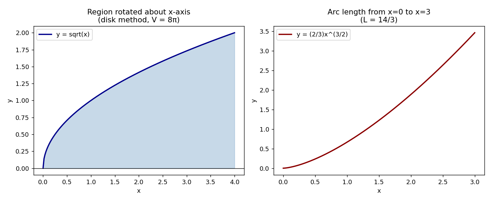

# Stage 5, Lesson 5.24 — Area, Arc Length, Surface Area, Volume

**Threads:** Math, CS
**Estimated time:** 60–90 minutes

---

## What This Lesson Is About

The Fundamental Theorem of Calculus (Lesson 16) told you that a definite integral computes "accumulated change," and you used it to find the area under a single curve. This lesson takes that one idea and points it at four different geometric questions: the area trapped *between* two curves, the length of a curved path, the volume of a solid formed by spinning a region around an axis, and the surface area of that same spinning solid. All four turn out to be the same trick in disguise — chop the shape into infinitely many infinitesimally thin pieces whose individual size you *can* write down exactly, then let the integral add them all up. By the end of this lesson you will be able to look at "find the area / length / volume / surface area of ___" and immediately see what to chop it into.

---

## Historical Context

Bonaventura Cavalieri, in his 1635 work on indivisibles, argued that the volume of a solid could be found by slicing it into infinitely many thin cross-sections and summing their areas — the direct ancestor of the disk method in this lesson, developed decades before Newton and Leibniz gave calculus its modern symbolic form. Arc length was considered a genuinely harder problem: for centuries "rectifying a curve" (finding its exact length with a straight line) was believed impossible in general. That changed in 1659, when the Dutch mathematician Hendrik van Heuraet published the first general method for computing arc length — effectively deriving the arc length integral used below — by approximating a curve with a large number of tiny straight segments and taking the limit as calculus was just beginning to make that limit rigorous.

---

## What You Need To Know First

- **The definite integral as accumulated area** (Lesson 15): this lesson reuses that idea repeatedly, just accumulating different quantities (volume, length) instead of area.
- **The Fundamental Theorem of Calculus** (Lesson 16): how you will actually evaluate every integral that appears below.
- **Integration by substitution** (Lesson 17): needed for the arc length formula, which almost always requires a substitution to evaluate.
- **The Pythagorean theorem**: the arc length formula is a direct consequence of it, applied to an infinitesimally small triangle.

---

## The Lesson

### Area Between Two Curves

**The problem.** Lesson 15 found the area between a single curve and the $x$-axis. What if you want the area trapped between *two* curves, say $y=f(x)$ on top and $y=g(x)$ on the bottom?

**Formal definition.** If $f(x) \geq g(x)$ on $[a,b]$, the area between the curves is
$$A = \int_a^b \big[f(x) - g(x)\big]\,dx$$

**Geometric picture.** Slice the region into vertical strips of width $dx$. Each strip is (approximately) a thin rectangle whose height is the *gap* between the top curve and the bottom curve at that $x$, i.e. $f(x)-g(x)$, and whose area is therefore $[f(x)-g(x)]\,dx$. Add up every strip from $a$ to $b$ — that sum, in the limit, is the integral above. This is exactly the area-under-a-curve idea from Lesson 15, applied twice and subtracted.

**Physical/computational lens.** This is how you compute material removed in a manufacturing cross-section (the region between the original stock profile and the machined profile), or the area between a supply curve and a demand curve in economics (consumer/producer surplus).

---

### Volume by the Disk Method

**The problem.** If you spin the region under a curve $y=f(x)$, from $x=a$ to $x=b$, all the way around the $x$-axis, you sweep out a solid of revolution. What is its volume?

**Formal definition.** Rotating $y = f(x)$ about the $x$-axis over $[a,b]$ produces a solid with volume
$$V = \pi \int_a^b [f(x)]^2\, dx$$

**Geometric picture — Cavalieri's slicing idea.** Freeze the rotation at one particular $x$-value. The cross-section there is a thin circular disk of radius $f(x)$ (the curve's height at that $x$), so its area is $\pi [f(x)]^2$ (the ordinary area of a circle). Stack up every one of these paper-thin disks, from $x=a$ to $x=b$, and their combined thickness $dx$ times area is exactly what the integral above adds up. This is Cavalieri's slicing principle, made precise with a limit instead of an intuitive "infinitely thin" slice.

#### Hand-Worked Example — Volume of Revolution

We will find the volume of the solid formed by rotating $y=\sqrt{x}$, for $0 \leq x \leq 4$, about the $x$-axis.

**Step 1 — state what we're computing.** The volume swept out by spinning the region under $y=\sqrt{x}$ around the $x$-axis, from $x=0$ to $x=4$.

**Step 2 — set up the integral.** By the disk formula, with $f(x)=\sqrt{x}$:
$$V = \pi \int_0^4 (\sqrt{x})^2\, dx = \pi \int_0^4 x\, dx$$

**Step 3 — evaluate using the Fundamental Theorem (Lesson 16).**
$$\pi \int_0^4 x\, dx = \pi \left[\frac{x^2}{2}\right]_0^4 = \pi\left(\frac{16}{2} - 0\right) = 8\pi$$

**Step 4 — narrate.** Every disk from $x=0$ to $x=4$ has radius $\sqrt{x}$, so area $\pi x$. Summing those areas times their infinitesimal thickness over the interval is exactly $\pi \int_0^4 x\,dx$.

**Step 5 — verify numerically.** $8\pi \approx 25.1327$. The code block below computes this same integral numerically with `scipy.integrate.quad` and confirms the same value.

**Step 6 — generalize.** For any $f(x)$, rotating about the $x$-axis always gives $V = \pi\int_a^b [f(x)]^2\,dx$ — the pattern is "square the radius function, then integrate," never anything more complicated, as long as the axis of rotation is the $x$-axis itself.

---

### Arc Length

**The problem.** How long is a curved path — not a straight line, where you'd just use the distance formula, but an actual curve $y=f(x)$?

**Formal definition.** The length of the curve $y=f(x)$ from $x=a$ to $x=b$ is
$$L = \int_a^b \sqrt{1 + [f'(x)]^2}\, dx$$

**Geometric picture — from the Pythagorean theorem.** Zoom in on a tiny piece of the curve so closely that it looks straight — a tiny right triangle with horizontal leg $dx$ and vertical leg $dy = f'(x)\,dx$ (the rise, from the derivative's definition in Lesson 6). By the Pythagorean theorem, the length of that tiny straight piece is
$$ds = \sqrt{dx^2 + dy^2} = \sqrt{dx^2 + [f'(x)]^2 dx^2} = \sqrt{1+[f'(x)]^2}\;dx$$
Adding up every one of these tiny straight pieces along the whole curve, in the limit, is exactly the integral above — this is van Heuraet's idea, stated in modern notation.

#### Hand-Worked Example — Length of a Curve

We will find the length of $y = \frac{2}{3}x^{3/2}$ from $x=0$ to $x=3$.

**Step 1 — find $f'(x)$.** By the power rule (Lesson 7): $f'(x) = \frac{2}{3}\cdot\frac{3}{2}x^{1/2} = x^{1/2}$.

**Step 2 — build the integrand.** $[f'(x)]^2 = x$, so $1+[f'(x)]^2 = 1+x$.

**Step 3 — set up the integral.**
$$L = \int_0^3 \sqrt{1+x}\; dx$$

**Step 4 — evaluate, using substitution (Lesson 17) with $u = 1+x$.** $\int \sqrt{u}\,du = \frac{2}{3}u^{3/2}$, so
$$L = \left[\frac{2}{3}(1+x)^{3/2}\right]_0^3 = \frac{2}{3}\big(4^{3/2} - 1^{3/2}\big) = \frac{2}{3}(8-1) = \frac{14}{3}$$

**Step 5 — verify numerically.** $\frac{14}{3} \approx 4.6667$; confirmed by `scipy.integrate.quad` in the code block below.

**Step 6 — generalize.** Notice this curve was deliberately chosen so that $[f'(x)]^2$ simplified to a clean polynomial — most arc length integrals in the wild do not simplify this nicely, which is exactly why arc length is usually computed numerically in practice (the topic of Lesson 21).

---

### Surface Area of Revolution

**The problem.** The disk method gives the *volume* of a solid of revolution. What is the area of its outer *skin*?

**Formal definition.** Rotating $y=f(x)$ about the $x$-axis over $[a,b]$ produces a surface with area
$$S = 2\pi \int_a^b f(x)\sqrt{1+[f'(x)]^2}\; dx$$

**Geometric picture.** This combines the previous two ideas directly: $\sqrt{1+[f'(x)]^2}\,dx$ is the tiny arc-length piece $ds$ from the arc length section, and spinning that tiny piece around the axis sweeps out a thin ring (like a wedding band) of circumference $2\pi f(x)$ and width $ds$ — so its area is $2\pi f(x)\, ds$. Summing every ring from $a$ to $b$ gives the formula above.

**Physical/computational lens.** This formula is exactly how you compute the surface area of a tank, a nose cone, or any other axially-symmetric part in mechanical design — the amount of material (sheet metal, paint, insulation) needed to cover it.

---

### Code — Verifying Both Hand-Worked Results Numerically

**Purpose.** Confirm the volume and arc length computed by hand above using numerical integration, so you can see that the exact algebraic answer and the numerical answer agree.

```python
import numpy as np
from scipy import integrate

# Volume of revolution: y = sqrt(x), rotated about x-axis, x from 0 to 4
def f(x):
    return np.sqrt(x)

exact_volume = np.pi * (4**2 / 2)          # from Step 3 above: pi * [x^2/2] from 0 to 4
numeric_volume, _ = integrate.quad(lambda x: np.pi * f(x)**2, 0, 4)

# Arc length: y = (2/3) x^(3/2), from x=0 to x=3
def g_prime(x):
    return x**0.5

exact_length = (2/3) * ((1+3)**1.5 - 1)    # from Step 4 above
numeric_length, _ = integrate.quad(lambda x: np.sqrt(1 + g_prime(x)**2), 0, 3)

print("Volume  -- exact:", exact_volume, " numeric:", numeric_volume)
print("Length  -- exact:", exact_length, " numeric:", numeric_length)
```

**Real output, this session:**
```
Volume  -- exact: 25.132741228718345  numeric: 25.132741228718345
Length  -- exact: 4.666666666666666  numeric: 4.666666666666668
```



**Walkthrough.** `integrate.quad` is SciPy's general-purpose numerical integrator — it does not know or care that we solved these by hand; it approximates the integral purely numerically (using an adaptive scheme related to the ideas you'll formalize in Lesson 21) and returns both the estimated value and an estimated error bound. The near-exact agreement between `exact_volume`/`numeric_volume` and `exact_length`/`numeric_length` (differing only in the 13th decimal place, from floating-point rounding) is the verification step — it confirms both hand-worked derivations above were done correctly, independent of the algebra itself.

**Connection.** The right-hand curve in the figure is the same $y=\frac{2}{3}x^{3/2}$ used in the arc length hand-worked example; the shaded region on the left is exactly what gets spun around the $x$-axis to produce the $8\pi$ solid from the volume example.

---

## Connect the Pieces

This lesson is the Fundamental Theorem of Calculus (Lesson 16) and substitution (Lesson 17) turned into geometry: every formula here — area between curves, disk volume, arc length, surface area of revolution — is "chop into infinitesimal pieces whose size you know exactly, then integrate," the same accumulation idea from Lesson 15 applied to a new quantity each time. It sets up two things directly ahead: Lesson 20 (Improper Integrals) will need to handle these same formulas when the interval or the function itself is unbounded, and Lesson 21 (Numerical Integration) exists precisely because most real arc-length and surface-area integrals, unlike the two chosen for this lesson's hand-worked examples, do not have a clean closed form and must be approximated the way `scipy.integrate.quad` did above.

---

## Summary

- **Area between curves:** $A = \int_a^b [f(x)-g(x)]\,dx$, for $f(x)\geq g(x)$ on $[a,b]$.
- **Volume by disks (rotation about the $x$-axis):** $V = \pi\int_a^b [f(x)]^2\, dx$.
- **Arc length:** $L = \int_a^b \sqrt{1+[f'(x)]^2}\, dx$, derived from the Pythagorean theorem applied to an infinitesimal piece of the curve.
- **Surface area of revolution (about the $x$-axis):** $S = 2\pi\int_a^b f(x)\sqrt{1+[f'(x)]^2}\, dx$.
- All four formulas follow the same pattern: identify the infinitesimal piece (strip, disk, arc segment, ring), write its size exactly, then integrate.

---

## Problems

### Computation

1. Find the volume of the solid formed by rotating $y = x^2$, for $0 \leq x \leq 2$, about the $x$-axis.
2. Find the area between $f(x) = x+2$ and $g(x) = x^2$ on the interval where $f(x) \geq g(x)$.
3. Set up (but do not necessarily evaluate by hand) the arc length integral for $y = x^3$ from $x=0$ to $x=1$.

*Answers: (1) $V=\pi\int_0^2 x^4\,dx = \pi[x^5/5]_0^2 = \frac{32\pi}{5}$. (2) Curves meet where $x+2=x^2 \Rightarrow x=-1,2$; $A=\int_{-1}^{2}[(x+2)-x^2]\,dx = \frac{9}{2}$. (3) $L=\int_0^1\sqrt{1+9x^4}\,dx$.*

### Understanding

4. A student computes the volume of a solid of revolution using $V = \int_a^b f(x)\,dx$ (no $\pi$, no squaring). Explain precisely what geometric quantity this student actually computed instead, and why the disk formula needs both the $\pi$ and the square.

### Proof

5. Prove that rotating the region under a *constant* function $f(x)=r$ about the $x$-axis, from $x=0$ to $x=h$, gives the volume formula for a right circular cylinder, $V = \pi r^2 h$, using the disk formula from this lesson.

### Extension ★

6. ★ The disk method assumes the region touches the axis of rotation. When it doesn't — for instance, rotating the region between $y=x^2$ and $y=1$ about the $x$-axis — each cross-section is a *washer* (a disk with a hole), not a solid disk. Propose a formula for the volume in this case, in terms of an outer radius function $R(x)$ and an inner radius function $r(x)$, by adapting the disk formula above.
