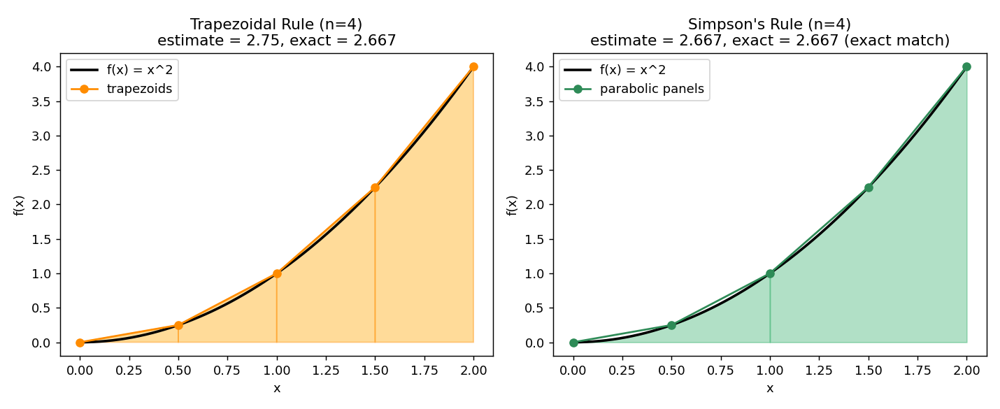

# Stage 5, Lesson 5.26 — Numerical Integration: Trapezoid and Simpson

**Threads:** Math, CS
**Estimated time:** 45–60 minutes

---

## What This Lesson Is About

Every integral in Lessons 5.15–5.19 was chosen because it had a clean antiderivative — that was necessary for teaching the ideas, but it is not how most integrals in the real world behave. Plenty of functions that show up in engineering and physics simply have no elementary antiderivative at all, and plenty more only exist as a table of measured data points rather than a formula. When the Fundamental Theorem of Calculus can't be applied directly, you still need the *number* the integral represents — an area, a volume, a total distance. This lesson introduces two ways to approximate a definite integral numerically, directly from function values, with no antiderivative required: the **Trapezoidal Rule** and **Simpson's Rule**. These are not academic curiosities — they are the actual algorithms running inside calculators, simulation software, and every numerical library you will ever call.

---

## Historical Context

The story begins over a century before Newton or Leibniz: Johannes Kepler, in 1615, needed to estimate the volume of wine barrels for tax purposes and derived an early rule — now called Kepler's barrel rule — that approximates a curved profile using a parabola, mathematically identical in spirit to what is now called Simpson's Rule. Thomas Simpson did not invent the method that carries his name; he popularized it in his 1743 calculus textbook, which is why history remembers his name rather than Kepler's for a technique Kepler used first to settle a very practical tax dispute.

---

## What You Need To Know First

- **The definite integral as area** (Lesson 15): what quantity we are trying to approximate.
- **Area between curves / area under a curve via rectangles** (Riemann sums, Lesson 15): the Trapezoidal Rule is a direct refinement of that same rectangle-summing idea.
- **Polynomial interpolation basics**: Simpson's Rule works by fitting a parabola through three points at a time — you don't need a full course in this, just the idea that exactly one parabola passes through any three non-collinear points.

---

## The Lesson

### The Trapezoidal Rule

**The problem.** A Riemann sum (Lesson 15) approximates area using thin *rectangles*, which either consistently overshoot or undershoot a curving function. Can we get a better approximation using a shape that follows the curve more closely, without needing an antiderivative at all?

**Formal definition.** Split $[a,b]$ into $n$ equal subintervals of width $h = \frac{b-a}{n}$, with endpoints $x_0=a, x_1, x_2, \dots, x_n=b$. The Trapezoidal Rule approximates
$$\int_a^b f(x)\,dx \;\approx\; \frac{h}{2}\Big[f(x_0) + 2f(x_1) + 2f(x_2) + \cdots + 2f(x_{n-1}) + f(x_n)\Big]$$

**Geometric picture.** Instead of a flat-topped rectangle on each subinterval, use a **trapezoid**: connect $\big(x_i, f(x_i)\big)$ to $\big(x_{i+1}, f(x_{i+1})\big)$ with a straight line instead of a flat top. The area of a single trapezoid with parallel sides $f(x_i)$, $f(x_{i+1})$ and width $h$ is $\frac{h}{2}\big[f(x_i)+f(x_{i+1})\big]$ — ordinary trapezoid area from geometry. Every interior point $x_i$ (for $1 \le i \le n-1$) is shared by two neighboring trapezoids, which is exactly why it gets coefficient $2$ in the formula and the two endpoints get coefficient $1$.

---

### Simpson's Rule

**The problem.** A trapezoid is still just a straight line connecting two points — it can't bend to follow a curve. What if, instead, we fit a curved piece through *three* points at a time?

**Formal definition.** With $n$ (even) equal subintervals, Simpson's Rule approximates
$$\int_a^b f(x)\,dx \;\approx\; \frac{h}{3}\Big[f(x_0) + 4f(x_1) + 2f(x_2) + 4f(x_3) + 2f(x_4) + \cdots + 4f(x_{n-1}) + f(x_n)\Big]$$
with the coefficients alternating $4, 2, 4, 2, \dots, 4$ between the two endpoints (each of which gets coefficient $1$).

**Geometric picture.** Take every *pair* of subintervals — three consecutive points $\big(x_{i-1}, f(x_{i-1})\big)$, $\big(x_i, f(x_i)\big)$, $\big(x_{i+1}, f(x_{i+1})\big)$ — and fit the unique parabola that passes through all three (this is Kepler's original idea from 1615). Because a parabola bends, it hugs a curving function far better than a straight trapezoid top does. Compute the exact area under that parabola (which has a known closed form) instead of under a straight line, and repeat for every pair of subintervals. The alternating $4,2,4,2,\dots$ coefficient pattern falls directly out of summing up the exact-area formula for each individual parabolic piece.

#### Hand-Worked Example — Comparing Both Methods

We will approximate $\int_0^2 x^2\,dx$ using both rules with $n=4$ subintervals, and compare to the exact value.

**Step 1 — state what we're computing.** $\int_0^2 x^2\,dx$, exactly known (Lesson 16) to be $\left[\frac{x^3}{3}\right]_0^2 = \frac{8}{3} \approx 2.6667$.

**Step 2 — build the grid.** $a=0,\,b=2,\,n=4 \Rightarrow h = \frac{2-0}{4}=0.5$. Points: $x_0=0,\,x_1=0.5,\,x_2=1,\,x_3=1.5,\,x_4=2$.

**Step 3 — evaluate $f(x)=x^2$ at every point.**

| $i$ | $x_i$ | $f(x_i)=x_i^2$ |
|---|---|---|
| 0 | 0.0 | 0.00 |
| 1 | 0.5 | 0.25 |
| 2 | 1.0 | 1.00 |
| 3 | 1.5 | 2.25 |
| 4 | 2.0 | 4.00 |

**Step 4 — apply the Trapezoidal Rule.**
$$\frac{0.5}{2}\big[0 + 2(0.25) + 2(1) + 2(2.25) + 4\big] = 0.25 \times [0+0.5+2+4.5+4] = 0.25 \times 11 = 2.75$$

**Step 5 — apply Simpson's Rule.**
$$\frac{0.5}{3}\big[0 + 4(0.25) + 2(1) + 4(2.25) + 4\big] = 0.1\overline{6} \times [0+1+2+9+4] = 0.1\overline{6}\times 16 = 2.6\overline{6}$$

**Step 6 — verify against the exact value.** Trapezoid gives $2.75$, an error of $|2.75-2.6667|\approx 0.0833$. Simpson gives $2.6667$, matching the exact value to full precision.

**Step 7 — narrate why Simpson matched exactly.** This isn't a coincidence: Simpson's Rule is *exact* for any polynomial of degree 3 or lower, because a parabola can represent up to a cubic's worth of curvature exactly across each panel-pair. Since $f(x)=x^2$ is only degree 2, Simpson's Rule has zero error here — but it would not be exact for, say, $f(x)=x^4$.

**Step 8 — generalize.** Trapezoid error shrinks like $O(h^2)$ as you add more subintervals; Simpson error shrinks much faster, like $O(h^4)$ — which is why Simpson's Rule is almost always preferred when it's available, at the (small) cost of requiring an even number of subintervals.

---

### Code — Computing and Visualizing Both Rules

**Purpose.** Reproduce the hand-worked computation above programmatically, so the same numbers can be checked instantly, and visualize what each rule is actually fitting to the curve.

```python
import numpy as np

def f(x):
    return x**2

a, b, n = 0, 2, 4
h = (b - a) / n
xs = np.linspace(a, b, n + 1)
ys = f(xs)

# Trapezoidal rule: h/2 * [f0 + 2f1 + 2f2 + ... + 2f(n-1) + fn]
trap = (h / 2) * (ys[0] + 2 * np.sum(ys[1:-1]) + ys[-1])

# Simpson's rule: h/3 * [f0 + 4f1 + 2f2 + 4f3 + ... + fn]  (n must be even)
simpson = (h / 3) * (ys[0] + 4 * np.sum(ys[1:-1:2]) + 2 * np.sum(ys[2:-1:2]) + ys[-1])

exact = (b**3 - a**3) / 3

print("Trapezoidal estimate:", trap)
print("Simpson's estimate:  ", simpson)
print("Exact value:          ", exact)
print("Trapezoid error:", abs(trap - exact))
print("Simpson error:  ", abs(simpson - exact))
```

**Real output, this session:**
```
Trapezoidal estimate: 2.75
Simpson's estimate:   2.6666666666666665
Exact value:           2.6666666666666665
Trapezoid error: 0.08333333333333348
Simpson error:   0.0
```



**Walkthrough.** `ys[1:-1]` slices out every *interior* point (excluding the first and last), which is exactly the set of points that get coefficient $2$ in the trapezoidal formula — the slice directly mirrors the math. For Simpson, `ys[1:-1:2]` takes every other interior point starting from index 1 (the "4-coefficient" points $x_1, x_3, \dots$) and `ys[2:-1:2]` takes every other interior point starting from index 2 (the "2-coefficient" points $x_2, x_4, \dots$) — the step-size-2 slicing is a direct translation of the alternating $4,2,4,2$ pattern in the formula. The plot shows why Simpson wins: the orange trapezoid panels are straight lines that visibly cut across the curve's bend, while the green parabolic panels curve along with $f(x)=x^2$ almost perfectly — because $x^2$ itself is a parabola, Simpson's fitted parabolas match it exactly, which is exactly why its error came out to zero.

**Connection.** This is the numerical counterpart to every exact integral computed by hand in Lessons 5.15–5.19; you'll use `scipy.integrate.quad` (a far more sophisticated adaptive version of these same ideas) whenever a real integral has no closed form, and Lesson 7.4 uses this same "approximate the true value using local polynomial fits" strategy to numerically solve differential equations.

---

## Connect the Pieces

This lesson takes the Riemann sum idea from Lesson 15 and improves it twice: once by replacing flat rectangle tops with straight trapezoid tops, and again by replacing straight tops with Kepler's curved parabolic panels. It exists because Lesson 19's arc length and surface area integrals, and Lesson 20's improper integrals, frequently have no elementary antiderivative — this lesson is the tool that lets you get a trustworthy number anyway. Outside pure mathematics, this exact machinery (in a far more adaptive form) is what runs every time a physics engine advances a simulation by one time step (Lesson 7.4, Euler and Runge-Kutta methods) or a piece of engineering software integrates measured sensor data instead of a clean formula.

---

## Summary

- **Trapezoidal Rule:** $\int_a^b f(x)\,dx \approx \frac{h}{2}\big[f(x_0)+2f(x_1)+\cdots+2f(x_{n-1})+f(x_n)\big]$ — straight-line panels; error shrinks like $O(h^2)$.
- **Simpson's Rule:** $\int_a^b f(x)\,dx \approx \frac{h}{3}\big[f(x_0)+4f(x_1)+2f(x_2)+\cdots+4f(x_{n-1})+f(x_n)\big]$ — parabolic panels fit through every three consecutive points; requires even $n$; error shrinks like $O(h^4)$; exact for any polynomial of degree $\leq 3$.
- Both rules approximate an integral using only function *values* at sample points — no antiderivative required, which is the entire point.
- Simpson's Rule is generally preferred whenever it's applicable, because it converges to the true value much faster as $n$ increases.

---

## Problems

### Computation

1. Approximate $\int_0^4 \sqrt{x}\, dx$ using the Trapezoidal Rule with $n=4$.
2. Approximate the same integral, $\int_0^4 \sqrt{x}\,dx$, using Simpson's Rule with $n=4$.
3. Using $n=2$, apply Simpson's Rule to $\int_0^2 x^3\,dx$ and compare to the exact value $4$. What do you notice, and why, given Step 7 of the hand-worked example?

*Answers: (1) $h=1$; points $0,1,2,3,4$; $f$-values $0,1,\sqrt2\approx1.414,\sqrt3\approx1.732,2$; Trapezoid $\approx \frac{1}{2}[0+2(1)+2(1.414)+2(1.732)+2] = 5.146$. (2) Simpson with same grid $\approx \frac{1}{3}[0+4(1)+2(1.414)+4(1.732)+2] \approx 5.25$. (3) Simpson gives exactly $4$ — matches, since $x^3$ has degree $3$ and Simpson is exact up to degree 3.*

### Understanding

4. Explain, without computing anything, why the Trapezoidal Rule will always slightly *overestimate* $\int_a^b f(x)\,dx$ when $f$ is concave up (like $x^2$) on $[a,b]$, and slightly *underestimate* it when $f$ is concave down.

### Proof

5. Prove that the Trapezoidal Rule is exact (zero error) whenever $f(x)$ is a linear function, for any number of subintervals $n$.

### Extension ★

6. ★ Simpson's error bound is proportional to $\frac{(b-a)^5}{n^4}\max|f^{(4)}(x)|$ — the fourth derivative of $f$. Explain why this formula correctly predicts that Simpson's Rule has *zero* error for the hand-worked example above ($f(x)=x^2$), and connect this to the more general numerical methods (Euler's method, Runge-Kutta) you'll meet in Lesson 7.4 for approximating solutions to differential equations, where no exact antiderivative exists at all.
