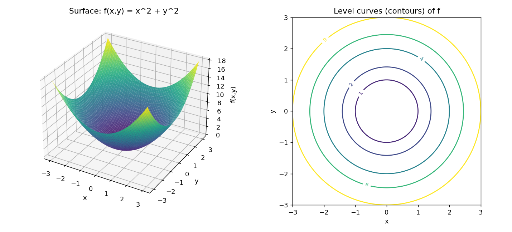

# Stage 5, Lesson 5.27 — Functions of Several Variables

**Threads:** Math, Physics
**Estimated time:** 45–60 minutes

---

## What This Lesson Is About

Every function you have studied so far — polynomials, exponentials, trig functions, even the derivatives and integrals of Chapters 5A–5C — has taken a single number in and produced a single number out. But almost nothing in the physical world depends on only one quantity. The temperature in a room depends on where you are standing — three coordinates, not one. The pressure of a gas depends on both its volume and its temperature. The height of a mountain depends on both your latitude and your longitude. This lesson introduces **functions of several variables**: functions that take more than one input and combine them into a single output. You will learn what their domain and graph look like once you can no longer draw a simple curve, and you will meet **level curves** — the tool that lets you see a multi-input function on flat paper by slicing it. Everything from here through the end of Stage 5 (partial derivatives, gradients, multivariable optimization, double and triple integrals) depends on getting comfortable with this object first.

---

## Historical Context

Leonhard Euler's 1755 treatise on fluid mechanics needed to describe the velocity and pressure of a fluid at every point in space, at every instant in time — quantities that depend on four numbers at once ($x$, $y$, $z$, and $t$), not one. This forced mathematicians to formalize what a "function" means when it eats more than one number. Around the same period, Alexis Clairaut and Euler were also independently working out how to handle functions of two variables in the context of surfaces and heat, laying the groundwork for what would later become multivariable calculus. The idea that a function's *domain* could be a whole region of a plane, rather than a stretch of a number line, took decades to become fully rigorous — but the physical need for it came first.

---

## What You Need To Know First

- **Functions as input → rule → output** (Lesson 0.7): a function of several variables is the same abstraction, just with a wider input.
- **The Cartesian plane and 3D coordinate systems** (Lesson 0.10): you need to be comfortable plotting a point $(x, y)$ in a plane and, informally, a point $(x, y, z)$ in space.
- **Graphing single-variable functions** (Stage 1): you already know that $y = f(x)$ produces a curve. This lesson generalizes "curve" to "surface."
- **Circles and their equations** (Lesson 3.2): the equation $x^2 + y^2 = r^2$ will reappear constantly in this lesson as the shape of a level curve.

---

## The Lesson

### What Is a Function of Several Variables?

**The problem.** A single-variable function like $f(x) = x^2$ answers "what number comes out for this one number I put in?" But a heated metal plate has a different temperature at every point on its surface — the temperature depends on *two* numbers, an $x$-position and a $y$-position, not one. We need a way to write "the rule that turns a location into a temperature."

**Formal definition.** A **function of two variables** is a rule $f$ that assigns to each ordered pair $(x, y)$ in some set $D \subseteq \mathbb{R}^2$ exactly one real number, written $f(x, y)$. The set $D$ is the **domain**, and the set of all output values is the **range**. This generalizes directly: a function of three variables $f(x, y, z)$ assigns one real number to each point in a domain $D \subseteq \mathbb{R}^3$, and so on for any number of inputs.

Notice the definition is structurally identical to the single-variable case from Lesson 0.7 — "exactly one output for each input" — except the *input itself* is now a pair (or triple, or longer list) of numbers instead of a single number.

**Geometric picture.** For a function of one variable, you picture a curve in a 2D plane: horizontal axis is input, vertical axis is output. For a function of two variables, you need one axis for each input plus one for the output — three axes total. The graph of $z = f(x, y)$ is therefore a **surface** floating in three-dimensional space, not a curve. Every point on that surface has the form $(x, y, f(x,y))$: walk to position $(x,y)$ on the floor, then go up (or down) by however much $f(x,y)$ says.

**Physical/computational lens.** A temperature field $T(x, y)$ on a metal plate, air pressure $P(x, y, z)$ in a room, and the elevation $h(x, y)$ of terrain on a map are all functions of several variables that engineers and scientists work with directly. Computationally, a grayscale image is literally a function of two variables: $I(x, y)$ gives the brightness at pixel $(x,y)$. A neural network's loss during training is a function of every one of its weights simultaneously — often millions of variables at once. That "loss surface" is exactly the object this lesson introduces, just in a space too large to draw; you will use the same vocabulary (domain, level sets, gradient) when you reach gradient descent in Lesson 24 and Lesson 9.14.

---

### Domain and Range in Higher Dimensions

**The problem.** For $f(x) = \sqrt{x}$, the domain was a *ray* on the number line: $x \geq 0$. What does a domain restriction look like when the input is a pair of numbers instead of one?

**The idea.** Because the input to $f(x,y)$ is a point in the plane, restricting the domain restricts $f$ to a **region** of the plane — not a single interval, but an actual two-dimensional shape: a disk, a half-plane, the area between two curves, and so on.

#### Hand-Worked Example — Finding a Domain

We will find the domain of $g(x, y) = \sqrt{9 - x^2 - y^2}$.

**Step 1.** The square root requires its argument to be non-negative:
$$9 - x^2 - y^2 \geq 0$$

**Step 2.** Rearrange:
$$x^2 + y^2 \leq 9$$

**Step 3.** Recognize the shape. From Lesson 3.2, $x^2 + y^2 = 9$ is a circle of radius 3 centered at the origin. The inequality $x^2 + y^2 \leq 9$ is every point *on or inside* that circle — a solid disk of radius 3.

**Step 4 — verify.** Pick a point clearly inside the disk, say $(1, 1)$: $9 - 1 - 1 = 7 \geq 0$. ✓ Valid. Pick a point clearly outside, say $(4, 0)$: $9 - 16 - 0 = -7$, which is negative — the square root would be undefined there, correctly excluded. ✓

**Generalize.** For any $g(x,y) = \sqrt{c^2 - x^2 - y^2}$, the domain is always the disk of radius $c$ centered at the origin. This pattern — "the domain of a square-root function of two variables is a disk" — will reappear when we compute the volume of a hemisphere with a double integral in Lesson 27.

---

### Visualizing: Surfaces and Level Curves

**The problem.** A 3D surface is hard to draw accurately on flat paper, and even harder to read precise values off of. Mapmakers solved exactly this problem centuries ago for terrain — how do you show the height of a mountain on a flat map? The answer: **contour lines**, and the same tool works for any function of two variables.

**Formal definition.** For a function $f(x, y)$ and a constant $c$ in the range of $f$, the **level curve** at height $c$ is the set of all points $(x, y)$ satisfying
$$f(x, y) = c$$
A **contour map** (or **contour plot**) is a picture showing several level curves of $f$ at evenly spaced values of $c$, each one labeled with its value.

**Geometric picture.** Imagine slicing the 3D surface $z = f(x,y)$ with a perfectly horizontal plane at height $z = c$. The level curve is exactly the outline where that plane cuts through the surface — then you look straight down from above and draw what you see. Every point along one level curve has the *same* output value; that is the entire point of drawing it.

#### Hand-Worked Example — Level Curves of a Paraboloid

We will find and describe the level curves of $f(x, y) = x^2 + y^2$.

**Step 1 — state what we're computing.** We want the shape of $f(x,y) = c$ for a few specific values of $c$.

**Step 2 — evaluate the function at some sample points first, to get a feel for it:**

| $(x,y)$ | $f(x,y) = x^2+y^2$ |
|---|---|
| $(0,0)$ | $0$ |
| $(1,0)$ | $1$ |
| $(0,1)$ | $1$ |
| $(2,1)$ | $5$ |
| $(-1,-1)$ | $2$ |
| $(3,4)$ | $25$ |

(These are computed directly below in the code block — same numbers, actually run.)

**Step 3 — find the level curve at $c = 4$.** Set $f(x,y) = 4$:
$$x^2 + y^2 = 4$$
By Lesson 3.2, this is a circle centered at the origin with radius $\sqrt{4} = 2$.

**Step 4 — find the level curve at $c = 9$.** Set $f(x,y) = 9$:
$$x^2 + y^2 = 9 \implies \text{circle of radius } \sqrt{9} = 3$$

**Step 5 — verify.** The point $(2, 0)$ should lie on the $c=4$ circle since it has radius 2: check $f(2,0) = 4 + 0 = 4$. ✓ Correct.

**Step 6 — generalize.** For $f(x,y) = x^2 + y^2$, the level curve at any height $c > 0$ is a circle of radius $\sqrt{c}$ centered at the origin. As $c$ grows, the circles grow — which tells us, without drawing the 3D surface at all, that $f$ increases as you move away from the origin in any direction. This shape — a bowl whose every level curve is a circle — is called a **paraboloid**, and it will reappear as the canonical example of a local minimum when we study multivariable optimization in Lesson 26.

#### Code — Plotting the Surface and Its Level Curves

**Purpose.** Generate the actual 3D surface for $f(x,y) = x^2+y^2$ side-by-side with its contour map, so you can see directly how slicing the surface horizontally produces the circles found by hand above.

```python
import numpy as np
import matplotlib
matplotlib.use("Agg")
import matplotlib.pyplot as plt

def f(x, y):
    return x**2 + y**2

x = np.linspace(-3, 3, 100)
y = np.linspace(-3, 3, 100)
X, Y = np.meshgrid(x, y)
Z = f(X, Y)

fig = plt.figure(figsize=(11, 5))

ax1 = fig.add_subplot(1, 2, 1, projection="3d")
ax1.plot_surface(X, Y, Z, cmap="viridis", alpha=0.9)
ax1.set_xlabel("x"); ax1.set_ylabel("y"); ax1.set_zlabel("f(x,y)")
ax1.set_title("Surface: f(x,y) = x^2 + y^2")

ax2 = fig.add_subplot(1, 2, 2)
levels = [0, 1, 2, 4, 6, 9]
cs = ax2.contour(X, Y, Z, levels=levels, cmap="viridis")
ax2.clabel(cs, inline=True, fontsize=8)
ax2.set_xlabel("x"); ax2.set_ylabel("y"); ax2.set_aspect("equal")
ax2.set_title("Level curves (contours) of f")

plt.tight_layout()
plt.savefig("surface_and_contours.png", dpi=130)
print("Z range:", Z.min(), "to", Z.max())
print("Contour levels drawn:", levels)
```

**Real output, this session:**
```
Z range: 0.0018365472910927424 to 18.0
Contour levels drawn: [0, 1, 2, 4, 6, 9]
```



**Walkthrough.** `np.meshgrid(x, y)` takes the two 1D arrays of $x$ and $y$ values and builds two 2D grids, `X` and `Y`, such that `X[i,j], Y[i,j]` together give every combination of an $x$-value with a $y$-value — this is what lets us evaluate `f(X, Y)` once and get the output at *every* grid point simultaneously, rather than looping over each pair by hand. `ax1.plot_surface` draws the resulting $(X, Y, Z)$ triples as the 3D surface from the Geometric Lens above. `ax2.contour(X, Y, Z, levels=levels)` is the code equivalent of the hand-worked Steps 3–4: for each value in `levels`, it finds every point where `Z` equals that value and draws the curve through them — the same circles we found by algebra, at the same radii $\sqrt{c}$.

**Connection.** The right-hand panel is literally the picture form of what Steps 3–6 of the hand-worked example computed algebraically — nested circles growing outward, each one a slice of the bowl-shaped surface on the left at a fixed height.

---

### Functions of Three or More Variables

**The problem.** What happens to "level curves" once you can no longer plot a 3D surface at all — for instance, for a function of three variables, whose graph would need *four* axes?

**The idea.** The pattern extends by one dimension at every step. For $f(x, y, z)$, you cannot draw the graph $w = f(x,y,z)$ (that would require 4 axes), but you *can* still draw the **level surface** $f(x,y,z) = c$ directly in ordinary 3D space, since it only involves $x$, $y$, and $z$. For example, the level surfaces of $f(x,y,z) = x^2+y^2+z^2$ at $c = 4$ and $c = 9$ are spheres of radius 2 and 3 — the direct 3D generalization of the circles found above. This is exactly the object you will integrate over in Lesson 27 (triple integrals) to compute volumes and masses of 3D regions.

---

## Connect the Pieces

This lesson builds directly on the function concept from Lesson 0.7 (input, rule, output — now with a wider input), the Cartesian and 3D coordinate systems from Lesson 0.10, and the circle equation from Lesson 3.2, which turned out to be exactly the shape of every level curve in the worked example. It makes possible everything remaining in Stage 5D: **partial derivatives** (Lesson 23) ask how $f$ changes if you move in just the $x$ or just the $y$ direction; the **gradient** (Lesson 24) packages those partial derivatives into a single vector that points toward the steepest increase of $f$ — and is the exact mathematical object that trains every neural network via gradient descent, as flagged in the Physical/Computational Lens above. Outside pure mathematics, this is the language engineers use for every scalar field: temperature distributions in heat transfer, pressure fields in fluid dynamics, and stress at a point (which, once it depends on direction as well as position, grows into the stress tensor of Lesson 6.20).

---

## Summary

- A **function of two variables** $f(x,y)$ assigns one real number to each point $(x,y)$ in a domain $D \subseteq \mathbb{R}^2$; a function of $n$ variables generalizes this to $D \subseteq \mathbb{R}^n$.
- The domain of $f(x,y)$ is a **region of the plane**, found the same way as a single-variable domain (exclude what makes the function undefined) but expressed as an inequality in $x$ and $y$.
- The **graph** of $z = f(x,y)$ is a surface in 3D space: the set of all points $(x, y, f(x,y))$.
- A **level curve** at height $c$ is the set $\{(x,y) : f(x,y) = c\}$ — the horizontal slice of the surface at height $c$, viewed from above. A **contour map** shows several level curves at once.
- For $f(x,y) = x^2+y^2$, the level curve at height $c > 0$ is a circle of radius $\sqrt{c}$ centered at the origin — the surface is a **paraboloid**.
- For $f(x,y,z)$, the analogous object is a **level surface** $f(x,y,z) = c$, living directly in 3D space.

---

## Problems

### Computation

1. Find and describe (in words) the domain of $h(x,y) = \ln(x - y^2)$.
2. Evaluate $f(x,y,z) = xy + yz + zx$ at the point $(1, 2, 3)$.
3. For $f(x,y) = x^2 + y^2$, find the level curve at $c = 16$, and state its radius.

*Answers: (1) all $(x,y)$ with $x > y^2$ — the region strictly to the right of the parabola $x = y^2$. (2) $f(1,2,3) = 2 + 6 + 3 = 11$. (3) $x^2+y^2=16$, a circle of radius 4.*

### Understanding

4. A student says: "The graph of $z = f(x,y)$ is a curve, just like $y = f(x)$ was." Explain what is wrong with this claim and state what the graph actually is.

### Proof

5. Prove that for $f(x,y) = x^2 + y^2$ and any two distinct positive constants $c_1 \neq c_2$, the level curves $f(x,y) = c_1$ and $f(x,y) = c_2$ never intersect. (Hint: suppose a point $(x,y)$ were on both, and show this forces $c_1 = c_2$.)

### Extension ★

6. ★ The function $f(x,y,z) = x^2+y^2+z^2$ has level *surfaces* rather than level curves. Describe the level surface at $c = 25$, and explain in one or two sentences how you expect this shape to connect to computing the volume of a solid ball once you reach triple integrals in Lesson 27.
